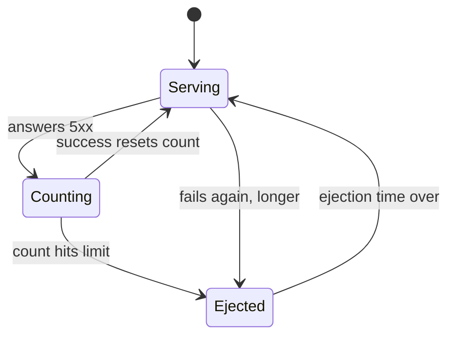

# Ejection Mechanics And Limits

Spotting a damaged ship is half the story. Marking an endpoint as failing is only the start. This part covers what happens next: when the ejection happens, how long it lasts, what happens to a repeat offender, which errors count, and the two limits that stop the mechanism from pulling the whole squadron out of formation and destroying the service it protects.

## The timeline



The limit is `consecutive5xxErrors`, and the return is noticed at the next `interval` sweep. The diagram shows the two moves people forget: a single success puts the endpoint straight back to `Serving` with a clean count, and a repeat ejection lasts longer than the first.

Three things to take from it.

**A consecutive-error ejection happens at once.** As soon as an endpoint reaches `consecutive5xxErrors` (or `consecutiveGatewayErrors`), the proxy ejects it. It does not wait for the next `interval`.

**`interval` is the check-up sweep.** Every `interval` (default `10s`), the proxy runs a sweep. On that sweep it lets back endpoints whose ejection time is over. So an endpoint can stay out up to one `interval` longer than its ejection time.

**`baseEjectionTime` is the starting length, not a fixed length.** The real ejection time is `baseEjectionTime × (number of times this endpoint has been ejected)`. A second ejection lasts twice as long, a third three times as long. Envoy caps this growth at 300 seconds, or at `baseEjectionTime` if that is larger. This is a back-off: an endpoint that keeps coming back broken is tried less and less often, but never written off for good.

**An ejection always ends.** There is no permanent removal. When the time is up, the endpoint goes back into the load-balancing set and gets traffic again. If it is still broken, it fails again and is ejected for longer.

So with a pod that stays broken, you do **not** see a clean steady state. You see short bursts of failures, separated by quiet periods that grow longer. Part 3 lets you watch it.

## Which errors count

Two fields count errors, and they overlap:

| Field | Counts | Default |
| --- | --- | --- |
| `consecutive5xxErrors` | every 5xx: 500, 502, 503, 504, ... | **5**, as soon as an `outlierDetection` block exists |
| `consecutiveGatewayErrors` | only 502, 503 and 504 | off (`0`) |

The trap is the default. You might write only `consecutiveGatewayErrors: 3`, so that a pod answering **500** (an error inside the app) is left alone. But `consecutive5xxErrors` is still there at 5, and a 500 counts for it. After five 500s in a row, the pod is ejected anyway. To count *only* gateway errors, switch the other field off with `consecutive5xxErrors: 0`.

There is one more rule from the API. Gateway errors also count as 5xx errors. So if `consecutiveGatewayErrors` is equal to or higher than `consecutive5xxErrors`, it never gets the chance to act.

<!-- astrona:playground:renew -->

> [!TIP]
> **Try it — count only gateway errors**
>
> Swap the 503 pod for one that answers **500**, then apply a rule that ignores 500s:
>
> ```sh
> kubectl delete -f httpbin-broken-pod.yaml
> ```
>
> Save this as `httpbin-broken-500-pod.yaml`:
>
> ```yaml
> apiVersion: apps/v1
> kind: Deployment
> metadata:
>   name: httpbin-broken-500
>   namespace: bookinfo
> spec:
>   replicas: 1
>   selector:
>     matchLabels:
>       app: httpbin
>       version: broken-500
>   template:
>     metadata:
>       labels:
>         app: httpbin
>         version: broken-500
>     spec:
>       containers:
>       - name: http-echo
>         image: hashicorp/http-echo:1.0
>         args: ["-listen=:8080", "-status-code=500", "-text=broken"]
>         ports:
>         - containerPort: 8080
> ```
>
> Save this as `destinationrule-httpbin-gateway-errors-only.yaml`:
>
> ```yaml
> apiVersion: networking.istio.io/v1
> kind: DestinationRule
> metadata:
>   name: httpbin
>   namespace: bookinfo
> spec:
>   host: httpbin
>   trafficPolicy:
>     outlierDetection:
>       consecutiveGatewayErrors: 3
>       consecutive5xxErrors: 0
>       interval: 5s
>       baseEjectionTime: 1m
>       maxEjectionPercent: 50
> ```
>
> Apply it:
>
> ```sh
> kubectl apply -f httpbin-broken-500-pod.yaml
> ```
>
> Then check the result:
>
> ```sh
> kubectl rollout status -n bookinfo deploy/httpbin-broken-500
> ```
>
> Apply it:
>
> ```sh
> kubectl apply -f destinationrule-httpbin-gateway-errors-only.yaml
> ```
>
> Then check the result:
>
> ```sh
> count_status; count_status
> ```
>
> Expect about one request in three to come back as `500` in **every** run. The 500 pod is never ejected, because only 502, 503 and 504 count.
>
> Now put Part 1's rule back. It uses `consecutive5xxErrors: 3`, which counts 500s:
>
> ```sh
> kubectl apply -f destinationrule-httpbin-outlier-detection.yaml
> ```
>
> Then check the result:
>
> ```sh
> count_status; count_status
> ```
>
> After a few 500s, the pod is ejected and you get `15 200`. When this lab was first tested, leaving out `consecutive5xxErrors: 0` ejected the 500 pod after five errors in a row, exactly as the default says it would.

Clean up before the next step:

```sh
kubectl delete -f httpbin-broken-500-pod.yaml
```

Apply it:

```sh
kubectl apply -f httpbin-broken-pod.yaml
```

## The two safety limits

Both limits exist for the same reason. A feature that removes failing endpoints must never remove *all* of them. If a shared dependency fails, every endpoint starts returning 5xx at once. A detector with no limits would eject the whole service, turning a slow service into one that is completely down.

**`maxEjectionPercent`** caps how much of the pool may be ejected at the same time.

> Its default is **10%**.

That default is the most common reason a correct-looking policy does nothing. Before each ejection, Envoy works out what share of the pool *would* be ejected after it. With three endpoints, ejecting one means 33%. That is above 10%, so nothing is ejected. On any small service, the policy runs, counts the failures faithfully, and never ejects anything. Silently.

On a small service you must raise it. Part 1's rule uses `50`: one of three endpoints (33%) is allowed, two (67%) are not. `100` means "eject as many as are failing", which is right when you would rather have no endpoints than bad ones. A production value is a judgement call: high enough to act, low enough that one shared failure cannot empty the pool.

**`minHealthPercent`** works from the other side. As long as at least this share of the pool is healthy, outlier detection is on. When the healthy share drops *below* it, outlier detection switches off and the proxy sends to all endpoints again, failing ones included. The default is `0%`, which means it never switches off. With three endpoints and `minHealthPercent: 70`, the first ejection leaves 67% healthy. That is below 70%, so detection switches off and the bad pod gets traffic again. It is a useful guard on a large pool and a trap on a small one.

> [!TIP]
> **Try it — the 10% default in action**
>
> Restart `curl` so its sidecar starts with no ejection history, then lower the limit to 10%:
>
> ```sh
> kubectl rollout restart -n bookinfo deploy/curl
> kubectl rollout status -n bookinfo deploy/curl
> kubectl patch destinationrule httpbin -n bookinfo --type merge -p '
> spec:
>   trafficPolicy:
>     outlierDetection:
>       maxEjectionPercent: 10'
> sleep 3
> count_status; count_status
> ejection_stats
> ```
>
> Expect about a third of the requests to fail in **both** runs, and `ejections_active: 0` in the stats. The failures were counted and the threshold was met, but nothing could be ejected: one of three endpoints is 33%, which is more than 10%. Put `maxEjectionPercent: 50` back (`kubectl apply -f destinationrule-httpbin-outlier-detection.yaml`) and run `count_status` twice to see the difference.

## Choosing the numbers

A short guide, because tasks usually describe a behaviour rather than a value:

| Requirement | Field to change |
| --- | --- |
| "let a bad pod back in sooner (or later)" | `interval` and `baseEjectionTime` |
| "tolerate a brief blip" | raise `consecutive5xxErrors` |
| "do not count application errors" | `consecutiveGatewayErrors`, **and** `consecutive5xxErrors: 0` |
| "keep a bad pod out longer each time" | nothing: `baseEjectionTime` is multiplied for you |
| "it must actually eject on a small service" | raise `maxEjectionPercent` above the 10% default |
| "never remove more than half the pool" | `maxEjectionPercent: 50` |
| "stop ejecting if the service is mostly down" | `minHealthPercent` |

## Common pitfalls

> [!WARNING]
> **Leaving `maxEjectionPercent` at 10% on a small service.** With two or three endpoints, nothing can ever be ejected. The most common reason a correct policy does nothing.
>
> **Writing only `consecutiveGatewayErrors` and expecting 500s to be ignored.** `consecutive5xxErrors` is still 5 by default. Set it to `0`.
>
> **Reading `baseEjectionTime` as the ejection length.** It is the base. Repeat offenders are ejected for a growing multiple of it.
>
> **Expecting a bad pod back the instant its time is up.** It returns on the next `interval` sweep after that.
>
> **Setting `minHealthPercent` high on a small pool.** One ejection can push the healthy share below it, and then detection switches off.

> *`maxEjectionPercent` defaults to 10%, which on a two- or three-endpoint service means nothing can ever be ejected.*
