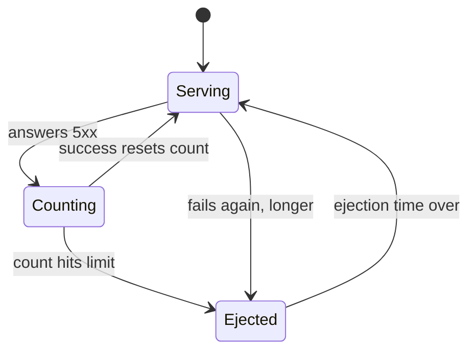

# Ejection Mechanics And Limits

Astronaut, spotting a damaged ship is only the start. This part covers what happens next: when the ejection happens, how long it lasts, which errors count, and the two limits that stop the mesh from pulling the whole squadron out of formation.

The commands below need the four helpers from the module's landing page, and the broken ship and `DestinationRule` from the part before: `probe-broken.yaml` and `destinationrule-probe-outlier-detection.yaml`.

## The timeline

An ejection is not permanent. A ship moves between three states, and the move back is what surprises people.



The limit is `consecutive5xxErrors`, and the move back to `Serving` happens on an `interval` sweep. The diagram shows the two moves people forget: one success puts the ship straight back to `Serving` with a clean count, and a repeat ejection lasts longer than the first.

Four facts follow from it:

- **A consecutive-error ejection happens at once.** As soon as a ship reaches `consecutive5xxErrors` (or `consecutiveGatewayErrors`), the proxy ejects it. It does not wait for the next `interval`.
- **`interval` is the check-up sweep.** Every `interval` (default `10s`), the proxy lets back the ships whose ejection time is over. So a ship can stay out up to one `interval` longer than its ejection time.
- **`baseEjectionTime` is the starting length.** The real ejection time is `baseEjectionTime` × the number of times this ship has been ejected. A second ejection lasts twice as long, a third three times. Envoy caps this growth at 300 seconds, or at `baseEjectionTime` if that is larger.
- **An ejection always ends.** When the time is up, the ship goes back into the list and gets signals again. If it is still broken, it fails again and is ejected for longer.

So a ship that stays broken does **not** give you a clean steady state. You see short bursts of failures, with quiet periods that grow longer each time.

## Which errors count

Two fields count errors, and they overlap:

| Field | Counts | Value if you leave it out |
| --- | --- | --- |
| `consecutive5xxErrors` | every 5xx: `500`, `502`, `503`, `504`, ... | **5**, as soon as an `outlierDetection` block exists |
| `consecutiveGatewayErrors` | only `502`, `503` and `504` | off (`0`) |

The trap is that first default. You might write only `consecutiveGatewayErrors: 3`, so that a ship answering `500` (an error inside the app) is left alone. But `consecutive5xxErrors` is still there at 5, and a `500` counts for it. To count *only* gateway errors, switch the other field off with `consecutive5xxErrors: 0`.

There is one more rule. Gateway errors also count as 5xx errors, so if `consecutiveGatewayErrors` is equal to or higher than `consecutive5xxErrors`, it never gets the chance to act.

<!-- astrona:playground:renew -->

### Swap in a ship that answers 500

Replace the broken ship with one that answers `500` instead of `503`. First remove the old one:

```sh
kubectl delete -f probe-broken.yaml
```

Save this as `probe-broken-500.yaml`:

```yaml
apiVersion: apps/v1
kind: Deployment
metadata:
  name: probe-broken-500
  namespace: starfleet
spec:
  replicas: 1
  selector:
    matchLabels:
      app: probe
      version: broken-500
  template:
    metadata:
      labels:
        app: probe
        version: broken-500
    spec:
      containers:
      - name: http-echo
        image: hashicorp/http-echo:1.0
        args: ["-listen=:8080", "-status-code=500", "-text=broken"]
        ports:
        - containerPort: 8080
```

Apply it:

```sh
kubectl apply -f probe-broken-500.yaml
```

Then wait for it to start:

```sh
kubectl rollout status -n starfleet deploy/probe-broken-500
```

### Count only gateway errors

Now write a rule that ignores `500`s: gateway errors only, with the 5xx count switched off. Save this as `destinationrule-probe-gateway-errors-only.yaml`:

```yaml
apiVersion: networking.istio.io/v1
kind: DestinationRule
metadata:
  name: probe
  namespace: starfleet
spec:
  host: probe
  trafficPolicy:
    outlierDetection:
      consecutiveGatewayErrors: 3
      consecutive5xxErrors: 0
      interval: 5s
      baseEjectionTime: 1m
      maxEjectionPercent: 50
```

Apply it:

```sh
kubectl apply -f destinationrule-probe-gateway-errors-only.yaml
```

Then send two rounds of 15 signals:

```sh
count_status
count_status
```

You should see:

```text
  10 200
   5 500
  10 200
   5 500
```

About one signal in three fails in **every** round. The `500` ship is never ejected, because this rule only counts `502`, `503` and `504`.

### Put the 5xx rule back

The first rule uses `consecutive5xxErrors: 3`, which counts `500`s too. Apply it again:

```sh
kubectl apply -f destinationrule-probe-outlier-detection.yaml
```

Then send two rounds of 15 signals:

```sh
count_status
count_status
```

You should see:

```text
  12 200
   3 500
  15 200
```

After three `500`s in a row, the ship is ejected. The same happens if you write only `consecutiveGatewayErrors: 3` and leave `consecutive5xxErrors` out: it is then 5, and the `500` ship is ejected after five errors in a row.

When you are done, bring back the `503` ship for the next step:

```sh
kubectl delete -f probe-broken-500.yaml
kubectl apply -f probe-broken.yaml
```

## The two safety limits

A feature that removes failing ships must never remove *all* of them. If a shared dependency fails, every ship starts answering 5xx at once. A detector without limits would eject the whole squadron, and a slow service would become a service that is completely down. Two fields prevent that.

**`maxEjectionPercent`** caps how much of the list may be ejected at the same time. Its default is **10%**.

That default is the most common reason a correct-looking rule does nothing. Before each ejection, Envoy works out what share of the list *would* be ejected after it. With three ships, ejecting one means 33%. That is above 10%, so nothing is ejected. On any small service, the rule runs, counts the failures, and never ejects anything. Silently.

On a small service you must raise it. The first rule uses `50`: one ship of three (33%) may be out, two (67%) may not. `100` means "eject as many as are failing", which is right when you would rather have no ships than bad ones.

**`minHealthPercent`** works from the other side. As long as at least this share of the list is healthy, outlier detection is on. When the healthy share drops *below* it, outlier detection switches off, and the proxy sends to every ship again, failing ones included. The default is `0%`, so it never switches off. With three ships and `minHealthPercent: 70`, the first ejection leaves 67% healthy, which is below 70%, so detection switches off again at once. It is a useful guard on a big list and a trap on a small one.

### The 10% default in action

Restart the shuttle, so its communications officer starts with no ejection history:

```sh
kubectl rollout restart -n starfleet deploy/shuttle
kubectl rollout status -n starfleet deploy/shuttle
```

Then lower the limit to 10%. Save this as `destinationrule-probe-10-percent.yaml`:

```yaml
apiVersion: networking.istio.io/v1
kind: DestinationRule
metadata:
  name: probe
  namespace: starfleet
spec:
  host: probe
  trafficPolicy:
    outlierDetection:
      consecutive5xxErrors: 3
      interval: 5s
      baseEjectionTime: 1m
      maxEjectionPercent: 10
```

Apply it:

```sh
kubectl apply -f destinationrule-probe-10-percent.yaml
```

Then send two rounds of 15 signals, and read the counters, including the ones that count blocked ejections:

```sh
count_status
count_status
kubectl exec -n starfleet deploy/shuttle -c istio-proxy -- pilot-agent request GET stats 2>/dev/null \
  | grep -E 'probe.starfleet.*outlier_detection.(ejections_active|ejections_total|ejections_overflow|ejections_detected_consecutive_5xx|ejections_enforced_consecutive_5xx):'
```

You should see:

```text
  14 200
   1 503
   9 200
   6 503
cluster.outbound|8000||probe.starfleet.svc.cluster.local;.outlier_detection.ejections_active: 0
cluster.outbound|8000||probe.starfleet.svc.cluster.local;.outlier_detection.ejections_detected_consecutive_5xx: 2
cluster.outbound|8000||probe.starfleet.svc.cluster.local;.outlier_detection.ejections_enforced_consecutive_5xx: 0
cluster.outbound|8000||probe.starfleet.svc.cluster.local;.outlier_detection.ejections_overflow: 3
cluster.outbound|8000||probe.starfleet.svc.cluster.local;.outlier_detection.ejections_total: 0
```

The broken ship keeps failing in both rounds. The counters tell you why: the proxy **detected** the failing ship twice (`detected_consecutive_5xx: 2`), but **enforced** nothing (`enforced_consecutive_5xx: 0`). Three times the limit stopped an ejection (`ejections_overflow: 3`): one ship of three is 33%, which is more than 10%.

Put the 50% rule back:

```sh
kubectl apply -f destinationrule-probe-outlier-detection.yaml
```

> [!TIP]
> When a correct-looking outlier rule ejects nothing, read `ejections_overflow` first. Any number above 0 means the failing ship was found and `maxEjectionPercent` blocked the ejection.

## Choosing the numbers

Tasks usually describe a behaviour, not a value. This table maps one to the other:

| Requirement | Field to change |
| --- | --- |
| "let a bad ship back in sooner (or later)" | `interval` and `baseEjectionTime` |
| "tolerate a brief blip" | raise `consecutive5xxErrors` |
| "do not count errors from inside the app" | `consecutiveGatewayErrors`, **and** `consecutive5xxErrors: 0` |
| "keep a bad ship out longer each time" | nothing: `baseEjectionTime` is multiplied for you |
| "it must really eject on a small service" | raise `maxEjectionPercent` above the 10% default |
| "never remove more than half the ships" | `maxEjectionPercent: 50` |
| "stop ejecting when most of the service is down" | `minHealthPercent` |

## Common pitfalls

> [!WARNING]
> - **Leaving `maxEjectionPercent` at 10% on a small service.** With two or three ships, nothing can ever be ejected. `ejections_overflow` counts the blocked attempts.
> - **Writing only `consecutiveGatewayErrors` and expecting `500`s to be ignored.** `consecutive5xxErrors` is still 5. Set it to `0`.
> - **Reading `baseEjectionTime` as the ejection length.** It is the starting length. A ship that keeps failing is ejected for a growing multiple of it.
> - **Expecting a bad ship back the moment its time is up.** It returns on the next `interval` sweep after that.
> - **Setting `minHealthPercent` high on a small service.** One ejection can push the healthy share below it, and then detection switches off.

> *`maxEjectionPercent` defaults to 10%, which on a two- or three-ship service means nothing can ever be ejected.*

## Your mission: Outlier Detection And Endpoint Ejection

You can now pull a damaged ship out of formation, choose which errors count, and get past the 10% limit on a small service. Now prove it in a graded mission: make a sender's communications officer stop using a ship that fails every signal, while Kubernetes keeps listing it as healthy.

The mission runs in its own training solar system, so first pause your playground. Nothing in it is lost:

```sh
astrona stop ats-014-playground-040-03
```

Then start the mission:

```sh
astrona run --git git@github.com:astrona-io/ATS014.git -c sections/section-040/module-03/labs/lab-01
```

Read the task in [`question.md`](./labs/lab-01/question.md) and solve it on your own first. When you think you are done, send it for grading:

```sh
astrona submit -c sections/section-040/module-03/labs/lab-01
```

When the mission is done, remove it and wake your playground up again:

```sh
astrona destroy ats-014-lab-040-03
astrona start ats-014-playground-040-03
```
