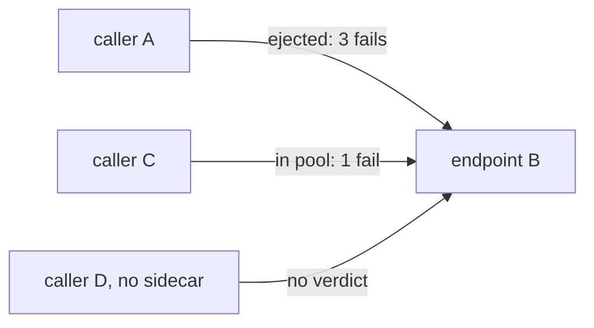

# Local, Temporary, And Verified

Astronaut, two properties are left, and both surprise people. They follow from *where* the feature lives, not from what it does. Then come the commands that prove an ejection, both halves of circuit breaking in one rule, and the reason the next module depends on all of this.

This part assumes Part 1's rule (`destinationrule-httpbin-outlier-detection.yaml`, `maxEjectionPercent: 50`) and the 503 pod (`httpbin-broken-pod.yaml`) are applied.

## The verdict is per proxy

Outlier detection runs inside each caller's sidecar, over the answers **that sidecar** received. There is no shared state, no gossip between proxies, and no central decision. Each ship's communications officer decides for itself which damaged ships to avoid. Mission control (`istiod`) is not involved.



The diagram shows three callers with three different opinions about the same endpoint, all of them correct: an ejection describes one proxy's own experience, never the pod itself.

Three things follow:

- **The pod stays in the Service.** `kubectl get endpoints` still lists it. Nothing about the Kubernetes object changes.
- **A workload without a sidecar is not affected**, because there is no proxy holding a verdict.
- **A caller with little traffic may never eject anything**, simply because it has not collected the evidence.

This is the sharpest contrast with a readiness probe, which takes the pod out of the Service once, centrally, for everybody.

> [!TIP]
> **Try it — Kubernetes and the proxy disagree**
>
> ```sh
> count_status
> kubectl get endpoints httpbin -n bookinfo
> show_endpoints
> ```
>
> `kubectl get endpoints` lists all three pod addresses. `show_endpoints` shows something like this (the IP addresses are examples):
>
> ```text
> ENDPOINT           STATUS    OUTLIER CHECK
> 10.244.0.16:8080   HEALTHY   OK
> 10.244.0.17:8080   HEALTHY   OK
> 10.244.0.19:8080   HEALTHY   FAILED      <- broken pod
> ```
>
> Read the two columns separately. `STATUS: HEALTHY` is the Kubernetes view: the pod is a ready Service endpoint. `OUTLIER CHECK: FAILED` is **this proxy's own verdict**. The gap between those two columns *is* outlier detection, and `kubectl get endpoints` will never show it. If every row says `OK`, the ejection time ran out: run `count_status` again first.

## The counters

Better behaviour is a hint. Counters are proof. The three to know:

| Counter | Meaning |
| --- | --- |
| `outlier_detection.ejections_active` | endpoints ejected right now (a live value) |
| `outlier_detection.ejections_total` | ejections for this cluster since the proxy started |
| `outlier_detection.ejections_enforced_consecutive_5xx` | how many ejections that rule caused |

The playground's `curl` Deployment carries the `sidecar.istio.io/statsInclusionPrefixes: "cluster.outbound"` annotation. Without it, Istio drops these per-cluster counters, as module 2 explains.

> [!TIP]
> **Try it — the ejection counters**
>
> ```sh
> count_status >/dev/null
> ejection_stats
> ```
>
> Expect three lines in this shape (trimmed, numbers will differ):
>
> ```text
> cluster.outbound|8000||httpbin.bookinfo.svc.cluster.local.outlier_detection.ejections_active: 1
> cluster.outbound|8000||httpbin.bookinfo.svc.cluster.local.outlier_detection.ejections_enforced_consecutive_5xx: <count>
> cluster.outbound|8000||httpbin.bookinfo.svc.cluster.local.outlier_detection.ejections_total: <count>
> ```
>
> `ejections_active: 1` while the broken pod is out, and `enforced_consecutive_5xx` names *which* rule did it, which helps when several thresholds are set. If `total` has grown while `active` reads 0, you caught the pod between ejections. That is the next section.

## Watching the cycle

An ejection ends and the endpoint is tried again, so a pod that stays broken produces a cycle, not a steady state. Watching `ejections_total` climb while `ejections_active` flips between 1 and 0 makes that cycle visible. It is worth seeing once, so you do not mistake it for instability.

With `baseEjectionTime: 1m`, the first ejection lasts about a minute, the second about two, and so on. This loop checks every 20 seconds for about four minutes:

```sh
for i in $(seq 1 12); do
  ejection_stats | grep -E 'ejections_(active|total)' | awk -F'.' '{print $NF}' | tr '\n' ' '; echo
  count_status >/dev/null
  sleep 20
done
```

`total` only ever goes up. `active` drops to 0 when the ejection time is over and goes back to 1 once the returned pod fails again. The quiet periods get longer each time, which is the back-off from Part 2.

## Both halves in one rule

Module 2's `connectionPool` and this module's `outlierDetection` sit side by side under `trafficPolicy`. In real life you usually want both: limit the load, **and** remove bad pods. Keep them in **one** `DestinationRule` per host. Two rules for the same host do not combine reliably.

> [!TIP]
> **Try it — a full circuit breaker**
>
> ```sh
> cat > destinationrule-httpbin-full-circuit-breaker.yaml <<'EOF'
> apiVersion: networking.istio.io/v1
> kind: DestinationRule
> metadata:
>   name: httpbin
>   namespace: bookinfo
> spec:
>   host: httpbin
>   trafficPolicy:
>     connectionPool:
>       tcp:
>         maxConnections: 1
>       http:
>         http1MaxPendingRequests: 1
>         maxRequestsPerConnection: 1
>     outlierDetection:
>       consecutive5xxErrors: 3
>       interval: 5s
>       baseEjectionTime: 1m
>       maxEjectionPercent: 50
> EOF
> kubectl apply -f destinationrule-httpbin-full-circuit-breaker.yaml
> load_test 3
> ```
>
> Expect something like:
>
> ```text
> Code 200 : 13 (43.3 %)
> Code 503 : 17 (56.7 %)
> ```
>
> With three parallel connections, the pool of one connection overflows (`503 UO`, as in module 2). The outlier half keeps working at the same time, for whatever traffic gets through.

Ready to drill it exam-style? The [practice task](./playground/docs/practice.md) asks for both halves with different numbers.

## Where this fits

Two links to the rest of the section, both worth being able to state.

**Locality failover depends on this.** The next module's `localityLbSetting` decides where traffic goes when a locality has no healthy endpoints. In a sidecar mesh, "healthy" means "not ejected by outlier detection". There is no separate health checker. A locality failover setup without `outlierDetection` never fails over, because nothing ever marks anything as unhealthy. That is the most examined fact in the next module, and it starts here.

**Retries pair well with it.** Ejection needs a few real failures to notice a bad endpoint, and those failures are somebody's requests. Add a retry policy from module 1, and the retried request lands on a different endpoint. The caller sees a success, while the proxy still records the failure it needs. The caller's experience improves and detection still works.

## Clean up

```sh
kubectl delete destinationrule httpbin -n bookinfo
kubectl delete deploy httpbin-broken httpbin-broken-500 -n bookinfo --ignore-not-found
```

## Common pitfalls

> [!WARNING]
> **Expecting a Kubernetes-level change.** The pod stays in the Service and `kubectl get endpoints` never moves. Use the proxy's stats and `istioctl proxy-config endpoints`.
>
> **Assuming one proxy's verdict is shared.** Every caller's proxy ejects on its own, based on what it has seen.
>
> **Expecting an ejection to last forever.** It lasts `baseEjectionTime × ejection count` (up to Envoy's cap), then the endpoint is tried again.
>
> **Mistaking the ejection cycle for instability.** A pod that stays broken produces repeating bursts with growing gaps. That is the design.
>
> **Reading counters from a caller without the stats annotation.** The per-cluster `outlier_detection.*` counters are simply missing.
>
> **Splitting `connectionPool` and `outlierDetection` into two DestinationRules for one host.** Keep both in one rule.

> *`STATUS` is what Kubernetes says and `OUTLIER CHECK` is what this proxy decided: the gap between those two columns is the entire feature.*
