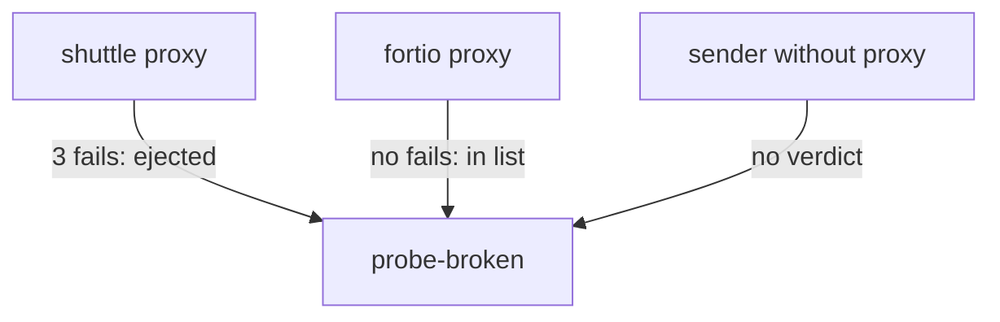

# Local, Temporary, And Verified

Astronaut, two properties of outlier detection are left, and both surprise people: every proxy reaches its own verdict, and every ejection ends. This part shows both on your playground, then the counters that prove an ejection, and a full circuit breaker that limits the load and removes bad ships in one rule.

The commands below need the four helpers from the module's landing page, the broken ship (`probe-broken.yaml`) and the 50% rule (`destinationrule-probe-outlier-detection.yaml`).

## The verdict is per proxy

Outlier detection runs inside each sender's communications officer, over the answers **that officer** received. There is no shared state between proxies and no central decision. Mission control (`istiod`) is not involved at all.



The shuttle's officer saw three failures from `probe-broken` and ejected it. Fortio's officer has not sent it anything, so it still has the ship in its list. A sender without a proxy has no verdict at all. All three views are correct at the same time: an ejection describes one proxy's own experience, never the pod itself.

Three things follow:

- **The pod stays in the Service.** Kubernetes still lists it as an endpoint. Nothing about the Kubernetes objects changes.
- **A workload without a sidecar is not protected**, because there is no proxy to hold a verdict.
- **A sender with little traffic may never eject anything**, because it has not collected enough evidence.

<!-- astrona:playground:renew -->

### Kubernetes and the proxy disagree

Send a round of signals, so the shuttle has fresh evidence. Then compare what Kubernetes lists with what two different proxies think:

```sh
count_status
kubectl get endpointslices -n starfleet -l kubernetes.io/service-name=probe
kubectl get pods -n starfleet -l app=probe -o wide
show_endpoints
istioctl proxy-config endpoints deploy/fortio -n starfleet --cluster "outbound|8000||probe.starfleet.svc.cluster.local"
```

You should see (the pod list trimmed to the name and IP columns):

```text
  12 200
   3 503
NAME          ADDRESSTYPE   PORTS   ENDPOINTS                           AGE
probe-tlf24   IPv4          8080    10.244.0.8,10.244.0.7,10.244.0.13   2m37s
NAME                            IP
probe-broken-5d7dc9b96f-l8j9s   10.244.0.13
probe-v1-7888d6c6d5-tct6g       10.244.0.7
probe-v2-58767cc46-rvjn5        10.244.0.8
ENDPOINT             STATUS      OUTLIER CHECK     CLUSTER
10.244.0.13:8080     HEALTHY     FAILED            outbound|8000||probe.starfleet.svc.cluster.local
10.244.0.7:8080      HEALTHY     OK                outbound|8000||probe.starfleet.svc.cluster.local
10.244.0.8:8080      HEALTHY     OK                outbound|8000||probe.starfleet.svc.cluster.local
ENDPOINT             STATUS      OUTLIER CHECK     CLUSTER
10.244.0.13:8080     HEALTHY     OK                outbound|8000||probe.starfleet.svc.cluster.local
10.244.0.7:8080      HEALTHY     OK                outbound|8000||probe.starfleet.svc.cluster.local
10.244.0.8:8080      HEALTHY     OK                outbound|8000||probe.starfleet.svc.cluster.local
```

The EndpointSlice still lists all three addresses, including `10.244.0.13`, the broken ship. In the shuttle's view, that ship has `OUTLIER CHECK: FAILED`. In fortio's view, the same ship is `OK`.

Read the two columns separately. `STATUS: HEALTHY` is the Kubernetes view: the pod is a ready endpoint of the Service. `OUTLIER CHECK` is **this proxy's own verdict**. The gap between those two columns is outlier detection, and no Kubernetes command will ever show it.

If every row in the shuttle's view says `OK`, the ejection time ran out. Run `count_status` again first.

## The counters

Better behaviour is a hint. The proxy's counters are proof. Three are worth knowing:

| Counter | Meaning |
| --- | --- |
| `outlier_detection.ejections_active` | ships ejected right now |
| `outlier_detection.ejections_total` | ejections since the proxy started |
| `outlier_detection.ejections_enforced_consecutive_5xx` | ejections caused by the 5xx rule |

Istio drops these per-destination counters unless the pod asks for them. The playground's shuttle carries the annotation `sidecar.istio.io/statsInclusionPrefixes: "cluster.outbound"`, which keeps them.

### Read the ejection counters

```sh
ejection_stats
```

You should see:

```text
cluster.outbound|8000||probe.starfleet.svc.cluster.local;.outlier_detection.ejections_active: 1
cluster.outbound|8000||probe.starfleet.svc.cluster.local;.outlier_detection.ejections_enforced_consecutive_5xx: 1
cluster.outbound|8000||probe.starfleet.svc.cluster.local;.outlier_detection.ejections_total: 1
```

`ejections_active: 1` while the broken ship is out, and `enforced_consecutive_5xx` names *which* rule did it. That helps when several limits are set. If `total` has grown while `active` reads `0`, you caught the ship between two ejections.

## Watching the cycle

An ejection ends and the ship is tried again, so a ship that stays broken produces a cycle, not a steady state. Watching `ejections_total` climb while `ejections_active` flips between `1` and `0` makes that cycle visible.

### Watch four minutes of ejections

This loop prints the two counters every 20 seconds, and keeps sending signals so the shuttle keeps collecting evidence:

```sh
for i in $(seq 1 12); do
  ejection_stats | grep -E 'ejections_(active|total)' | awk -F'.' '{print $NF}' | tr '\n' ' '; echo
  count_status >/dev/null
  sleep 20
done
```

You should see:

```text
ejections_active: 1 ejections_total: 1 
ejections_active: 1 ejections_total: 1 
ejections_active: 1 ejections_total: 1 
ejections_active: 0 ejections_total: 1 
ejections_active: 1 ejections_total: 2 
ejections_active: 1 ejections_total: 2 
ejections_active: 1 ejections_total: 2 
ejections_active: 1 ejections_total: 2 
ejections_active: 1 ejections_total: 2 
ejections_active: 0 ejections_total: 2 
ejections_active: 1 ejections_total: 3 
ejections_active: 1 ejections_total: 3 
```

`total` only ever goes up. `active` drops to `0` when an ejection ends, and goes back to `1` as soon as the returned ship fails again. With `baseEjectionTime: 1m`, the first ejection lasted about one minute (three lines) and the second about two (five lines): the back-off at work.

## Both halves in one rule

A connection pool and outlier detection sit side by side under `trafficPolicy`. In real systems you usually want both: limit how much work is open to a service, **and** remove ships that keep failing. Together they are called a circuit breaker. Keep both in **one** `DestinationRule` per host, because two rules for the same host do not combine reliably.

### Raise both shields at once

Save this as `destinationrule-probe-full-circuit-breaker.yaml`:

```yaml
apiVersion: networking.istio.io/v1
kind: DestinationRule
metadata:
  name: probe
  namespace: starfleet
spec:
  host: probe
  trafficPolicy:
    connectionPool:
      tcp:
        maxConnections: 1
      http:
        http1MaxPendingRequests: 1
        maxRequestsPerConnection: 1
    outlierDetection:
      consecutive5xxErrors: 3
      interval: 5s
      baseEjectionTime: 1m
      maxEjectionPercent: 50
```

Apply it:

```sh
kubectl apply -f destinationrule-probe-full-circuit-breaker.yaml
```

Then fire 30 signals over 3 parallel connections from fortio, and read fortio's own counters for both halves:

```sh
load_test 3
kubectl exec -n starfleet deploy/fortio -c istio-proxy -- pilot-agent request GET stats 2>/dev/null \
  | grep -E 'probe.starfleet.*(upstream_rq_pending_overflow|outlier_detection.ejections_total):'
```

You should see:

```text
Code 200 : 11 (36.7 %)
Code 503 : 19 (63.3 %)
cluster.outbound|8000||probe.starfleet.svc.cluster.local;.outlier_detection.ejections_total: 1
cluster.outbound|8000||probe.starfleet.svc.cluster.local;.upstream_rq_pending_overflow: 16
```

Both halves worked in the same run. `upstream_rq_pending_overflow: 16` counts the signals the connection pool refused at once, with `503 UO`, because too many were open. `ejections_total: 1` shows that fortio's own officer also pulled the broken ship out of formation.

### Clean up

Remove the rule and the broken ship, so the playground is back to two healthy probes:

```sh
kubectl delete destinationrule probe -n starfleet
kubectl delete -f probe-broken.yaml
```

```text
destinationrule.networking.istio.io "probe" deleted from starfleet namespace
deployment.apps "probe-broken" deleted from starfleet namespace
```

## Common pitfalls

> [!WARNING]
> - **Expecting a change in Kubernetes.** The pod stays in the Service. Use `istioctl proxy-config endpoints` and the proxy's counters.
> - **Assuming one proxy's verdict is shared.** Every sender's communications officer ejects on its own, from what it has seen.
> - **Expecting an ejection to last forever.** It lasts `baseEjectionTime` × the ejection count (up to Envoy's cap), then the ship is tried again.
> - **Mistaking the ejection cycle for instability.** A ship that stays broken produces repeating bursts with growing gaps. That is the design.
> - **Reading counters from a pod without the stats annotation.** The per-destination `outlier_detection.*` counters are simply missing.
> - **Splitting the connection pool and outlier detection over two `DestinationRule`s for one host.** Keep both in one rule.

> *`STATUS` is what Kubernetes says and `OUTLIER CHECK` is what this proxy decided: the gap between those two columns is the entire feature.*

## Your mission: Raise Both Shields

You can now prove an ejection from the proxy's own view and counters, and combine a connection pool with outlier detection in one rule. Now prove it in a graded mission: protect the probe with both halves of a circuit breaker, and show each half working.

The mission runs in its own training solar system, so first pause your playground. Nothing in it is lost:

```sh
astrona stop ats-014-playground-040-03
```

Then start the mission:

```sh
astrona run --git git@github.com:astrona-io/ATS014.git -c sections/section-040/module-03/labs/lab-02
```

Read the task in [`question.md`](./labs/lab-02/question.md) and solve it on your own first. When you think you are done, send it for grading:

```sh
astrona submit -c sections/section-040/module-03/labs/lab-02
```

When the mission is done, remove it and wake your playground up again:

```sh
astrona destroy ats-014-lab-040-03-02
astrona start ats-014-playground-040-03
```
