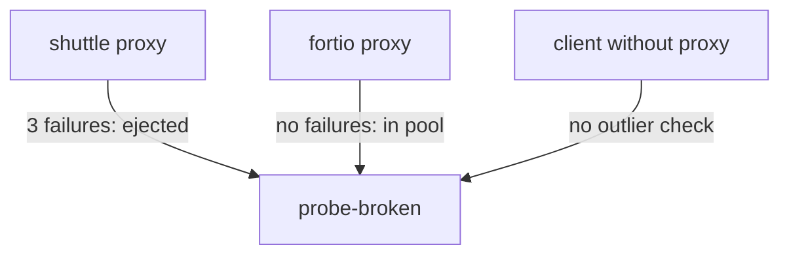

# Verify Ejections And Combine Them With A Connection Pool

Fewer errors in a test are a hint that outlier detection works, not proof. This part shows where an ejection really becomes visible: in each client proxy's own list of endpoints and in its counters, never in Kubernetes. It then shows two facts that surprise people, that every proxy decides on its own and that every ejection ends. It closes with a circuit breaker: a connection pool and outlier detection in one `DestinationRule`.

The commands in this part start from a known state. The `starfleet` namespace has the `probe` Service with two healthy pods (`probe-v1` and `probe-v2`) and a third pod, `probe-broken`, that answers every request with `503`. Its Deployment is saved in `deployment-probe-broken.yaml`. A `DestinationRule` named `probe` has this outlier detection block: `consecutive5xxErrors: 3`, `interval: 5s`, `baseEjectionTime: 1m` and `maxEjectionPercent: 50`.

## Each proxy decides on its own

Outlier detection runs inside each client's sidecar proxy, the Envoy container that Istio adds to each pod. Each proxy counts the responses that **it** received. There is no shared state between proxies and no central decision. `istiod`, Istio's control plane that sends configuration to every proxy, only delivers the rule. It takes no part in any ejection.



The diagram shows three clients of the same broken pod. The `shuttle` pod's proxy received three failures from `probe-broken` and ejected it. The `fortio` pod's proxy has sent it nothing yet, so the endpoint is still in its load-balancing pool. A client without a sidecar proxy has no outlier detection at all.

All three views are correct at the same time, because an ejection describes what one proxy has seen, never the pod itself. Three facts follow:

- **The pod stays in the Service.** Kubernetes still lists it as an endpoint. No Kubernetes object changes.
- **A workload without a sidecar proxy is not protected**, because there is no proxy to count its failures.
- **A client with little traffic may never eject anything**, because it has not received enough failed responses.

## Compare Kubernetes with two proxies

The difference between Kubernetes and the proxies is easiest to see side by side. Kubernetes stores the endpoints of a Service in an **EndpointSlice**, an object that lists the addresses of the ready pods behind the Service. `istioctl proxy-config endpoints` shows the endpoints that one proxy holds for one Envoy cluster. An **Envoy cluster** is the proxy's name for a group of endpoints, here `outbound|8000||probe.starfleet.svc.cluster.local`: outbound traffic to port `8000` of the `probe` Service.

<!-- astrona:playground:renew -->

The commands in this part use four shell helper functions. Paste them into your terminal first. Each comment says what the helper does:

```sh
# 15 single requests from the shuttle to the probe, counted by status code
count_status() { for i in $(seq 1 15); do
  kubectl exec -n starfleet deploy/shuttle -- curl -s -o /dev/null -w "%{http_code}\n" http://probe:8000/get
done | sort | uniq -c; }
# the probe's endpoints as the shuttle's proxy sees them, with the OUTLIER CHECK column
show_endpoints() { istioctl proxy-config endpoints deploy/shuttle -n starfleet --cluster "outbound|8000||probe.starfleet.svc.cluster.local"; }
# the shuttle proxy's outlier-detection counters for the probe
ejection_stats() { kubectl exec -n starfleet deploy/shuttle -c istio-proxy -- \
  pilot-agent request GET stats 2>/dev/null | grep -E 'probe.starfleet.*outlier_detection.ejections_(active|total|enforced_consecutive_5xx):'; }
# 30 requests to the probe over N parallel connections, from fortio
load_test() { kubectl exec -n starfleet deploy/fortio -c fortio -- \
  fortio load -c "$1" -qps 0 -n 30 -loglevel Warning http://probe:8000/get 2>&1 | grep -E "^Code"; }
```

Send a round of requests, so the `shuttle` proxy has fresh failures to count. Then compare what Kubernetes lists with what the `shuttle` proxy and the `fortio` proxy hold:

```sh
count_status
kubectl get endpointslices -n starfleet -l kubernetes.io/service-name=probe
kubectl get pods -n starfleet -l app=probe -o wide
show_endpoints
istioctl proxy-config endpoints deploy/fortio -n starfleet --cluster "outbound|8000||probe.starfleet.svc.cluster.local"
```

You should see this (the pod list is shortened to the name and IP columns):

```text
  12 200
   3 503
NAME          ADDRESSTYPE   PORTS   ENDPOINTS                           AGE
probe-tlf24   IPv4          8080    10.244.0.8,10.244.0.7,10.244.0.13   2m37s
NAME                            IP
probe-broken-5d7dc9b96f-l8j9s   10.244.0.13
probe-v1-7888d6c6d5-tct6g       10.244.0.7
probe-v2-58767cc46-rvjn5        10.244.0.8
ENDPOINT             STATUS      OUTLIER CHECK     CLUSTER
10.244.0.13:8080     HEALTHY     FAILED            outbound|8000||probe.starfleet.svc.cluster.local
10.244.0.7:8080      HEALTHY     OK                outbound|8000||probe.starfleet.svc.cluster.local
10.244.0.8:8080      HEALTHY     OK                outbound|8000||probe.starfleet.svc.cluster.local
ENDPOINT             STATUS      OUTLIER CHECK     CLUSTER
10.244.0.13:8080     HEALTHY     OK                outbound|8000||probe.starfleet.svc.cluster.local
10.244.0.7:8080      HEALTHY     OK                outbound|8000||probe.starfleet.svc.cluster.local
10.244.0.8:8080      HEALTHY     OK                outbound|8000||probe.starfleet.svc.cluster.local
```

The EndpointSlice still lists all three addresses, including `10.244.0.13`, the broken pod. In the `shuttle` proxy's list, that endpoint has `OUTLIER CHECK: FAILED`. In the `fortio` proxy's list, the same endpoint is `OK`.

Read the two columns separately. `STATUS: HEALTHY` comes from Kubernetes through `istiod`: the pod is a ready endpoint of the Service. `OUTLIER CHECK` is **this proxy's own decision**. The difference between those two columns is outlier detection, and no Kubernetes command shows it. If every row in the `shuttle` list says `OK`, the ejection time has run out; run `count_status` and check again.

## Read the ejection counters

The endpoint list shows the current state. The proxy's counters show what happened over time. Three counters are worth knowing:

| Counter | Meaning |
| --- | --- |
| `outlier_detection.ejections_active` | endpoints ejected right now |
| `outlier_detection.ejections_total` | ejections since the proxy started |
| `outlier_detection.ejections_enforced_consecutive_5xx` | ejections caused by the `consecutive5xxErrors` rule |

Istio drops these counters for each destination unless the pod asks for them. The playground's `shuttle` and `fortio` pods carry the annotation `sidecar.istio.io/statsInclusionPrefixes: "cluster.outbound"`, which keeps them. Read them with the `ejection_stats` helper:

```sh
ejection_stats
```

You should see:

```text
cluster.outbound|8000||probe.starfleet.svc.cluster.local;.outlier_detection.ejections_active: 1
cluster.outbound|8000||probe.starfleet.svc.cluster.local;.outlier_detection.ejections_enforced_consecutive_5xx: 1
cluster.outbound|8000||probe.starfleet.svc.cluster.local;.outlier_detection.ejections_total: 1
```

`ejections_active` is `1` while the broken endpoint is out, and `enforced_consecutive_5xx` names *which* rule ejected it. That helps when several limits are set. If `total` has grown while `active` reads `0`, you checked between two ejections.

## Watch the ejection cycle

Every ejection ends, and the proxy then tries the endpoint again. So a pod that stays broken produces a cycle, not a stable state. You can see the cycle when `ejections_total` climbs while `ejections_active` changes between `1` and `0`.

This loop prints the two counters every 20 seconds for four minutes. It keeps sending requests, so the `shuttle` proxy keeps receiving responses:

```sh
for i in $(seq 1 12); do
  ejection_stats | grep -E 'ejections_(active|total)' | awk -F'.' '{print $NF}' | tr '\n' ' '; echo
  count_status >/dev/null
  sleep 20
done
```

You should see:

```text
ejections_active: 1 ejections_total: 1 
ejections_active: 1 ejections_total: 1 
ejections_active: 1 ejections_total: 1 
ejections_active: 0 ejections_total: 1 
ejections_active: 1 ejections_total: 2 
ejections_active: 1 ejections_total: 2 
ejections_active: 1 ejections_total: 2 
ejections_active: 1 ejections_total: 2 
ejections_active: 1 ejections_total: 2 
ejections_active: 0 ejections_total: 2 
ejections_active: 1 ejections_total: 3 
ejections_active: 1 ejections_total: 3 
```

`total` only goes up. `active` drops to `0` when an ejection ends, and goes back to `1` as soon as the returned endpoint fails again. With `baseEjectionTime: 1m`, the first ejection lasted about one minute (three lines) and the second about two minutes (five lines). Each repeat ejection is longer than the one before.

## A connection pool and outlier detection in one rule

Outlier detection removes endpoints that fail. A **connection pool**, set under `trafficPolicy.connectionPool`, limits how many connections and waiting requests a client proxy may have open to a host at the same time. When the limit is reached, the proxy refuses the extra requests at once with `503` and the response flag `UO` (upstream overflow). Together, the two settings are called a **circuit breaker**.

Both sit side by side under the same `trafficPolicy`. Keep both in **one** `DestinationRule` per host, because two rules for the same host do not combine reliably. Save this as `destinationrule-probe-full-circuit-breaker.yaml`:

```yaml
apiVersion: networking.istio.io/v1
kind: DestinationRule
metadata:
  name: probe
  namespace: starfleet
spec:
  host: probe
  trafficPolicy:
    connectionPool:
      tcp:
        maxConnections: 1
      http:
        http1MaxPendingRequests: 1
        maxRequestsPerConnection: 1
    outlierDetection:
      consecutive5xxErrors: 3
      interval: 5s
      baseEjectionTime: 1m
      maxEjectionPercent: 50
```

Apply it:

```sh
kubectl apply -f destinationrule-probe-full-circuit-breaker.yaml
```

Then send 30 requests over 3 parallel connections from `fortio`, a load generator that sends many requests at the same time. Read the `fortio` proxy's counters for both halves of the rule:

```sh
load_test 3
kubectl exec -n starfleet deploy/fortio -c istio-proxy -- pilot-agent request GET stats 2>/dev/null \
  | grep -E 'probe.starfleet.*(upstream_rq_pending_overflow|outlier_detection.ejections_total):'
```

You should see:

```text
Code 200 : 11 (36.7 %)
Code 503 : 19 (63.3 %)
cluster.outbound|8000||probe.starfleet.svc.cluster.local;.outlier_detection.ejections_total: 1
cluster.outbound|8000||probe.starfleet.svc.cluster.local;.upstream_rq_pending_overflow: 16
```

Both halves worked in the same run. `upstream_rq_pending_overflow: 16` counts the requests that the connection pool refused at once with `503 UO`, because too many were open. `ejections_total: 1` shows that the `fortio` proxy also ejected the broken endpoint, from its own failed responses.

To bring the playground back to two healthy probe pods, delete the rule and the broken Deployment:

```sh
kubectl delete destinationrule probe -n starfleet
kubectl delete -f deployment-probe-broken.yaml
```

```text
destinationrule.networking.istio.io "probe" deleted from starfleet namespace
deployment.apps "probe-broken" deleted from starfleet namespace
```

You now know how to prove an ejection from the proxy's endpoint list and counters, why each proxy decides on its own, why an ejection always ends, and how to combine outlier detection with a connection pool. The open question is no longer how the feature works, but which numbers suit a given Service and its traffic.

## Common pitfalls

> [!WARNING]
> - **Looking for the ejection in Kubernetes.** The pod stays in the Service and the EndpointSlice. Use `istioctl proxy-config endpoints` and the proxy's counters.
> - **Expecting one proxy's ejection to protect every client.** Each client's sidecar proxy ejects on its own, from the responses it received.
> - **Expecting an ejection to last forever.** It lasts `baseEjectionTime` × the ejection count (up to Envoy's cap), then the proxy tries the endpoint again.
> - **Reading the ejection cycle as a fault.** A pod that stays broken produces repeating bursts of errors with growing gaps. That is how the feature works.
> - **Reading counters from a pod without the stats annotation.** The `outlier_detection.*` counters for each destination are missing from its statistics.
> - **Splitting the connection pool and outlier detection over two `DestinationRule` objects for one host.** Keep both in one rule.

## Your mission: Combine A Connection Pool And Outlier Detection Lab

You can now prove an ejection from the proxy's own endpoint list and counters, and combine a connection pool with outlier detection in one rule. In the lab, you protect the `probe` Service with both halves of a circuit breaker and show that each half works on live requests.

The lab runs in its own cluster, so first pause your playground. Nothing in it is lost:

```sh
astrona stop ats-014-playground-040-03
```

Then start the lab:

```sh
astrona run --git git@github.com:astrona-io/ATS014.git -c sections/section-040/module-03/labs/lab-02
```

The task is on the next page. Solve it on your own first. When you think you are done, send it for grading:

```sh
astrona submit -c sections/section-040/module-03/labs/lab-02
```

When the lab is done, remove it and start your playground again:

```sh
astrona destroy ats-014-lab-040-03-02
astrona start ats-014-playground-040-03
```
