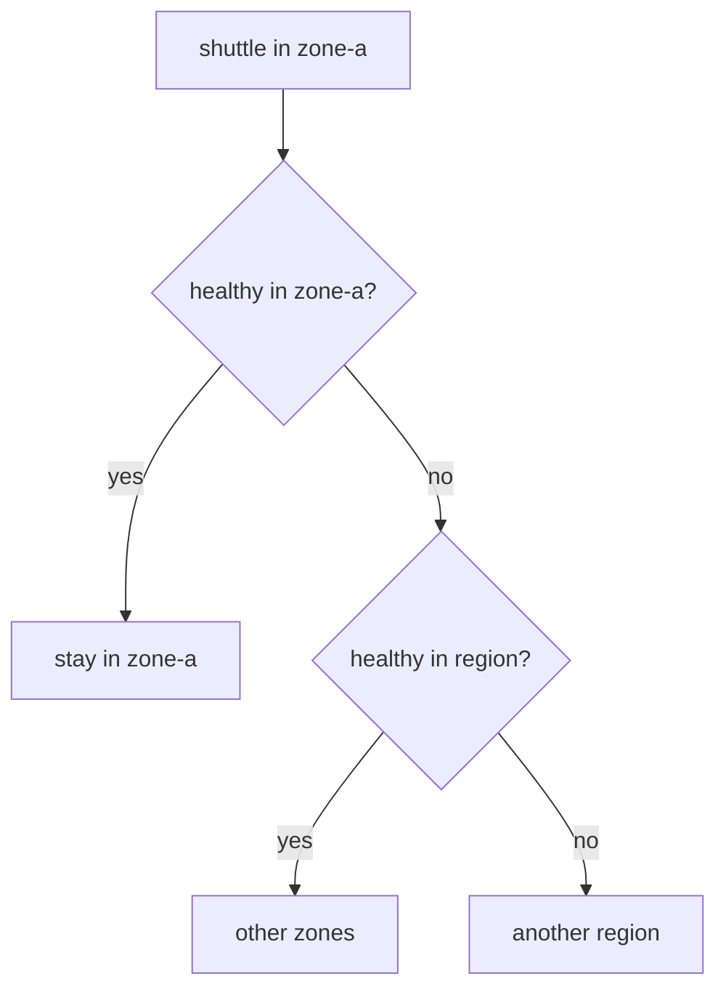

# Configure Locality Preference, Distribute And Failover

Every endpoint in your playground has a locality, and so does the client pod `shuttle`. That alone does not change where requests go. Before you change how the client's sidecar proxy picks a zone, find out how it picks one today.

This part shows what really switches on the preference for the client's own zone. It then shows the two ways to take control of that preference: exact weights with `distribute`, and an ordered fallback between regions with `failover`. All three settings live in a `DestinationRule`, the Istio object that sets the traffic policy (load balancing, connection limits, outlier detection) for requests to one host.

## What switches the preference on

The locality preference works like this. A client in `zone-a` sends requests to `zone-a` endpoints while they are healthy, and only moves to other endpoints when they are not. The proxy matches from most specific to least specific: same region, zone and subzone first, then same region and zone, then same region, then any endpoint.



The diagram shows the order in which the proxy of `shuttle` (region `local`, zone `zone-a`) uses the levels: each level is only used when the level above has no healthy endpoint left.

There is a catch that surprises almost everyone. **Istio only applies this preference to a host whose `DestinationRule` has `outlierDetection`.** **Outlier detection** is the proxy feature that ejects an endpoint after it returns a number of errors in a row. The preference needs to know which endpoints are healthy, and outlier detection is what tells it. You can prove this in three steps.

<!-- astrona:playground:renew -->

### No `DestinationRule`: no preference

Start with the playground as it is. Check that there is no `DestinationRule`, then send 20 requests:

```sh
kubectl -n starfleet get destinationrule
count_zones 20
```

You should see something like:

```text
No resources found in starfleet namespace.
   9 probe-zone-a
  11 probe-zone-b
```

The requests are spread over both zones. Nothing keeps them in the client's own zone.

### `localityLbSetting` alone: still no preference

Next, switch locality on explicitly, without outlier detection. Save this as `destinationrule-probe-locality.yaml`:

```yaml
apiVersion: networking.istio.io/v1
kind: DestinationRule
metadata:
  name: probe
  namespace: starfleet
spec:
  host: probe
  trafficPolicy:
    loadBalancer:
      localityLbSetting:
        enabled: true
```

Apply it:

```sh
kubectl apply -f destinationrule-probe-locality.yaml
```

Then send 20 requests again:

```sh
count_zones 20
```

You should see a mix again, for example:

```text
  13 probe-zone-a
   7 probe-zone-b
```

`enabled: true` on its own changes nothing you can see. Without outlier detection, Istio does not apply the preference.

### Add outlier detection: the preference appears

Now add outlier detection to the same `DestinationRule`. Save this as `destinationrule-probe-failover.yaml`:

```yaml
apiVersion: networking.istio.io/v1
kind: DestinationRule
metadata:
  name: probe
  namespace: starfleet
spec:
  host: probe
  trafficPolicy:
    outlierDetection:
      consecutive5xxErrors: 2
      interval: 5s
      baseEjectionTime: 30s
      maxEjectionPercent: 100
    loadBalancer:
      localityLbSetting:
        enabled: true
```

Apply it:

```sh
kubectl apply -f destinationrule-probe-failover.yaml
```

Then send 20 requests:

```sh
count_zones 20
```

You should see:

```text
  20 probe-zone-a
```

Every request stays in the client's own zone. To see how the proxy of `shuttle` stores this, read its endpoint list again and look at the `priority` field:

```sh
istioctl proxy-config endpoints deploy/shuttle -n starfleet \
  --cluster "outbound|8000||probe.starfleet.svc.cluster.local" -o json \
  | grep -E '"zone"|"priority"'
```

You should see (trimmed to the matching lines):

```text
                    "zone": "zone-a"
                "priority": 1,
                    "zone": "zone-b"
```

`istiod` gave the `zone-b` endpoints `"priority": 1`. Envoy uses a priority 1 endpoint only when priority 0, the client's own zone, has no healthy endpoint left. The full output also contains a second line, `"priority": "HIGH"`; that one belongs to the connection limits, not to locality.

Keep this `DestinationRule` in mind: the same two blocks, `outlierDetection` and `localityLbSetting`, are what make failover work.

## `distribute`: exact proportions

The preference is all or nothing: every request stays in the client's zone while that zone is healthy. Sometimes you want a fixed share of requests in another zone instead. `distribute` replaces the preference with exact weights for requests that start in a given locality. It has two fields:

- **`from`** is a locality pattern that the **client** must match.
- **`to`** maps destination locality patterns to weights. The weights must add up to exactly 100.

In both fields, `*` stands for "any value" at the remaining levels, so `local/zone-a/*` means region `local`, zone `zone-a`, any subzone. A client whose locality matches no `from` keeps the normal behaviour. Use `distribute` when strict preference is wrong, for example to keep a share of requests going to the second zone, so you know that path works before you need it.

### Send 30% to the other zone on purpose

Replace the `DestinationRule` with one that sends 70% of the requests from `zone-a` to `zone-a` and 30% to `zone-b`. Save this as `destinationrule-probe-distribute.yaml`:

```yaml
apiVersion: networking.istio.io/v1
kind: DestinationRule
metadata:
  name: probe
  namespace: starfleet
spec:
  host: probe
  trafficPolicy:
    loadBalancer:
      localityLbSetting:
        enabled: true
        distribute:
        - from: local/zone-a/*
          to:
            "local/zone-a/*": 70
            "local/zone-b/*": 30
```

Apply it:

```sh
kubectl apply -f destinationrule-probe-distribute.yaml
```

Then send 100 requests:

```sh
count_zones 100
```

You should see something like:

```text
  70 probe-zone-a
  30 probe-zone-b
```

The proxy picks a zone by weight for each request, so expect a few requests of difference from run to run. Note that `distribute` works **without** outlier detection: it sets fixed weights, so it does not need to know which endpoints are healthy.

Weights that do not add up to 100 are refused. Change `30` to `20` in the file and apply it again:

```sh
kubectl apply -f destinationrule-probe-distribute.yaml
```

You should see (trimmed to the first and last line):

```text
Error from server: error when applying patch:
...
for: "destinationrule-probe-distribute.yaml": error when patching "destinationrule-probe-distribute.yaml": admission webhook "validation.istio.io" denied the request: configuration is invalid: total locality weight 90 != 100
```

Istio's validation webhook, which checks every Istio object before Kubernetes stores it, rejected the change. Put the `30` back before you go on.

## `failover`: ordered fallback between regions

`distribute` changes the shares inside a healthy setup. `failover` handles the opposite case: a whole region with no healthy endpoint left. It sets no weights. It keeps the preference and names the **region** to use next:

```yaml
trafficPolicy:
  outlierDetection:
    consecutive5xxErrors: 2
    interval: 5s
    baseEjectionTime: 30s
    maxEjectionPercent: 100
  loadBalancer:
    localityLbSetting:
      enabled: true
      failover:
      - from: us-east1
        to: us-west1
```

This is only a piece of a `DestinationRule`, so you do not apply it. Three facts matter:

- **`failover` works between regions only.** Moving from one zone to another inside a region is already what the preference does.
- **It needs `outlierDetection`,** like the preference itself.
- **`distribute` and `failover` cannot be combined** for the same host. Istio rejects it with `can not simultaneously specify 'distribute' and 'failover'`.

There is also `failoverPriority`. It is a list of label keys, such as `topology.kubernetes.io/region`, and it ranks endpoints by how many of those labels have the same value as on the client. It is the more flexible alternative, and you should recognise it on the exam.

Your playground has only one region, `local`, so there is no second region to fail over to here.

## Choosing between them

The four settings answer four different requirements:

| The task says | Use |
| --- | --- |
| "keep requests in the zone, fall back if it fails" | `outlierDetection` plus `localityLbSetting: {enabled: true}` |
| "send 30% to the other zone on purpose" | `distribute` |
| "if this region is down, use that one" | `failover`, with `outlierDetection` |
| "rank fallbacks by how similar the locality is" | `failoverPriority`, with `outlierDetection` |

Delete the `DestinationRule` before you go on, so the probe has none:

```sh
kubectl delete destinationrule probe -n starfleet
```

You now know that the locality preference only acts when `outlierDetection` is present, and you can see it in the proxy as `"priority": 1` on the other zone. You can replace the preference with fixed weights through `distribute`, and name a fallback region with `failover`. The open question is what really happens when the endpoint in the client's own zone stops working, and why outlier detection is the part that notices.

## Common pitfalls

> [!WARNING]
> - **Expecting a preference without `outlierDetection`.** Istio only applies the locality preference to a host that has outlier detection. `enabled: true` alone changes nothing.
> - **`distribute` weights that do not add up to 100.** Istio rejects the object: `total locality weight 90 != 100`.
> - **`distribute` and `failover` together.** They are alternatives, and Istio rejects the combination.
> - **Expecting `failover` to work between zones.** It works between regions. Moving between zones inside a region is the preference itself.

## Your mission: Split Traffic Between Two Zones With Distribute Lab

You can now switch on the locality preference, and replace it with exact weights between zones. In the lab, you keep most requests in the client's zone but send a fixed share to the other zone on purpose.

The lab runs in its own cluster, so first pause your playground. Nothing in it is lost:

```sh
astrona stop ats-014-playground-040-04
```

Then start the lab:

```sh
astrona run --git git@github.com:astrona-io/ATS014.git -c sections/section-040/module-04/labs/lab-03
```

The task is on the next page. Solve it on your own first. When you think you are done, send it for grading:

```sh
astrona submit -c sections/section-040/module-04/labs/lab-03
```

When the lab is done, remove it and start your playground again:

```sh
astrona destroy ats-014-lab-040-04-03
astrona start ats-014-playground-040-04
```
