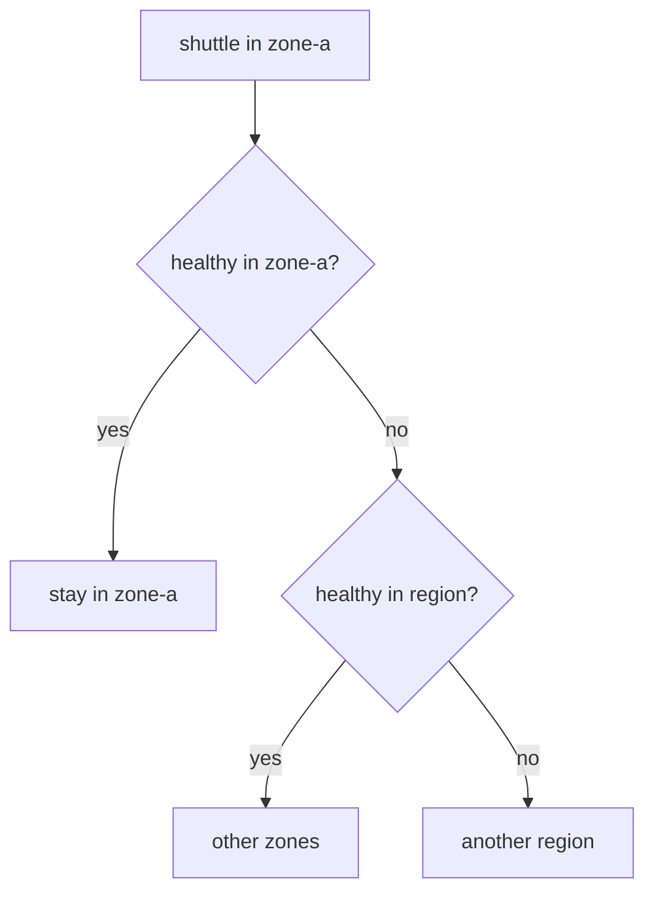

# Preference, `distribute` And `failover`

Astronaut, before you change how signals choose an orbit, find out how they choose one today. This part shows what really switches on the preference for the nearby orbit, then the two ways to take control of it: exact weights with `distribute`, and an ordered fallback with `failover`.

## What switches the preference on

Istio's locality preference works like this: a sender in `zone-a` sends to `zone-a` endpoints while they are healthy, and only spills over when they are not. The matching goes from most specific to least specific: same region, zone and subzone first, then same region and zone, then same region, then anything.



The shuttle flies in region `local`, zone `zone-a`. Each level below is only used when the level above has no healthy endpoint left.

There is a catch that surprises almost everyone: **Istio only applies this preference to a host whose `DestinationRule` has `outlierDetection`.** The preference needs to know which endpoints are healthy, and outlier detection is what tells it. You will now prove that in three steps.

<!-- astrona:playground:renew -->

### No `DestinationRule`: no preference

Check that there is no `DestinationRule`, then send 20 signals:

```sh
kubectl -n starfleet get destinationrule
count_orbits 20
```

You should see something like:

```text
No resources found in starfleet namespace.
   9 probe-zone-a
  11 probe-zone-b
```

The signals are spread over both orbits. Nothing keeps them in the shuttle's own zone.

### `localityLbSetting` alone: still no preference

Turn locality on explicitly, without outlier detection. Save this as `destinationrule-probe-locality.yaml`:

```yaml
apiVersion: networking.istio.io/v1
kind: DestinationRule
metadata:
  name: probe
  namespace: starfleet
spec:
  host: probe
  trafficPolicy:
    loadBalancer:
      localityLbSetting:
        enabled: true
```

Apply it:

```sh
kubectl apply -f destinationrule-probe-locality.yaml
```

Then send 20 signals again:

```sh
count_orbits 20
```

You should see a mix again, for example:

```text
  13 probe-zone-a
   7 probe-zone-b
```

`enabled: true` on its own changes nothing you can see. Without outlier detection, Istio does not apply the preference.

### Add outlier detection: the preference appears

Now give the `DestinationRule` outlier detection. Save this as `destinationrule-probe-failover.yaml`:

```yaml
apiVersion: networking.istio.io/v1
kind: DestinationRule
metadata:
  name: probe
  namespace: starfleet
spec:
  host: probe
  trafficPolicy:
    outlierDetection:
      consecutive5xxErrors: 2
      interval: 5s
      baseEjectionTime: 30s
      maxEjectionPercent: 100
    loadBalancer:
      localityLbSetting:
        enabled: true
```

Apply it:

```sh
kubectl apply -f destinationrule-probe-failover.yaml
```

Then send 20 signals:

```sh
count_orbits 20
```

You should see:

```text
  20 probe-zone-a
```

Every signal stays in the shuttle's own orbit. Look at how the communications officer stores this:

```sh
istioctl proxy-config endpoints deploy/shuttle -n starfleet \
  --cluster "outbound|8000||probe.starfleet.svc.cluster.local" -o json \
  | grep -E '"zone"|"priority"'
```

You should see (trimmed to the matching lines):

```text
                    "zone": "zone-a"
                "priority": 1,
                    "zone": "zone-b"
```

The `zone-b` endpoints got `"priority": 1`: a fallback level that is only used when priority 0, the shuttle's own zone, has no healthy endpoint left. (A second line, `"priority": "HIGH"`, also appears in the full output; that one belongs to the connection limits, not to locality.)

You will meet this `DestinationRule` again: the same two blocks are what make failover work.

## `distribute`: exact proportions

`distribute` replaces the preference with exact weights, for signals that start in a given orbit:

- **`from`** is a locality pattern that the **sender** must match.
- **`to`** maps destination locality patterns to weights. The weights must add up to exactly 100.
- `*` stands for "any value" at the remaining levels, so `local/zone-a/*` means region `local`, zone `zone-a`, any subzone.

A sender whose locality matches no `from` keeps the normal behaviour. Use `distribute` when strict preference is wrong, for example to keep a share of signals flowing to the second zone so you know that path works before you need it.

### Send 30% to the far orbit on purpose

Save this as `destinationrule-probe-distribute.yaml`:

```yaml
apiVersion: networking.istio.io/v1
kind: DestinationRule
metadata:
  name: probe
  namespace: starfleet
spec:
  host: probe
  trafficPolicy:
    loadBalancer:
      localityLbSetting:
        enabled: true
        distribute:
        - from: local/zone-a/*
          to:
            "local/zone-a/*": 70
            "local/zone-b/*": 30
```

Apply it:

```sh
kubectl apply -f destinationrule-probe-distribute.yaml
```

Then send 100 signals:

```sh
count_orbits 100
```

You should see something like:

```text
  70 probe-zone-a
  30 probe-zone-b
```

The weights are a draw per signal, so expect a few signals of difference from run to run. Notice that `distribute` works **without** outlier detection: it sets fixed weights, it does not need to know which endpoints are healthy.

Weights that do not add up to 100 are refused. Change `30` to `20` in the file and apply it again:

```sh
kubectl apply -f destinationrule-probe-distribute.yaml
```

You should see (trimmed to the first and last line):

```text
Error from server: error when applying patch:
...
for: "destinationrule-probe-distribute.yaml": error when patching "destinationrule-probe-distribute.yaml": admission webhook "validation.istio.io" denied the request: configuration is invalid: total locality weight 90 != 100
```

Put the `30` back before you go on.

## `failover`: ordered fallback between regions

`failover` sets no weights. It keeps the preference and says which **region** to use next when a whole region has no healthy endpoint left:

```yaml
trafficPolicy:
  outlierDetection:
    consecutive5xxErrors: 2
    interval: 5s
    baseEjectionTime: 30s
    maxEjectionPercent: 100
  loadBalancer:
    localityLbSetting:
      enabled: true
      failover:
      - from: us-east1
        to: us-west1
```

This is a piece of a `DestinationRule` (you do not apply it). Three facts to remember:

- **`failover` works between regions only.** Falling back from one zone to another inside a region is already what the preference does.
- **It needs `outlierDetection`,** like the preference itself.
- **`distribute` and `failover` cannot be combined** for the same host. Istio rejects it with `can not simultaneously specify 'distribute' and 'failover'`.

There is also `failoverPriority`: a list of label keys, such as `topology.kubernetes.io/region`, that ranks endpoints by how many of those labels they share with the sender. It is the more flexible alternative, and worth recognising.

Your playground has only one region, `local`, so there is no second region to fail over to here.

## Choosing between them

| The task says | Use |
| --- | --- |
| "keep signals in the zone, fall back if it fails" | `outlierDetection` plus `localityLbSetting: {enabled: true}` |
| "send 30% to the other zone on purpose" | `distribute` |
| "if this region is down, use that one" | `failover`, with `outlierDetection` |
| "rank fallbacks by how similar the locality is" | `failoverPriority`, with `outlierDetection` |

Clean up before the next part, so the probe has no `DestinationRule`:

```sh
kubectl delete destinationrule probe -n starfleet
```

## Common pitfalls

> [!WARNING]
> - **Expecting a preference without `outlierDetection`.** Istio only applies the locality preference to a host that has outlier detection. `enabled: true` alone changes nothing.
> - **`distribute` weights that do not add up to 100.** Istio rejects the object: `total locality weight 90 != 100`.
> - **`distribute` and `failover` together.** They are alternatives, and Istio rejects the combination.
> - **Expecting `failover` to work between zones.** It is region-level. Zone fallback inside a region is the preference itself.

> *The preference for the nearby orbit only acts when outlier detection is there. `distribute` sets fixed weights instead, and `failover` names the next region.*

## Your mission: Split Signals Between Two Orbits

You can now switch on the locality preference, and replace it with exact weights between orbits. Now prove it in a graded mission: keep most signals in the shuttle's orbit, but send a fixed share to the far orbit on purpose.

The mission runs in its own training solar system, so first pause your playground. Nothing in it is lost:

```sh
astrona stop ats-014-playground-040-04
```

Then start the mission:

```sh
astrona run --git git@github.com:astrona-io/ATS014.git -c sections/section-040/module-04/labs/lab-03
```

Read the task in [`question.md`](./labs/lab-03/question.md) and solve it on your own first. When you think you are done, send it for grading:

```sh
astrona submit -c sections/section-040/module-04/labs/lab-03
```

When the mission is done, remove it and wake your playground up again:

```sh
astrona destroy ats-014-lab-040-04-03
astrona start ats-014-playground-040-04
```
