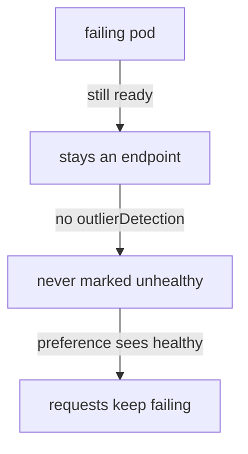

# Fail Over A Zone With Outlier Detection

Locality failover moves requests to another zone when the client's own zone has no healthy endpoint left. That only works if some component notices that an endpoint is not healthy. This part shows which component does that, why a pod that is removed behaves differently from a pod that fails, and where locality settings can live.

The examples use `DestinationRule`, the Istio object that sets the traffic policy for requests to one host, and the client's **sidecar proxy** (Envoy), the proxy container in each pod that picks an endpoint for every outgoing request.

## Failover needs outlier detection

"No healthy endpoint left in this zone" is a statement about **health**. In a mesh with sidecar proxies, endpoint health comes from one place: **outlier detection**, the proxy feature that ejects an endpoint after it returns a number of `5xx` errors in a row. Istio has no separate health checker for locality.

Follow what happens without it:



The diagram shows why a pod that fails every request still receives requests when there is no outlier detection.

The pod still passes its readiness probe, so Kubernetes keeps it as an endpoint of the Service. Nothing in the mesh marks it unhealthy. Locality failover cannot detect failures on its own, so another component must supply the health information, and that component is `outlierDetection`.

So a working failover always has **two** blocks in the same `trafficPolicy`: `outlierDetection` and `loadBalancer.localityLbSetting`. Also set `maxEjectionPercent` high enough to eject the failing endpoints. It is the largest share of the endpoints that the proxy may eject at the same time. With one pod per zone, its default of 10% can never eject anything. Then nothing is ever unhealthy, and nothing ever fails over.

## A pod that is removed is not a pod that fails

The two blocks matter because a zone can run out of usable endpoints in two ways, and the two ways behave differently:

| | Endpoint **removal** | Endpoint **failure** |
| --- | --- | --- |
| Cause | pod deleted, scaled to zero, readiness check fails | pod returns errors but stays ready |
| Who notices | Kubernetes: the endpoint leaves the list | the client's proxy, through outlier detection |
| Needs `outlierDetection` to fall back | no, as long as the preference itself is active | **yes** |
| Requests lost on the way | none | the failures that trigger the detection |

You will now see both cases, with a `DestinationRule` that has outlier detection and locality switched on.

<!-- astrona:playground:renew -->

### Remove the endpoint in the client's zone

First make sure the failover `DestinationRule` is in place. Save this as `destinationrule-probe-failover.yaml`:

```yaml
apiVersion: networking.istio.io/v1
kind: DestinationRule
metadata:
  name: probe
  namespace: starfleet
spec:
  host: probe
  trafficPolicy:
    outlierDetection:
      consecutive5xxErrors: 2
      interval: 5s
      baseEjectionTime: 30s
      maxEjectionPercent: 100
    loadBalancer:
      localityLbSetting:
        enabled: true
```

Apply it:

```sh
kubectl apply -f destinationrule-probe-failover.yaml
```

Then check that the preference is active:

```sh
count_zones 20
```

```text
  20 probe-zone-a
```

Now scale the `zone-a` probe to zero replicas and send requests again:

```sh
kubectl -n starfleet scale deployment probe-zone-a --replicas=0
kubectl -n starfleet rollout status deployment probe-zone-a
status_codes
count_zones 20
```

You should see:

```text
deployment.apps/probe-zone-a scaled
deployment "probe-zone-a" successfully rolled out
200 200 200 200 200 200 200 200 200 200 200 200 200 200 200 200 200 200 200 200
  20 probe-zone-b
```

Every request succeeded, and `zone-b` served all of them. No request failed on the way, because the endpoint left the Service's endpoint list and the proxy never tried it. Scale the `zone-a` probe back up:

```sh
kubectl -n starfleet scale deployment probe-zone-a --replicas=1
kubectl -n starfleet rollout status deployment probe-zone-a
```

### Replace it with a pod that fails every request

Removal was the easy case. The real failover test is a pod that stays in the endpoint list but fails every request. First delete the `DestinationRule`, swap the healthy `zone-a` probe for `probe-zone-a-damaged`, and list the probe pods:

```sh
kubectl delete destinationrule probe -n starfleet
kubectl -n starfleet scale deployment probe-zone-a --replicas=0
kubectl -n starfleet scale deployment probe-zone-a-damaged --replicas=1
kubectl -n starfleet rollout status deployment probe-zone-a-damaged
kubectl get pods -n starfleet -l app=probe
```

You should see (trimmed to the pod list):

```text
NAME                                    READY   STATUS    RESTARTS   AGE
probe-zone-a-damaged-58cb8b94cb-rqrdj   2/2     Running   0          11s
probe-zone-b-56b7474bd-k25md            2/2     Running   0          2m40s
```

The `probe-zone-a-damaged` pod is `2/2` and `Running`, so Kubernetes sees nothing wrong. Send 20 requests while there is no `DestinationRule`:

```sh
status_codes
```

You should see a mix, for example:

```text
503 503 503 503 200 503 503 503 503 503 200 200 503 503 200 503 200 200 503 200
```

About half the requests fail. With no outlier detection there is no preference and no health information, so the proxy keeps sending requests to the failing pod.

Now apply the failover `DestinationRule` again:

```sh
kubectl apply -f destinationrule-probe-failover.yaml
```

Then send 20 requests, twice:

```sh
status_codes
status_codes
```

You should see:

```text
503 503 200 200 200 200 200 200 200 200 200 200 200 200 200 200 200 200 200 200
200 200 200 200 200 200 200 200 200 200 200 200 200 200 200 200 200 200 200 200
```

The first two requests went to the failing pod and got `503`. That is `consecutive5xxErrors: 2` at work: after two errors in a row, the proxy of `shuttle` ejected the endpoint, and it sent every later request to `zone-b`. To see the ejection, read the endpoint list of `shuttle`:

```sh
istioctl proxy-config endpoints deploy/shuttle -n starfleet \
  --cluster "outbound|8000||probe.starfleet.svc.cluster.local"
```

```text
ENDPOINT             STATUS      OUTLIER CHECK     CLUSTER
10.244.0.10:8080     HEALTHY     FAILED            outbound|8000||probe.starfleet.svc.cluster.local
10.244.0.8:8080      HEALTHY     OK                outbound|8000||probe.starfleet.svc.cluster.local
```

The `STATUS` column still says `HEALTHY` for the failing pod, because that column comes from Kubernetes readiness. Its `OUTLIER CHECK` column says `FAILED`, because the proxy's outlier detection ejected it. That one column is what made the failover happen.

Put the playground back the way it started:

```sh
kubectl delete destinationrule probe -n starfleet
kubectl -n starfleet scale deployment probe-zone-a-damaged --replicas=0
kubectl -n starfleet scale deployment probe-zone-a --replicas=1
```

> [!TIP]
> To test a failover setup, never just scale the endpoint in the client's zone to zero. That only proves endpoint removal. Run a pod that stays ready while it fails, and check that its `OUTLIER CHECK` turns `FAILED`.

## Where the configuration lives

So far every locality setting was in a `DestinationRule`. Locality settings can live in two places:

| Where | Scope | Typical use |
| --- | --- | --- |
| `meshConfig.localityLbSetting`, set when Istio is installed | every host in the mesh | the default policy for the whole mesh |
| `DestinationRule.trafficPolicy.loadBalancer.localityLbSetting` | one host | the exceptions |

The per-host setting wins for its host. `meshConfig` is the mesh-wide configuration that `istiod` reads at install time, so a change to it is an install change, not an everyday edit. To switch locality off for one host that should ignore zones completely, set `enabled: false` in that host's `DestinationRule`.

## What this playground cannot show

The playground runs on one node in one region, so two things stay out of reach:

- **Real distance and cost between zones.** Every pod runs on one node. The locality labels are correct, but the distance is not real.
- **Failover between regions.** There is one region, `local`. You can write `failover`, and Istio accepts it, but there is no second region to fall back to.

You now know that locality failover depends on outlier detection, because nothing else marks an endpoint unhealthy. You have seen that removing an endpoint moves traffic without errors, while a failing endpoint costs a few errors before the proxy ejects it. You can read the ejection in the `OUTLIER CHECK` column, and you know when to use the mesh-wide setting instead of a `DestinationRule`. The open question for a real cluster is how many errors you accept before ejection, which is what `consecutive5xxErrors` and `interval` decide.

## Common pitfalls

> [!WARNING]
> - **A `localityLbSetting` without `outlierDetection`.** Nothing is ever marked unhealthy, and Istio does not even apply the preference, so nothing ever fails over.
> - **`maxEjectionPercent` at its default.** With one pod per zone, the 10% default can eject nothing.
> - **Testing failover by scaling to zero.** That is endpoint removal. It does not prove the failure path.
> - **Trusting `kubectl get pods`.** A failing pod can be `Running` and ready. Only the `OUTLIER CHECK` column shows that the proxy ejected it.

## Your mission: Fail Over From A Failing Zone With Outlier Detection Lab

You can now move requests away from a failing zone, and prove that outlier detection, not endpoint removal, did it. In the lab, the endpoint in the client's zone returns `503` to every request while it stays ready, and your `DestinationRule` must move the requests to the other zone.

The lab runs in its own cluster, so first pause your playground. Nothing in it is lost:

```sh
astrona stop ats-014-playground-040-04
```

Then start the lab:

```sh
astrona run --git git@github.com:astrona-io/ATS014.git -c sections/section-040/module-04/labs/lab-01
```

The task is on the next page. Solve it on your own first. When you think you are done, send it for grading:

```sh
astrona submit -c sections/section-040/module-04/labs/lab-01
```

When the lab is done, remove it and start your playground again:

```sh
astrona destroy ats-014-lab-040-04
astrona start ats-014-playground-040-04
```
