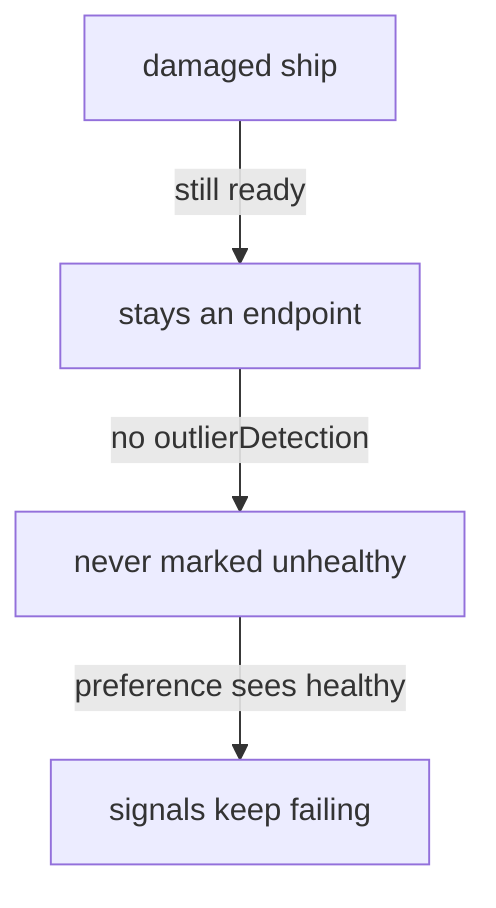

# The Health Dependency And Scope

Astronaut, the fleet only switches orbit when someone notices that the nearby ships are damaged. This part shows who notices, why a ship that leaves is different from a ship that fails, and where locality settings can live.

## Failover needs outlier detection

"No healthy endpoint left in this orbit" is a statement about **health**. In a mesh with sidecars, endpoint health comes from one place: **outlier detection**. There is no separate health checker.

Follow what happens without it:



The ship fails every signal, but because it still passes its readiness check, Kubernetes keeps it as an endpoint, and nothing in the mesh marks it unhealthy. Locality failover has no failure detector of its own. Something else must supply the health information, and that something is `outlierDetection`.

So a working failover always has **two** blocks in the same `trafficPolicy`: `outlierDetection` and `loadBalancer.localityLbSetting`. Set `maxEjectionPercent` high enough to eject the damaged ships. With one ship per zone, its 10% default can never eject anything, which means nothing is ever unhealthy, which means nothing ever fails over.

## A ship that leaves is not a ship that fails

An orbit can run out of endpoints in two ways, and they behave differently:

| | Endpoint **removal** | Endpoint **failure** |
| --- | --- | --- |
| Cause | pod deleted, scaled to zero, readiness check fails | pod answers errors but stays ready |
| Who notices | Kubernetes: the endpoint leaves the list | the sender's proxy, through outlier detection |
| Needs `outlierDetection` to fall back | no, as long as the preference itself is active | **yes** |
| Signals lost on the way | none | the failures that trigger the detection |

You will now see both, using the `DestinationRule` with outlier detection and locality turned on.

<!-- astrona:playground:renew -->

### Remove the nearby ship

Make sure the failover `DestinationRule` is in place. Save this as `destinationrule-probe-failover.yaml`:

```yaml
apiVersion: networking.istio.io/v1
kind: DestinationRule
metadata:
  name: probe
  namespace: starfleet
spec:
  host: probe
  trafficPolicy:
    outlierDetection:
      consecutive5xxErrors: 2
      interval: 5s
      baseEjectionTime: 30s
      maxEjectionPercent: 100
    loadBalancer:
      localityLbSetting:
        enabled: true
```

Apply it:

```sh
kubectl apply -f destinationrule-probe-failover.yaml
```

Then check that the preference is active:

```sh
count_orbits 20
```

```text
  20 probe-zone-a
```

Now remove the `zone-a` ship and send signals again:

```sh
kubectl -n starfleet scale deployment probe-zone-a --replicas=0
kubectl -n starfleet rollout status deployment probe-zone-a
status_codes
count_orbits 20
```

You should see:

```text
deployment.apps/probe-zone-a scaled
deployment "probe-zone-a" successfully rolled out
200 200 200 200 200 200 200 200 200 200 200 200 200 200 200 200 200 200 200 200
  20 probe-zone-b
```

Every signal succeeded, now served from `zone-b`, and none failed on the way. The endpoint left the list, so the proxy never tried it. Bring the ship back:

```sh
kubectl -n starfleet scale deployment probe-zone-a --replicas=1
kubectl -n starfleet rollout status deployment probe-zone-a
```

### Damage the nearby ship

This is the real failover test: a ship that stays in the list but fails every signal. First remove the `DestinationRule`, swap the healthy `zone-a` probe for the damaged one, and look at the probe pods:

```sh
kubectl delete destinationrule probe -n starfleet
kubectl -n starfleet scale deployment probe-zone-a --replicas=0
kubectl -n starfleet scale deployment probe-zone-a-damaged --replicas=1
kubectl -n starfleet rollout status deployment probe-zone-a-damaged
kubectl get pods -n starfleet -l app=probe
```

You should see (trimmed to the pod list):

```text
NAME                                    READY   STATUS    RESTARTS   AGE
probe-zone-a-damaged-58cb8b94cb-rqrdj   2/2     Running   0          11s
probe-zone-b-56b7474bd-k25md            2/2     Running   0          2m40s
```

The damaged ship is `2/2` and `Running`: Kubernetes sees nothing wrong. Send 20 signals with no `DestinationRule`:

```sh
status_codes
```

You should see a mix, for example:

```text
503 503 503 503 200 503 503 503 503 503 200 200 503 503 200 503 200 200 503 200
```

About half the signals fail. With no outlier detection there is no preference and no health information, so signals keep landing on the damaged ship.

Now apply the failover `DestinationRule` again:

```sh
kubectl apply -f destinationrule-probe-failover.yaml
```

Then send 20 signals, twice:

```sh
status_codes
status_codes
```

You should see:

```text
503 503 200 200 200 200 200 200 200 200 200 200 200 200 200 200 200 200 200 200
200 200 200 200 200 200 200 200 200 200 200 200 200 200 200 200 200 200 200 200
```

The first two signals hit the damaged ship and failed. That was `consecutive5xxErrors: 2`: after two failures in a row, outlier detection pulled the ship out of formation, and every signal after that flew to `zone-b`. Look at the shuttle's endpoint list:

```sh
istioctl proxy-config endpoints deploy/shuttle -n starfleet \
  --cluster "outbound|8000||probe.starfleet.svc.cluster.local"
```

```text
ENDPOINT             STATUS      OUTLIER CHECK     CLUSTER
10.244.0.10:8080     HEALTHY     FAILED            outbound|8000||probe.starfleet.svc.cluster.local
10.244.0.8:8080      HEALTHY     OK                outbound|8000||probe.starfleet.svc.cluster.local
```

The damaged ship is still `HEALTHY` as far as Kubernetes is concerned, but its `OUTLIER CHECK` is `FAILED`. That one column is what made the failover happen.

Put the playground back the way it started:

```sh
kubectl delete destinationrule probe -n starfleet
kubectl -n starfleet scale deployment probe-zone-a-damaged --replicas=0
kubectl -n starfleet scale deployment probe-zone-a --replicas=1
```

> [!TIP]
> To test a failover setup, never just scale the nearby ship to zero. That only proves endpoint removal. Damage a ship so it stays ready while failing, and check that its `OUTLIER CHECK` turns `FAILED`.

## Where the configuration lives

Locality settings can live in two places:

| Where | Scope | Typical use |
| --- | --- | --- |
| `meshConfig.localityLbSetting`, set when Istio is installed | every host in the mesh | the standing policy for the whole fleet |
| `DestinationRule.trafficPolicy.loadBalancer.localityLbSetting` | one host | the exceptions |

The per-host setting wins for its host. A mesh-wide setting is an install-time change, so it is not something you edit casually. `enabled: false` in a `DestinationRule` is how you switch locality off for one host that should ignore orbits completely.

## What this playground cannot show

- **Real cross-zone distance and cost.** Every pod runs on one node. The locality labels are honest, the distance is not.
- **Failover between regions.** There is one region, `local`. You can write `failover`, and Istio accepts it, but there is no second region to fall back to.

## Common pitfalls

> [!WARNING]
> - **A `localityLbSetting` without `outlierDetection`.** Nothing is ever marked unhealthy, and the preference is not even applied, so nothing ever fails over.
> - **`maxEjectionPercent` at its default.** With one ship per zone, the 10% default can eject nothing.
> - **Testing failover by scaling to zero.** That is endpoint removal. It does not prove the failure path.
> - **Trusting `kubectl get pods`.** A damaged ship is `Running` and ready. Only the `OUTLIER CHECK` column shows that the mesh noticed.

> *Locality decides where signals should go. Outlier detection decides which ships count as damaged. Without the second, the first never acts.*

## Your mission: Locality Load Balancing And Failover

You can now make signals leave a damaged orbit, and prove that outlier detection, not endpoint removal, did it. Now prove it in a graded mission: the nearby ship answers `503` to everything while staying ready, and your `DestinationRule` has to move the signals to the far orbit.

The mission runs in its own training solar system, so first pause your playground. Nothing in it is lost:

```sh
astrona stop ats-014-playground-040-04
```

Then start the mission:

```sh
astrona run --git git@github.com:astrona-io/ATS014.git -c sections/section-040/module-04/labs/lab-01
```

Read the task in [`question.md`](./labs/lab-01/question.md) and solve it on your own first. When you think you are done, send it for grading:

```sh
astrona submit -c sections/section-040/module-04/labs/lab-01
```

When the mission is done, remove it and wake your playground up again:

```sh
astrona destroy ats-014-lab-040-04
astrona start ats-014-playground-040-04
```
