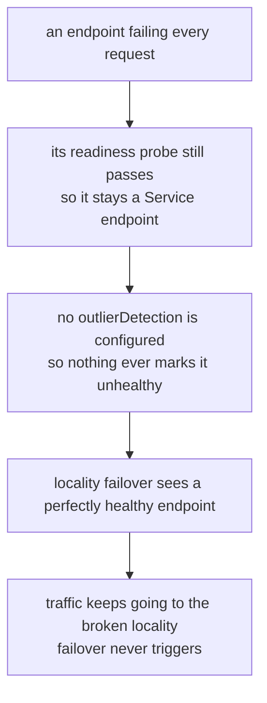

# The Health Dependency And Scope

> Prerequisite: [Preference, `distribute` And `failover`](./course-02-preference-distribute-and-failover.md). Next: [the module landing page](./course.md).

One fact remains, and it is the most examinable thing in section 040. Then where the configuration lives, and an honest account of what this playground can and cannot show you.

## Failover needs outlier detection

"No healthy endpoints left in this locality" is a statement about endpoint **health**. In a sidecar mesh, endpoint health comes from exactly one place: **outlier detection**, from module 3. There is no separate health checker.

Follow the consequence:



Locality failover has no failure detector of its own. It acts on health, and something else has to supply it.

So a working failover configuration always has **two** parts in the same `trafficPolicy`:

```yaml
trafficPolicy:
  outlierDetection:
    consecutive5xxErrors: 2
    interval: 5s
    baseEjectionTime: 30s
    maxEjectionPercent: 100
  loadBalancer:
    localityLbSetting:
      enabled: true
```

Note `maxEjectionPercent: 100` again, for module 3's reason: with one endpoint per zone, the 10% default means nothing can be ejected, which means nothing is ever unhealthy, which means no failover. The two defaults compound into complete inaction.

A `localityLbSetting` with no `outlierDetection` is not an error and produces no warning. It simply never does the thing it was written for.

## Endpoint removal is not failover

There is a second way a locality can run out of endpoints, and distinguishing it from failover is worth doing because it is what a playground can easily demonstrate.

| | Endpoint **removal** | Endpoint **failure** |
| --- | --- | --- |
| Cause | pod deleted, scaled to zero, readiness probe fails | pod returns errors while staying ready |
| Who notices | the control plane — the endpoint leaves the registry | the client proxy, via outlier detection |
| Needs `outlierDetection` | **no** | **yes** |
| Requests lost in transition | none | the failures that triggered detection |

Scaling a Deployment to zero exercises the first row. It shows locality **preference** falling back, which is real and useful — but it is not the failover path, and a configuration that passes this test can still be completely broken for the second row.

> [!TIP]
> **Try it — remove the preferred zone's endpoint**
>
> ```sh
> kubectl -n locality-demo scale deployment httpbin-zone-a --replicas=0
> kubectl -n locality-demo rollout status deployment httpbin-zone-a
> kubectl -n locality-demo exec deploy/tester -- sh -c \
>   'for i in $(seq 1 20); do curl -s -o /dev/null -w "%{http_code} " http://httpbin:8000/get; done; echo'
> kubectl -n locality-demo logs deploy/tester -c istio-proxy --tail=20 \
>   | grep -oE '[0-9]+\.[0-9]+\.[0-9]+\.[0-9]+:8080' | sort | uniq -c
> ```
>
> Expect something like:
>
> ```text
> 200 200 200 200 200 200 200 200 200 200 200 200 200 200 200 200 200 200 200 200
>      20 10.244.0.22:8080
> ```
>
> Every request succeeded, now served entirely from the other zone, with **no failed requests during the transition** — because this was an endpoint leaving the registry rather than an endpoint failing. Scale `httpbin-zone-a` back to 1 and the preference returns within seconds.

To see health-driven failover you need the local endpoint to **stay in the registry while returning errors** — the exact scenario module 3 set up with a deliberately broken pod. The two modules together are the complete mechanism: outlier detection decides an endpoint is bad, locality settings decide where traffic goes once it is.

## Where the configuration lives

Locality settings can be set in two places:

| Where | Scope | Typical use |
| --- | --- | --- |
| `meshConfig.localityLbSetting` (install time) | every host in the mesh | the standing policy, e.g. "always prefer local" |
| `DestinationRule.trafficPolicy.loadBalancer.localityLbSetting` | one host | the exceptions |

The per-host setting wins for that host. The usual arrangement is a mesh-wide default with `DestinationRule` overrides for the few services that need something different — and note that a mesh-wide setting is an install-time change (`istioctl install --set meshConfig...`), so it is not something you edit casually.

`enabled: true` appears in most examples and is the default when the block is present; setting `enabled: false` is how you switch locality awareness **off** for a host that should ignore topology entirely.

## What this playground cannot show

Stated plainly, because inventing a demonstration would teach the wrong thing:

- **Real cross-zone latency or cost.** Both pods are on one node. The locality labels are honest; the network distance is not.
- **Genuine multi-region behaviour.** There is one region, `local`. `failover` is region-level, so it cannot be exercised meaningfully here — you can write it, and it will be accepted, and there is no second region to fail to.
- **Health-driven failover out of the box.** It needs an endpoint that stays ready while failing. You can build one by swapping `httpbin-zone-a`'s image for an always-503 container as module 3's playground does, and that is the experiment worth doing if you want to see the full path.

What it **does** show faithfully: locality derivation, the default preference, `distribute` proportions, and endpoint-removal fallback. The matching lab under `domains/` targets a real multi-node cluster.

## Common pitfalls

> [!WARNING]
> **A `localityLbSetting` with no `outlierDetection`.** Nothing is ever marked unhealthy, so failover never triggers. The most examinable fact in the module.
>
> **`maxEjectionPercent` at its 10% default.** With one endpoint per zone, nothing can be ejected and nothing can fail over — the two defaults compound.
>
> **Empty locality on every endpoint.** Check `kubectl get nodes -L topology.kubernetes.io/region,topology.kubernetes.io/zone` and the endpoint dump *before* debugging anything else.
>
> **Forgetting the caller needs a locality too.** "Prefer local" is relative to the calling workload.
>
> **Expecting `failover` to work between zones.** It is region-level. Zone spillover inside a region is the default preference, not something `failover` expresses.
>
> **Setting `distribute` and `failover` together.** Mutually exclusive.
>
> **Assuming you need `localityLbSetting` to get locality preference.** You do not — it is already the default. You need it to *change* the default.
>
> **Testing failover by scaling to zero and declaring victory.** That is endpoint removal, which works without outlier detection. It does not prove the failure path.

> *Locality decides where traffic should go; outlier detection decides what counts as unavailable — without the second, the first never acts.*

## Reference

- [Locality load balancing task](https://istio.io/latest/docs/tasks/traffic-management/locality-load-balancing/) — including the explicit statement that failover requires outlier detection.
- [LocalityLoadBalancerSetting API](https://istio.io/latest/docs/reference/config/networking/destination-rule/#LocalityLoadBalancerSetting) — `distribute`, `failover`, `failoverPriority` and `enabled`.
- [MeshConfig](https://istio.io/latest/docs/reference/config/istio.mesh.v1alpha1/#MeshConfig) — where the mesh-wide `localityLbSetting` is defined.
- [OutlierDetection API](https://istio.io/latest/docs/reference/config/networking/destination-rule/#OutlierDetection) — the dependency, from module 3.
