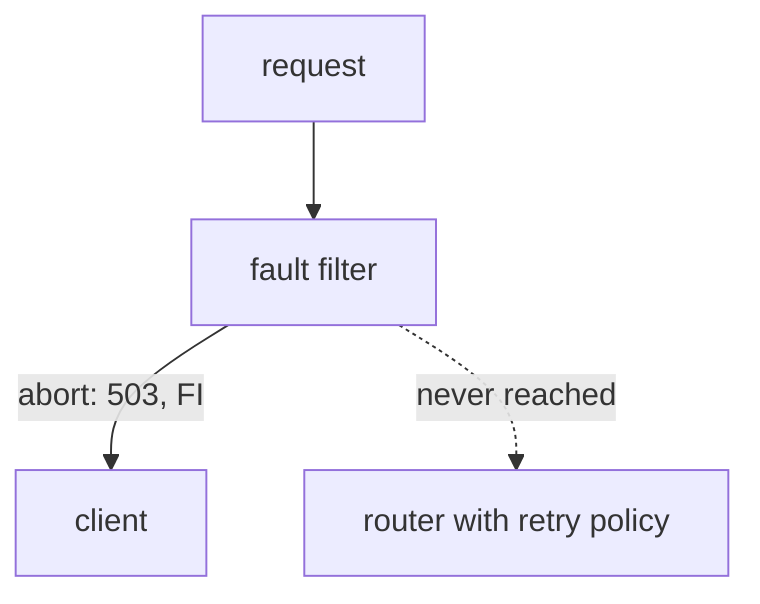

# Solution Walkthrough

The task needs one `VirtualService` with three rules for `notification-service`, one `VirtualService` with a timeout for `booking-service`, and two fault tests that run independently. The result of the first test is the lesson of the lab.

---

## Step 1: Measure the Baseline

List the `VirtualService` objects, then send one request from the `tester` pod and print the status code and the time:

```sh
kubectl -n orders get virtualservice
kubectl -n orders exec deploy/tester -- \
  curl -s -o /dev/null -w '%{http_code} %{time_total}s\n' -X POST http://booking-service/book
```

```text
No resources found in orders namespace.
200 0.012958s
```

Other teams use this namespace. Every rule you add without a `match` block changes their requests too. That is why each test gets its own header value, and a clean plain rule goes last.

---

## Step 2: Predict the Result of the Abort Test

The first rule aborts with `503` **and** has a retry policy with `retryOn: gateway-error`, which covers `503`. So how many attempts do you expect?

Most people expect three: the first attempt plus two retries, each one aborted again. The real answer is **one**. The reason is the order of the filters inside the sidecar proxy (Envoy):



The diagram shows that the fault filter answers the request with `503` itself, so the request never reaches the router, where the retry policy lives.

The **router** is the part of the proxy that sends the request to the destination, and it is also the part that retries it. An injected abort is a response that the fault filter makes on its own. The router never sends a request, so it has no failed attempt to retry. The retry policy is valid configuration, and it never runs.

That is the point of the test. Retries recover from short failures of the destination. An injected abort never reaches the destination: it never leaves the client's proxy.

Check the time budget as well, because the rule has both settings. Two retries plus the first attempt would be 3 attempts × `perTryTimeout: 1s` = 3 seconds, and `timeout: 5s` leaves room. So if the retries did run, nothing in this rule would cut them short.

---

## Step 3: Write All Three Rules

Write each object to a file and apply the file. In the exam, a file is easy to read again, edit and apply again.

Save this as `virtualservice-notification.yaml`:

```yaml
apiVersion: networking.istio.io/v1
kind: VirtualService
metadata:
  name: notification
  namespace: orders
spec:
  hosts:
    - notification-service
  http:
    - match:
        - headers:
            x-chaos:
              exact: abort
      fault:
        abort:
          httpStatus: 503
          percentage:
            value: 100
      retries:
        attempts: 2
        perTryTimeout: 1s
        retryOn: gateway-error
      timeout: 5s
      route:
        - destination:
            host: notification-service
    - match:
        - headers:
            x-chaos:
              exact: delay
      fault:
        delay:
          fixedDelay: 7s
          percentage:
            value: 100
      route:
        - destination:
            host: notification-service
    - route:
        - destination:
            host: notification-service
```

Apply it:

```sh
kubectl apply -f virtualservice-notification.yaml
```

```text
virtualservice.networking.istio.io/notification created
```

Save this as `virtualservice-booking.yaml`:

```yaml
apiVersion: networking.istio.io/v1
kind: VirtualService
metadata:
  name: booking
  namespace: orders
spec:
  hosts:
    - booking-service
  http:
    - timeout: 2s
      route:
        - destination:
            host: booking-service
```

Apply it:

```sh
kubectl apply -f virtualservice-booking.yaml
```

Then check the result:

```sh
istioctl analyze -n orders
```

```text
✔ No validation issues found when analyzing namespace: orders.
```

Both fault rules are above the plain rule, and each matches a different value of the same header. The third rule has no `fault`, no `timeout` and no `retries`. The grader checks that all three are missing.

---

## Step 4: Check Other Requests First

Always check in this order. If the scoping is wrong, you want to know before you start to cause failures.

```sh
for i in 1 2 3 4 5; do
  kubectl -n orders exec deploy/tester -- \
    curl -s -o /dev/null -w '%{http_code} %{time_total}s\n' -X POST http://booking-service/book
done
```

```text
200 0.006104s
200 0.007915s
200 0.002709s
200 0.003174s
200 0.002417s
```

---

## Step 5: Run the Abort Test and Count the Attempts

The access log is where each sidecar proxy writes one line for every request. Count the `FI` lines in the log of the `booking-service` proxy before and after one request with `x-chaos: abort`:

```sh
BEFORE=$(kubectl -n orders logs -l app=booking-service -c istio-proxy --tail=-1 | grep -c ' FI ')
kubectl -n orders exec deploy/tester -- \
  curl -s -o /dev/null -w '%{http_code} %{time_total}s\n' -H "x-chaos: abort" -X POST http://booking-service/book
sleep 3
AFTER=$(kubectl -n orders logs -l app=booking-service -c istio-proxy --tail=-1 | grep -c ' FI ')
echo "FI-flagged attempts: $((AFTER - BEFORE))"
kubectl -n orders logs -l app=booking-service -c istio-proxy --tail=5 | grep ' FI ' | head -1
```

```text
503 0.006800s
FI-flagged attempts: 1
[2026-10-09T20:56:01.489Z] "POST /notify HTTP/1.1" 503 FI fault_filter_abort - "-" 0 18 0 - "-" "curl/8.22.0" "bb2766f3-615a-9b89-8de5-98bc2ca94722" "notification-service" "-" outbound|80||notification-service.orders.svc.cluster.local - 10.96.115.125:80 10.244.0.8:41832 - -
```

One client request produced one attempt, with the flag `FI`, in about 7 milliseconds. The upstream host in the line is `"-"`: the proxy of `booking-service` answered the request itself and never opened a connection to `notification-service`. If you expected three, read step 2 again: the retry policy is there and it is correct, but the router never had a chance to use it. Now confirm that nothing reached `notification-service`:

```sh
kubectl -n orders logs -l app=notification-service -c istio-proxy --tail=20 | grep -c ' 503 '
```

```text
0
```

The access log of `notification-service` has no `503` at all. None of these requests reached it.

---

## Step 6: Run the Delay Test

Send one request with `x-chaos: delay`, then read the access log of the `tester` proxy:

```sh
kubectl -n orders exec deploy/tester -- \
  curl -s -o /dev/null -w '%{http_code} %{time_total}s\n' -H "x-chaos: delay" -X POST http://booking-service/book
sleep 2
kubectl -n orders logs deploy/tester -c istio-proxy --tail=-1 | grep ' 504 UT ' | tail -1
```

```text
504 2.008974s
[2026-10-09T20:56:07.384Z] "POST /book HTTP/1.1" 504 UT response_timeout - "-" 0 24 2001 - "-" "curl/8.22.0" "dd38e4be-c545-9d66-ae38-ba2130e66a58" "booking-service" "10.244.0.8:8083" outbound|80||booking-service.orders.svc.cluster.local 10.244.0.10:42692 10.96.17.210:80 10.244.0.10:49752 - -
```

The request ended after two seconds, not seven: the timeout stopped the delay. Note which proxy logged it. `UT` (upstream request timeout) is in the log of the **client**, `tester`, on its request to `booking-service`, because that proxy enforces the 2-second timeout. The delay itself is applied one hop further, in the proxy of **`booking-service`** on its request to `notification-service`.

The two flags of this lab are the key to reading such failures. `FI` means "the proxy made this response itself", and `UT` means "the proxy's timeout expired". In this lab they appear one hop apart, which is exactly why the timeout had to go on the other `VirtualService`.

---

## Step 7: Clean Up

```sh
kubectl -n orders delete virtualservice notification
```

A fault is configuration. The `x-chaos` rules do no harm if you leave them, because nobody else sends that header. But the habit of deleting faults is what stops an unscoped one from becoming an outage.

---

## Common Mistakes

- **Expecting the retry policy to produce three attempts.** It produces one. The fault filter answers before the router, so the retries never run, and exactly one `FI` line appears. Counting it is the proof.
- **Putting the 2s timeout next to the delay on rule 2.** It does nothing there: the fault filter holds the request before the router starts timing it. The call takes the full seven seconds, and the proxy never logs `UT`.
- **Adding retries to rule 2.** The task asks for none, and the grader checks it.
- **Anything on the plain rule.** No fault, no timeout, no retries: requests without the header must not change.
- **Both fault rules matching the same header value.** They need different values, because the first matching rule wins.
- **The plain rule placed first.** It matches every request, so neither test ever runs.
- **Putting the faults on `booking-service`.** That delays the request from `tester` and tests the wrong hop.
- **Reading only the final status.** The `FI` evidence is in the proxy log of the middle service, and the `UT` evidence is in the log of the client.
