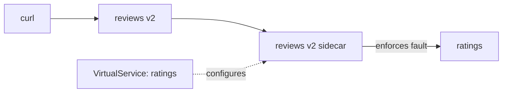

# `fault.delay`

The first half of the feature, and the failure people most often forget to test: a ship that is not broken, just slow to answer. The signal still gets through, it simply arrives late.

## The baseline

First, astronaut, you need a working chain of ships to break. Send user `jason` to `reviews` v2, which signals `ratings` on every request. Everyone else goes to `reviews` v1.

<!-- astrona:playground:renew -->

> [!TIP]
> **Try it — the call chain working normally**
>
> Save this as `virtualservice-reviews-jason-v2.yaml`:
>
> ```yaml
> apiVersion: networking.istio.io/v1
> kind: VirtualService
> metadata:
>   name: reviews
>   namespace: bookinfo
> spec:
>   hosts:
>     - reviews
>   http:
>     - match:
>         - headers:
>             end-user:
>               exact: jason
>       route:
>         - destination:
>             host: reviews
>             subset: v2
>     - route:
>         - destination:
>             host: reviews
>             subset: v1
> ```
>
> Apply it:
>
> ```sh
> kubectl apply -f virtualservice-reviews-jason-v2.yaml
> ```
>
> Then check the result:
>
> ```sh
> status_and_time -H "end-user: jason" http://reviews:9080/reviews/0
> ```
>
> Expect a `200`, in well under a second. That request crossed two services: `curl` to `reviews` v2, then `reviews` v2 to `ratings`. Both numbers are the baseline — the status code and the time are what the two halves of this module each change, one at a time.

## The field

`fault` sits on the HTTP rule, alongside `route` and `timeout`. Its `delay` half holds the request for `fixedDelay` and then forwards it normally:

```yaml
http:
  - fault:
      delay:
        fixedDelay: 2s
        percentage:
          value: 100
    route:
      - destination:
          host: ratings
          subset: v1
```

**The request still succeeds.** The caller gets a correct response, two seconds late. That is precisely what you want for testing a timeout, because it separates "slow" from "broken" — and a real degraded dependency usually looks like this, not like a clean error.

`percentage.value` is a percent, and it may have decimals. `100` is every request, `50` is half, and `0.1` is one request in a thousand — not one in ten.

There is also `exponentialDelay` in the API, intended for modelling growing latency. `fixedDelay` is what tasks and examples use; recognise the other rather than reaching for it.

## Which `VirtualService` owns the fault

This is the detail to get exactly right, because getting it wrong gives you a drill that works but tests the wrong thing.

The fault is **enforced by the caller's proxy**, but the object is keyed by the **callee's hostname**. So a `VirtualService` for host `ratings` injects faults into calls *to* `ratings`, and the code that runs is inside the sidecar of whoever calls `ratings` — here, `reviews` v2. In the space picture, the flight plan names the ship the signal is flying *to*, but it is the communications officer on the *sending* ship who holds the signal back.



The object names the *callee* and the code runs in the *caller*. Those are two different pods, and mixing them up gives you a working experiment that tests the wrong thing.

Put the fault on `reviews` instead and you delay the request from curl — a different experiment, testing curl's patience rather than how `reviews` copes with a slow `ratings`.

The rule of thumb: **name the host you want to pretend is broken.**

> [!TIP]
> **Try it — two seconds added to the second hop**
>
> Save this as `virtualservice-ratings-delay-2s.yaml`:
>
> ```yaml
> apiVersion: networking.istio.io/v1
> kind: VirtualService
> metadata:
>   name: ratings
>   namespace: bookinfo
> spec:
>   hosts:
>     - ratings
>   http:
>     - fault:
>         delay:
>           fixedDelay: 2s
>           percentage:
>             value: 100
>       route:
>         - destination:
>             host: ratings
>             subset: v1
> ```
>
> Apply it:
>
> ```sh
> kubectl apply -f virtualservice-ratings-delay-2s.yaml
> ```
>
> Then check the result:
>
> ```sh
> status_and_time -H "end-user: jason" http://reviews:9080/reviews/0
> kubectl logs -n bookinfo deploy/reviews-v2 -c istio-proxy --tail=2 | grep ratings
> ```
>
> Expect `200 2.0s`, and a line like this in the `reviews` v2 sidecar (trimmed):
>
> ```text
> "GET /ratings/0 HTTP/1.1" 200 DI via_upstream ... 2001 ...
> ```
>
> Still a `200`, now two seconds slower. **`DI`** is the response flag for "delay injected", and `2001` is the time in milliseconds. The line is in the log of `reviews` v2 — the caller — not `ratings`. Nothing was deployed, restarted or patched in either application: `reviews` is simply experiencing a slow dependency, which is the condition its timeout configuration is supposed to handle.

## The delay is real work being held

Two clarifications that prevent misreading the mechanism.

**The upstream never sees the delay.** The communications officer holds the signal before sending it on, so `ratings` receives it two seconds late and answers normally. Its own latency metrics are untouched — which is what makes this a clean test of the *caller*.

**The delay consumes caller resources.** For those two seconds, `reviews` has a request in flight: a connection, a worker, a slot in any pool. That is not an artefact of the test; it is exactly what a real slow dependency does, and it is why a delay of a few seconds against a tight connection pool (section 040, module 2) will produce overflow rejections as a *side effect*. Worth knowing so you do not misread those 503s.

## Common pitfalls

> [!WARNING]
> **Putting the fault on the caller's own host.** Name the host you want to pretend is struggling, not the workload you want to observe.
>
> **Looking for the delay at the upstream.** The proxy holds the request before forwarding. The upstream sees a normal request, late, and its own latency metrics are untouched.
>
> **Forgetting that a held request occupies the caller.** Two seconds of delay is two seconds of a connection and a pool slot. Against a tight connection pool this produces overflow 503s as a side effect.
>
> **Assuming an omitted `percentage` means nothing happens.** The default is 100%.
>
> **Reading a delayed success as a failure.** `fault.delay` produces a correct response, late. That is the point: it separates slow from broken.
>
> **Reading `percentage.value: 0.1` as 10%.** It means 0.1% — one request in a thousand.
>
> **Testing from a pod without a sidecar.** The fault runs in the caller's sidecar. A caller with no sidecar never meets it, so nothing happens.

> *`fault.delay` produces a slow success, enforced in the caller's proxy, on the `VirtualService` of the host you want to pretend is struggling.*
