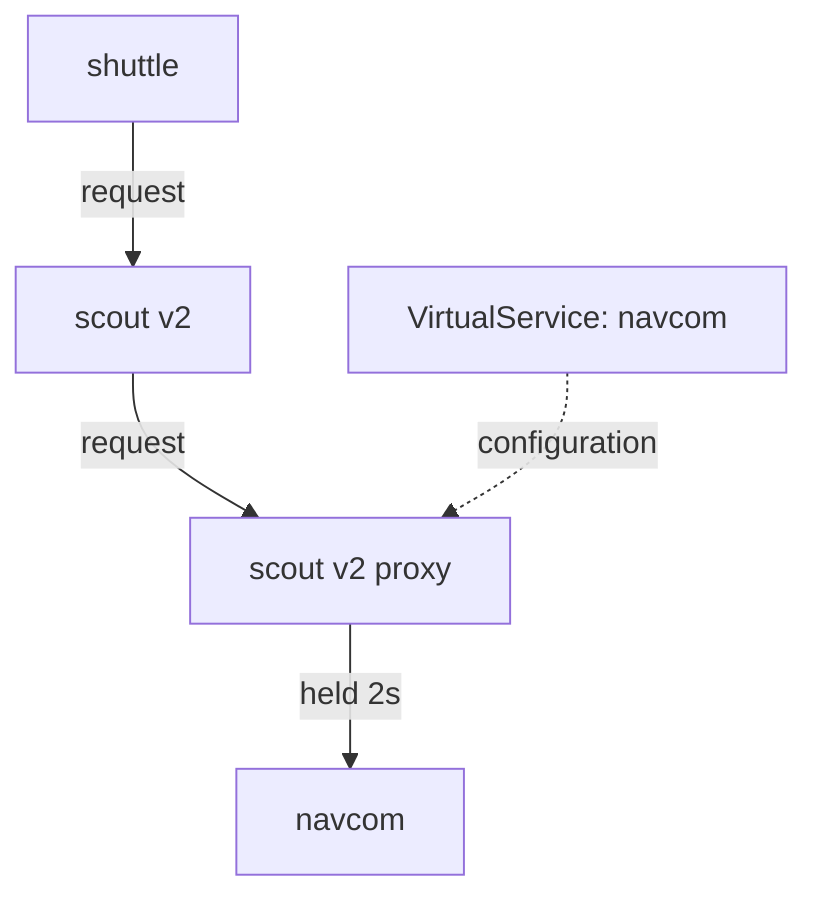

# Inject A Delay Into Requests

The failure that people most often forget to test is a service that is not broken, only slow. The request still succeeds. The response simply arrives late. Timeouts exist for exactly this case, so you need a way to make a service slow on demand.

This part shows the `fault.delay` field, which sidecar proxy applies the delay, and how to prove the delay from the access logs. A **sidecar proxy** is the Envoy container that Istio adds to each pod; all traffic in and out of the pod passes through it. An **access log** is the log where each sidecar proxy writes one line for every request it handles.

## A working call chain first

Before you inject any fault, you need a chain of calls that works. In the `starfleet` namespace, `scout` v2 and v3 call `navcom` for a star rating every time they answer. `scout` v1 never does. So a request that reaches `scout` v2 makes two hops:

```text
shuttle  →  scout v2  →  navcom
```

Most faults go on the second hop. There you can watch how one service (`scout` v2) reacts when a service it depends on (`navcom`) has trouble.

To use that chain, send requests from the user `jason` to `scout` v2, and every other request to `scout` v1. A **`VirtualService`** holds the routing rules for requests to a host, and a **subset** is a named group of pods of one Service, defined in a `DestinationRule`. The subsets `v1`, `v2` and `v3` of `scout` already exist in the playground.

<!-- astrona:playground:renew -->

Save this as `virtualservice-scout-jason-v2.yaml`:

```yaml
apiVersion: networking.istio.io/v1
kind: VirtualService
metadata:
  name: scout
  namespace: starfleet
spec:
  hosts:
  - scout
  http:
  - match:
    - headers:
        end-user:
          exact: jason
    route:
    - destination:
        host: scout
        subset: v2
  - route:
    - destination:
        host: scout
        subset: v1
```

Apply it:

```sh
kubectl apply -f virtualservice-scout-jason-v2.yaml
```

Then check the result. The `status_and_time` helper function sends one request from the `shuttle` pod and prints the status code and the time the request took. Send one request as `jason`:

```sh
status_and_time -H "end-user: jason" http://scout:9080/reviews/0
```

You should see something like:

```text
200 0.025932s
```

A `200` in a few hundredths of a second is your baseline. The status code and the time are the two numbers that fault injection changes. The very first request after a pod starts can take half a second, so send a second one before you read the number.

## The `delay` field

With a working baseline, you can now look at the field that makes a request slow. `fault` sits on an `http` rule of a `VirtualService`, next to `route`. Its `delay` part holds the request for the time in `fixedDelay`, and then sends it on as normal. This piece of a `VirtualService` shows it (you do not apply it):

```yaml
http:
- fault:
    delay:
      fixedDelay: 2s
      percentage:
        value: 100
  route:
  - destination:
      host: navcom
      subset: v1
```

**The request still succeeds.** The client gets a correct response, two seconds late. That is what you want when you test a timeout, because it keeps "slow" apart from "broken". A real service in trouble usually looks like this, not like a clean error.

`percentage.value` is a percent, and it may have decimals. `100` means every request, `50` means half, and `0.1` means one request in a thousand, not one in ten. If you leave the `percentage` block out, every matching request gets the delay.

The API also has `exponentialDelay`. You only need to recognise the name: the Istio tasks and the exam use `fixedDelay`.

## Which VirtualService holds the fault

The next question is where to put the fault. Get this detail exactly right, because the wrong choice gives you a fault that works but tests the wrong thing.

A `VirtualService` names the host that a request goes **to**. But the sidecar proxy of the pod that **sends** the request applies the fault. So a `VirtualService` for host `navcom` delays requests *to* `navcom`, and the proxy that holds them is the proxy of whoever calls `navcom`: here, `scout` v2.



The diagram shows that the `VirtualService` names `navcom`, but `istiod` sends its configuration to the sidecar proxy of `scout` v2, which holds the request for two seconds before it sends it on to `navcom`.

If you put the fault on the `scout` `VirtualService` instead, you delay the request from `shuttle` to `scout`. That is a different test: it tests how `shuttle` handles a slow `scout`, not how `scout` handles a slow `navcom`. The rule is simple: **put the fault on the `VirtualService` of the service that should look slow.**

Now hold every request to `navcom` for two seconds. Save this as `virtualservice-navcom-delay-2s.yaml`:

```yaml
apiVersion: networking.istio.io/v1
kind: VirtualService
metadata:
  name: navcom
  namespace: starfleet
spec:
  hosts:
  - navcom
  http:
  - fault:
      delay:
        percentage:
          value: 100
        fixedDelay: 2s
    route:
    - destination:
        host: navcom
        subset: v1
```

Apply it:

```sh
kubectl apply -f virtualservice-navcom-delay-2s.yaml
```

Then check the result. Send the request as `jason` again, and read the last access log lines of `scout` v2, the pod that calls `navcom`:

```sh
status_and_time -H "end-user: jason" http://scout:9080/reviews/0
kubectl logs -n starfleet deploy/scout-v2 -c istio-proxy --tail=3 | grep ratings
```

You should see (log line shortened):

```text
200 2.051916s
"GET /ratings/0 HTTP/1.1" 200 DI via_upstream ... 2014 ... "navcom:9080" "10.244.0.7:9080" outbound|9080|v1|navcom.starfleet.svc.cluster.local ...
```

The status is still `200`, now two seconds slower. The text after the status code is the **response flag**, a short code that Envoy writes to say what happened to the request. **`DI`** means "delay injected". The number `2014` is how long the request took, in milliseconds. The line is in the access log of `scout` v2, the client, not in the log of `navcom`. No pod was redeployed, restarted or changed: `scout` simply has a slow `navcom` now.

## The destination never sees the delay

The client's log shows the delay. The destination's log tells a different story. Look at the same request from the side of `navcom`:

```sh
kubectl logs -n starfleet deploy/navcom-v1 -c istio-proxy --tail=1
```

You should see (shortened):

```text
[2026-10-08T21:32:55.775Z] "GET /ratings/0 HTTP/1.1" 200 - via_upstream ... 10 ... "be958016-06fd-4bc8-9fa5-131e12be67da" ... inbound|9080|| ...
```

It is the same request: compare the request ID with your own `scout` v2 line. But `navcom` received it two seconds after `scout` v2 sent it, and answered in 10 milliseconds. The sidecar proxy of `scout` v2 held the request **before** it sent it on, so the timing of `navcom` is untouched. That makes a delay a clean test of the *client*.

One side effect is real, though. For those two seconds, `scout` v2 has a request open. It holds a connection and a place in any connection limit, as it would with a real slow service. So a long delay against a tight connection limit also produces overflow failures. Know this, so that you do not misread them.

You now know how to make a service slow with `fault.delay`, where the fault belongs, and how to prove it with the `DI` flag in the client's access log. A slow service still answers in the end. The next question is how to fake a service that does not answer at all.

## Common pitfalls

> [!WARNING]
> - **Putting the fault on the client's own `VirtualService`.** Put it on the `VirtualService` of the service that should look slow, not of the service you want to watch.
> - **Looking for the delay at the destination.** The destination gets a normal request, late, and its own timing is untouched. Read the client's access log.
> - **Reading a delayed success as a failure.** `fault.delay` gives a correct response, late. That keeps slow apart from broken.
> - **Reading `percentage.value: 0.1` as 10%.** It means 0.1%: one request in a thousand.
> - **Expecting no fault when `percentage` is left out.** The default is 100%.
> - **Testing from a pod without a sidecar proxy.** The client's proxy applies the fault. A client without a proxy never meets it.
