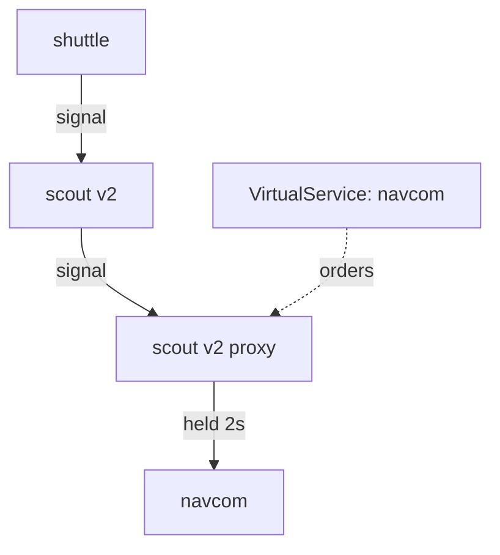

# Slow A Ship Down

Astronaut, the first drill fakes the failure people most often forget to test: a ship that is not broken, only slow to answer. The signal still gets through. It simply arrives late.

This part shows the `delay` field, which ship's communications officer holds the signal back, and how to prove the delay from the flight logs.

## The working chain

Before you break anything, you need a chain of ships that works. In your fleet, the scout ships v2 and v3 ask the navigation computer, `navcom`, for a star rating every time they answer. The scout v1 never does. So a signal that reaches scout v2 crosses two hops:

```text
shuttle  →  scout v2  →  navcom
```

The second hop is where most drills go, because there you can watch a ship (scout v2) react when a ship it depends on (navcom) struggles.

<!-- astrona:playground:renew -->

### Send jason's signals through both hops

Send jason to scout v2, and everyone else to scout v1. Save this as `virtualservice-scout-jason-v2.yaml`:

```yaml
apiVersion: networking.istio.io/v1
kind: VirtualService
metadata:
  name: scout
  namespace: starfleet
spec:
  hosts:
  - scout
  http:
  - match:
    - headers:
        end-user:
          exact: jason
    route:
    - destination:
        host: scout
        subset: v2
  - route:
    - destination:
        host: scout
        subset: v1
```

Apply it:

```sh
kubectl apply -f virtualservice-scout-jason-v2.yaml
```

Then send one signal as jason, and print the status code and the time it took:

```sh
status_and_time -H "end-user: jason" http://scout:9080/reviews/0
```

You should see something like:

```text
200 0.025932s
```

A `200` in a few hundredths of a second. That is your baseline: the status code and the time are the two numbers the drills in this module change. (The very first signal after a ship starts can take half a second. Send a second one before you read the number.)

## The `delay` field

`fault` sits on an `http` rule, next to `route`. Its `delay` half holds the signal for `fixedDelay`, and then sends it on as normal. This piece of a `VirtualService` shows it (you do not apply it):

```yaml
http:
- fault:
    delay:
      fixedDelay: 2s
      percentage:
        value: 100
  route:
  - destination:
      host: navcom
      subset: v1
```

**The signal still succeeds.** The sender gets a correct answer, two seconds late. That is exactly what you want when you test a timeout, because it keeps "slow" apart from "broken". A real ship in trouble usually looks like this, not like a clean error.

`percentage.value` is a percent, and it may have decimals. `100` is every signal, `50` is half, and `0.1` is one signal in a thousand, not one in ten. Leave the `percentage` block out, and every matching signal gets the delay.

There is also `exponentialDelay` in the API. You only need to recognise it: every task and every exam question uses `fixedDelay`.

## Which flight plan holds the drill

This is the detail to get exactly right, because getting it wrong gives you a drill that works but tests the wrong thing.

The flight plan names the ship the signal flies **to**. But the drill is carried out by the communications officer on the ship that **sends** the signal. So a `VirtualService` for host `navcom` holds back signals *to* navcom, and the code that holds them runs in the sidecar of whoever calls navcom: here, scout v2.



The `VirtualService` names navcom, but its orders land in scout v2's communications officer, which holds the signal for two seconds before it flies on to navcom.

Put the drill on the scout flight plan instead, and you hold back the shuttle's signal to the scout: a different test, of the shuttle's patience rather than of how the scout copes with a slow navcom.

The rule of thumb: **name the ship you want to pretend is struggling.**

### Add two seconds to the second hop

Hold every signal to navcom for two seconds. Save this as `virtualservice-navcom-delay-2s.yaml`:

```yaml
apiVersion: networking.istio.io/v1
kind: VirtualService
metadata:
  name: navcom
  namespace: starfleet
spec:
  hosts:
  - navcom
  http:
  - fault:
      delay:
        percentage:
          value: 100
        fixedDelay: 2s
    route:
    - destination:
        host: navcom
        subset: v1
```

Apply it:

```sh
kubectl apply -f virtualservice-navcom-delay-2s.yaml
```

Then send jason's signal again, and read the last flight log line of scout v2, the ship that calls navcom:

```sh
status_and_time -H "end-user: jason" http://scout:9080/reviews/0
kubectl logs -n starfleet deploy/scout-v2 -c istio-proxy --tail=3 | grep ratings
```

You should see (log line trimmed):

```text
200 2.051916s
"GET /ratings/0 HTTP/1.1" 200 DI via_upstream ... 2014 ... "navcom:9080" "10.244.0.7:9080" outbound|9080|v1|navcom.starfleet.svc.cluster.local ...
```

Still a `200`, now two seconds slower. **`DI`** is the flag for "delay injected", and `2014` is how long the signal took, in milliseconds. The line is in scout v2's flight log, the sender, not in navcom's. Nothing in either ship was redeployed, restarted or changed: the scout is simply living with a slow navigation computer.

## The receiver never sees the delay

Look at the same signal from navcom's side:

```sh
kubectl logs -n starfleet deploy/navcom-v1 -c istio-proxy --tail=1
```

You should see (trimmed):

```text
[2026-10-08T21:32:55.775Z] "GET /ratings/0 HTTP/1.1" 200 - via_upstream ... 10 ... "be958016-06fd-4bc8-9fa5-131e12be67da" ... inbound|9080|| ...
```

It is the same signal: compare the request ID with your own scout v2 line. But navcom received it two seconds after scout v2 sent it, and answered in 10 milliseconds. The communications officer held the signal **before** sending it on, so navcom's own timing is untouched. That is what makes a delay drill a clean test of the *sender*.

One side effect is real, though: for those two seconds, scout v2 has a signal in flight. It holds a connection and a slot in any connection limit, exactly as it would with a real slow dependency. A long delay against a tight connection limit therefore produces overflow failures too. Know that, so you do not misread them.

## Common pitfalls

> [!WARNING]
> - **Putting the drill on the sender's own flight plan.** Name the ship you want to pretend is struggling, not the ship you want to watch.
> - **Looking for the delay at the receiver.** The receiver gets a normal signal, late. Its own timing is untouched. Read the sender's flight log.
> - **Reading a delayed success as a failure.** `fault.delay` gives a correct answer, late. That is the point: it keeps slow apart from broken.
> - **Reading `percentage.value: 0.1` as 10%.** It means 0.1%: one signal in a thousand.
> - **Expecting no drill when `percentage` is left out.** The default is 100%.
> - **Testing from a pod without a sidecar.** The drill runs in the sender's communications officer. A sender without one never meets it.

> *`fault.delay` gives a slow success. It sits on the flight plan of the ship you want to pretend is struggling, and the sender's communications officer carries it out.*
