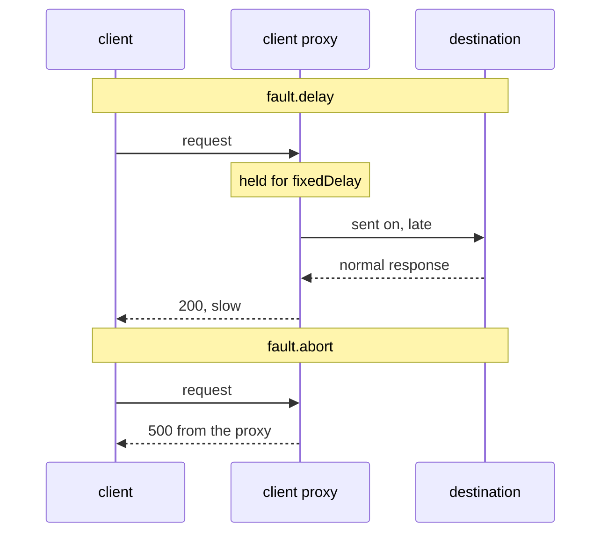

# Abort Requests In The Client Proxy

A delay fakes a slow service. Many tests need a service that is down instead: what does the client do when every call fails? An abort is not "a delay with an error at the end". An aborted request never leaves the client's pod at all.

This part shows the `fault.abort` field, where its evidence lives, and how to put a delay and an abort on one rule. The **sidecar proxy** is the Envoy container that Istio adds to each pod, and the **access log** is the log where each proxy writes one line for every request it handles.

## The client's proxy answers the request

An `abort` makes the sidecar proxy of the client answer the request **at once**, with the HTTP status code you choose. The proxy never calls the destination. This piece of a `VirtualService`, the Istio object that holds the routing rules for a host, shows it (you do not apply it):

```yaml
fault:
  abort:
    httpStatus: 500
    percentage:
      value: 50
```

The sequence diagram puts a delay and an abort side by side:



The diagram shows that with a delay, the request still reaches the destination. With an abort, the lower half has no arrow to the destination at all.

Remember the consequence: **the destination has no record of an aborted request.** Its access log has no line for it, its metrics do not change, and its application never runs. If you look for the error at the destination, you find nothing. The evidence is in the **client's** access log, because the client's proxy made the response.

For gRPC traffic, `abort` takes `grpcStatus` instead of `httpStatus`.

## Sampling with `percentage`

An abort for every request is easy to see. Often you want only some requests to fail. `percentage.value` is the share of **matching** requests that get the abort. The proxy decides for each request on its own, at random, so count over enough requests to see a rate and not a coincidence. If you leave the `percentage` block out, every matching request is aborted.

<!-- astrona:playground:renew -->

Abort half of all requests to `navcom` with a `500`. Save this as `virtualservice-navcom-abort-50.yaml`:

```yaml
apiVersion: networking.istio.io/v1
kind: VirtualService
metadata:
  name: navcom
  namespace: starfleet
spec:
  hosts:
  - navcom
  http:
  - fault:
      abort:
        httpStatus: 500
        percentage:
          value: 50
    route:
    - destination:
        host: navcom
        subset: v1
```

Apply it:

```sh
kubectl apply -f virtualservice-navcom-abort-50.yaml
```

It has the name `navcom`, so it replaces any earlier `VirtualService` with that name in the namespace, for example one with a delay.

Then check the result. The `count_navcom_status` helper function sends 10 requests from the `shuttle` pod straight to `navcom` and counts the status codes:

```sh
count_navcom_status
```

You should see a split close to half, for example:

```text
   5 200
   5 500
```

Now read one of the failed requests in the access log of `shuttle`:

```sh
kubectl logs -n starfleet deploy/shuttle -c istio-proxy --tail=10 | grep ' 500 ' | head -1
```

You should see (shortened):

```text
"GET /ratings/0 HTTP/1.1" 500 FI fault_filter_abort ... 0 ... "navcom:9080" "-" outbound|9080|v1|navcom.starfleet.svc.cluster.local ...
```

There is no wait this time: the duration is `0` milliseconds. The response flag, the short code Envoy writes after the status, is **`FI`**, which means "fault injected", and `fault_filter_abort` names the cause. The address of the destination pod is `"-"`, because the request never left the `shuttle` pod.

The `shuttle` log is only half of the proof. To show that `navcom` never got these requests, count the `500` lines in both access logs:

```sh
kubectl logs -n starfleet deploy/shuttle -c istio-proxy --tail=10 | grep -c ' 500 '
kubectl logs -n starfleet deploy/navcom-v1 -c istio-proxy --tail=40 | grep -c ' 500 '
```

You should see:

```text
5
0
```

The `shuttle` proxy logged all five aborted requests. The `navcom` proxy logged none of them, because they never arrived.

> [!TIP]
> A `5xx` status with `FI` in the client's access log is an injected fault, yours or somebody else's. Any other `5xx` comes from a real problem. Check the flag before you start to debug an application.

## A delay and an abort on one rule

So far each rule had one kind of fault. Both can sit on the same rule, and the proxy decides each one on its own. It checks every matching request first for the delay, then for the abort. So a request can be delayed **and** then aborted. That looks like a service that times out, not one that fails fast, and it is the shape most real outages have. The two percentages are separate random choices, and they do not need to add up to anything.

Delay half of the requests to `navcom` by one second, and abort a fifth of them with `503`. Save this as `virtualservice-navcom-delay-and-abort.yaml`:

```yaml
apiVersion: networking.istio.io/v1
kind: VirtualService
metadata:
  name: navcom
  namespace: starfleet
spec:
  hosts:
  - navcom
  http:
  - fault:
      delay:
        percentage:
          value: 50
        fixedDelay: 1s
      abort:
        percentage:
          value: 20
        httpStatus: 503
    route:
    - destination:
        host: navcom
        subset: v1
```

Apply it:

```sh
kubectl apply -f virtualservice-navcom-delay-and-abort.yaml
```

Then check the result. Send 40 requests, sort them into fast and slow, and count them:

```sh
for i in $(seq 1 40); do
  kubectl exec -n starfleet deploy/shuttle -- curl -s -o /dev/null -w "%{http_code} %{time_total}\n" http://navcom:9080/ratings/0 \
    | awk '{print $1, ($2 > 0.9 ? "slow" : "fast")}'
done | sort | uniq -c
```

You should see something like:

```text
  16 200 fast
  17 200 slow
   5 503 fast
   2 503 slow
```

About half are slow, and about a fifth fail. Two requests were **both** slow and failed. Their access log lines carry both flags at once, `503 DI,FI`:

```sh
kubectl logs -n starfleet deploy/shuttle -c istio-proxy --tail=40 | grep -oE '" (200|503) [A-Z,-]+' | sort | uniq -c
```

```text
  16 " 200 -
  17 " 200 DI
   2 " 503 DI,FI
   5 " 503 FI
```

You now know that an abort is answered by the client's own sidecar proxy, that the destination never sees it, and that `FI` in the client's access log is the proof. You can also combine a delay and an abort on one rule. Every fault so far hit every client of `navcom`, though, and that is the next problem to solve.

## Common pitfalls

> [!WARNING]
> - **Looking for the aborted request at the destination.** It never arrived. Read the client's access log.
> - **Reading a `5xx` without checking for `FI`.** The flag tells an injected fault apart from a real failure.
> - **Expecting `abort` to be a delay plus an error.** An abort is immediate. Add a `delay` on the same rule if you want a slow failure.
> - **Expecting the two percentages to add up.** They are separate random choices.
> - **Leaving `percentage` out while testing.** The default is 100%: every matching request fails.

## Your mission: Inject A Delay And An Abort Lab

You can now delay a request with `delay`, fail it with `abort`, and prove both from the access logs. The lab asks you to put a delay on one service and an abort on another, and to leave the evidence in the right access logs.

The lab runs in its own cluster, so first pause your playground. Nothing in it is lost:

```sh
astrona stop ats-014-playground-050-01
```

Then start the lab:

```sh
astrona run --git git@github.com:astrona-io/ATS014.git -c sections/section-050/module-01/labs/lab-02
```

The task is on the next page. Solve it on your own first. When you think you are done, send it for grading:

```sh
astrona submit -c sections/section-050/module-01/labs/lab-02
```

When the lab is done, remove it and start your playground again:

```sh
astrona destroy ats-014-lab-050-01-02
astrona start ats-014-playground-050-01
```
