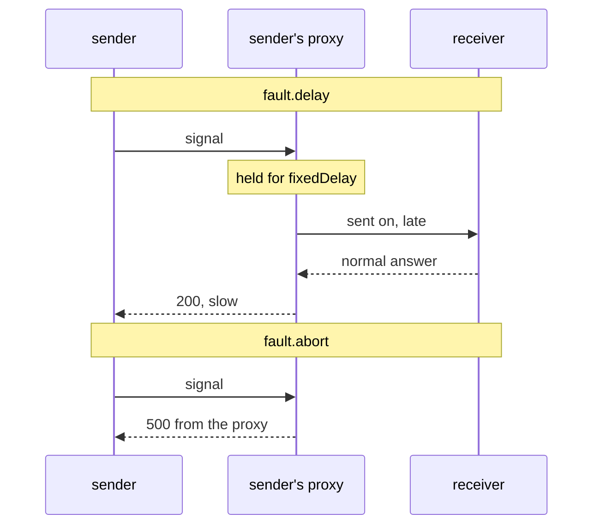

# Fail A Signal Before It Leaves

Astronaut, the second drill fakes a ship that is down. It is not "a delay with an error at the end": an aborted signal never leaves the sending ship at all. This part shows what makes an abort different, where its evidence lives, and how to run both drills on one rule.

## Answered on board, never sent

An `abort` makes the sender's communications officer answer the signal **at once**, with the status code you choose, without ever calling the receiving ship. This piece of a `VirtualService` shows it (you do not apply it):

```yaml
fault:
  abort:
    httpStatus: 500
    percentage:
      value: 50
```



With a delay, the signal still reaches the receiver. With an abort, the lower half has no arrow to the receiver at all.

The consequence to remember: **the receiver has no record of an aborted signal.** Its flight log has no line for it, its metrics do not move, and its app never ran. Go looking for the error on the receiving ship and you find nothing. The evidence is in the **sender's** flight log, because the sender's proxy made the answer.

For gRPC traffic, `abort` also takes `grpcStatus` instead of `httpStatus`.

## Sampling with `percentage`

`percentage.value` is the share of **matching** signals that get the abort. Each signal is decided on its own, like a coin toss, so count over enough signals to see a rate rather than a coincidence. Leave the block out, and every matching signal is aborted.

<!-- astrona:playground:renew -->

### Fail half the signals to navcom

Abort half of all signals to navcom with a `500`. Save this as `virtualservice-navcom-abort-50.yaml`:

```yaml
apiVersion: networking.istio.io/v1
kind: VirtualService
metadata:
  name: navcom
  namespace: starfleet
spec:
  hosts:
  - navcom
  http:
  - fault:
      abort:
        httpStatus: 500
        percentage:
          value: 50
    route:
    - destination:
        host: navcom
        subset: v1
```

Apply it:

```sh
kubectl apply -f virtualservice-navcom-abort-50.yaml
```

It has the same name as the delay flight plan, `navcom`, so it replaces it.

Then send 10 signals from the shuttle straight to navcom, and count the status codes:

```sh
count_navcom_status
```

You should see a split close to half, for example:

```text
   5 200
   5 500
```

Now read one of the failed signals in the shuttle's flight log:

```sh
kubectl logs -n starfleet deploy/shuttle -c istio-proxy --tail=10 | grep ' 500 ' | head -1
```

You should see (trimmed):

```text
"GET /ratings/0 HTTP/1.1" 500 FI fault_filter_abort ... 0 ... "navcom:9080" "-" outbound|9080|v1|navcom.starfleet.svc.cluster.local ...
```

No pause anywhere this time: the time is `0` milliseconds. The flag is **`FI`**, "fault injected", and `fault_filter_abort` names the cause. The address of the receiving ship is `"-"`, because the signal never left the shuttle.

### Prove navcom never heard about it

Count the `500`s in both flight logs:

```sh
kubectl logs -n starfleet deploy/shuttle -c istio-proxy --tail=10 | grep -c ' 500 '
kubectl logs -n starfleet deploy/navcom-v1 -c istio-proxy --tail=40 | grep -c ' 500 '
```

You should see:

```text
5
0
```

The shuttle logged all five aborted signals. Navcom logged none of them: they never arrived.

> [!TIP]
> A `5xx` with `FI` in the sender's flight log is a drill, yours or somebody else's. Any other `5xx` came from a real problem. Check the flag before you start debugging an app.

## Delay and abort on one rule

Both halves can sit on the same rule, and they are decided independently. Every matching signal is first checked for the delay, then for the abort. So a signal can be held back **and** then aborted, which looks like a ship that times out rather than one that fails fast: the shape most real outages have. The two percentages are separate coin tosses and do not need to add up to anything.

### Fifty percent slow, twenty percent failing

Save this as `virtualservice-navcom-delay-and-abort.yaml`:

```yaml
apiVersion: networking.istio.io/v1
kind: VirtualService
metadata:
  name: navcom
  namespace: starfleet
spec:
  hosts:
  - navcom
  http:
  - fault:
      delay:
        percentage:
          value: 50
        fixedDelay: 1s
      abort:
        percentage:
          value: 20
        httpStatus: 503
    route:
    - destination:
        host: navcom
        subset: v1
```

Apply it:

```sh
kubectl apply -f virtualservice-navcom-delay-and-abort.yaml
```

Then send 40 signals, sort them into fast and slow, and count:

```sh
for i in $(seq 1 40); do
  kubectl exec -n starfleet deploy/shuttle -- curl -s -o /dev/null -w "%{http_code} %{time_total}\n" http://navcom:9080/ratings/0 \
    | awk '{print $1, ($2 > 0.9 ? "slow" : "fast")}'
done | sort | uniq -c
```

You should see something like:

```text
  16 200 fast
  17 200 slow
   5 503 fast
   2 503 slow
```

About half are slow, and about a fifth fail. Two signals were **both** slow and failed. Their flight log lines carry both flags at once, `503 DI,FI`:

```sh
kubectl logs -n starfleet deploy/shuttle -c istio-proxy --tail=40 | grep -oE '" (200|503) [A-Z,-]+' | sort | uniq -c
```

```text
  16 " 200 -
  17 " 200 DI
   2 " 503 DI,FI
   5 " 503 FI
```

## Common pitfalls

> [!WARNING]
> - **Looking for the aborted signal at the receiver.** It never arrived. Read the sender's flight log.
> - **Reading a `5xx` without checking for `FI`.** The flag is what tells a drill apart from a real failure.
> - **Expecting `abort` to be a delay plus an error.** An abort is immediate. Put a `delay` on the same rule if you want a slow failure.
> - **Expecting the two percentages to add up.** They are separate coin tosses.
> - **Leaving `percentage` out while testing.** The default is 100%: every matching signal fails.

> *An abort is answered by the sender's own communications officer and carries the `FI` flag. The receiving ship never hears about it.*

## Your mission: Run Two Simulation Drills

You can now hold a signal back with `delay`, fail it with `abort`, and prove both from the flight logs. Now prove it in a graded mission: set up a delay drill and an abort drill on two different ships, and leave the evidence in the right flight logs.

The mission runs in its own training solar system, so first pause your playground. Nothing in it is lost:

```sh
astrona stop ats-014-playground-050-01
```

Then start the mission:

```sh
astrona run --git git@github.com:astrona-io/ATS014.git -c sections/section-050/module-01/labs/lab-02
```

Read the task in [`question.md`](./labs/lab-02/question.md) and solve it on your own first. When you think you are done, send it for grading:

```sh
astrona submit -c sections/section-050/module-01/labs/lab-02
```

When the mission is done, remove it and wake your playground up again:

```sh
astrona destroy ats-014-lab-050-01-02
astrona start ats-014-playground-050-01
```
