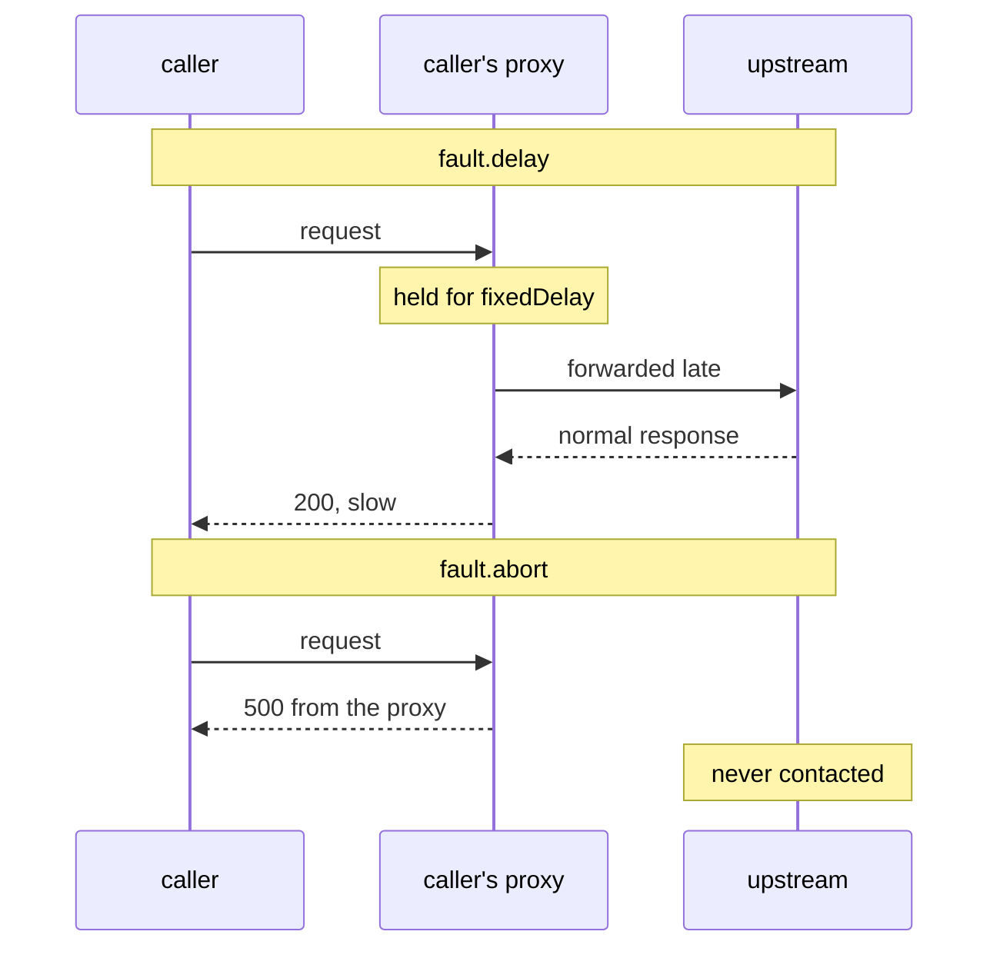

# `fault.abort`

The other half, and it is not "delay with an error at the end". An abort is a signal that never leaves the ship. This part covers what makes an abort different, where the evidence lives, and how to inject into only some traffic.

## Immediate, and never forwarded

```yaml
fault:
  abort:
    httpStatus: 500
    percentage:
      value: 50
```

The communications officer answers with the status **immediately**, without ever signalling the upstream ship.



With an abort, the upstream gets no request, writes no log line and counts no metric. The lower half has no arrow reaching the upstream at all. That missing arrow is why looking for an injected error at the destination finds nothing.

The consequence to internalise: **the upstream has no record of an aborted request.** Its access log is empty for it, its metrics are unmoved, its application never ran. If you go looking for the injected error on the destination you will not find it, and concluding "the fault is not working" is the natural mistake.

The evidence lives in the **caller's** access log (its black box flight log), because the caller's proxy is what produced the response.

`abort` also accepts `grpcStatus` for gRPC traffic, and `httpStatus` is what HTTP tasks use.

## Sampling with `percentage`

`percentage.value` is a float and is the share of **matching** requests affected. Leave the block out and 100% of matched traffic gets the fault — the default is 100, not 0, which is a reasonable thing to get wrong under exam pressure.

As with every percentage in this course the decision is per request and independent, so measure over enough requests to see a rate rather than a coincidence.

<!-- astrona:playground:renew -->

> [!TIP]
> **Try it — half the calls fail, none of them reach the upstream**
>
> Save this as `virtualservice-ratings-abort-50.yaml`:
>
> ```yaml
> apiVersion: networking.istio.io/v1
> kind: VirtualService
> metadata:
>   name: ratings
>   namespace: bookinfo
> spec:
>   hosts:
>     - ratings
>   http:
>     - fault:
>         abort:
>           httpStatus: 500
>           percentage:
>             value: 50
>       route:
>         - destination:
>             host: ratings
>             subset: v1
> ```
>
> Apply it:
>
> ```sh
> kubectl apply -f virtualservice-ratings-abort-50.yaml
> ```
>
> Then check the result:
>
> ```sh
> count_ratings_status
> kubectl logs -n bookinfo deploy/curl -c istio-proxy --tail=10 | grep ' 500 '
> ```
>
> Expect about half `500` — it is random, for example `4 200` and `6 500` — and log lines like this (trimmed):
>
> ```text
> "GET /ratings/0 HTTP/1.1" 500 FI fault_filter_abort ... "-" outbound|9080|v1|ratings...
> ```
>
> No pause anywhere, unlike Part 1. The `500` was made by `curl`'s own sidecar. The upstream address in the line is `"-"`, because the request never left the `curl` pod.

The file replaces the `ratings` VirtualService from Part 1, because it has the same name in the same namespace. `kubectl apply` swaps one for the other.

## Proving the upstream was never involved

The asymmetry between the two logs is the cleanest demonstration of what `abort` does, and it is the same shape as the circuit-breaker evidence in section 040 module 2.

> [!TIP]
> **Try it — the caller logged it, the destination did not**
>
> ```sh
> count_ratings_status
> kubectl logs -n bookinfo deploy/curl -c istio-proxy --tail=10 | grep -c ' 500 '
> kubectl logs -n bookinfo deploy/ratings-v1 -c istio-proxy --tail=40 | grep -c ' 500 '
> ```
>
> The first count matches the number of `500`s you just saw. The second is `0`: the `ratings` sidecar has no line for any of them. Look at the response flag in the caller's lines: **`FI`** — fault injected — with `fault_filter_abort` naming the cause. That flag is how you tell an injected 500 from a real one, and it belongs in the same mental table as `UT`, `UO` and `UH` from section 040.

That gives the module its diagnostic rule: **a 5xx with `FI` in the caller's log is yours.** Anything else is the application's.

## Delay and abort together

Both halves can appear on the same rule, and they are independent:

```yaml
fault:
  delay:
    fixedDelay: 1s
    percentage:
      value: 100
  abort:
    httpStatus: 503
    percentage:
      value: 30
```

Read that as: every matching request is held for a second, and 30% of them are then aborted. The delay applies first, so an aborted request is *also* slow — which models a dependency that times out rather than one that fails fast, and is a more realistic shape for most real outages.

The two percentages are independent draws. They do not need to sum to anything.

> [!TIP]
> **Try it — 50% slow, 20% failing, on one rule**
>
> Save this as `virtualservice-ratings-delay-and-abort.yaml`:
>
> ```yaml
> apiVersion: networking.istio.io/v1
> kind: VirtualService
> metadata:
>   name: ratings
>   namespace: bookinfo
> spec:
>   hosts:
>     - ratings
>   http:
>     - fault:
>         delay:
>           percentage:
>             value: 50
>           fixedDelay: 1s
>         abort:
>           percentage:
>             value: 20
>           httpStatus: 503
>       route:
>         - destination:
>             host: ratings
>             subset: v1
> ```
>
> Apply it:
>
> ```sh
> kubectl apply -f virtualservice-ratings-delay-and-abort.yaml
> ```
>
> Then check the result:
>
> ```sh
> for i in $(seq 1 20); do
>   kubectl exec -n bookinfo deploy/curl -- curl -s -o /dev/null -w "%{http_code} %{time_total}\n" http://ratings:9080/ratings/0 \
>     | awk '{print $1, ($2 > 0.9 ? "slow" : "fast")}'
> done | sort | uniq -c
> ```
>
> Expect something like `11 200 fast`, `6 200 slow`, `2 503 fast`, `1 503 slow`. Each request is checked for both faults on its own, so some requests got both: slow *and* failed.

## Common pitfalls

> [!WARNING]
> **Hunting for the injected error at the destination.** It never arrived there. The caller's proxy produced the response.
>
> **Reading a 5xx without checking for `FI`.** The flag is what separates an injected failure from a real one.
>
> **Expecting `abort` to be `delay` plus an error.** An abort is immediate. Combine both on one rule if you want a slow failure.
>
> **Expecting the two `percentage` values to be related.** They are independent draws and need not sum to anything.
>
> **Leaving `percentage` out while testing.** The default is 100%, which means every matching request — often far more blast radius than intended.

> *`abort` is produced by the caller's proxy and carries the `FI` response flag — the upstream never hears about it.*
