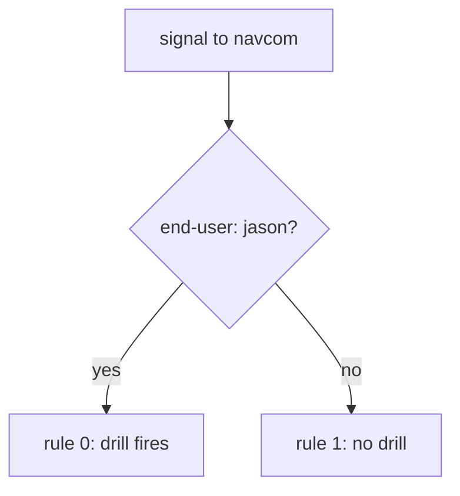

# Scope A Drill To Your Own Signals

Astronaut, every drill so far hit every ship that signals navcom. In a solar system that other crews share, that is a self-made outage. This part shows how to aim a drill at your own signals only, or at the signals of one sending ship, so nobody else notices it is running.

## Aim the drill with a match

The fix uses matching you already know. Put the drill on a rule that only your test signals fit, and keep a plain rule below it for everyone else. The proxy reads the rules from the top and uses the first one that fits, so the drill rule goes **first** and the plain rule goes **last**.



Only signals that take the "yes" arrow meet the drill, and you decide which signals those are. A drill without a `match` has no "no" arrow: every sender of navcom is in its blast radius.

This is the shape to reach for by default, astronaut. It lets you run a drill in a solar system other crews are using, and it is a common exam task precisely because the unscoped version is careless.

<!-- astrona:playground:renew -->

### Fail only jason's signals

Abort jason's signals to navcom with a `500`, and leave everyone else alone. Save this as `virtualservice-navcom-abort-jason.yaml`:

```yaml
apiVersion: networking.istio.io/v1
kind: VirtualService
metadata:
  name: navcom
  namespace: starfleet
spec:
  hosts:
  - navcom
  http:
  - match:
    - headers:
        end-user:
          exact: jason
    fault:
      abort:
        httpStatus: 500
        percentage:
          value: 100
    route:
    - destination:
        host: navcom
        subset: v1
  - route:
    - destination:
        host: navcom
        subset: v1
```

Apply it:

```sh
kubectl apply -f virtualservice-navcom-abort-jason.yaml
```

Then send one signal to navcom as jason, and one without a label:

```sh
kubectl exec -n starfleet deploy/shuttle -- curl -s -H "end-user: jason" http://navcom:9080/ratings/0
kubectl exec -n starfleet deploy/shuttle -- curl -s http://navcom:9080/ratings/0
```

You should see:

```text
fault filter abort
{"id":0,"ratings":{"Reviewer1":5,"Reviewer2":4}}
```

Same navcom, same moment. Only the signal with jason's label failed: `fault filter abort` is the body the proxy sends with its own `500`.

## Watch the scout survive

That signal went straight from the shuttle to navcom. The more useful test goes through the real chain, shuttle → scout v2 → navcom, because it shows how the scout copes when navcom fails.

For that to work, jason's label must travel with the signal to the second hop. The label is set on the signal the shuttle sends to the scout, and the scout copies it onto its own signal to navcom. A ship that does not pass its labels on cannot be tested this way at all. When a scoped drill never fires through a chain, check that first, before you blame the drill.

### Send jason through the chain

You need the flight plan that sends jason to scout v2. If it is not applied any more, apply it again:

```sh
kubectl apply -f virtualservice-scout-jason-v2.yaml
```

Then send jason's signal to the scout:

```sh
kubectl exec -n starfleet deploy/shuttle -- curl -s -H "end-user: jason" http://scout:9080/reviews/0
```

You should see (trimmed):

```text
{"id": "0","podname": "scout-v2-866c98b568-h77rf", ... "rating": {"error": "Ratings service is currently unavailable"}}, ... }
```

The scout still answers, from v2, just without stars: where the rating would be, it reports that the ratings service is unavailable. That is exactly what a drill should show you. The scout copes with a failing navcom by leaving the stars out, instead of failing itself. You can see the same on the bridge page in your browser, `http://127.0.0.1:9080/productpage`, once you log in as `jason`.

## Aim the drill at one sending ship

A header match picks signals by what they **carry**. Sometimes you want to pick them by **who sends them** instead: "fail every signal from the scout to navcom" is a common exam phrasing. `sourceLabels` matches the labels of the pod that sends the signal. It works because the drill runs in the sender's own communications officer, which knows the labels of its own ship.

### Fail only the scout's signals

Save this as `virtualservice-navcom-abort-from-scout.yaml`:

```yaml
apiVersion: networking.istio.io/v1
kind: VirtualService
metadata:
  name: navcom
  namespace: starfleet
spec:
  hosts:
  - navcom
  http:
  - match:
    - sourceLabels:
        app: scout
    fault:
      abort:
        percentage:
          value: 100
        httpStatus: 500
    route:
    - destination:
        host: navcom
        subset: v1
  - route:
    - destination:
        host: navcom
        subset: v1
```

Apply it:

```sh
kubectl apply -f virtualservice-navcom-abort-from-scout.yaml
```

Then send one signal from the shuttle straight to navcom, and one through the scout:

```sh
status_and_time http://navcom:9080/ratings/0
kubectl exec -n starfleet deploy/shuttle -- curl -s -H "end-user: jason" http://scout:9080/reviews/0 \
  | grep -o '"rating": {[^}]*}' | head -1
```

You should see:

```text
200 0.019789s
"rating": {"error": "Ratings service is currently unavailable"}
```

The shuttle's own signal to navcom works: the shuttle does not carry the label `app: scout`. The scout's signal to navcom fails. Same navcom, different sender, different result.

> [!TIP]
> Scope every drill with a `match` from the very first version, even in a playground. A drill that works only because nobody else uses the solar system today becomes an outage the day somebody does.

## Common pitfalls

> [!WARNING]
> - **Putting the plain rule above the drill rule.** The plain rule fits every signal, so the drill rule is never reached.
> - **Scoping on a label the middle ship does not pass on.** The drill never fires through the chain, and the configuration looks wrong when the problem is label forwarding.
> - **Mixing up `headers` and `sourceLabels`.** `headers` matches what the signal carries. `sourceLabels` matches the pod that sends it.
> - **Forgetting the plain rule below the drill.** Without it, every signal that does not fit the drill rule has no route and gets `404`.

> *A `match` decides who meets the drill. Scope by what the signal carries with `headers`, or by who sends it with `sourceLabels`, and keep a plain rule below for everyone else.*

## Your mission: Stop The Drill That Never Ended

You can now aim a drill at your own signals or at one sending ship, and keep everyone else safe. Now prove it in a graded mission: a drill somebody left behind is breaking every signal to navcom, and you have to turn it into a drill that only hits test signals.

The mission runs in its own training solar system, so first pause your playground. Nothing in it is lost:

```sh
astrona stop ats-014-playground-050-01
```

Then start the mission:

```sh
astrona run --git git@github.com:astrona-io/ATS014.git -c sections/section-050/module-01/labs/lab-03
```

Read the task in [`question.md`](./labs/lab-03/question.md) and solve it on your own first. When you think you are done, send it for grading:

```sh
astrona submit -c sections/section-050/module-01/labs/lab-03
```

When the mission is done, remove it and wake your playground up again:

```sh
astrona destroy ats-014-lab-050-01-03
astrona start ats-014-playground-050-01
```
