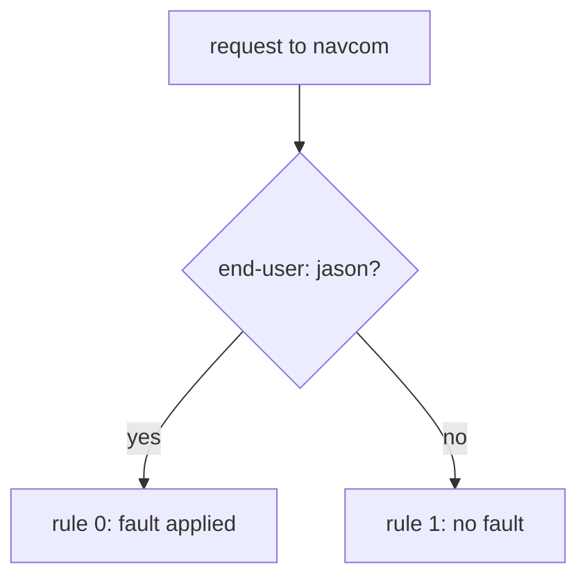

# Scope Fault Injection With Match Rules

A fault without a `match` hits every client of a service. In a cluster that other teams share, that is an outage you caused yourself. This part shows how to limit a fault to your own test requests, or to the requests of one calling workload, so that nobody else is affected.

## Limit the fault with a header match

The fix uses the request matching of a `VirtualService`, the Istio object that holds the routing rules for a host. Put the fault on a rule that only your test requests match, and keep a plain rule below it for everyone else. The **sidecar proxy** (Envoy) of the client reads the `http` rules from the top and uses the first rule that matches. So the fault rule goes **first**, and the plain rule goes **last**.



The diagram shows that only requests on the "yes" arrow meet the fault, and you decide which requests those are. A fault rule without a `match` has no "no" arrow: every client of `navcom` gets the fault.

Use this shape by default. It lets you inject faults in a cluster that other people use, and it is a common exam task because the unscoped version is careless.

<!-- astrona:playground:renew -->

Abort the requests of `jason` to `navcom` with a `500`, and leave every other request alone. Save this as `virtualservice-navcom-abort-jason.yaml`:

```yaml
apiVersion: networking.istio.io/v1
kind: VirtualService
metadata:
  name: navcom
  namespace: starfleet
spec:
  hosts:
  - navcom
  http:
  - match:
    - headers:
        end-user:
          exact: jason
    fault:
      abort:
        httpStatus: 500
        percentage:
          value: 100
    route:
    - destination:
        host: navcom
        subset: v1
  - route:
    - destination:
        host: navcom
        subset: v1
```

Apply it:

```sh
kubectl apply -f virtualservice-navcom-abort-jason.yaml
```

Then check the result. Send one request to `navcom` with the header `end-user: jason`, and one without it:

```sh
kubectl exec -n starfleet deploy/shuttle -- curl -s -H "end-user: jason" http://navcom:9080/ratings/0
kubectl exec -n starfleet deploy/shuttle -- curl -s http://navcom:9080/ratings/0
```

You should see:

```text
fault filter abort
{"id":0,"ratings":{"Reviewer1":5,"Reviewer2":4}}
```

The two requests went to the same `navcom` at the same moment. Only the request with the `jason` header failed. `fault filter abort` is the response body that the `shuttle` proxy sends with its own `500`.

## Watch scout handle the failure

That request went straight from `shuttle` to `navcom`. A more useful test goes through the real chain, `shuttle` → `scout` v2 → `navcom`, because it shows how `scout` handles a failing `navcom`.

For that test, the `end-user` header must reach the second hop. `shuttle` sets the header on its request to `scout`, and the `scout` application copies it onto its own request to `navcom`. This is called **header propagation**. An application that does not copy headers cannot be tested this way at all. When a scoped fault never fires through a chain, check header propagation first, before you blame the `VirtualService`.

The test also needs the `scout` `VirtualService` that sends requests with `end-user: jason` to subset `v2`, saved as `virtualservice-scout-jason-v2.yaml`. If it is not applied any more, apply it again:

```sh
kubectl apply -f virtualservice-scout-jason-v2.yaml
```

Then send a request as `jason` to `scout`:

```sh
kubectl exec -n starfleet deploy/shuttle -- curl -s -H "end-user: jason" http://scout:9080/reviews/0
```

You should see (shortened):

```text
{"id": "0","podname": "scout-v2-866c98b568-h77rf", ... "rating": {"error": "Ratings service is currently unavailable"}}, ... }
```

`scout` v2 still answers, but without stars. Where the rating would be, it reports that the ratings service is unavailable. This is what a fault test should show you: `scout` handles a failing `navcom` by leaving the stars out, and it does not fail itself. You can see the same on the `bridge` page in your browser, `http://127.0.0.1:9080/productpage`, after you log in as `jason`.

## Limit the fault to one calling workload

A header match selects requests by what they **carry**. Sometimes you want to select them by **who sends them** instead: "fail every request from `scout` to `navcom`" is a common exam task. `sourceLabels` matches the labels of the pod that sends the request. It works because the client's own sidecar proxy applies the fault, and that proxy knows the labels of its own pod.

Save this as `virtualservice-navcom-abort-from-scout.yaml`:

```yaml
apiVersion: networking.istio.io/v1
kind: VirtualService
metadata:
  name: navcom
  namespace: starfleet
spec:
  hosts:
  - navcom
  http:
  - match:
    - sourceLabels:
        app: scout
    fault:
      abort:
        percentage:
          value: 100
        httpStatus: 500
    route:
    - destination:
        host: navcom
        subset: v1
  - route:
    - destination:
        host: navcom
        subset: v1
```

Apply it:

```sh
kubectl apply -f virtualservice-navcom-abort-from-scout.yaml
```

Then check the result. The `status_and_time` helper function sends one request from `shuttle` and prints the status and the time. Send one request straight to `navcom`, and one through `scout`:

```sh
status_and_time http://navcom:9080/ratings/0
kubectl exec -n starfleet deploy/shuttle -- curl -s -H "end-user: jason" http://scout:9080/reviews/0 \
  | grep -o '"rating": {[^}]*}' | head -1
```

You should see:

```text
200 0.019789s
"rating": {"error": "Ratings service is currently unavailable"}
```

The request from `shuttle` to `navcom` works, because the `shuttle` pod does not carry the label `app: scout`. The request from `scout` to `navcom` fails. The destination is the same, but the client is different, so the result is different.

> [!TIP]
> Scope every fault with a `match` from the very first version, even in a playground. A fault that is safe only because nobody else uses the cluster today becomes an outage on the day somebody does.

You now know how to limit a fault with a `match`: by a header with `headers`, or by the calling pod with `sourceLabels`, with a plain rule below for everyone else. A fault on its own only breaks things, though. Its real purpose is to test timeouts and retries, and that has a trap of its own.

## Common pitfalls

> [!WARNING]
> - **Putting the plain rule above the fault rule.** The plain rule matches every request, so the proxy never reaches the fault rule.
> - **Scoping on a header that the middle service does not copy.** The fault never fires through the chain, and the configuration looks wrong when the real problem is header propagation.
> - **Mixing up `headers` and `sourceLabels`.** `headers` matches what the request carries. `sourceLabels` matches the labels of the pod that sends it.
> - **Forgetting the plain rule below the fault rule.** Without it, a request that does not match the fault rule has no route and gets a `404`.

## Your mission: Scope A Forgotten Abort To One Test User Lab

You can now limit a fault to your own test requests or to one calling workload, and keep every other client safe. In the lab, a fault that somebody left behind breaks every request to `navcom`, and you must limit it to test requests only.

The lab runs in its own cluster, so first pause your playground. Nothing in it is lost:

```sh
astrona stop ats-014-playground-050-01
```

Then start the lab:

```sh
astrona run --git git@github.com:astrona-io/ATS014.git -c sections/section-050/module-01/labs/lab-03
```

The task is on the next page. Solve it on your own first. When you think you are done, send it for grading:

```sh
astrona submit -c sections/section-050/module-01/labs/lab-03
```

When the lab is done, remove it and start your playground again:

```sh
astrona destroy ats-014-lab-050-01-03
astrona start ats-014-playground-050-01
```
