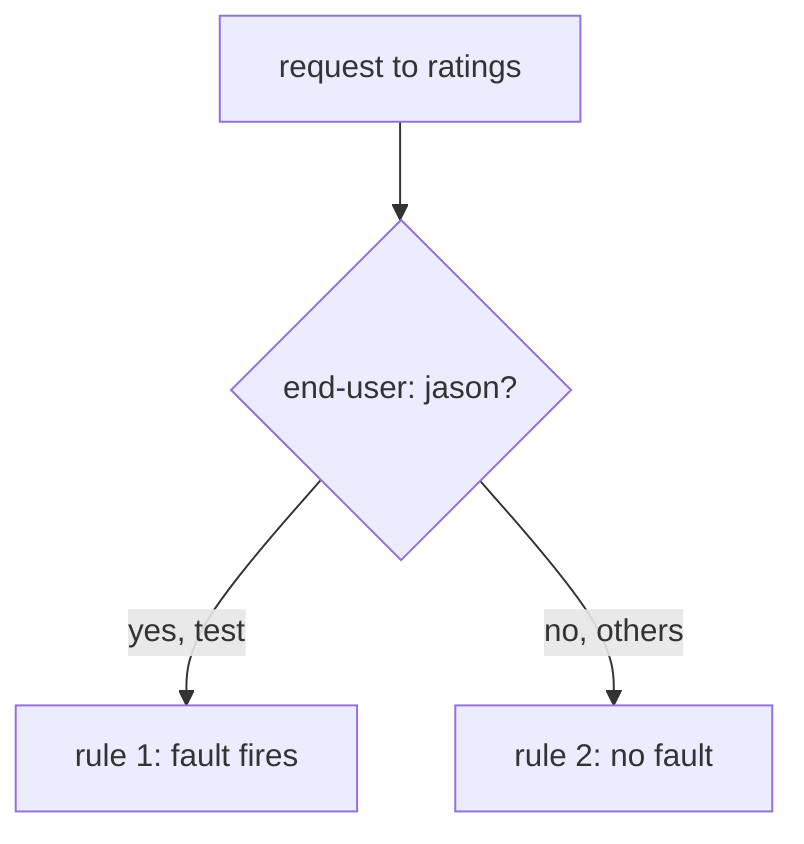

# Scoping, Composition And Hazards

Everything so far affects every ship that signals the host. In a shared solar system that is a self-inflicted outage. This part is about limiting the blast radius, using injection to drive the section 040 features, and finding a drill somebody forgot to switch off.

## Scoping a fault so it hurts only you

The fix uses matching you already know: put the fault on a rule that only your test requests match, and leave a normal rule below it for everyone else. Rules are evaluated top down and first match wins, so the scoped rule goes **first** and the plain route goes last.



Everything the fault can reach is on the left branch, and you control what goes down it. An unmatched fault has no left branch — every caller of the host is your blast radius.

```yaml
http:
  - match:
      - headers:
          end-user:
            exact: jason
    fault:
      abort:
        httpStatus: 500
        percentage:
          value: 100
    route:
      - destination:
          host: ratings
          subset: v1
  - route:
      - destination:
          host: ratings
          subset: v1
```

This is the shape to reach for by default, astronaut. It makes fault injection something you can run in a solar system other crews are using, and it is a realistic exam scenario precisely because the unscoped version is irresponsible.

> [!TIP]
> **Try it — the fault applies only to the marked request**
>
> ```sh
> cat > virtualservice-ratings-abort-jason.yaml <<'EOF'
> apiVersion: networking.istio.io/v1
> kind: VirtualService
> metadata:
>   name: ratings
>   namespace: bookinfo
> spec:
>   hosts:
>     - ratings
>   http:
>     - match:
>         - headers:
>             end-user:
>               exact: jason
>       fault:
>         abort:
>           httpStatus: 500
>           percentage:
>             value: 100
>       route:
>         - destination:
>             host: ratings
>             subset: v1
>     - route:
>         - destination:
>             host: ratings
>             subset: v1
> EOF
> kubectl apply -f virtualservice-ratings-abort-jason.yaml
> kubectl exec -n bookinfo deploy/curl -- curl -s -H "end-user: jason" http://ratings:9080/ratings/0
> kubectl exec -n bookinfo deploy/curl -- curl -s http://ratings:9080/ratings/0
> ```
>
> Expect:
>
> ```text
> fault filter abort
> {"id":0,"ratings":{"Reviewer1":5,"Reviewer2":4}}
> ```
>
> Same service, same moment. Only the request with the `jason` header failed.

That request went straight from `curl` to `ratings`. The more useful test goes through the real chain, `curl` → `reviews` v2 → `ratings`, because it shows how `reviews` copes when `ratings` fails. For that to work, the `end-user` header set on the **inbound** request must reach the second hop. `reviews` forwards it. A service that does not pass headers on cannot be tested this way at all — which is one practical argument for header propagation in general, and a thing to check before blaming the fault configuration.

> [!TIP]
> **Try it — `reviews` survives the failure**
>
> With the `reviews` VirtualService from Part 1 still sending `jason` to v2:
>
> ```sh
> kubectl exec -n bookinfo deploy/curl -- curl -s -H "end-user: jason" http://reviews:9080/reviews/0
> ```
>
> Expect `... "rating": {"error": "Ratings service is currently unavailable"} ...` in the answer. `reviews` still answers, just without stars. That is exactly what fault injection should prove. Open <http://127.0.0.1:9080/productpage> and sign in as `jason` to see the same on the page.

### Scoping by caller with `sourceLabels`

A header match picks requests by what they *carry*. Sometimes you want to pick them by who *sends* them instead: "inject a fault for requests **from** service X" is a common exam phrasing. `sourceLabels` matches the labels of the pod that sends the request:

```yaml
http:
  - match:
      - sourceLabels:
          app: reviews
    fault:
      abort:
        httpStatus: 500
        percentage:
          value: 100
    route:
      - destination:
          host: ratings
          subset: v1
  - route:
      - destination:
          host: ratings
          subset: v1
```

Calls to `ratings` from `reviews` now fail, and calls from anything else fall through to the second rule. In the playground (file `examples/cases/c3-virtualservice-ratings-abort-from-reviews-only.yaml`):

```bash
status_and_time http://ratings:9080/ratings/0
# 200            ← curl calls ratings directly: not affected

kubectl exec -n bookinfo deploy/curl -- curl -s -H "end-user: jason" http://reviews:9080/reviews/0 \
  | grep -o '"rating": {[^}]*}' | head -1
# "rating": {"error": "Ratings service is currently unavailable"}   ← via reviews: fails
```

This works because the rule is checked in the caller's sidecar, which knows its own pod's labels.

## Driving the section 040 features

This is what the module is for: simulation drills that test the shields and abort windows you fitted in the previous section. Three experiments, each pointing at one field. Only the first one does what people expect:

| Experiment | Tests | What you should see |
| --- | --- | --- |
| `delay.fixedDelay: 2s` on the *inner* hop (`ratings`) against `timeout: 0.5s` on the *outer* one (`reviews`) | the route timeout | `504` in about half a second, every time, with `UT` in the caller's log |
| `abort.httpStatus: 500` at 50% against a retry policy | retries | still about half `500` — the retry policy never runs at all |
| `abort` at 60% against `outlierDetection` | ejection thresholds | no ejection at all — the abort never reaches an endpoint, so there is nothing to eject |

The second one deserves a note, because the result surprises people. The intuition is that the retries turn most of the `500`s back into `200`s. What actually happens is that nothing changes. With `attempts: 3` and `retryOn: 5xx` on the same route as a 50% abort, ten requests still give about half `500`s — one run gave `3 200` and `7 500` (the playground's `examples/cases/c4-virtualservice-ratings-abort-with-retries.yaml`).

The reason is the order inside the proxy. The fault filter sits before the router in the filter chain and answers the request itself. The router never sends an upstream attempt, so there is no failure for the retry policy to act on. The policy is valid configuration that never runs.

That is a sharper lesson than the usual one. Retries recover from *transient
upstream* failures, and an injected fault is not upstream at all — it never
leaves the caller's proxy.

The third fails for the same reason. Outlier detection counts the answers that come back from each real endpoint, and an injected abort is answered by the caller's own communications officer before any endpoint is called. No endpoint ever fails, so none is pulled out of formation. To test ejection, make a real pod fail instead, as section 040 module 3 does with a pod that always answers with an error.

> [!TIP]
> **Try it — make a timeout fire on demand**
>
> The delay and the timeout have to sit on **different hops**. An injected delay
> is produced by the fault filter, which runs before the router in that same
> proxy, so a `timeout` on the same rule never sees it and the request waits out
> the full delay. Put the delay on the inner call (`ratings`) and the timeout on
> the outer one (`reviews`):
>
> ```sh
> kubectl apply -f virtualservice-ratings-delay-2s.yaml   # the 2s delay from Part 1
> cat > virtualservice-reviews-timeout.yaml <<'EOF'
> apiVersion: networking.istio.io/v1
> kind: VirtualService
> metadata:
>   name: reviews
>   namespace: bookinfo
> spec:
>   hosts:
>     - reviews
>   http:
>     - route:
>         - destination:
>             host: reviews
>             subset: v2
>       timeout: 0.5s
> EOF
> kubectl apply -f virtualservice-reviews-timeout.yaml
> status_and_time http://reviews:9080/reviews/0
> kubectl logs -n bookinfo deploy/reviews-v2 -c istio-proxy --tail=2 | grep ratings
> ```
>
> Expect `504 0.5s`, and in the `reviews` v2 sidecar (trimmed):
>
> ```text
> "GET /ratings/0 HTTP/1.1" 200 DI via_upstream ... 2001 ...
> ```

Read those two results together, because they say different things. The **outer** call from curl was cut at half a second by the timeout, enforced in curl's own proxy — that is the `504`. The **inner** call to `ratings` was held by the fault filter in `reviews` v2's proxy — that is the `DI` flag — and it still took the full 2001 ms. The timeout freed the caller; it did not stop the work further down the chain.

Swap the two fields around, putting the timeout next to the delay on the `ratings` route, and the request takes the full two seconds instead: `200 2.0s`, not a `504` (the playground's case 5). That arrangement is the single most common way this experiment is written and silently fails.

## Finding a fault somebody left behind

An injected fault is configuration. It survives restarts, redeploys and your going home. An unscoped `abort` left in place is a drill that never ends: a silent, permanent outage for every caller of that host, and nothing about the solar system looks unhealthy.

Two ways to find one:

- **`istioctl proxy-config routes ... -o json | grep -i fault`** on a caller, which shows whether the proxy currently holds a fault filter.
- **The `FI` response flag** in access logs, which identifies injected failures in bulk across a namespace.

> [!TIP]
> **Try it — the fault filter in the caller's route configuration**
>
> ```sh
> istioctl proxy-config routes deploy/reviews-v2 -n bookinfo -o json | grep -i -A10 '"fault"'
> ```
>
> Look for a `"fault"` block holding the `fixedDelay` you set. The proxy queried is `reviews` v2, the **caller** — confirming once more that a fault for host `ratings` is enforced on the calling side. Run this against a proxy you did not configure, and a hit means somebody's test is still live.

Clean up when you are done:

```sh
kubectl delete virtualservice ratings reviews -n bookinfo
```

## Common pitfalls

> [!WARNING]
> **Putting the fault on the wrong host.** It belongs on the `VirtualService` of the service being *called*. Name the host you want to pretend is broken.
>
> **Adding `retries` or `timeout` to the route that has the `fault`.** That route ignores both. Put the fault on the service being called and the timeout or retries on the caller.
>
> **Looking for the injected error in the destination's logs.** An aborted request never arrives there. Look at the caller's log, and check for the `FI` flag.
>
> **The application's own retries hiding the fault.** A 50% abort rate can look like 5% if a client library retries. Check the proxy access log, not just the final response a user sees.
>
> **Leaving a fault in place.** An unscoped `abort` is a silent outage for every caller of that host, and it survives restarts. Scope it with a header match from the start, and delete it afterwards.
>
> **Confusing `delay` with a slow failure.** `delay` still succeeds. If you want an error that is `abort`; the two are independent and compose on one rule.
>
> **Omitting `percentage` and expecting nothing to happen.** The default is 100%.
>
> **Testing a percentage with five requests.** Per-request, independent draws — the same sampling caution as every other percentage in this course.
>
> **Scoping on a header the intermediate service does not forward.** The fault never fires and the configuration looks wrong when the problem is header propagation.
>
> **Reading only the outer response.** In a multi-hop chain the interesting result is often the inner one, in the intermediate service's proxy log.

> *A fault is configuration, not a session — it outlives your terminal, so scope it with a match and delete it when you are finished.*
