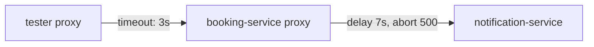

# Solution Walkthrough

The task needs two `VirtualService` objects: one for `notification-service` with a scoped fault rule and a plain rule, and one for `booking-service` with the timeout. The scoping matters: the grader sends requests without the header and fails the lab if any of them is affected.

---

## Step 1: Measure the Baseline

List the `VirtualService` objects, then send one request from the `tester` pod and print the status code and the time:

```sh
kubectl -n fault-demo get virtualservice
kubectl -n fault-demo exec deploy/tester -- \
  curl -s -o /dev/null -w '%{http_code} %{time_total}s\n' -X POST http://booking-service/book
```

```text
No resources found in fault-demo namespace.
200 0.043s
```

The request takes about 40 milliseconds across two hops. Both numbers matter: the abort changes the status, and the delay changes the time.

---

## Step 2: Work Out Where the Timeout Goes

The task asks for a 7-second delay **and** a `500` abort on one rule, and a 3-second timeout on a **different** `VirtualService`. That split is the point of the lab, so work out the reason before you apply anything.

Inside the sidecar proxy (Envoy), a request passes a chain of filters. The **fault filter** applies the delay and the abort. The **router** comes after it: it sends the request to the destination, and it enforces the route `timeout`. While the fault filter holds the request, the router has not started yet, so a `timeout` on the same rule never sees the delay. With both on one rule, the request waits the full seven seconds and then gets the `500` of the abort.



The diagram shows that the proxy of `tester` enforces the timeout on the first hop, and the proxy of `booking-service` applies the fault on the second hop.

The timeout on the **first** hop stops the whole request after three seconds. That is before the seven-second delay ends, so the abort never runs. The result you see is a **`504` after about 3 seconds**, not a `500` after 7.

This is why an injected delay is useful: it makes a timeout fire on demand, every time, without a real slow service. But a timeout only fires against a delay that a *different* proxy applies.

---

## Step 3: Write Both VirtualService Objects

Write each object to a file and apply the file. In the exam, a file is easy to read again, edit and apply again.

Save this as `virtualservice-notification.yaml`:

```yaml
apiVersion: networking.istio.io/v1
kind: VirtualService
metadata:
  name: notification
  namespace: fault-demo
spec:
  hosts:
    - notification-service
  http:
    - match:
        - headers:
            end-user:
              exact: tester
      fault:
        delay:
          fixedDelay: 7s
          percentage:
            value: 100
        abort:
          httpStatus: 500
          percentage:
            value: 100
      route:
        - destination:
            host: notification-service
    - route:
        - destination:
            host: notification-service
```

Apply it:

```sh
kubectl apply -f virtualservice-notification.yaml
```

```text
virtualservice.networking.istio.io/notification created
```

Save this as `virtualservice-booking.yaml`:

```yaml
apiVersion: networking.istio.io/v1
kind: VirtualService
metadata:
  name: booking
  namespace: fault-demo
spec:
  hosts:
    - booking-service
  http:
    - timeout: 3s
      route:
        - destination:
            host: booking-service
```

Apply it:

```sh
kubectl apply -f virtualservice-booking.yaml
```

```text
virtualservice.networking.istio.io/booking created
```

Then check the result:

```sh
istioctl analyze -n fault-demo
```

```text
✔ No validation issues found when analyzing namespace: fault-demo.
```

The grader checks four things in these objects:

- **`hosts: [notification-service]`**, not `booking-service`. The fault belongs on the host that should look broken. On `booking-service`, it would delay the request from `tester` to `booking-service`, which is a different test.
- **The scoped rule is first.** The plain rule has no `match`, so it matches every request. Below it, the header rule would never be used.
- **The second rule is clean:** no fault and no timeout. That keeps every other request working.
- **The timeout is on the `booking` object**, not next to the fault. Next to the delay it would do nothing, as step 2 explains.

---

## Step 4: Confirm That the Client's Proxy Holds the Fault

`istioctl proxy-config routes` prints the routes that a proxy holds right now. Read the routes of the `booking-service` proxy and search for the fault filter:

```sh
istioctl proxy-config routes deploy/booking-service-v1 -n fault-demo -o json | grep -i -A8 'envoy.filters.http.fault'
```

The output starts with the key `"envoy.filters.http.fault"`, followed by the delay with `"fixedDelay": "7s"` and the abort. Envoy writes the percentage of 100 as a numerator of one million out of a million.

Note which proxy that is: **`booking-service`**, the client of `notification-service`. The `VirtualService` names the destination host, but the sidecar proxy of the calling workload applies the fault.

---

## Step 5: Check That Other Requests Are Untouched

Do this **before** you test your own request. It is the check that tells a test apart from an outage:

```sh
for i in 1 2 3 4 5; do
  kubectl -n fault-demo exec deploy/tester -- \
    curl -s -o /dev/null -w '%{http_code} %{time_total}s\n' -X POST http://booking-service/book
done
```

```text
200 0.041s
200 0.038s
200 0.044s
200 0.039s
200 0.042s
```

All five requests return `200`, fast. Every other client's requests work as before.

---

## Step 6: Check the Request With the Header

```sh
kubectl -n fault-demo exec deploy/tester -- \
  curl -s -o /dev/null -w '%{http_code} %{time_total}s\n' -H "end-user: tester" -X POST http://booking-service/book
```

```text
504 3.052s
```

The request returns after three seconds, not seven, with a `504` and not the `500` you configured. That is the result step 2 predicted.

If this returns `200`, the header did not reach the second hop. `booking-service` copies the request headers onto its own call, and that makes the match work. An application that does not copy headers cannot be tested this way. That is a property of the application, not of your configuration.

---

## Step 7: Prove That the Timeout Fired

Read the access log of the `tester` sidecar proxy, the log where it writes one line for every request:

```sh
kubectl -n fault-demo logs deploy/tester -c istio-proxy --tail=-1 | grep ' 504 UT ' | tail -1
```

```text
[2026-09-28T19:03:07.140Z] "POST /book HTTP/1.1" 504 UT response_timeout - "-" 0 24 3000 - ...
```

The response flag `UT` (upstream request timeout) is in the log of the **client**, `tester`, on its request to `booking-service`. That is the 3-second route timeout firing. The fault itself is applied one hop further, in the proxy of `booking-service` on its request to `notification-service`. So you do not find `UT` in the log of `booking-service`: no timeout is set on that hop.

---

## Step 8: Clean Up

A fault is configuration. It stays in the cluster after you close your terminal.

```sh
kubectl -n fault-demo delete virtualservice notification
```

---

## Common Mistakes

- **Fault on `booking-service` instead of `notification-service`.** It delays the request from `tester` and tests the wrong hop.
- **No header match, or the plain rule first.** Every client gets the fault. That is an outage you caused, and the grader fails it.
- **A fault or timeout left on the second rule.** Requests without the header are affected, and the grader catches it.
- **Expecting a `500` after 7 seconds.** The 3-second timeout stops the 7-second delay first, so you get a `504` after 3 seconds.
- **Leaving out `percentage` and expecting no fault.** The default is 100%.
- **Scoping on a header that the middle service does not copy.** The fault never fires, and nothing tells you why.
- **Reading only the final response code.** In a chain with two hops, part of the evidence is in the proxy log of the middle service.
- **Leaving the fault in place afterwards.** Delete it.
