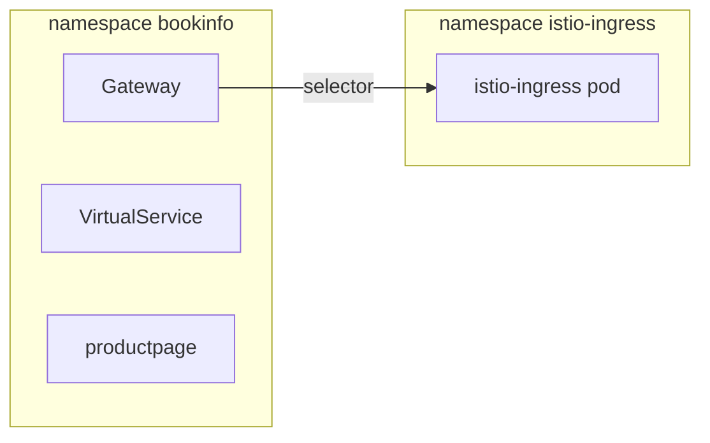

# The Gateway Pod And Its Listener

This part answers two questions. What is the gateway, as a running program? And what does a `Gateway` object do to it? Neither is hard. But mixing the two up causes most of the confusion in this section.

## A sidecar with no app beside it

The ingress gateway is the same Envoy program that runs in every injected pod. In the fleet picture, every ship has a communications officer on board: the sidecar. The gateway is a communications officer standing alone at the spaceport arrival gate, with no ship of their own. The differences are all about where it runs:

| | Sidecar | Ingress gateway |
| --- | --- | --- |
| Runs | inside an app pod | in its own pod, in its own namespace (`istio-ingress` in the playground) |
| Containers in the pod | app + `istio-proxy` (`2/2`) | just the proxy (`1/1`) |
| Reached by | traffic caught inside the pod | a Kubernetes Service, usually `LoadBalancer` or `NodePort` (`ClusterIP` plus a port forward in the playground) |
| Set up by | `VirtualService` / `DestinationRule` for mesh traffic | `Gateway` + a `VirtualService` linked to it |
| Traffic direction | east-west | north-south |

Because it is the same Envoy, every tool you already know works on it: `istioctl proxy-config listeners/routes/clusters`, the access log, `pilot-agent request GET stats`. Keep that in mind. You debug a gateway with the same commands as a sidecar.

> [!TIP]
> **Try it — a gateway with no configuration**
>
> ```sh
> kubectl get pods -n istio-ingress --show-labels
> kubectl get svc -n istio-ingress
> kubectl get gateway,virtualservice -n bookinfo
> gateway_status /productpage
> ```
>
> What to look for (output not shown in full):
>
> - The `istio-ingress` pod is `1/1`: one container, no app. Among its labels is `istio=ingress`. Remember that label; the next section needs it.
> - The `istio-ingress` Service is type `ClusterIP`. The playground reaches it through the astrona port forward on `127.0.0.1:8080`.
> - `No resources found in bookinfo namespace.`
> - `gateway_status` prints `000`. curl got an empty reply, because no `Gateway` has told the proxy to listen on port 80 yet.
>
> All of this is the expected starting state. The proxy is healthy. It simply has no listener for your traffic.

## The `Gateway` object

```yaml
apiVersion: networking.istio.io/v1
kind: Gateway
metadata:
  name: bookinfo-gateway
  namespace: bookinfo
spec:
  selector:
    istio: ingress
  servers:
  - port:
      number: 80
      name: http
      protocol: HTTP
    hosts:
    - bookinfo.example.com
```

Read `Gateway` as **"open a listener on some gateway pods"**: it opens the gate and tunes it to a radio channel. It does not route anything. There is no `destination` anywhere in it.

**`selector`** is a **pod label selector**. It is how this object finds the gateway pods to set up. Which label to use depends on how Istio was installed:

| Install method | Gateway pod label |
| --- | --- |
| Helm `gateway` chart installed as `istio-ingress` (this playground) | `istio: ingress` |
| `istioctl install` (`default` or `demo` profile) | `istio: ingressgateway` |

Most examples on the internet use `istio: ingressgateway`. Copy one onto a Helm install and no pod gets your listener. So look before you write: `kubectl get pods -n istio-ingress --show-labels`.

Two more things follow from the selector:

- To run a second gateway with different labels, such as a separate internal gateway, you point a different `Gateway` at it through those labels. The object is not tied to any Deployment by name.
- A `selector` that matches nothing is not an error. The object exists, sets up no proxy, and the port stays closed. `istioctl analyze` reports it as `IST0101`.

**`servers[].port`** is the port (the radio channel) **on the gateway Service**, with a `name` and an explicit `protocol`. The protocol matters more than it looks:

| `protocol` | The gateway will |
| --- | --- |
| `HTTP` | read requests: host and path routing, header matching, all of layer 7 |
| `HTTPS` | decrypt TLS (with a `tls` block), then behave as HTTP |
| `TLS` | look at SNI (the server name the client asks for) and either pass the stream through or decrypt it, without reading HTTP |
| `TCP` | move bytes, with no layer-7 awareness at all |

Declaring `TCP` for HTTP traffic gives you a working byte pipe and no routing. That is a confusing result to debug backwards.

**`servers[].hosts`** is the set of `Host` headers this listener accepts. A request whose `Host` is not in the list is not served by it. `*` matches anything; `*.example.com` matches any subdomain.

## The namespace split that catches everyone



The `Gateway` `bookinfo-gateway` and the `VirtualService` `bookinfo` live next to `productpage` in `bookinfo`. The object and the pod it sets up live in different namespaces. The selector, `istio: ingress`, is the only thing joining them.

Think of each namespace as a planet. The `Gateway` **object** lives on your app's planet. The gateway **pod** it sets up, the gate itself, lives on another planet, `istio-ingress`. That is normal and correct. The object is configuration, and the selector connects it to a pod somewhere else.

It also means a `Gateway` in your namespace can set up a shared, cluster-wide gateway. Part 2 covers the reverse case, where the `Gateway` object itself lives elsewhere.

## Applying it alone changes almost nothing

A listener with no routes serves nothing: the gate is open, but no flight plan tells arriving signals where to go. It is worth seeing this on purpose, because "I created the Gateway and it still 404s" is a common first result. It is not a fault.

> [!TIP]
> **Try it — open the listener, and get 404 instead of 000**
>
> Write the `Gateway` to a file, then apply it.
>
> Save this as `gateway-bookinfo.yaml`:
>
> ```yaml
> apiVersion: networking.istio.io/v1
> kind: Gateway
> metadata:
>   name: bookinfo-gateway
>   namespace: bookinfo
> spec:
>   selector:
>     istio: ingress
>   servers:
>   - port:
>       number: 80
>       name: http
>       protocol: HTTP
>     hosts:
>     - bookinfo.example.com
> ```
>
> Apply it:
>
> ```sh
> kubectl apply -f gateway-bookinfo.yaml
> ```
>
> Then check the result:
>
> ```sh
> sleep 2
> gateway_status /productpage
> kubectl logs -n istio-ingress deploy/istio-ingress --tail=1
> istioctl proxy-config listener deploy/istio-ingress -n istio-ingress
> ```
>
> Expect `404`, and a log line like this (trimmed):
>
> ```text
> "GET /productpage HTTP/1.1" 404 NR route_not_found ... "bookinfo.example.com" ...
> ```
>
> The status changed from `000` to `404`. The connection now works, because the listener exists. But the gateway has no route for the request, so it answers `404` itself. The flag **`NR`** in the log means "no route". The `proxy-config listener` output now shows a listener whose destination is a route table (`Route: http.<port>`). That table is still empty. This is the state a `Gateway` alone produces: somewhere for requests to arrive, and nothing to do with them.

## Common pitfalls

> [!WARNING]
> **Expecting a `Gateway` to route anything.** It opens a listener. There is no `destination` in the object, and on its own it gives `404 NR`.
>
> **Copying `istio: ingressgateway` onto a Helm install.** No pod has that label, so no pod gets the listener. The port stays closed and curl gets an empty reply (`000`), not a 404. `istioctl analyze` reports `IST0101`. Check the labels with `kubectl get pods -n istio-ingress --show-labels`.
>
> **Declaring the wrong `protocol`.** `TCP` for HTTP traffic gives you a working byte pipe with no host or path routing.
>
> **Forgetting that `hosts` filters the `Host` header.** A request whose `Host` is not in the list is not served by that listener.
>
> **Looking for the gateway pod in your own namespace.** The object is yours; the pod is the shared one in the gateway's namespace (`istio-ingress` here).
>
> **Confusing the Service port with the listener port.** The Service publishes port 80, and the proxy may listen on a different port inside the pod. Both can show up in output.

> *`Gateway` opens a listener on pods its `selector` matches; it contains no destination and routes nothing by itself.*
