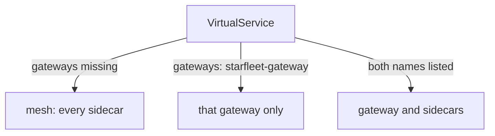

# Bind A VirtualService To A Gateway

A gateway with a listener and no routes answers every request with `404 NR`. This part adds the routes.

A `VirtualService` is the Istio object that sets how requests to a host are routed: match rules, read from top to bottom, and the destination for each. To reach the gateway, it needs one extra line of YAML, and that line is the one people forget most often when they expose a service.

The commands below need the `starfleet-gateway` `Gateway` applied (selector `istio: ingress`, port `80`, host `starfleet.example.com`). They also use the `gateway_status` helper, which sends one request through the gateway on `localhost:8080` with a `Host` header and prints the status code:

<!-- astrona:playground:renew -->

```sh
gateway_status() { curl -s -o /dev/null -w "%{http_code}\n" -H "Host: ${2:-starfleet.example.com}" "http://localhost:8080$1"; }
```

## The `gateways:` field binds routes to a gateway

A route on the gateway is the same `VirtualService` you use inside the mesh. It gets one new field, `gateways:`, which names the `Gateway` that the routes belong to. The quickest way to see what it does is to apply one and send requests.

### Bind the routes and watch 404 become 200

This `VirtualService` sends the paths that the `bridge` web frontend serves to the `bridge` Service on port `9080`. Save this as `virtualservice-bridge.yaml`:

```yaml
apiVersion: networking.istio.io/v1
kind: VirtualService
metadata:
  name: bridge
  namespace: starfleet
spec:
  hosts:
  - starfleet.example.com
  gateways:
  - starfleet-gateway
  http:
  - match:
    - uri:
        exact: /productpage
    - uri:
        prefix: /static
    - uri:
        exact: /login
    - uri:
        exact: /logout
    - uri:
        prefix: /api/v1/products
    route:
    - destination:
        host: bridge
        port:
          number: 9080
```

Apply it:

```sh
kubectl apply -f virtualservice-bridge.yaml
```

```text
virtualservice.networking.istio.io/bridge created
```

Then check the result with three requests: the `bridge` page, a path that is not in the match list, and a host the `Gateway` does not serve:

```sh
gateway_status /productpage
gateway_status /admin
gateway_status /productpage other.example.com
```

```text
200
404
404
```

The first request now reaches `bridge`: `200`. The second gets `404`, because `/admin` is not in the match list, so the gateway's Envoy finds no route. The third gets `404` too, because `other.example.com` is not a host on the `Gateway`.

Everything in this file except `gateways:` works exactly as it does inside the mesh: the `http` rules, the matching, and the rule that the first match wins. The match list names only the paths that `bridge` serves, so any other path finds no route.

### Read the routes on the gateway

The gateway is a normal Envoy proxy, so you can read its route table just as you would for a sidecar proxy:

```sh
istioctl proxy-config routes deploy/istio-ingress -n istio-ingress
```

```text
NAME        VHOST NAME                   DOMAINS                   MATCH                  VIRTUAL SERVICE
http.80     starfleet.example.com:80     starfleet.example.com     /productpage           bridge.starfleet
http.80     starfleet.example.com:80     starfleet.example.com     /static*               bridge.starfleet
http.80     starfleet.example.com:80     starfleet.example.com     /login                 bridge.starfleet
http.80     starfleet.example.com:80     starfleet.example.com     /logout                bridge.starfleet
http.80     starfleet.example.com:80     starfleet.example.com     /api/v1/products*      bridge.starfleet
            backend                      *                         /stats/prometheus*     
            backend                      *                         /healthz/ready*        
```

The route table `http.80`, which the port `80` listener uses, now holds your five path matches for the host `starfleet.example.com`. The last column names the `VirtualService` they came from: `bridge.starfleet` (name, then namespace).

Send one more request and read the gateway's access log:

```sh
gateway_status /productpage
kubectl logs -n istio-ingress deploy/istio-ingress --tail=1
```

```text
200
[2026-10-08T21:53:36.653Z] "GET /productpage HTTP/1.1" 200 - via_upstream - "-" 0 15064 566 565 "10.244.0.6" "curl/8.7.1" "a21a2b87-9e17-495f-935b-42f3a30919d8" "starfleet.example.com" "10.244.0.12:9080" outbound|9080||bridge.starfleet.svc.cluster.local 10.244.0.6:56402 127.0.0.1:80 127.0.0.1:41526 - -
```

The gateway sent the request to the Envoy cluster `outbound|9080||bridge.starfleet.svc.cluster.local`, which is the `bridge` Service on port `9080`, and `bridge` answered `200`. The log line can take a few seconds to appear. If you see an older line, run the `kubectl logs` command again.

The `Host` header does real work here. The name `starfleet.example.com` does not resolve in DNS, so you connect to the port forward and tell the gateway which host you mean. A real client reaches the gateway the same way, with a real domain name that resolves to the gateway's address.

## `mesh` is the default value of `gateways:`

The routes now work, so it is time to see what happens without the extra line. Every `VirtualService` without a `gateways:` field gets a default value, and knowing it explains the most common gateway failure:

```yaml
gateways:
- mesh          # used when the field is missing
```

`mesh` is a reserved name that means all sidecar proxies in the mesh. So the rule is: leave out `gateways:` and the routes apply to sidecar proxies only; name a gateway and they apply to that gateway only.



The diagram shows which proxies get a `VirtualService`'s routes, depending on its `gateways:` field.

The field is a list, so you can name both:

```yaml
gateways:
- starfleet-gateway
- mesh
```

That gives the same routes to the gateway and to sidecar proxies inside the mesh. It is useful when requests from outside and inside should behave the same. Make it a real choice, though, because often they should not.

### Remove the field and watch the gateway fail

Seeing this failure once makes it easy to spot later. Save this as `virtualservice-bridge-no-gateways.yaml`. It is the same `VirtualService` without `gateways:`:

```yaml
apiVersion: networking.istio.io/v1
kind: VirtualService
metadata:
  name: bridge
  namespace: starfleet
spec:
  hosts:
  - starfleet.example.com
  http:
  - match:
    - uri:
        exact: /productpage
    - uri:
        prefix: /static
    - uri:
        exact: /login
    - uri:
        exact: /logout
    - uri:
        prefix: /api/v1/products
    route:
    - destination:
        host: bridge
        port:
          number: 9080
```

Apply it:

```sh
kubectl apply -f virtualservice-bridge-no-gateways.yaml
```

```text
virtualservice.networking.istio.io/bridge configured
```

Then check the result with a request, the access log, the gateway's route table and `istioctl analyze`:

```sh
gateway_status /productpage
kubectl logs -n istio-ingress deploy/istio-ingress --tail=1
istioctl proxy-config routes deploy/istio-ingress -n istio-ingress
istioctl analyze -n starfleet
```

```text
404
[2026-10-08T21:53:27.695Z] "GET /productpage HTTP/1.1" 404 NR route_not_found - "-" 0 0 1 - "10.244.0.6" "curl/8.7.1" "5830fef6-0677-4c2e-97f9-9f411dc7c3af" "starfleet.example.com" "-" - - 127.0.0.1:80 127.0.0.1:59976 - -
NAME        VHOST NAME       DOMAINS     MATCH                  VIRTUAL SERVICE
http.80     blackhole:80     *           /*                     404
            backend          *           /stats/prometheus*     
            backend          *           /healthz/ready*        

✔ No validation issues found when analyzing namespace: starfleet.
```

The answer is `404 NR` again. The gateway's route table has no routes from `bridge.starfleet` any more. It holds only a `blackhole:80` entry, which answers `404` to every request. And `istioctl analyze` reports nothing, because a `VirtualService` for `mesh` is a valid object. Kubernetes stored it and nothing warns you: `istiod` sent the routes to the sidecar proxies, not to the gateway.

### Restore the working VirtualService

Apply the working `VirtualService` again:

```sh
kubectl apply -f virtualservice-bridge.yaml
```

```text
virtualservice.networking.istio.io/bridge configured
```

Then check the result:

```sh
gateway_status /productpage
```

```text
200
```

The gateway routes to `bridge` again.

> [!TIP]
> When a gateway answers `404` and `istioctl analyze` is clean, look at `gateways:` first. Then confirm with `istioctl proxy-config routes` on the gateway: if your host is not in the table, the `VirtualService` never reached the gateway.

You now know that a `VirtualService` reaches a gateway only when its `gateways:` field names the `Gateway`, and that a missing field means `mesh`. Both objects in this part used the same host, `starfleet.example.com`. The open question is what happens when the two host lists differ, or when the `Gateway` lives in another namespace.

## Common pitfalls

> [!WARNING]
> - **Leaving out `gateways:` for requests from outside.** The default value is `mesh`, so the routes go to the sidecar proxies and the gateway answers `404 NR`. `istioctl analyze` does not report it.
> - **Naming a gateway and expecting sidecar proxies to keep the same routes.** Naming a gateway *replaces* the default `mesh`. List `mesh` as well if you want both.
> - **A match list that misses a path the page needs.** The `bridge` page loads `/static` files. Leave that path out and the page loads with no styling, because those requests get `404`.
> - **Testing without the `Host` header.** Without it, curl sends `localhost:8080` as the host, which matches no host on the `Gateway`. The `gateway_status` helper adds the header for you.
