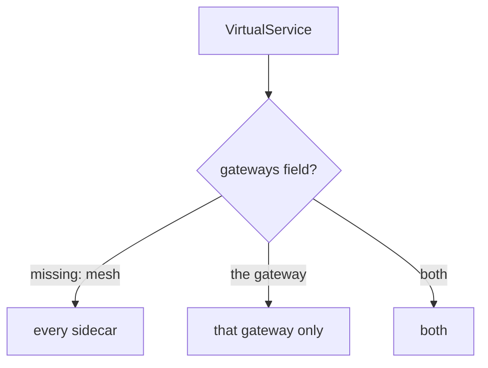

# Binding Routes With `gateways:`

Part 1 left a listener with nothing attached. This part is about the field that attaches routes to it. It is one line of YAML, and it is the most common thing people forget in this whole section.

## The field

The object is the `VirtualService` from section 010, the flight plan that says which way a signal (a request) flies. It gets one new field:

```yaml
apiVersion: networking.istio.io/v1
kind: VirtualService
metadata:
  name: bookinfo
  namespace: bookinfo
spec:
  hosts:
  - bookinfo.example.com
  gateways:
  - bookinfo-gateway          # ← the whole difference
  http:
  - match:
    - uri:
        exact: /productpage
    - uri:
        prefix: /static
    - uri:
        exact: /login
    - uri:
        exact: /logout
    - uri:
        prefix: /api/v1/products
    route:
    - destination:
        host: productpage
        port:
          number: 9080
```

You already know everything except `gateways:`. The `http` rules, the matching, the order and the first-match-wins rule all work exactly as they do inside the mesh. The match list here names only the paths `productpage` serves. Any other path finds no route and gets a 404.

## `mesh` is a reserved name, and it is the default

Every `VirtualService` you wrote before this section had a hidden `gateways` value:

```yaml
gateways:
- mesh          # used when the field is missing
```



With `gateways` missing, the rules reach every sidecar and the gateway answers 404. Naming only the gateway leaves callers inside the mesh unaffected. The diagram shows where a `VirtualService`'s rules end up, depending on its `gateways` field.

`mesh` is a reserved gateway name that means **all sidecars**: every communications officer on every ship in the fleet. So the rule is:

> Leave out `gateways:` and the routes apply to sidecars only. Name a gateway and they apply to that gateway only.

Leaving the field out while expecting traffic from outside to work is the classic failure of this module. You get a 404 from a configuration that looks correct. The API server gives no error, and `istioctl analyze` is clean.

The field is a list, so you can name both:

```yaml
gateways:
- bookinfo-gateway
- mesh
```

That attaches the same routes to the gateway **and** to callers inside the mesh. It is useful when outside and inside traffic should behave the same. Make it a real decision, not a default, because often they should not.

<!-- astrona:playground:renew -->

> [!TIP]
> **Try it — attach the routes and watch 404 become 200**
>
> Write the `VirtualService` above to a file named `virtualservice-bookinfo.yaml`, then:
>
> ```sh
> kubectl apply -f virtualservice-bookinfo.yaml
> ```
>
> Then check the result:
>
> ```sh
> sleep 2
> gateway_status /productpage
> gateway_status /admin
> gateway_status /productpage other.example.com
> ```
>
> Expect `200` first. Then `404`, because `/admin` is not in the match list. Then `404` again, because `other.example.com` is not on the `Gateway`.
>
> The `Host` header does real work here. `bookinfo.example.com` resolves nowhere, so you connect to the port forward and tell the gateway which host you mean. A real client's DNS name reaches it the same way. To use a browser, add `127.0.0.1 bookinfo.example.com` to `/etc/hosts` and open <http://bookinfo.example.com:8080/productpage>.

Now remove the one line and watch it break. Seeing it is more useful than reading about it.

> [!TIP]
> **Try it — the same object without `gateways:`**
>
> ```sh
> kubectl -n bookinfo patch virtualservice bookinfo --type json \
>   -p '[{"op":"remove","path":"/spec/gateways"}]'
> sleep 2
> gateway_status /productpage
> kubectl logs -n istio-ingress deploy/istio-ingress --tail=1
> istioctl analyze -n bookinfo
> ```
>
> Expect `404`, then a log line and an analysis like these (trimmed):
>
> ```text
> "GET /productpage HTTP/1.1" 404 NR route_not_found ...
> ✔ No validation issues found
> ```
>
> A `404 NR` and a clean analysis. The routes are valid. They are just attached to `mesh` instead of to the gateway. Put the field back before you go on (`kubectl apply -f virtualservice-bookinfo.yaml`). This is the failure to recognise on sight: when a gateway returns 404, check `gateways:` first.

## Host overlap between the two objects

The `hosts` of the `VirtualService` must **overlap** the `hosts` of the `Gateway`. They do not have to be the same:

| `Gateway.hosts` | `VirtualService.hosts` | Result |
| --- | --- | --- |
| `bookinfo.example.com` | `bookinfo.example.com` | works |
| `*` | `bookinfo.example.com` | works: the gateway accepts anything, the routes narrow it |
| `*.example.com` | `bookinfo.example.com` | works |
| `bookinfo.example.com` | `shop.example.com` | **no overlap**: the gateway ignores the routes |
| `bookinfo.example.com` | `*` | works, and the listener still only accepts `bookinfo.example.com` |

A wildcard on one side does not rescue a typo on the other. With no overlap, the gateway ignores the routes for every `Host`, and you get a 404. Here `istioctl analyze` does help: it warns with `IST0132`, "host … not found in Gateway".

Setting `"*"` on both objects accepts every `Host`, so `curl http://localhost:8080/productpage` works with no `Host` header at all. That is handy in a lab, and in an exam task that names no host. In real systems, use real host names. With `"*"`, every `VirtualService` linked to that gateway competes for the same hosts.

## Gateway routes use the same features

A route linked to a gateway can use everything a route inside the mesh can: subsets, weights, retries, faults. Nothing is special about it. The next version of the `VirtualService` adds a first rule that sends `/reviews/<id>` from outside straight to `reviews` v3. It relies on the `reviews` subsets, which the playground already created.

```yaml
apiVersion: networking.istio.io/v1
kind: VirtualService
metadata:
  name: bookinfo
  namespace: bookinfo
spec:
  hosts:
  - bookinfo.example.com
  gateways:
  - bookinfo-gateway
  http:
  - match:
    - uri:
        prefix: /reviews/
    route:
    - destination:
        host: reviews
        subset: v3
        port:
          number: 9080
  - match:
    - uri:
        exact: /productpage
    - uri:
        prefix: /static
    - uri:
        exact: /login
    - uri:
        exact: /logout
    - uri:
        prefix: /api/v1/products
    route:
    - destination:
        host: productpage
        port:
          number: 9080
```

> [!TIP]
> **Try it — subset routing at the gate**
>
> Write the YAML above to `virtualservice-bookinfo-reviews-api.yaml`, then:
>
> ```sh
> kubectl apply -f virtualservice-bookinfo-reviews-api.yaml
> ```
>
> Then check the result:
>
> ```sh
> for i in 1 2 3; do curl -s -H "Host: bookinfo.example.com" http://localhost:8080/reviews/0 | grep -o 'reviews-v[0-9]'; done
> ```
>
> Expect `reviews-v3` three times. Without the rule, `reviews` would spread these requests over all three versions.

## Referencing a `Gateway` in another namespace

A common production layout is one shared `Gateway` in a central namespace, with each team's `VirtualService` in its own namespace attaching to it. The reference then needs the namespace:

```yaml
gateways:
- istio-system/shared-gateway
```

A bare name is looked up **in the `VirtualService`'s own namespace**. Leave out the prefix and Istio looks for a `Gateway` that does not exist there. It finds nothing and attaches the routes to nothing: a silent 404.

This is the same short-name trap as `hosts` in section 010, in a different field. Learn it as a family: **any short name in an Istio object is looked up in that object's own namespace.**

> [!TIP]
> **Try it — point at the wrong namespace and break the reference**
>
> ```sh
> kubectl -n bookinfo patch virtualservice bookinfo --type merge \
>   -p '{"spec":{"gateways":["istio-system/bookinfo-gateway"]}}'
> sleep 2
> echo "wrong namespace: $(gateway_status /productpage)"
> kubectl -n bookinfo patch virtualservice bookinfo --type merge \
>   -p '{"spec":{"gateways":["bookinfo-gateway"]}}'
> sleep 2
> echo "correct:         $(gateway_status /productpage)"
> ```
>
> Expect `404` for the wrong namespace and `200` once it is fixed. The `Gateway` lives in `bookinfo`, so `istio-system/bookinfo-gateway` names an object that does not exist. Nothing reports the mistake. The routes simply attach to nothing.

> *Leaving out `gateways:` means `mesh`: the routes apply to sidecars and the gateway keeps returning 404.*

## Common pitfalls

> [!WARNING]
> **Leaving out `gateways:` for traffic from outside.** The hidden value is `mesh`, so the routes apply to sidecars and the gateway answers `404 NR`. This is the most common failure in the section, and `istioctl analyze` does not report it.
>
> **Naming a gateway and expecting callers inside the mesh to keep working.** Naming one *replaces* the hidden `mesh`. List `mesh` as well if you want both.
>
> **A `VirtualService` host that the `Gateway` does not serve.** Both objects have a host list, and only the overlap counts. `istioctl analyze` warns with `IST0132`.
>
> **Referencing a `Gateway` in another namespace by bare name.** A short name is looked up in the `VirtualService`'s own namespace. Use `<namespace>/<name>`.
