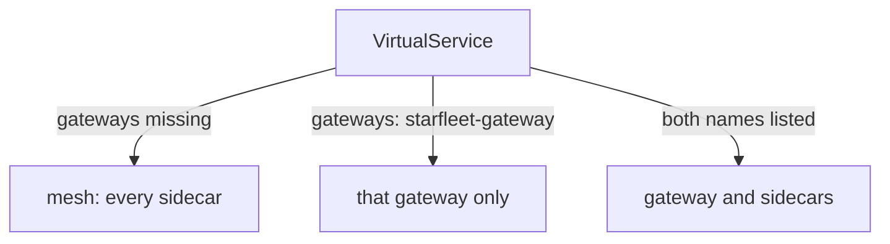

# Binding Routes With `gateways:`

Astronaut, an open gate with no flight plan answers every signal with `404 NR`. This part attaches a flight plan to the gate. It takes one line of YAML, and that line is the thing people forget most often when they expose a service.

The commands below need the `starfleet-gateway` `Gateway` applied (selector `istio: ingress`, port `80`, host `starfleet.example.com`) and the `gateway_status` helper pasted into your terminal.

## The field that links a flight plan to the gate

A route at the gate is the same `VirtualService` you use inside the mesh: the flight plan that says which way a signal flies, based on what it carries. It gets one new field, `gateways:`, which names the gate the plan belongs to.

<!-- astrona:playground:renew -->

### Attach the flight plan and watch 404 become 200

Here is the flight plan for the bridge. Save this as `virtualservice-bridge.yaml`:

```yaml
apiVersion: networking.istio.io/v1
kind: VirtualService
metadata:
  name: bridge
  namespace: starfleet
spec:
  hosts:
  - starfleet.example.com
  gateways:
  - starfleet-gateway
  http:
  - match:
    - uri:
        exact: /productpage
    - uri:
        prefix: /static
    - uri:
        exact: /login
    - uri:
        exact: /logout
    - uri:
        prefix: /api/v1/products
    route:
    - destination:
        host: bridge
        port:
          number: 9080
```

Apply it:

```sh
kubectl apply -f virtualservice-bridge.yaml
```

```text
virtualservice.networking.istio.io/bridge created
```

Then check the result with three signals: the bridge page, a path that is not in the match list, and a host the gate does not serve:

```sh
gateway_status /productpage
gateway_status /admin
gateway_status /productpage other.example.com
```

```text
200
404
404
```

The first signal now reaches the bridge: `200`. The second gets `404`, because `/admin` is not in the match list, so the gateway finds no route. The third gets `404` too, because `other.example.com` is not a host on the `Gateway`.

Everything in this file except `gateways:` works exactly as inside the mesh: the `http` rules, the matching, and the rule that the first match wins. The match list names only the paths the bridge serves, so any other path finds no route.

### See the routes the gate now holds

The gateway is a normal Envoy, so you can ask it for its route table, just like a sidecar:

```sh
istioctl proxy-config routes deploy/istio-ingress -n istio-ingress
```

```text
NAME        VHOST NAME                   DOMAINS                   MATCH                  VIRTUAL SERVICE
http.80     starfleet.example.com:80     starfleet.example.com     /productpage           bridge.starfleet
http.80     starfleet.example.com:80     starfleet.example.com     /static*               bridge.starfleet
http.80     starfleet.example.com:80     starfleet.example.com     /login                 bridge.starfleet
http.80     starfleet.example.com:80     starfleet.example.com     /logout                bridge.starfleet
http.80     starfleet.example.com:80     starfleet.example.com     /api/v1/products*      bridge.starfleet
            backend                      *                         /stats/prometheus*     
            backend                      *                         /healthz/ready*        
```

The route table `http.80`, which the port `80` listener points to, now holds your five path matches for the host `starfleet.example.com`. The last column names the flight plan they came from: `bridge.starfleet` (name, then namespace).

Send one more signal and read the gate's flight log:

```sh
gateway_status /productpage
kubectl logs -n istio-ingress deploy/istio-ingress --tail=1
```

```text
200
[2026-10-08T21:53:36.653Z] "GET /productpage HTTP/1.1" 200 - via_upstream - "-" 0 15064 566 565 "10.244.0.6" "curl/8.7.1" "a21a2b87-9e17-495f-935b-42f3a30919d8" "starfleet.example.com" "10.244.0.12:9080" outbound|9080||bridge.starfleet.svc.cluster.local 10.244.0.6:56402 127.0.0.1:80 127.0.0.1:41526 - -
```

The gate sent the signal to `outbound|9080||bridge.starfleet.svc.cluster.local`, the bridge on port `9080`, and the bridge answered `200`. The log line can take a few seconds to appear; if you see an older line, run the `kubectl logs` command again.

The `Host` header does real work here. The name `starfleet.example.com` points nowhere, so you connect to the port forward and tell the gate which host you mean. A real client reaches the gate the same way, with a real domain name.

## `mesh` is the hidden default

Every `VirtualService` without a `gateways:` field has a hidden value. Knowing it explains the most common gateway failure.

```yaml
gateways:
- mesh          # used when the field is missing
```

`mesh` is a reserved name that means **all sidecars**: every communications officer on every ship in the fleet. So the rule is:

> Leave out `gateways:` and the routes apply to sidecars only. Name a gateway and they apply to that gateway only.



The diagram shows where a flight plan's rules end up, depending on its `gateways:` field.

The field is a list, so you can name both:

```yaml
gateways:
- starfleet-gateway
- mesh
```

That gives the same routes to the gate **and** to ships inside the mesh. It is useful when signals from outside and inside should behave the same. Make it a real choice, though, because often they should not.

### Remove the one line and watch the gate break

Seeing this failure once makes it easy to spot later. Save this as `virtualservice-bridge-no-gateways.yaml`. It is the same flight plan without `gateways:`:

```yaml
apiVersion: networking.istio.io/v1
kind: VirtualService
metadata:
  name: bridge
  namespace: starfleet
spec:
  hosts:
  - starfleet.example.com
  http:
  - match:
    - uri:
        exact: /productpage
    - uri:
        prefix: /static
    - uri:
        exact: /login
    - uri:
        exact: /logout
    - uri:
        prefix: /api/v1/products
    route:
    - destination:
        host: bridge
        port:
          number: 9080
```

Apply it:

```sh
kubectl apply -f virtualservice-bridge-no-gateways.yaml
```

```text
virtualservice.networking.istio.io/bridge configured
```

Then check the result: a signal, the flight log, the gate's route table and `istioctl analyze`:

```sh
gateway_status /productpage
kubectl logs -n istio-ingress deploy/istio-ingress --tail=1
istioctl proxy-config routes deploy/istio-ingress -n istio-ingress
istioctl analyze -n starfleet
```

```text
404
[2026-10-08T21:53:27.695Z] "GET /productpage HTTP/1.1" 404 NR route_not_found - "-" 0 0 1 - "10.244.0.6" "curl/8.7.1" "5830fef6-0677-4c2e-97f9-9f411dc7c3af" "starfleet.example.com" "-" - - 127.0.0.1:80 127.0.0.1:59976 - -
NAME        VHOST NAME       DOMAINS     MATCH                  VIRTUAL SERVICE
http.80     blackhole:80     *           /*                     404
            backend          *           /stats/prometheus*     
            backend          *           /healthz/ready*        

✔ No validation issues found when analyzing namespace: starfleet.
```

Back to `404 NR`. The gate's route table is empty again: only a `blackhole:80` entry that answers `404` to everything. And `istioctl analyze` is clean, because a flight plan for `mesh` is a perfectly valid object. Kubernetes accepted it and nothing warns you. The routes went to the sidecars, not to the gate.

### Put the line back

Apply the working flight plan again:

```sh
kubectl apply -f virtualservice-bridge.yaml
```

```text
virtualservice.networking.istio.io/bridge configured
```

Then check the result:

```sh
gateway_status /productpage
```

```text
200
```

The gate routes to the bridge again.

> [!TIP]
> When a gate answers `404` and `istioctl analyze` is clean, look at `gateways:` first. Then confirm with `istioctl proxy-config routes` on the gateway: if your host is not in the table, the flight plan never reached the gate.

## Common pitfalls

> [!WARNING]
> - **Leaving out `gateways:` for signals from outside.** The hidden value is `mesh`, so the routes go to the sidecars and the gate answers `404 NR`. `istioctl analyze` does not report it.
> - **Naming a gateway and expecting ships inside the mesh to keep the same routes.** Naming a gateway *replaces* the hidden `mesh`. List `mesh` as well if you want both.
> - **A match list that misses a path the page needs.** The bridge page loads `/static` files. Leave that out and the page loads with no styling, because those signals get `404`.
> - **Testing without the `Host` header.** Without it, curl sends `localhost:8080` as the host, which matches no host on the `Gateway`. The `gateway_status` helper adds the header for you.

> *Leave out `gateways:` and the flight plan goes to `mesh`: the sidecars get the routes, and the gate keeps answering `404 NR`.*
