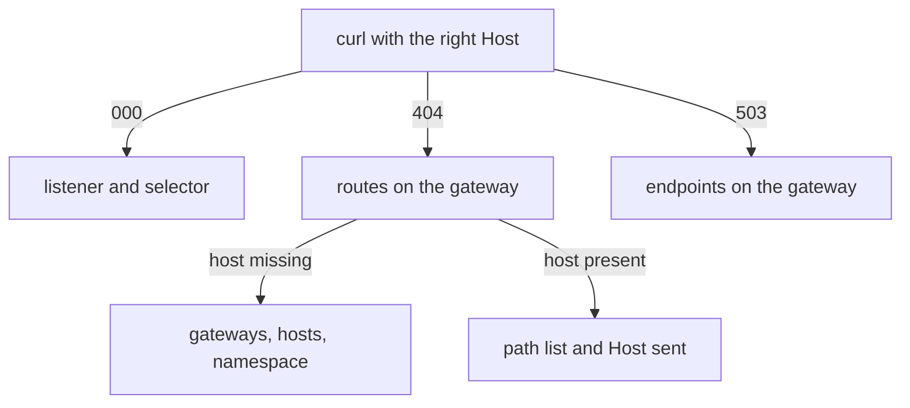

# Diagnose 000, 404 And 503 At The Ingress Gateway

A broken ingress gateway shows only a few results: no response, a `404` or a `503`. Most of the work is telling them apart, because each one points at a different object. This part creates each failure on purpose, shows which command confirms it, and ends with a short order of checks you can use on any gateway.

The commands below need the `starfleet-gateway` `Gateway` (selector `istio: ingress`, port `80`, host `starfleet.example.com`) and the `bridge` `VirtualService` applied. That `VirtualService` serves `starfleet.example.com`, has `gateways: [starfleet-gateway]`, and is saved as `virtualservice-bridge.yaml`. The commands also use the `gateway_status` helper, which sends one request through the gateway with a `Host` header and prints the status code:

<!-- astrona:playground:renew -->

```sh
gateway_status() { curl -s -o /dev/null -w "%{http_code}\n" -H "Host: ${2:-starfleet.example.com}" "http://localhost:8080$1"; }
```

## `000`, `404` and `503`

The three results come from three different stages inside the gateway's Envoy proxy, so each one tells you where to look:

| Result | Means | Look at |
| --- | --- | --- |
| **`000`** (no response at all) | nothing listens on the port | does a `Gateway` exist, and does its `selector` match the gateway pod's labels |
| **`404`**, flag `NR` | the request reached a listener but matched **no route** | the `Host` header, `Gateway.hosts`, `VirtualService.hosts`, the `gateways:` field and its namespace, the path match list |
| **`503`**, flag `NC` or `UH` | a route matched, but Envoy could not reach the destination | `destination.host`, the port, the subset, and whether the destination pods are ready |

A short way to remember it: `000` points at the `Gateway`, `404` at the `VirtualService`, and `503` at the destination Service.

`000` means there is no listener at all. A `404` means Envoy found a listener but no route to use. A `503` means Envoy found a route and picked a destination, but that destination was missing (`NC`, "no cluster") or had no healthy pod (`UH`, "no healthy upstream"). These short codes are response flags: Envoy writes them in the access log to say why a request failed.

### Make two different 404s

Start from the working gateway. Send one request with a host the `Gateway` does not serve, and one with the right host but a path that is not in the `VirtualService`:

```sh
gateway_status /productpage wrong.example.com
gateway_status /nothing-here
```

```text
404
404
```

You get two `404`s from two different causes. The status code alone cannot tell them apart. The access log and the route table can, and you read both in a moment.

### Point the route at a host that does not exist

Now break the third stage. This `VirtualService` sends `/productpage` to a host called `no-such-ship`, which no Service uses. Save this as `virtualservice-bridge-missing-ship.yaml`:

```yaml
apiVersion: networking.istio.io/v1
kind: VirtualService
metadata:
  name: bridge
  namespace: starfleet
spec:
  hosts:
  - starfleet.example.com
  gateways:
  - starfleet-gateway
  http:
  - match:
    - uri:
        exact: /productpage
    route:
    - destination:
        host: no-such-ship
        port:
          number: 9080
```

Apply it:

```sh
kubectl apply -f virtualservice-bridge-missing-ship.yaml
```

```text
virtualservice.networking.istio.io/bridge configured
```

Then check the result:

```sh
gateway_status /productpage
istioctl analyze -n starfleet
```

```text
503
Error [IST0101] (VirtualService starfleet/bridge) Referenced host not found: "no-such-ship"
```

(The `analyze` output is shortened to its finding.)

This time the route matched, so the request got past the `404` stage. But Envoy has no cluster for `no-such-ship`, so it answers `503`. `istioctl analyze` names the missing host: `IST0101 Referenced host not found`.

### Read the three failures in the access log

The gateway's Envoy writes one access log line per request, with a response flag that says what went wrong. Read the last three lines:

```sh
kubectl logs -n istio-ingress deploy/istio-ingress --tail=3
```

```text
[2026-10-08T21:55:14.392Z] "GET /productpage HTTP/1.1" 404 NR route_not_found - "-" 0 0 31 - "10.244.0.6" "curl/8.7.1" "c34ecc42-f5ff-46cd-a4aa-176fe6268793" "wrong.example.com" "-" - - 127.0.0.1:80 1
[2026-10-08T21:55:14.523Z] "GET /nothing-here HTTP/1.1" 404 NR route_not_found - "-" 0 0 5 - "10.244.0.6" "curl/8.7.1" "45a8d61a-e038-4472-8ad2-8bd3e5bf8a4f" "starfleet.example.com" "-" - - 127.0.0.1:
[2026-10-08T21:55:26.890Z] "GET /productpage HTTP/1.1" 503 NC cluster_not_found - "-" 0 0 3 - "10.244.0.6" "curl/8.7.1" "231050f2-a836-48e8-97ac-6bb27c70ea75" "starfleet.example.com" "-" - - 127.0.0.1
```

(Each line is cut short at the end.)

The two `404`s both carry `NR route_not_found`, but the host field tells them apart. The first has `wrong.example.com`. The second has `starfleet.example.com` with the path `/nothing-here`. The `503` carries `NC cluster_not_found`: Envoy had no cluster with that name.

## Reading the gateway's own configuration

The access log tells you what happened to one request. The gateway's configuration tells you why. The gateway is an ordinary Envoy proxy, so `istioctl proxy-config` works on it exactly as on a sidecar proxy. Three commands settle almost every case:

- **`listener`** answers "is anything listening on this port?" It is the check for `000`.
- **`routes`** answers "did my `VirtualService` reach the gateway?" It catches a missing `gateways:` field, a host mismatch and a wrong namespace in the `Gateway` reference.
- **`endpoints`** answers "does the destination have healthy pods?" It is the check for `503`.

### Restore the gateway and read all three

Apply the working `VirtualService` again:

```sh
kubectl apply -f virtualservice-bridge.yaml
```

```text
virtualservice.networking.istio.io/bridge configured
```

Then check the result with all three commands:

```sh
istioctl proxy-config listener deploy/istio-ingress -n istio-ingress --port 80
istioctl proxy-config routes deploy/istio-ingress -n istio-ingress | grep -E "NAME|starfleet"
istioctl proxy-config endpoints deploy/istio-ingress -n istio-ingress --cluster "outbound|9080||bridge.starfleet.svc.cluster.local"
```

```text
ADDRESSES PORT MATCH DESTINATION
0.0.0.0   80   ALL   Route: http.80
NAME        VHOST NAME                   DOMAINS                   MATCH                  VIRTUAL SERVICE
http.80     starfleet.example.com:80     starfleet.example.com     /productpage           bridge.starfleet
http.80     starfleet.example.com:80     starfleet.example.com     /static*               bridge.starfleet
http.80     starfleet.example.com:80     starfleet.example.com     /login                 bridge.starfleet
http.80     starfleet.example.com:80     starfleet.example.com     /logout                bridge.starfleet
http.80     starfleet.example.com:80     starfleet.example.com     /api/v1/products*      bridge.starfleet
ENDPOINT             STATUS      OUTLIER CHECK     CLUSTER
10.244.0.12:9080     HEALTHY     OK                outbound|9080||bridge.starfleet.svc.cluster.local
```

Read the output from top to bottom, in the same order a request passes through Envoy. A listener on port `80` sends requests to the route table `http.80`. That table holds your host and paths, from `bridge.starfleet`. And the `bridge` cluster has one healthy endpoint (pod address) on port `9080`. The pod address changes with every playground run, so yours will differ.

If your host is missing from the route table, the `VirtualService` never reached the gateway. That one check tells "my routes are wrong" apart from "my routes are not there".

### What `istioctl analyze` catches

`istioctl analyze` reads your objects, not the live gateway configuration, so it catches some mistakes and not others. Every row below was checked on the playground:

| Mistake | Does `istioctl analyze` report it? |
| --- | --- |
| `Gateway` `selector` matches no pod | yes, `IST0101` "Referenced selector not found" |
| `VirtualService` host not on the `Gateway` | yes, `IST0132` |
| reference to a `Gateway` in the wrong namespace | yes, `IST0101` "Referenced gateway not found" (plus `IST0132`) |
| destination host that does not exist | yes, `IST0101` "Referenced host not found" |
| `VirtualService` with no `gateways:` field | **no**: a `VirtualService` for `mesh` is a valid object |
| path that is missing from the match list | **no**: the gateway just answers `404 NR` |

## A short order of checks

When a gateway does not work, this order finds the cause faster than reading YAML again. Each step uses the answer from the step before:



The diagram shows which check to run next for each result.

1. **Send a request with the right `Host`.** Did you get `000`, `404` or `503`? That cuts the search at once.
2. For **`000`**: run `kubectl get pods -n istio-ingress -L istio` and compare the label with the `Gateway` `selector`. Then run `istioctl proxy-config listener deploy/istio-ingress -n istio-ingress`.
3. For **`404`**: run `istioctl proxy-config routes deploy/istio-ingress -n istio-ingress`. Is your host there at all? If it is missing, check the `gateways:` field, the host overlap and the namespace in the reference. If it is present, check the path match list and the `Host` you sent.
4. For **`503`**: run `istioctl proxy-config endpoints deploy/istio-ingress -n istio-ingress`. Does the destination exist, and does it have healthy endpoints?
5. **`istioctl analyze -n <namespace>`** catches wrong selectors, hosts missing from the `Gateway`, missing `Gateway` objects and missing destinations.
6. **The gateway's access log**, `kubectl logs -n istio-ingress deploy/istio-ingress --tail=1`, gives the status code and the response flag (`NR`, `NC`, `UH`) for every request.

> [!TIP]
> Fix one thing at a time and send a request after each fix. A gateway with two faults goes from `000` to `404` to `200`, and each change of status code tells you that the last fix worked.

You can now tell `000`, `404` and `503` apart, read the response flag in the access log, and confirm each case in the gateway's listeners, routes and endpoints. When several things are wrong at once, the order of checks takes you from one fault to the next.

## Common pitfalls

> [!WARNING]
> - **Reading a `503` as a routing problem.** A `503` means routing worked. Check the destination host, the port, the subset and the endpoints.
> - **Treating every `404` the same.** A wrong `Host` and a missing path both give `404 NR`. The host field in the access log and the route table tell them apart.
> - **Trusting a clean `istioctl analyze`.** It does not know that a `VirtualService` without `gateways:` was meant for the gateway.
> - **Expecting an `EXTERNAL-IP` on a cluster with no load balancer.** A `kind` cluster has none. Use a port forward (the playground runs one for you) or a `NodePort`.
> - **Declaring `protocol: TCP` for HTTP traffic.** You get a connection with no routing by host or path, which looks like a gateway that ignores your rules.

## Your mission: Repair A Broken Ingress Gateway Configuration Lab

You can now tell `000`, `404` and `503` apart and find the object behind each one. In the lab, the ingress gateway for the `starfleet` namespace is broken in more than one place, and you must find every fault and make `bridge` reachable from outside again.

The lab runs in its own cluster, so first pause your playground. Nothing in it is lost:

```sh
astrona stop ats-014-playground-060-01
```

Then start the lab:

```sh
astrona run --git git@github.com:astrona-io/ATS014.git -c sections/section-060/module-01/labs/lab-03
```

The task is on the next page. Solve it on your own first. When you think you are done, send it for grading:

```sh
astrona submit -c sections/section-060/module-01/labs/lab-03
```

When the lab is done, remove it and start your playground again:

```sh
astrona destroy ats-014-lab-060-01-03
astrona start ats-014-playground-060-01
```
