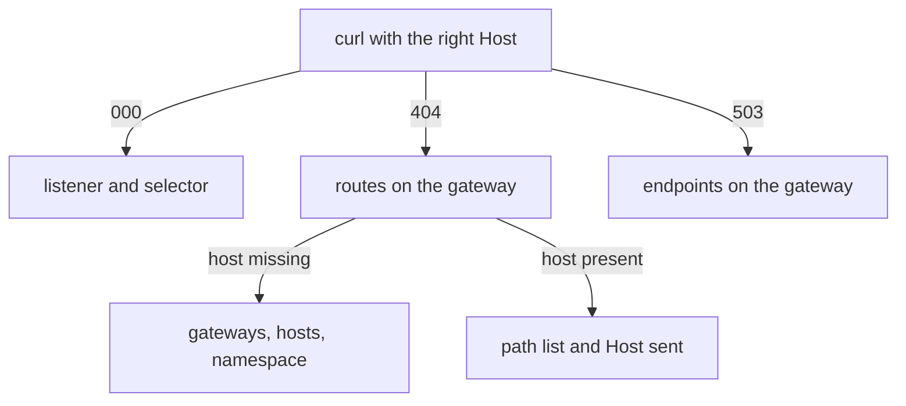

# Diagnosing The Gateway

Astronaut, a broken gate shows only a few results: no reply, a `404` or a `503`. Most of the work is telling them apart, because each one points at a different object. This part makes each failure on purpose, shows which command settles it, and ends with a short order of checks you can use on any gate.

The commands below need the `starfleet-gateway` `Gateway` and the `bridge` `VirtualService` applied (host `starfleet.example.com`, `gateways: [starfleet-gateway]`, saved as `virtualservice-bridge.yaml`), and the `gateway_status` helper pasted.

## `000`, `404` and `503`

The three results come from three different stages inside the gateway's Envoy, so each one tells you where to look.

| Result | Means | Look at |
| --- | --- | --- |
| **`000`** (no reply at all) | nothing listens on the port | does a `Gateway` exist, and does its `selector` match the gateway pod's labels |
| **`404`**, flag `NR` | the signal reached a listener but matched **no route** | the `Host` header, `Gateway.hosts`, `VirtualService.hosts`, the `gateways:` field and its namespace, the path match list |
| **`503`**, flag `NC` or `UH` | a route matched, but the ship behind it could not be reached | `destination.host`, the port, the subset, and whether the ship's pods are ready |

Remember it as one sentence: **`000` is my gate, `404` is my flight plan, `503` is my ship.**

`000` means there is no listener at all. A `404` means the gate found a listener but no route to use. A `503` means it found a route and picked a destination, but that destination was missing (`NC`, "no cluster") or had no healthy ship (`UH`, "no healthy upstream").

<!-- astrona:playground:renew -->

### Make two different 404s

Start from the working gate. Send one signal with a host the gate does not serve, and one with the right host but a path that is not in the flight plan:

```sh
gateway_status /productpage wrong.example.com
gateway_status /nothing-here
```

```text
404
404
```

Two `404`s from two different causes. The status code alone cannot tell them apart. The flight log and the route table can, and you read both in a moment.

### Point the flight plan at a ship that does not exist

Now break the third stage. This flight plan sends `/productpage` to a ship called `no-such-ship`. Save this as `virtualservice-bridge-missing-ship.yaml`:

```yaml
apiVersion: networking.istio.io/v1
kind: VirtualService
metadata:
  name: bridge
  namespace: starfleet
spec:
  hosts:
  - starfleet.example.com
  gateways:
  - starfleet-gateway
  http:
  - match:
    - uri:
        exact: /productpage
    route:
    - destination:
        host: no-such-ship
        port:
          number: 9080
```

Apply it:

```sh
kubectl apply -f virtualservice-bridge-missing-ship.yaml
```

```text
virtualservice.networking.istio.io/bridge configured
```

Then check the result:

```sh
gateway_status /productpage
istioctl analyze -n starfleet
```

```text
503
Error [IST0101] (VirtualService starfleet/bridge) Referenced host not found: "no-such-ship"
```

(The `analyze` output is trimmed to its finding.)

This time the route matched, so the gate got past the `404` stage. But it has no destination called `no-such-ship`, so it answers `503`. `istioctl analyze` names the missing ship: `IST0101 Referenced host not found`.

### Read the three failures in the gate's flight log

The gate writes one line per signal, with a short flag that says what went wrong. Read the last three lines:

```sh
kubectl logs -n istio-ingress deploy/istio-ingress --tail=3
```

```text
[2026-10-08T21:55:14.392Z] "GET /productpage HTTP/1.1" 404 NR route_not_found - "-" 0 0 31 - "10.244.0.6" "curl/8.7.1" "c34ecc42-f5ff-46cd-a4aa-176fe6268793" "wrong.example.com" "-" - - 127.0.0.1:80 1
[2026-10-08T21:55:14.523Z] "GET /nothing-here HTTP/1.1" 404 NR route_not_found - "-" 0 0 5 - "10.244.0.6" "curl/8.7.1" "45a8d61a-e038-4472-8ad2-8bd3e5bf8a4f" "starfleet.example.com" "-" - - 127.0.0.1:
[2026-10-08T21:55:26.890Z] "GET /productpage HTTP/1.1" 503 NC cluster_not_found - "-" 0 0 3 - "10.244.0.6" "curl/8.7.1" "231050f2-a836-48e8-97ac-6bb27c70ea75" "starfleet.example.com" "-" - - 127.0.0.1
```

(Each line is cut short at the end.)

The two `404`s both carry `NR route_not_found`, but the host field tells them apart: `wrong.example.com` for the first, `starfleet.example.com` with path `/nothing-here` for the second. The `503` carries `NC cluster_not_found`: the gate had no destination with that name.

## Reading the gateway's own configuration

The gateway is an ordinary Envoy, so `istioctl proxy-config` works on it exactly as on a sidecar. Three commands settle almost every case:

- **`listener`** answers "is anything listening on this port?" It is the check for `000`.
- **`routes`** answers "did my flight plan reach the gate?" It catches a missing `gateways:` field, a host mismatch and a wrong namespace in the link.
- **`endpoints`** answers "does the destination have healthy ships?" It is the check for `503`.

### Restore the gate and read all three

Apply the working flight plan again:

```sh
kubectl apply -f virtualservice-bridge.yaml
```

```text
virtualservice.networking.istio.io/bridge configured
```

Then check the result with all three commands:

```sh
istioctl proxy-config listener deploy/istio-ingress -n istio-ingress --port 80
istioctl proxy-config routes deploy/istio-ingress -n istio-ingress | grep -E "NAME|starfleet"
istioctl proxy-config endpoints deploy/istio-ingress -n istio-ingress --cluster "outbound|9080||bridge.starfleet.svc.cluster.local"
```

```text
ADDRESSES PORT MATCH DESTINATION
0.0.0.0   80   ALL   Route: http.80
NAME        VHOST NAME                   DOMAINS                   MATCH                  VIRTUAL SERVICE
http.80     starfleet.example.com:80     starfleet.example.com     /productpage           bridge.starfleet
http.80     starfleet.example.com:80     starfleet.example.com     /static*               bridge.starfleet
http.80     starfleet.example.com:80     starfleet.example.com     /login                 bridge.starfleet
http.80     starfleet.example.com:80     starfleet.example.com     /logout                bridge.starfleet
http.80     starfleet.example.com:80     starfleet.example.com     /api/v1/products*      bridge.starfleet
ENDPOINT             STATUS      OUTLIER CHECK     CLUSTER
10.244.0.12:9080     HEALTHY     OK                outbound|9080||bridge.starfleet.svc.cluster.local
```

Read it from top to bottom, the same way a signal travels. A listener on port `80` sends signals to the route table `http.80`. That table holds your host and paths, from `bridge.starfleet`. And the bridge's destination has one healthy ship on port `9080`. The ship's address changes with every playground run, so yours will differ.

**If your host is missing from the route table, the flight plan never reached the gate.** That one check tells "my routes are wrong" apart from "my routes are not there".

### What `istioctl analyze` catches

`istioctl analyze` reads your objects, not the live gate, so it catches some mistakes and not others. Every row below was checked on the playground:

| Mistake | Does `istioctl analyze` report it? |
| --- | --- |
| `Gateway` `selector` matches no pod | yes, `IST0101` "Referenced selector not found" |
| flight plan host not on the `Gateway` | yes, `IST0132` |
| link to a `Gateway` in the wrong namespace | yes, `IST0101` "Referenced gateway not found" (plus `IST0132`) |
| destination host that does not exist | yes, `IST0101` "Referenced host not found" |
| flight plan with no `gateways:` field | **no**: a flight plan for `mesh` is a valid object |
| path that is missing from the match list | **no**: the gate just answers `404 NR` |

## A short order of checks

When a gate does not work, this order finds the cause faster than reading YAML again. Each step uses the answer from the step before.



The diagram shows which command to run next for each result.

1. **Send a signal with the right `Host`.** `000`, `404` or `503`? That cuts the search at once.
2. For **`000`**: `kubectl get pods -n istio-ingress -L istio` and compare the label with the `Gateway` `selector`. Then `istioctl proxy-config listener deploy/istio-ingress -n istio-ingress`.
3. For **`404`**: `istioctl proxy-config routes deploy/istio-ingress -n istio-ingress`. Is your host there at all? Missing means the `gateways:` field, the host overlap or the namespace in the link. Present means check the path match list and the `Host` you sent.
4. For **`503`**: `istioctl proxy-config endpoints deploy/istio-ingress -n istio-ingress`. Does the destination exist, and does it have healthy ships?
5. **`istioctl analyze -n <namespace>`** catches wrong selectors, hosts missing from the `Gateway`, missing gates and missing destinations.
6. **The gate's flight log**, `kubectl logs -n istio-ingress deploy/istio-ingress --tail=1`, gives the status code and the flag (`NR`, `NC`, `UH`) for every signal.

> [!TIP]
> Fix one thing at a time and send a signal after each fix. A gate with two faults goes from `000` to `404` to `200`, and each change of code tells you that the last fix worked.

## Common pitfalls

> [!WARNING]
> - **Reading a `503` as a routing problem.** A `503` means routing worked. Check the destination host, the port, the subset and the endpoints.
> - **Treating every `404` the same.** A wrong `Host` and a missing path both give `404 NR`. The host field in the flight log and the route table tell them apart.
> - **Trusting a clean `istioctl analyze`.** It does not know that a flight plan without `gateways:` was meant for the gate.
> - **Expecting an `EXTERNAL-IP` on a cluster with no load balancer.** A `kind` cluster has none. Use a port forward (the playground runs one for you) or a `NodePort`.
> - **Declaring `protocol: TCP` for HTTP signals.** You get a byte pipe with no host or path routing, which looks like a gate that ignores your rules.

> *`000` is my gate, `404` is my flight plan, `503` is my ship, and the gate's own route table says which `404` you have.*

## Your mission: Repair The Arrival Gate

You can now tell `000`, `404` and `503` apart and find the object behind each one. Now prove it in a graded mission: the arrival gate for the Starfleet is broken in more than one place, and you have to find every fault and make the bridge reachable from outside again.

The mission runs in its own training solar system, so first pause your playground. Nothing in it is lost:

```sh
astrona stop ats-014-playground-060-01
```

Then start the mission:

```sh
astrona run --git git@github.com:astrona-io/ATS014.git -c sections/section-060/module-01/labs/lab-03
```

Read the task in [`question.md`](./labs/lab-03/question.md) and solve it on your own first. When you think you are done, send it for grading:

```sh
astrona submit -c sections/section-060/module-01/labs/lab-03
```

When the mission is done, remove it and wake your playground up again:

```sh
astrona destroy ats-014-lab-060-01-03
astrona start ats-014-playground-060-01
```
