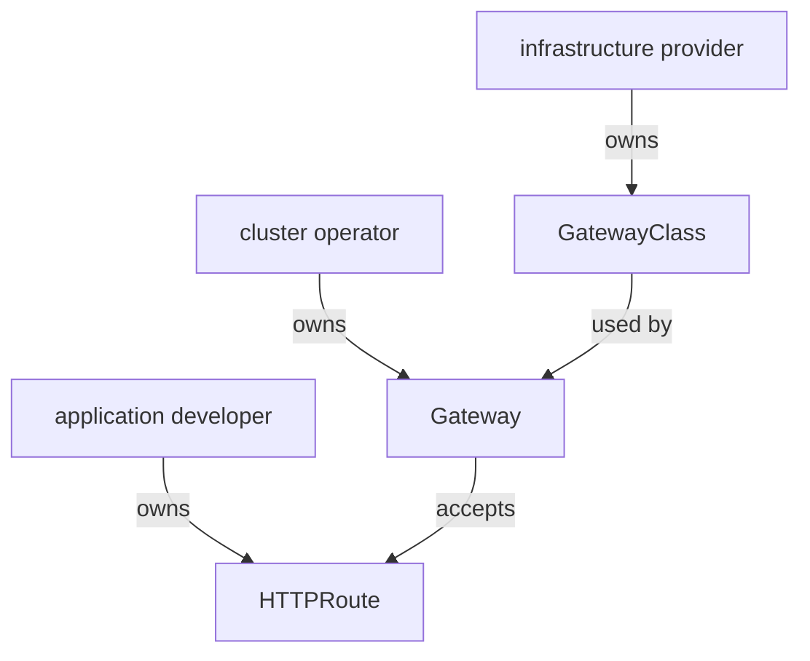

# The Gateway API Objects And Their Owners

Requests from outside the cluster need one place where they enter the mesh. That place is an ingress gateway: an Envoy proxy at the edge of the mesh that accepts traffic from outside the cluster and forwards it to a Service inside. Kubernetes and Istio give you more than one API to configure it, and this part covers the newest one, the **Kubernetes Gateway API**.

The Gateway API uses three objects where older APIs use one. The split is on purpose: each object belongs to a different role in the team that runs the cluster. Once you know which role owns which object, the rest of the API is easy to predict.

## The Gateway API is not part of Kubernetes

The Gateway API objects do not come with a new Kubernetes cluster, and Istio does not install them either. They come as **custom resource definitions** (CRDs). A CRD adds a new object kind to the Kubernetes API server, so that `kubectl` and controllers can create and read objects of that kind. Until someone installs the Gateway API CRDs, Kubernetes does not know the kinds `Gateway` or `HTTPRoute`.

Your playground installed the CRDs for you. On a cluster without them, applying a Gateway API `Gateway` fails like this:

```text
error: resource mapping not found for name: "starfleet-gateway" namespace: "starfleet" from "gateway-starfleet.yaml": no matches for kind "Gateway" in version "gateway.networking.k8s.io/v1"
ensure CRDs are installed first
```

This error looks like an Istio problem, but it is not. The Kubernetes API server rejects the object, because the kind is not registered. The fix is to install the Gateway API CRDs, in a version that your Istio release supports.

The same file can also fail with `the server could not find the requested resource`, if `kubectl` still has the CRDs in its local cache from earlier. Both messages mean the same thing: the CRDs are missing.

## The three objects

Each Gateway API object answers one question. The `GatewayClass` says which software builds and runs the gateways. The `Gateway` describes one gateway and its open ports. The `HTTPRoute` says which requests go to which Service.

| Object | Scope | What it decides |
| --- | --- | --- |
| `GatewayClass` | the whole cluster | which controller builds and runs the gateways |
| `Gateway` | one namespace | the listeners: port, protocol, host name, and which routes may use them |
| `HTTPRoute` | one namespace | which requests go to which Service |

A **listener** is one entry in a `Gateway` that opens a port for one protocol and, optionally, one host name. A **controller** is a program that watches objects of a kind and makes the cluster match them; for the `istio` class, the controller runs inside `istiod`.

There are other route kinds too, such as `GRPCRoute` for gRPC traffic. `HTTPRoute` is the kind for web traffic, and the only one this module uses.

## Why three objects, and not one

The split follows the roles in a team that runs a shared platform. The Gateway API names three roles, and each role owns one object:



The diagram shows one chain with three owners: a `Gateway` uses a `GatewayClass`, and an `HTTPRoute` attaches to a `Gateway`.

For example, the infrastructure provider installs Istio, which brings the `istio` class. The cluster operator creates a `Gateway` that listens on port 80 for `starfleet.example.com`. The application developer writes an `HTTPRoute` that sends `/productpage` to the `bridge` Service. Kubernetes role-based access control (RBAC) can then let application developers write `HTTPRoute` objects in their own namespace and nothing else.

Because the owners are different people, the owner of a `Gateway` needs a way to say which routes may use it. That is the `allowedRoutes` field of a listener. By default it is closed: only routes from the `Gateway`'s own namespace may attach.

## What Istio adds

`istiod` is Istio's control plane: it sends configuration and certificates to every proxy in the mesh. When `istiod` starts on a cluster that has the Gateway API CRDs, it registers its own `GatewayClass` objects. It then watches every `Gateway` that names one of those classes.

<!-- astrona:playground:renew -->

You can see both the CRDs and the classes in your playground. List the Gateway API kinds the cluster now knows, and the classes Istio registered:

```sh
kubectl get crd | grep gateway.networking.k8s.io
kubectl get gatewayclass
```

You should see this (the dates and ages on your cluster differ):

```text
gatewayclasses.gateway.networking.k8s.io    Cluster      v1(storage),v1beta1            2026-10-08T22:24:15Z
gateways.gateway.networking.k8s.io          Namespaced   v1(storage),v1beta1            2026-10-08T22:24:15Z
grpcroutes.gateway.networking.k8s.io        Namespaced   v1(storage)                    2026-10-08T22:24:15Z
httproutes.gateway.networking.k8s.io        Namespaced   v1(storage),v1beta1            2026-10-08T22:24:15Z
referencegrants.gateway.networking.k8s.io   Namespaced   v1beta1(storage)               2026-10-08T22:24:16Z
NAME           CONTROLLER                    ACCEPTED   AGE
istio          istio.io/gateway-controller   True       6m36s
istio-remote   istio.io/unmanaged-gateway    True       6m36s
```

The five CRDs are the Gateway API's standard set. `GatewayClass` is the only one with the scope `Cluster`; the others live inside a namespace. Istio registered two classes. You use `istio`: its controller, `istio.io/gateway-controller`, builds a real gateway for every `Gateway` that names it. `istio-remote` is for gateways that run outside this cluster, and you can ignore it here.

The CRDs and the classes exist, but no gateway runs yet. Look for any `Gateway` or `HTTPRoute`, and for any gateway proxy next to `istiod`:

```sh
kubectl get gateway,httproute -A
kubectl get deploy -n istio-system
```

You should see:

```text
No resources found
NAME     READY   UP-TO-DATE   AVAILABLE   AGE
istiod   1/1     1            1           8m20s
```

The `istio-system` namespace holds only `istiod`, and no ingress gateway runs anywhere. With the Gateway API, a gateway proxy appears only when you create a `Gateway`.

## Two `Gateway` kinds with one name

Istio has an older object that is also called `Gateway`. It has the same kind name, but it lives in a different API group and works in a different way. Examples online mix the two all the time, so learn to tell them apart now:

| | Istio's `Gateway` | Gateway API `Gateway` |
| --- | --- | --- |
| `apiVersion` | `networking.istio.io/v1` | `gateway.networking.k8s.io/v1` |
| Finds its proxy by | `spec.selector` (pod labels) | `spec.gatewayClassName` |
| Effect | configures a proxy that **already runs** | **creates** a new proxy Deployment and Service |
| Where the proxy runs | wherever the selected pods are, often `istio-system` | in the `Gateway`'s own namespace |
| Routes attach with | `VirtualService.spec.gateways` | `HTTPRoute.spec.parentRefs` |
| Routes from other namespaces | allowed | refused unless `allowedRoutes` allows them |

Always read the `apiVersion` first. If it says `networking.istio.io`, the example uses Istio's own `Gateway`, and nothing in this module applies to it.

You now know the three Gateway API objects, who owns each one, and how to check that the CRDs and Istio's `istio` class are in place. You also know that the cluster has no gateway proxy yet. The open question is what happens when you create a `Gateway` that names the `istio` class.

## Common pitfalls

> [!WARNING]
> - **Reading `no matches for kind "Gateway"` as an Istio problem.** The Kubernetes API server is telling you that the Gateway API CRDs are not installed. They are installed separately from Istio.
> - **Mixing up the two `Gateway` kinds.** They have the same name, a different API group and different behaviour. Check the `apiVersion`.
> - **Installing any CRD version.** The Gateway API version must be one that your Istio release supports.
> - **Expecting `GatewayClass` inside a namespace.** It is cluster-wide. `Gateway` and `HTTPRoute` live in a namespace.
