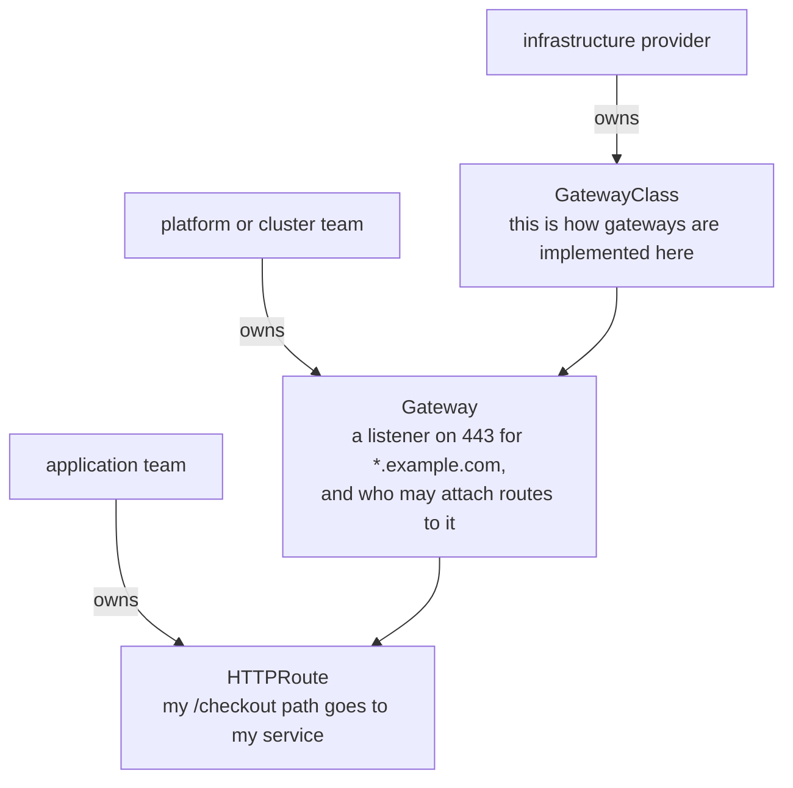

# Three Objects, Three Owners

> Prerequisite: [the module landing page](./course.md). Next: [A Gateway That Creates Its Own Data Plane](./course-02-a-gateway-that-creates-its-own-data-plane.md).

The Gateway API splits into three objects where `Ingress` had one. That split is not tidiness — it maps onto who owns what in a real organisation, and understanding the mapping makes the rest of the API predictable.

## The CRDs are not part of Kubernetes

First, the practical fact that produces the most confusing error message in this module.

Gateway API ships as **custom resource definitions**, installed separately. They are not in a stock Kubernetes cluster, and Istio does not install them for you. Without them:

```text
error: resource mapping not found for name: "booking-gateway" ... no matches for kind "Gateway" in version "gateway.networking.k8s.io/v1"
ensure CRDs are installed first
```

That reads like an Istio problem and is not one. It is Kubernetes saying it has never heard of the kind.

The playground installs them in `bootstrap/prepare.sh`. On a real cluster it is a one-line `kubectl apply` of a release manifest, and the version needs to be one the installed Istio supports — check the Istio release notes rather than assuming.

## The three objects

| Object | Scope | Owns | Analogous to |
| --- | --- | --- | --- |
| `GatewayClass` | cluster | which implementation handles a `Gateway` | `IngressClass` |
| `Gateway` | namespace | listeners: port, protocol, hostname, TLS, and who may attach | `networking.istio.io/Gateway` |
| `HTTPRoute` | namespace | matching and backends | `VirtualService` |

There are sibling route kinds — `GRPCRoute`, `TCPRoute`, `TLSRoute` — for non-HTTP traffic. `HTTPRoute` is what this module and most tasks use.

## Why three, and not one

The split maps onto organisational boundaries, and the API says so explicitly:



Three objects, three different owners, one chain. `Ingress` mixed all three concerns into a single object, which is why an application team writing one was also making infrastructure decisions.

With `Ingress`, one object mixed all three concerns, so an application team writing an `Ingress` was also making infrastructure decisions — and a platform team had no object to own. With `Gateway` and `HTTPRoute` as separate resources, RBAC can grant a team `HTTPRoute` in its own namespace and nothing else.

That is why `allowedRoutes` in Part 2 is a first-class field rather than a convention: once the objects belong to different people, the Gateway's owner needs a way to say who may use it.

## What Istio registers

When Istio starts with the CRDs present, it registers a `GatewayClass` of its own.

> [!TIP]
> **Try it — what the CRDs brought with them**
>
> ```sh
> kubectl get crd | grep gateway.networking.k8s.io
> kubectl get gatewayclass
> kubectl -n gwapi-demo get gateway,httproute
> kubectl -n gwapi-demo get deploy,svc
> ```
>
> Expect something like:
>
> ```text
> gatewayclasses.gateway.networking.k8s.io    2026-09-27T09:12:00Z
> gateways.gateway.networking.k8s.io          2026-09-27T09:12:00Z
> httproutes.gateway.networking.k8s.io        2026-09-27T09:12:00Z
> NAME    CONTROLLER                    ACCEPTED   AGE
> istio   istio.io/gateway-controller   True       9m
> No resources found in gwapi-demo namespace.
> NAME                                 READY   AGE
> deployment.apps/booking-service-v1   1/1     9m
> NAME                      TYPE        PORT(S)   AGE
> service/booking-service   ClusterIP   80/TCP    9m
> ```
>
> Three things worth noticing. The CRDs exist. Istio registered a `GatewayClass` named `istio` with `ACCEPTED: True` and controller `istio.io/gateway-controller` — note that is a **different string** from module 2's `istio.io/ingress-controller`; they are separate APIs with separate controllers. And there is no gateway Deployment in this namespace, which Part 2 explains.

## Two `Gateway` kinds, one name

Before going further, fix the distinction, because examples on the internet mix them freely:

| | `networking.istio.io/v1` | `gateway.networking.k8s.io/v1` |
| --- | --- | --- |
| Module | 1 | this one |
| Finds its proxy by | `spec.selector` (pod labels) | `spec.gatewayClassName` |
| Effect on the cluster | configures an **existing** pod | **creates** a Deployment and Service |
| Where the proxy runs | wherever the selected pods are (`istio-system`) | the `Gateway`'s own namespace |
| Routes attach via | `VirtualService.gateways` | `HTTPRoute.parentRefs` |
| Cross-namespace routes | allowed by convention | denied unless `allowedRoutes` permits |

**Check the `apiVersion` before reading any example.** If it says `networking.istio.io`, it is module 1's object and none of this module applies to it.

> *Gateway API is three CRDs with three owners — and its `Gateway` shares only a name with Istio's.*

## Common pitfalls

> [!WARNING]
> **Reading "no matches for kind Gateway" as an Istio problem.** It is Kubernetes saying the CRDs are not installed. They ship separately from Istio.
>
> **Confusing `gateway.networking.k8s.io/Gateway` with `networking.istio.io/Gateway`.** Same kind name, different API group, different object entirely. Always check the `apiVersion`.
>
> **Assuming any installed CRD version will do.** The Gateway API version has to be one the installed Istio supports.
>
> **Expecting `GatewayClass` to be namespaced.** It is cluster-scoped, like `IngressClass`.

## Reference

- [Gateway API](https://gateway-api.sigs.k8s.io/) — the project, including the role-oriented design rationale.
- [Istio Kubernetes Gateway API task](https://istio.io/latest/docs/tasks/traffic-management/ingress/gateway-api/) — Istio's own walkthrough and the CRD installation step.
- [Gateway API concepts: roles and personas](https://gateway-api.sigs.k8s.io/concepts/roles-and-personas/) — the three-owner split this part describes.
- `kubectl get gatewayclass` — the one-line check that Istio's controller is registered and accepted.
