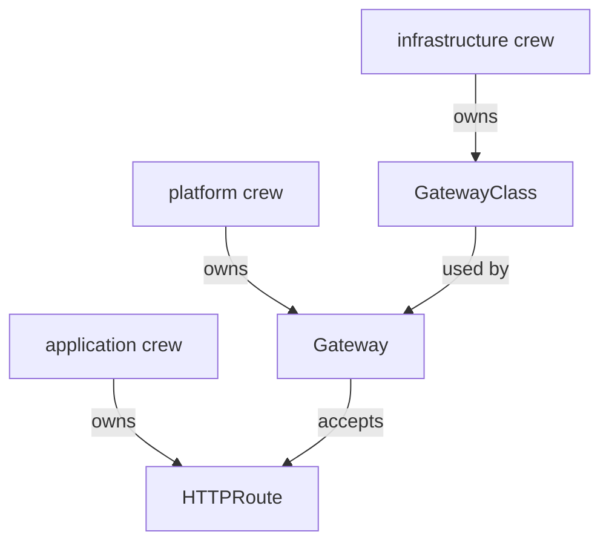

# Three Objects, Three Owners

Astronaut, before you build a gate into your solar system, meet the parts it is made of. The Gateway API uses three objects where older ways used one. That split is on purpose: each object belongs to a different crew, and once you know who owns what, the rest of the API is easy to predict.

## The Gateway API is not part of Kubernetes

The Gateway API objects do not come with a fresh Kubernetes cluster, and Istio does not install them either. They ship as **custom resource definitions** (CRDs). A CRD teaches Kubernetes a new kind of object, like adding a new page to the mission control manual. Until someone installs them, Kubernetes has never heard of a `Gateway` or an `HTTPRoute`.

Your playground installed them for you. On a cluster without them, applying a Gateway API `Gateway` fails like this:

```text
error: resource mapping not found for name: "starfleet-gateway" namespace: "starfleet" from "gateway-starfleet.yaml": no matches for kind "Gateway" in version "gateway.networking.k8s.io/v1"
ensure CRDs are installed first
```

This looks like an Istio problem, but it is not one. Kubernetes itself rejects the object, because the kind is missing from its manual. The fix is to install the Gateway API CRDs, in a version that your Istio release supports.

The same file can also fail with `the server could not find the requested resource`, if `kubectl` still remembers the CRDs from earlier. Both messages mean the same thing.

## The three objects

Each Gateway API object answers one question. Think of building a spaceport: first you pick a spaceport model, then you build one spaceport of that model, then you write the flight plans for the signals that land there.

| Object | Scope | What it decides | Space picture |
| --- | --- | --- | --- |
| `GatewayClass` | the whole cluster | which software builds and runs the gates | the spaceport model |
| `Gateway` | one namespace | the doors: port, protocol, host name, and who may use them | one spaceport |
| `HTTPRoute` | one namespace | which signals go to which Service | the flight plan |

There are other route kinds too, such as `GRPCRoute` for gRPC traffic. `HTTPRoute` is the one you use for web traffic, and the one this module uses.

## Why three, and not one

The split follows the crews that run a real platform. Each crew owns one object and nothing else:



The diagram shows one chain with three owners: a `Gateway` uses a `GatewayClass`, and an `HTTPRoute` attaches to a `Gateway`.

For example, the infrastructure crew installs Istio, which brings the `istio` class. The platform crew builds a `Gateway` that listens on port 80 for `starfleet.example.com`. The application crew writes an `HTTPRoute` that sends `/productpage` to the `bridge` Service. Kubernetes permissions can now give the application crew the right to write `HTTPRoute` objects in their own namespace, and nothing else.

Because the crews are different, the `Gateway` owner needs a way to say who may use the gate. That is the `allowedRoutes` field, and it is closed by default: only routes from the `Gateway`'s own namespace may attach.

## What Istio adds

When Istio starts on a cluster that has the Gateway API CRDs, it registers its own `GatewayClass` objects. Mission control (`istiod`) then watches for every `Gateway` that names one of them.

<!-- astrona:playground:renew -->

### See what the CRDs brought

List the Gateway API object kinds the cluster now knows, and the classes Istio registered:

```sh
kubectl get crd | grep gateway.networking.k8s.io
kubectl get gatewayclass
```

You should see (dates shortened to what your cluster shows):

```text
gatewayclasses.gateway.networking.k8s.io    Cluster      v1(storage),v1beta1            2026-10-08T22:24:15Z
gateways.gateway.networking.k8s.io          Namespaced   v1(storage),v1beta1            2026-10-08T22:24:15Z
grpcroutes.gateway.networking.k8s.io        Namespaced   v1(storage)                    2026-10-08T22:24:15Z
httproutes.gateway.networking.k8s.io        Namespaced   v1(storage),v1beta1            2026-10-08T22:24:15Z
referencegrants.gateway.networking.k8s.io   Namespaced   v1beta1(storage)               2026-10-08T22:24:16Z
NAME           CONTROLLER                    ACCEPTED   AGE
istio          istio.io/gateway-controller   True       6m36s
istio-remote   istio.io/unmanaged-gateway    True       6m36s
```

The five CRDs are the Gateway API's standard set. `GatewayClass` is the only one with scope `Cluster`; the others live inside a namespace. Istio registered two classes. `istio` is the one you use: its controller `istio.io/gateway-controller` builds a real gate for every `Gateway` that names it. `istio-remote` is for gates that run somewhere else, and you can ignore it here.

### Check that nothing is built yet

Look for any `Gateway` or `HTTPRoute`, and for any gateway proxy next to mission control:

```sh
kubectl get gateway,httproute -A
kubectl get deploy -n istio-system
```

You should see:

```text
No resources found
NAME     READY   UP-TO-DATE   AVAILABLE   AGE
istiod   1/1     1            1           8m20s
```

There is no gate yet. The `istio-system` namespace holds only `istiod`, and no ingress gateway runs anywhere. With the Gateway API, the gate's proxy appears only when you create a `Gateway`.

## Two `Gateway` kinds, one name

Istio has an older object that is also called `Gateway`. It has the same kind name, but it lives in a different API group and works in a different way. Examples online mix the two all the time, so learn to tell them apart now:

| | Istio's `Gateway` | Gateway API `Gateway` |
| --- | --- | --- |
| `apiVersion` | `networking.istio.io/v1` | `gateway.networking.k8s.io/v1` |
| Finds its proxy by | `spec.selector` (pod labels) | `spec.gatewayClassName` |
| Effect | configures a proxy that **already runs** | **creates** a new proxy Deployment and Service |
| Where the proxy runs | wherever the selected pods are, often `istio-system` | in the `Gateway`'s own namespace |
| Routes attach with | `VirtualService.spec.gateways` | `HTTPRoute.spec.parentRefs` |
| Routes from other namespaces | allowed | refused unless `allowedRoutes` allows them |

Always read the `apiVersion` first. If it says `networking.istio.io`, the example is about Istio's own `Gateway`, and nothing in this module applies to it.

## Common pitfalls

> [!WARNING]
> - **Reading `no matches for kind "Gateway"` as an Istio problem.** Kubernetes is telling you the Gateway API CRDs are not installed. They ship apart from Istio.
> - **Mixing up the two `Gateway` kinds.** Same name, different API group, different behaviour. Check the `apiVersion`.
> - **Installing any CRD version.** The Gateway API version must be one your Istio release supports.
> - **Expecting `GatewayClass` inside a namespace.** It is cluster-wide. `Gateway` and `HTTPRoute` live in a namespace.

> *The Gateway API is three objects with three owners, and its `Gateway` shares only a name with Istio's own.*
