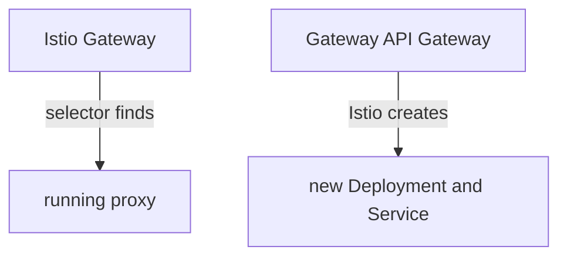

# A Gateway That Creates Its Own Data Plane

Astronaut, with Istio's own `Gateway` object, the gate's proxy already runs, and the object only gives it orders. A Gateway API `Gateway` works the other way round: the object comes first, and Istio builds a brand new proxy for it. In this part you create one and watch the spaceport appear.

## Creating versus configuring

The two `Gateway` kinds point in opposite directions. Istio's own `Gateway` finds a proxy that is already running and configures it. A Gateway API `Gateway` makes Istio create the proxy.



The diagram shows the difference: on the left the proxy exists first, on the right the object comes first and the proxy follows it.

This is called **automated deployment**, and it is how Istio works by default. The proxy Istio builds is called the gate's **data plane**: the part that carries the real signals. It runs in the `Gateway`'s own namespace, with the name `<gateway name>-istio`. So there is no `selector` field, and you will not find this proxy in `istio-system`. Its life is tied to the object: delete the `Gateway`, and the proxy goes too.

## The object

A `Gateway` lists one or more **listeners**. A listener is one door of the spaceport: a port, a protocol, an optional host name, and a rule for which routes may use it.

<!-- astrona:playground:renew -->

### Create a Gateway

Create a gate on port 80 for the host name `starfleet.example.com`. Save this as `gateway-starfleet.yaml`:

```yaml
apiVersion: gateway.networking.k8s.io/v1
kind: Gateway
metadata:
  name: starfleet-gateway
  namespace: starfleet
  annotations:
    networking.istio.io/service-type: ClusterIP
spec:
  gatewayClassName: istio
  listeners:
  - name: http
    port: 80
    protocol: HTTP
    hostname: starfleet.example.com
    allowedRoutes:
      namespaces:
        from: Same
```

Each field has one job:

- `gatewayClassName: istio` hands the gate to Istio. This is the only link to Istio in the whole object.
- `listeners` lists the doors. Each listener has a `name`, so a route can later pick one door by name.
- `hostname` is a single name per listener. For more names, add more listeners or use a wildcard such as `*.example.com`.
- `allowedRoutes` says which namespaces may attach routes. `Same` means only this `Gateway`'s own namespace.
- The `networking.istio.io/service-type: ClusterIP` annotation is for your `kind` cluster. By default Istio creates a `LoadBalancer` Service, and `kind` has no load balancer, so the Service would never get an address.

Apply it:

```sh
kubectl apply -f gateway-starfleet.yaml
```

Then wait until the gate is built and its proxy runs, and look at it:

```sh
kubectl wait -n starfleet --for=condition=Programmed gateway/starfleet-gateway --timeout=120s
kubectl rollout status deploy/starfleet-gateway-istio -n starfleet --timeout=120s
kubectl get gateway -n starfleet
```

You should see:

```text
gateway.gateway.networking.k8s.io/starfleet-gateway condition met
Waiting for deployment "starfleet-gateway-istio" rollout to finish: 0 of 1 updated replicas are available...
deployment "starfleet-gateway-istio" successfully rolled out
NAME                CLASS   ADDRESS                                               PROGRAMMED   AGE
starfleet-gateway   istio   starfleet-gateway-istio.starfleet.svc.cluster.local   True         2s
```

`PROGRAMMED` is `True`: Istio has built the gate, and it has an address. The `ADDRESS` is the name of a Service that you did not write. The second command waits for a Deployment you did not write either, `starfleet-gateway-istio`. `PROGRAMMED` turns `True` before that proxy pod is ready, which is why you wait for both.

### Find the proxy Istio built

Every object Istio created for the gate carries the label `gateway.networking.k8s.io/gateway-name`. List them:

```sh
kubectl get deploy,svc,pod -n starfleet -l gateway.networking.k8s.io/gateway-name=starfleet-gateway
kubectl get deploy -n istio-system
```

You should see:

```text
NAME                                      READY   UP-TO-DATE   AVAILABLE   AGE
deployment.apps/starfleet-gateway-istio   1/1     1            1           2s

NAME                              TYPE        CLUSTER-IP     EXTERNAL-IP   PORT(S)            AGE
service/starfleet-gateway-istio   ClusterIP   10.96.162.74   <none>        15021/TCP,80/TCP   2s

NAME                                          READY   STATUS    RESTARTS   AGE
pod/starfleet-gateway-istio-cc6f7bf56-4jm7d   1/1     Running   0          2s
NAME     READY   UP-TO-DATE   AVAILABLE   AGE
istiod   1/1     1            1           14m
```

You wrote one object, and Istio created a Deployment, a Service and a pod named `starfleet-gateway-istio`, on the `starfleet` planet. The pod shows `1/1`: it is a proxy on its own, with no app beside it. Port `80` is the listener you asked for; port `15021` is the proxy's health check. Nothing new appeared in `istio-system`.

## The status lights on a Gateway

Every `Gateway` reports its state as **conditions**, like status lights on a launch panel. Two of them matter most:

| Condition | `True` means | `False` usually means |
| --- | --- | --- |
| `Accepted` | the object is valid, and Istio has taken it on | a wrong `gatewayClassName`, or a listener Istio cannot build |
| `Programmed` | Istio built the gate, and its Service has an address | the Service has no address yet, or cannot get one |

`Accepted=True` with `Programmed=False` is a clear message: your YAML is fine, but the gate is not ready yet. Right after you create a `Gateway`, you see exactly that for a few seconds, with the reason `AddressNotAssigned`, until the Service exists.

### Send a first signal

Your gate is open, but no flight plan uses it yet. Send a signal from the shuttle to the gate's Service, with the host name the listener expects, and read the gate's flight log:

```sh
kubectl exec -n starfleet deploy/shuttle -- curl -s -o /dev/null -w "%{http_code}\n" \
  -H "Host: starfleet.example.com" http://starfleet-gateway-istio.starfleet/productpage
kubectl logs -n starfleet deploy/starfleet-gateway-istio --tail=1
```

You should see (log line trimmed):

```text
404
[2026-10-08T22:36:50.518Z] "GET /productpage HTTP/1.1" 404 NR route_not_found - "-" 0 0 0 - "10.244.0.12" "curl/8.11.1" ...
```

If you get `503` instead, and the log line is not a signal, the gate's proxy is still waiting for its first orders from mission control. Wait a few seconds and send the signal again.

The gate's proxy answered `404` by itself. The flag `NR` means "no route": the door is open, but no `HTTPRoute` tells the proxy where to send the signal. The `Host` header matters, because the listener only takes signals for `starfleet.example.com`. The gate reads the host name from the signal, not from a name lookup.

### Delete the Gateway, lose the proxy

The proxy lives and dies with the `Gateway` object. Delete it and look again:

```sh
kubectl delete -f gateway-starfleet.yaml
kubectl get deploy,svc -n starfleet -l gateway.networking.k8s.io/gateway-name=starfleet-gateway
```

You should see:

```text
gateway.gateway.networking.k8s.io "starfleet-gateway" deleted from starfleet namespace
No resources found in starfleet namespace.
```

The Deployment and the Service are gone with the object. Istio's own `Gateway` works differently: deleting it leaves the proxy running, just without orders.

Wait about half a minute, then build the gate again, so it is ready for the next steps:

```sh
kubectl apply -f gateway-starfleet.yaml
kubectl wait -n starfleet --for=condition=Programmed gateway/starfleet-gateway --timeout=120s
kubectl rollout status deploy/starfleet-gateway-istio -n starfleet --timeout=120s
```

If you apply it again within a few seconds, mission control may still remember the old gate. The `Gateway` then stays at `Programmed=False` with `AddressNotAssigned`, even though the new proxy runs. Delete it, wait half a minute, and apply it again.

## Common pitfalls

> [!WARNING]
> - **Looking for the proxy in `istio-system`.** A Gateway API gate runs in the `Gateway`'s own namespace, named `<gateway name>-istio`.
> - **Looking for a `selector` field.** There is none. `gatewayClassName` ties the object to Istio.
> - **Leaving out the service type annotation on `kind`.** Without a load balancer, the Service gets no address, and the `Gateway` stays `Programmed=False`.
> - **Sending signals without the right `Host` header.** The listener only takes the host name it names. Any other host gets `404`.
> - **Forgetting that the proxy belongs to the object.** Delete the `Gateway`, and the Deployment and Service go with it.

> *A Gateway API `Gateway` builds its own proxy in its own namespace, and its status lights tell you when that proxy is ready.*

## Your mission: Open The Spaceport Gate Lab

You can now create a Gateway API `Gateway` and check that Istio built its proxy. Now prove it in a graded mission: a flight plan for the bridge is waiting for a gate that does not exist yet, and you have to build that gate.

The mission runs in its own training solar system, so first pause your playground. Nothing in it is lost:

```sh
astrona stop ats-014-playground-060-03
```

Then start the mission:

```sh
astrona run --git git@github.com:astrona-io/ATS014.git -c sections/section-060/module-03/labs/lab-02
```

Read the task in [`question.md`](./labs/lab-02/question.md) and solve it on your own first. When you think you are done, send it for grading:

```sh
astrona submit -c sections/section-060/module-03/labs/lab-02
```

When the mission is done, remove it and wake your playground up again:

```sh
astrona destroy ats-014-lab-060-03-02
astrona start ats-014-playground-060-03
```
