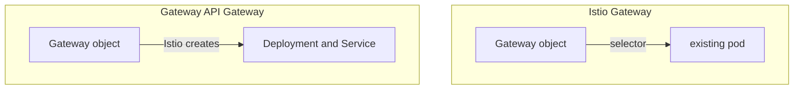

# A Gateway That Creates Its Own Data Plane

The single biggest behavioural difference from module 1, and the permission model that follows from the three-owner split.

## Creating versus configuring



In the Gateway API, a `Gateway` with `gatewayClassName: istio` makes Istio create a Deployment and Service in the `Gateway`'s namespace. The arrows point in opposite directions. In the Istio API the pod comes first and the object points at it, like writing orders for a spaceport that is already built. In the Gateway API the object comes first and the pod is a consequence of it: the order itself builds the spaceport.

So there is **no `selector` field**, and looking for your proxy in `istio-system` will not find it. The proxy's lifecycle is tied to the object: delete the `Gateway` and the Deployment goes with it.

This is called **automated deployment**, and it is the default. Istio also supports a manual mode where you deploy the proxy yourself and label it for the `Gateway` to adopt — useful when you need control over the pod spec, and worth knowing exists rather than reaching for.

## The object

```yaml
apiVersion: gateway.networking.k8s.io/v1
kind: Gateway
metadata:
  name: booking-gateway
  namespace: gwapi-demo
  annotations:
    # kind has no load balancer: without this the Gateway's Service sits at
    # EXTERNAL-IP <pending> and the Gateway reports Programmed=False.
    networking.istio.io/service-type: ClusterIP
spec:
  gatewayClassName: istio
  listeners:
    - name: http
      port: 80
      protocol: HTTP
      hostname: booking.ica.local
      allowedRoutes:
        namespaces:
          from: Same
```

Differences from module 1's object beyond the missing selector:

- **`listeners` rather than `servers`**, and each listener has a **`name`** — which `HTTPRoute` can target with `sectionName` to attach to one listener specifically.
- **`hostname` is singular**, one per listener. Where Istio's `Gateway` took a list of hosts on one server, here you write several listeners or use a wildcard.
- **`allowedRoutes`** has no Istio equivalent at all.

> [!TIP]
> **Try it — create a Gateway and watch a data plane appear**
>
> ```sh
> kubectl apply -f - <<'EOF'
> apiVersion: gateway.networking.k8s.io/v1
> kind: Gateway
> metadata:
>   name: booking-gateway
>   namespace: gwapi-demo
> spec:
>   gatewayClassName: istio
>   listeners:
>     - name: http
>       port: 80
>       protocol: HTTP
>       hostname: booking.ica.local
>       allowedRoutes:
>         namespaces:
>           from: Same
> EOF
> kubectl -n gwapi-demo rollout status deployment booking-gateway-istio --timeout=120s
> kubectl -n gwapi-demo get deploy,svc -l gateway.networking.k8s.io/gateway-name=booking-gateway
> kubectl -n istio-system get deploy | grep booking || echo "(nothing named booking in istio-system - correct)"
> ```
>
> Expect something like:
>
> ```text
> gateway.networking.k8s.io/booking-gateway created
> deployment "booking-gateway-istio" successfully rolled out
> NAME                                    READY   AGE
> deployment.apps/booking-gateway-istio   1/1     25s
> NAME                            TYPE           PORT(S)        AGE
> service/booking-gateway-istio   LoadBalancer   80:31380/TCP   25s
> (nothing named booking in istio-system - correct)
> ```
>
> You created one object and Istio created a Deployment and a Service, labelled `gateway.networking.k8s.io/gateway-name`, **in `gwapi-demo`**. On `kind` the Service's external IP stays `<pending>` as usual — so port-forward to `booking-gateway-istio`, not to `istio-ingressgateway`.

The lifecycle coupling is worth confirming once, because it is unlike anything else in this course:

> [!TIP]
> **Try it — delete the Gateway, lose the proxy**
>
> ```sh
> kubectl -n gwapi-demo delete gateway booking-gateway
> sleep 5
> kubectl -n gwapi-demo get deploy,svc -l gateway.networking.k8s.io/gateway-name=booking-gateway
> ```
>
> Expect something like:
>
> ```text
> gateway.networking.k8s.io "booking-gateway" deleted
> No resources found in gwapi-demo namespace.
> ```
>
> The Deployment and Service are gone with it. Re-create the `Gateway` from the previous checkpoint before continuing — and note that with module 1's object, deleting the `Gateway` would have left `istio-ingressgateway` running and simply unconfigured.

## `allowedRoutes` — deny by default

Because the `Gateway` and the `HTTPRoute` can belong to different teams, the Gateway's owner has to say who may dock. Think of it as a spaceport that only lets ships from approved planets land:

| `allowedRoutes.namespaces.from` | Routes may attach from |
| --- | --- |
| `Same` | the Gateway's own namespace only — **the default** |
| `All` | any namespace |
| `Selector` | namespaces matching a label selector you supply |

Compare with the older APIs, where a route in any namespace could attach to a shared gateway by convention and nothing prevented it. Here the default is closed, and a route that is not permitted simply does not attach — reporting why in its own status, which Part 3 covers.

`allowedRoutes` also has a `kinds` field to restrict which route kinds may attach, so a listener can accept `HTTPRoute` and refuse `TCPRoute`.

The selector form is the interesting one in practice:

```yaml
allowedRoutes:
  namespaces:
    from: Selector
    selector:
      matchLabels:
        gateway-access: "true"
```

Label a namespace `gateway-access=true` and its teams can attach; unlabel it and they cannot. That is a platform-team control expressed in Kubernetes-native terms rather than in RBAC on a shared object.

> *A Gateway API `Gateway` creates its own proxy in its own namespace, and `allowedRoutes` decides who may attach — closed by default.*

## Common pitfalls

> [!WARNING]
> **Looking for the proxy in `istio-system`.** A Gateway API gateway creates its Deployment in the `Gateway`'s own namespace, named `<gateway-name>-istio`.
>
> **Looking for a `selector` field.** There is none. `gatewayClassName` is what ties the object to an implementation.
>
> **Forgetting the proxy's lifecycle is tied to the object.** Delete the `Gateway` and the Deployment and Service go with it.
>
> **Assuming routes may attach from anywhere.** `allowedRoutes` decides, and the default is the Gateway's own namespace only.
