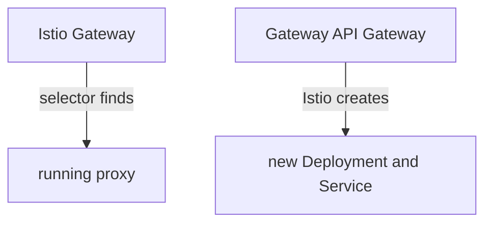

# A Gateway That Creates Its Own Data Plane

With Istio's own `Gateway` object, the gateway proxy already runs, and the object only configures it. A Gateway API `Gateway` works the other way round: you create the object first, and Istio then deploys a new proxy for it. This part shows that process, where the new proxy runs, and how the `Gateway` reports that it is ready.

## Creating a proxy versus configuring one

The two `Gateway` kinds point in opposite directions. Istio's own `Gateway` uses a label selector to find a proxy that already runs, and configures it. A Gateway API `Gateway` makes Istio create the proxy.



The diagram shows the difference: on the left the proxy exists first, and on the right the object comes first and the proxy follows it.

Istio calls this **automated deployment**, and it is the default. The proxy that Istio deploys is the gateway's **data plane**: the part that carries the real requests. It runs in the `Gateway`'s own namespace, with the name `<gateway name>-istio`. So a Gateway API `Gateway` has no `selector` field, and its proxy is not in `istio-system`. The proxy also has the same life as the object: when you delete the `Gateway`, Istio deletes the proxy.

## The Gateway object

A `Gateway` lists one or more listeners. Each listener opens one port for one protocol, can name one host name, and has a rule for which routes may attach to it. The example below opens port 80 for the host name `starfleet.example.com`.

<!-- astrona:playground:renew -->

Save this as `gateway-starfleet.yaml`:

```yaml
apiVersion: gateway.networking.k8s.io/v1
kind: Gateway
metadata:
  name: starfleet-gateway
  namespace: starfleet
  annotations:
    networking.istio.io/service-type: ClusterIP
spec:
  gatewayClassName: istio
  listeners:
  - name: http
    port: 80
    protocol: HTTP
    hostname: starfleet.example.com
    allowedRoutes:
      namespaces:
        from: Same
```

Each field has one job:

- `gatewayClassName: istio` hands the `Gateway` to Istio's controller. This is the only link to Istio in the whole object.
- `listeners` lists the open ports. Each listener has a `name`, so a route can later pick one listener by name.
- `hostname` takes a single host name per listener. For more names, add more listeners or use a wildcard such as `*.example.com`.
- `allowedRoutes` says which namespaces may attach routes. `Same` means only the `Gateway`'s own namespace.
- The `networking.istio.io/service-type: ClusterIP` annotation is for your `kind` cluster. By default Istio creates a Service of type `LoadBalancer`. `kind` has no load balancer, so that Service would never get an address.

Apply it:

```sh
kubectl apply -f gateway-starfleet.yaml
```

Then check the result. Wait until Istio has built the gateway and its proxy runs, and then list the `Gateway`:

```sh
kubectl wait -n starfleet --for=condition=Programmed gateway/starfleet-gateway --timeout=120s
kubectl rollout status deploy/starfleet-gateway-istio -n starfleet --timeout=120s
kubectl get gateway -n starfleet
```

You should see:

```text
gateway.gateway.networking.k8s.io/starfleet-gateway condition met
Waiting for deployment "starfleet-gateway-istio" rollout to finish: 0 of 1 updated replicas are available...
deployment "starfleet-gateway-istio" successfully rolled out
NAME                CLASS   ADDRESS                                               PROGRAMMED   AGE
starfleet-gateway   istio   starfleet-gateway-istio.starfleet.svc.cluster.local   True         2s
```

`PROGRAMMED` is `True`: Istio has built the gateway, and the gateway has an address. The `ADDRESS` is the name of a Service that you did not write. The second command waits for a Deployment that you did not write either, `starfleet-gateway-istio`. `PROGRAMMED` turns `True` before the proxy pod is ready, so you wait for both.

## Find the proxy Istio deployed

Istio puts the label `gateway.networking.k8s.io/gateway-name` on every object it creates for a `Gateway`. That label lets you list the Deployment, the Service and the pod in one command. The second command checks `istio-system` for comparison:

```sh
kubectl get deploy,svc,pod -n starfleet -l gateway.networking.k8s.io/gateway-name=starfleet-gateway
kubectl get deploy -n istio-system
```

You should see:

```text
NAME                                      READY   UP-TO-DATE   AVAILABLE   AGE
deployment.apps/starfleet-gateway-istio   1/1     1            1           2s

NAME                              TYPE        CLUSTER-IP     EXTERNAL-IP   PORT(S)            AGE
service/starfleet-gateway-istio   ClusterIP   10.96.162.74   <none>        15021/TCP,80/TCP   2s

NAME                                          READY   STATUS    RESTARTS   AGE
pod/starfleet-gateway-istio-cc6f7bf56-4jm7d   1/1     Running   0          2s
NAME     READY   UP-TO-DATE   AVAILABLE   AGE
istiod   1/1     1            1           14m
```

You wrote one object, and Istio created a Deployment, a Service and a pod named `starfleet-gateway-istio` in the `starfleet` namespace. The pod shows `1/1`: it is an Envoy proxy on its own, with no application container beside it. Port `80` is the listener you asked for, and port `15021` is the proxy's health check port. Nothing new appeared in `istio-system`.

## The status conditions of a Gateway

A Gateway API object reports its state in `status.conditions`. A **condition** is a named entry with a status of `True`, `False` or `Unknown`, a short reason and a message. Two conditions of a `Gateway` matter most:

| Condition | `True` means | `False` usually means |
| --- | --- | --- |
| `Accepted` | the object is valid, and Istio's controller has taken it | a wrong `gatewayClassName`, or a listener Istio cannot build |
| `Programmed` | Istio built the gateway, and its Service has an address | the Service has no address yet, or cannot get one |

`Accepted=True` with `Programmed=False` tells you that your YAML is fine, but the gateway is not ready yet. Right after you create a `Gateway`, you see exactly that for a few seconds, with the reason `AddressNotAssigned`, until the Service exists.

The gateway is ready, but no `HTTPRoute` uses it yet. Send a request from the `shuttle` pod to the gateway's Service, with the host name the listener expects. Then read the last line of the gateway proxy's access log, the one line Envoy writes for each request it handles:

```sh
kubectl exec -n starfleet deploy/shuttle -- curl -s -o /dev/null -w "%{http_code}\n" \
  -H "Host: starfleet.example.com" http://starfleet-gateway-istio.starfleet/productpage
kubectl logs -n starfleet deploy/starfleet-gateway-istio --tail=1
```

You should see this (the log line is shortened):

```text
404
[2026-10-08T22:36:50.518Z] "GET /productpage HTTP/1.1" 404 NR route_not_found - "-" 0 0 0 - "10.244.0.12" "curl/8.11.1" ...
```

The gateway proxy answered `404` by itself. The response flag `NR` means "no route": the listener accepted the request, but no `HTTPRoute` tells the proxy where to send it. The `Host` header matters, because the listener only accepts requests for `starfleet.example.com`. The proxy reads the host name from the request, not from a DNS lookup. If you get `503` and no matching log line, the new proxy has not received its first configuration from `istiod` yet; wait a few seconds and send the request again.

## Delete the Gateway, lose the proxy

The proxy has the same life as the `Gateway` object. Delete the object, and look for the proxy again:

```sh
kubectl delete -f gateway-starfleet.yaml
kubectl get deploy,svc -n starfleet -l gateway.networking.k8s.io/gateway-name=starfleet-gateway
```

You should see:

```text
gateway.gateway.networking.k8s.io "starfleet-gateway" deleted from starfleet namespace
No resources found in starfleet namespace.
```

Istio removed the Deployment and the Service together with the object. Istio's own `Gateway` works differently: when you delete it, the proxy keeps running, just without that configuration.

Wait about half a minute, then create the `Gateway` again, so it is ready for the next steps:

```sh
kubectl apply -f gateway-starfleet.yaml
kubectl wait -n starfleet --for=condition=Programmed gateway/starfleet-gateway --timeout=120s
kubectl rollout status deploy/starfleet-gateway-istio -n starfleet --timeout=120s
```

If you apply it again within a few seconds, `istiod` may still hold the old gateway in its state. The `Gateway` then stays at `Programmed=False` with `AddressNotAssigned`, even though the new proxy runs. Delete it, wait half a minute, and apply it again.

You can now create a Gateway API `Gateway`, find the proxy that Istio deploys for it, and read its `Accepted` and `Programmed` conditions. You have also seen that a gateway with no route answers `404 NR`. The open question is how to write the `HTTPRoute` that sends those requests to a Service.

## Common pitfalls

> [!WARNING]
> - **Looking for the proxy in `istio-system`.** A Gateway API gateway runs in the `Gateway`'s own namespace, with the name `<gateway name>-istio`.
> - **Looking for a `selector` field.** There is none. `gatewayClassName` ties the object to Istio.
> - **Leaving out the service type annotation on `kind`.** Without a load balancer, the Service gets no address, and the `Gateway` stays `Programmed=False`.
> - **Sending requests without the right `Host` header.** The listener only accepts the host name it names. Any other host gets `404`.
> - **Forgetting that the proxy belongs to the object.** Delete the `Gateway`, and Istio deletes its Deployment and Service too.

## Your mission: Create A Gateway API Gateway For A Waiting HTTPRoute Lab

You can now create a Gateway API `Gateway` and check that Istio deployed its proxy. The mission gives you an `HTTPRoute` for the `bridge` Service that names a `Gateway` that does not exist yet, and asks you to create that `Gateway`.

The lab runs on its own cluster, so first pause your playground. Nothing in it is lost:

```sh
astrona stop ats-014-playground-060-03
```

Then start the lab. The task is on the next page; solve it on your own first:

```sh
astrona run --git git@github.com:astrona-io/ATS014.git -c sections/section-060/module-03/labs/lab-02
```

When you think you are done, send it for grading:

```sh
astrona submit -c sections/section-060/module-03/labs/lab-02
```

When the lab is done, remove it and start your playground again:

```sh
astrona destroy ats-014-lab-060-03-02
astrona start ats-014-playground-060-03
```
