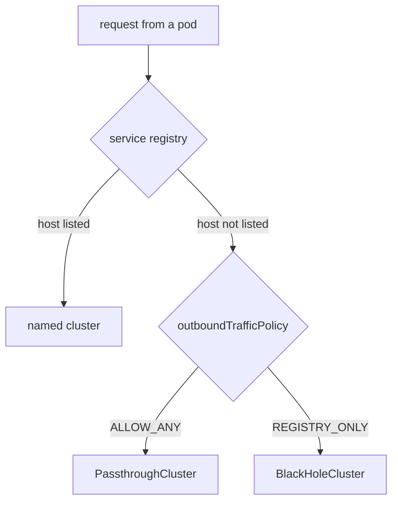

# Block Unknown Hosts With REGISTRY_ONLY

Before you write a `ServiceEntry`, you need to know one setting: the outbound traffic policy. It decides what the sidecar proxy does with a request to a host that Istio has never heard of. That decides what a `ServiceEntry` is for. Under one policy it only adds features to a host; under the other it is the only way for a request to leave at all.

## The service registry, and hosts outside it

Every sidecar proxy (Envoy) gets a list of known hosts from `istiod`, Istio's control plane. This list comes from the **service registry**, the set of hosts and endpoints that `istiod` knows about. It holds:

- every Kubernetes Service the proxy may see;
- every `ServiceEntry` the proxy may see (a `ServiceEntry` adds a host outside the mesh to the registry);
- every `WorkloadEntry` (one machine outside Kubernetes) that a `ServiceEntry` selects.

When a pod sends a request to a host that is **not** in the registry, the **outbound traffic policy** decides what the pod's sidecar proxy does with it:



The diagram shows the two decisions the sidecar proxy makes for every outbound request: first whether the host is in the registry, then what the policy says about a host that is not.

A host in the registry gets a named Envoy **cluster**, such as `outbound|443||httpbin.org`. A cluster is Envoy's name for a destination and its list of endpoints, and Istio's rules attach to it. With `ALLOW_ANY` (the default) the proxy lets every other host through with no rules. With `REGISTRY_ONLY` it refuses every other host. The sidecar proxy's **access log**, one line per request or connection, names the cluster each request went to. Reading that name is the fastest way to know which path a request took.

## The default: `ALLOW_ANY`

After a normal install, the sidecar proxy passes traffic for unknown hosts straight through. It does not route it, time it out or check it. Istio chose this default on purpose: a mesh that blocked every outbound request on day one would break most applications. The cost is that the mesh cannot see or control where your workloads send data.

You can see this in your playground. If your terminal does not have the `call_external` helper yet, paste it first. It sends one request from the `shuttle` pod and prints the status code, the time and the exit code of `curl`:

<!-- astrona:playground:renew -->

```sh
call_external() { kubectl exec -n starfleet deploy/shuttle -- curl -s -o /dev/null -w "%{http_code} %{time_total}s\n" --max-time 10 "$@"; echo "  exit=$?"; }
```

Now call `httpbin.org`, a public test API on the internet, and read the last line of the `shuttle` pod's access log:

```sh
call_external https://httpbin.org/get
kubectl logs -n starfleet deploy/shuttle -c istio-proxy --tail=1
```

You should see (log line shortened):

```text
200 0.640065s
  exit=0
[...] "- - -" 0 - - - "-" 901 4875 689 - "-" "-" "-" "-" "34.227.237.26:443" PassthroughCluster ...
```

The request got out with `200`. The access log names **`PassthroughCluster`**: the proxy did not know this host and let it through. The line shows only an address and byte counts, because the proxy cannot read encrypted HTTPS traffic. Istio has no rules for this host, and any pod in the mesh could reach any host on the internet the same way.

## `REGISTRY_ONLY`: refuse every unknown host

The other mode, `REGISTRY_ONLY`, refuses every destination that is not in the service registry. Pods may then only reach hosts that the registry lists. You can set it in two places.

**For the whole mesh**, the setting is part of the mesh configuration, `meshConfig.outboundTrafficPolicy.mode`, and you set it when you install the control plane. With `istioctl`:

```sh
istioctl install --set profile=demo \
  --set meshConfig.outboundTrafficPolicy.mode=REGISTRY_ONLY -y
```

With Helm, as in your playground, it is a value on the `istiod` chart:

```sh
helm upgrade istiod istiod --repo https://istio-release.storage.googleapis.com/charts \
  --version 1.30.5 -n istio-system --reuse-values \
  --set meshConfig.outboundTrafficPolicy.mode=REGISTRY_ONLY --wait
```

Both commands update the existing control plane; they do not create a second one. Do not run them now, because the playground uses the second place instead.

**For one namespace**, a `Sidecar` resource carries its own `outboundTrafficPolicy`. A `Sidecar` resource limits which hosts the sidecar proxies of one namespace get configuration for. Without a `workloadSelector`, it applies to every pod in its namespace. This is the practical way to start: block one namespace at a time, where you know its outside dependencies, without breaking other teams.

Switching to `REGISTRY_ONLY` does not break traffic inside the cluster, because every Service is already in the registry. It breaks only the outbound calls that nobody declared. To see this, block the `starfleet` namespace. Save this as `sidecar-registry-only.yaml`:

```yaml
apiVersion: networking.istio.io/v1
kind: Sidecar
metadata:
  name: default
  namespace: starfleet
spec:
  outboundTrafficPolicy:
    mode: REGISTRY_ONLY
  egress:
  - hosts:
    - "./*"
    - "istio-system/*"
```

The `egress.hosts` list says which namespaces the proxies take configuration from: `./*` takes in everything from the `Sidecar`'s own namespace, and `istio-system/*` everything from `istio-system`.

Apply it:

```sh
kubectl apply -f sidecar-registry-only.yaml
```

Then call the same host on the internet, and the `probe` Service inside the cluster, and read the access log:

```sh
call_external https://httpbin.org/get
call_external http://probe:8000/get
kubectl logs -n starfleet deploy/shuttle -c istio-proxy --tail=2
```

You should see (log lines shortened):

```text
000 0.022789s
command terminated with exit code 35
  exit=35
200 0.015859s
  exit=0
[...] "- - -" 0 UH - - "-" 0 0 1 - "-" "-" "-" "-" "-" BlackHoleCluster - 98.88.155.171:443 ...
[...] "GET /get HTTP/1.1" 200 - via_upstream ... outbound|8000||probe.starfleet.svc.cluster.local ...
```

The call to `httpbin.org` failed with `000` and exit code `35`: the proxy closed the connection before any response. The access log names **`BlackHoleCluster`** with the response flag `UH` (no healthy upstream). The call to the `probe` Service still returned `200`, through its own named cluster. Nothing about the pod or the network changed, only the policy. Keep this `Sidecar` applied: every step from here on assumes the namespace is blocked.

## How a refusal looks

A refused request does not come back with a message that names the policy. What you see depends on whether the sidecar proxy can read the request:

- **HTTPS (or any TLS)** to an unknown host: TLS (Transport Layer Security) is the encryption under HTTPS, so the proxy sees only encrypted bytes and closes the connection. `curl` shows `000` with exit code `35` or `56`. The access log says `BlackHoleCluster`.
- **Plain HTTP** to an unknown host, on a port where the proxy has **no** HTTP listener: the same closed connection, `000`. The access log says `BlackHoleCluster`.
- **Plain HTTP** on a port where the proxy **has** an HTTP listener, because some known host uses that port: the proxy reads the request and answers **`502`** itself. The access log names the route **`block_all`** instead of `BlackHoleCluster`.

A **listener** is the part of Envoy that accepts connections on one port. You can see the second case now, because no known host uses port `80` yet:

```sh
call_external http://httpbin.org/get
kubectl logs -n starfleet deploy/shuttle -c istio-proxy --tail=1
```

You should see (log line shortened):

```text
000 0.008687s
command terminated with exit code 56
  exit=56
[...] "- - -" 0 UH - - "-" 0 0 0 - "-" "-" "-" "-" "-" BlackHoleCluster - 32.194.118.12:80 ...
```

The proxy has no HTTP listener on port `80`, so it closes the connection. Once a known host has an HTTP port `80`, the same call to an unknown host returns `502` with `block_all`.

These signatures matter more than the YAML, because other failures look similar and mean something else. DNS, the Domain Name System, turns host names into addresses; a DNS or network failure can also give `000`:

| Symptom | Usually means |
| --- | --- |
| `BlackHoleCluster` in the access log | the mesh refused it: the host is not in the registry |
| `502` with `block_all` in the access log | the mesh refused it, seen from an HTTP listener |
| `000` and no access log line at all | the request never reached the proxy, or nothing answered: DNS or the network |
| `504` with `UT` | a route timeout fired |

The access log decides it. A refusal is a decision of the sidecar proxy: DNS worked, the network is fine, and the proxy had no cluster to send the request to. The cluster name tells you which path the request took:

| Cluster in the access log | Meaning |
| --- | --- |
| `PassthroughCluster` | unknown host, let through (`ALLOW_ANY`) |
| `BlackHoleCluster` | unknown host, refused (`REGISTRY_ONLY`) |
| `outbound\|443\|\|httpbin.org` | a host added by a `ServiceEntry` |

You now know the two outbound traffic policies, how to switch one namespace to `REGISTRY_ONLY` with a `Sidecar` resource, and how a refusal looks in `curl` and in the access log. The `starfleet` namespace now refuses every outside host. The open question is how to let one host through again, on purpose and with Istio's rules on it.

## Common pitfalls

> [!WARNING]
> - **Assuming the default refuses external traffic.** `ALLOW_ANY` is the install default: the sidecar proxy passes every unknown host through unchecked.
> - **Reading `ALLOW_ANY` as "no policy needed".** Traffic that leaves under it is invisible to the mesh: no routing, no timeouts, no record of the host.
> - **Switching to `REGISTRY_ONLY` without a list of your outside dependencies.** Every undeclared dependency fails at once, and the failures look like application bugs.
> - **Expecting a clear error on refusal.** The signature is a closed connection (`000`) or a `502`. Read the access log for `BlackHoleCluster` or `block_all`.
> - **Changing the whole mesh when one namespace needs it.** A `Sidecar` resource carries its own `outboundTrafficPolicy` for exactly this case.
> - **Treating `REGISTRY_ONLY` as a firewall.** The sidecar proxy enforces it, so a pod without a sidecar is not limited at all. Real enforcement also needs a Kubernetes `NetworkPolicy` and an egress gateway.
