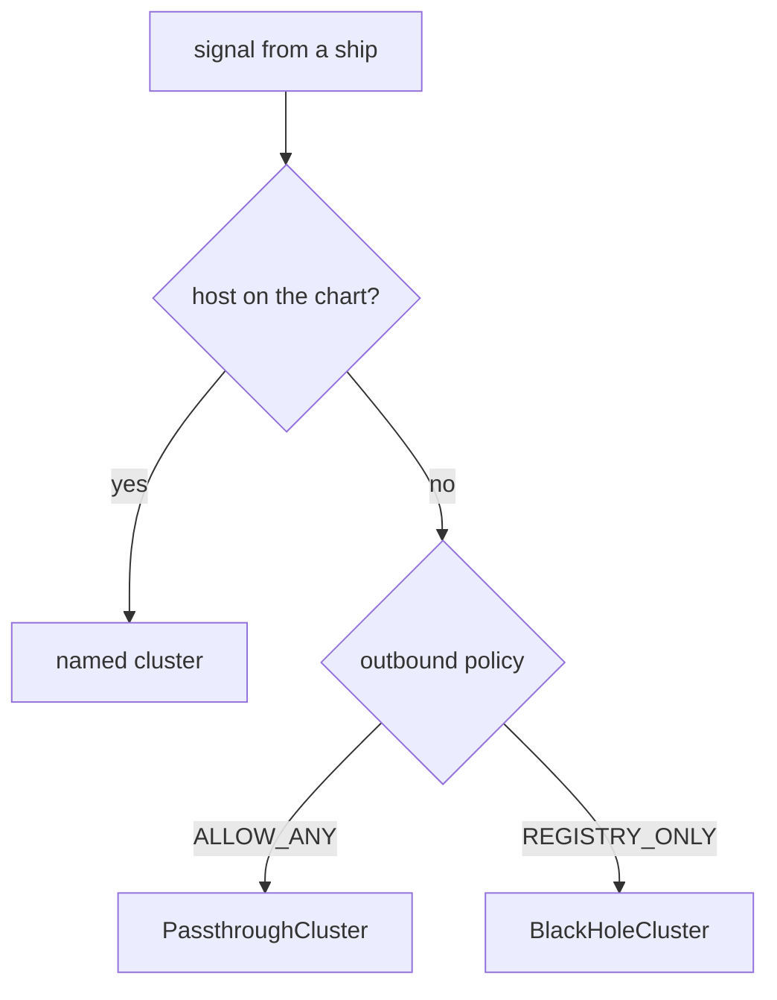

# The Outbound Traffic Policy

Astronaut, before you write a single `ServiceEntry`, look at the one setting that decides whether a ship may signal a planet Istio has never heard of. It decides what a `ServiceEntry` is *for*: a way to gain features, or a way to gain permission.

## The star chart, and what happens off it

Every sidecar, the ship's communications officer, holds a list of known hosts. This list is the **service registry**, the star chart. It holds:

- every Kubernetes Service the proxy may see;
- every `ServiceEntry` the proxy may see;
- every `WorkloadEntry` (a machine outside Kubernetes) that a `ServiceEntry` groups.

When a ship signals a host that is **not** on the chart, the **outbound traffic policy** decides what happens:



A charted host gets a named cluster, such as `outbound|443||httpbin.org`, and Istio's rules apply to it. With `ALLOW_ANY` (the default) every other host is let through with no rules. With `REGISTRY_ONLY` every other host is refused. The sidecar's access log, the ship's flight log, names the path for every signal. Reading that name is the fastest way to know which path a signal took.

## The default: `ALLOW_ANY`

Out of the box, a sidecar passes traffic to uncharted planets straight through. It does not route it, time it out or check it. It gets out of the way.

That is a deliberate choice: a mesh that cut off every outbound signal on its first day would break every application. The cost is that the mesh cannot see or control where your workloads send data.

<!-- astrona:playground:renew -->

### Signal a planet that is not on the chart

Paste the `call_external` helper from the module's landing page if you have not yet. Then call `httpbin.org` on the internet, and read the shuttle's flight log:

```sh
call_external https://httpbin.org/get
kubectl logs -n starfleet deploy/shuttle -c istio-proxy --tail=1
```

You should see (log line trimmed):

```text
200 0.640065s
  exit=0
[...] "- - -" 0 - - - "-" 901 4875 689 - "-" "-" "-" "-" "34.227.237.26:443" PassthroughCluster ...
```

The signal got out with `200`. The flight log names **`PassthroughCluster`**: the proxy did not know this host and let it through. It shows only an address and a byte count, because the proxy cannot read encrypted HTTPS. Istio has no rules for this host, and a hijacked ship could reach anything on the internet the same way.

## `REGISTRY_ONLY`: refuse anything off the chart

The other mode refuses every destination that is not on the chart: ships may signal only charted planets. You can set it in two places.

**For the whole mesh**, it is part of the mesh configuration, `meshConfig.outboundTrafficPolicy.mode`, and you set it when you install the control plane. With `istioctl`:

```sh
istioctl install --set profile=demo \
  --set meshConfig.outboundTrafficPolicy.mode=REGISTRY_ONLY -y
```

With Helm, as in your playground, it is a value on the `istiod` chart:

```sh
helm upgrade istiod istiod --repo https://istio-release.storage.googleapis.com/charts \
  --version 1.30.5 -n istio-system --reuse-values \
  --set meshConfig.outboundTrafficPolicy.mode=REGISTRY_ONLY --wait
```

Either way, the install updates the existing control plane. It does not create a second one. Do not run these now: the playground uses the second place instead.

**For one namespace**, a `Sidecar` resource carries its own `outboundTrafficPolicy`. A `Sidecar` gives the ships on one planet a smaller star chart. Without a `workloadSelector`, it applies to every pod in its namespace. This is the practical way in: lock one planet at a time, where you can list its outside dependencies, without breaking every other team.

Switching to `REGISTRY_ONLY` does not break traffic inside the cluster. Every Service is on the chart already. It breaks exactly the calls nobody declared.

### Lock the planet

Save this as `sidecar-registry-only.yaml`:

```yaml
apiVersion: networking.istio.io/v1
kind: Sidecar
metadata:
  name: default
  namespace: starfleet
spec:
  outboundTrafficPolicy:
    mode: REGISTRY_ONLY
  egress:
  - hosts:
    - "./*"
    - "istio-system/*"
```

The `egress.hosts` list is the smaller star chart: `./*` takes in everything from the `Sidecar`'s own namespace, and `istio-system/*` everything from `istio-system`.

Apply it:

```sh
kubectl apply -f sidecar-registry-only.yaml
```

Then call the same planet on the internet, and the probe inside the cluster, and read the flight log:

```sh
call_external https://httpbin.org/get
call_external http://probe:8000/get
kubectl logs -n starfleet deploy/shuttle -c istio-proxy --tail=2
```

You should see (log lines trimmed):

```text
000 0.022789s
command terminated with exit code 35
  exit=35
200 0.015859s
  exit=0
[...] "- - -" 0 UH - - "-" 0 0 1 - "-" "-" "-" "-" "-" BlackHoleCluster - 98.88.155.171:443 ...
[...] "GET /get HTTP/1.1" 200 - via_upstream ... outbound|8000||probe.starfleet.svc.cluster.local ...
```

The call to `httpbin.org` failed with `000` and exit code `35`: the connection was cut before any answer. The flight log names **`BlackHoleCluster`** with the flag `UH`. The call to the probe still answered `200`, through its own named cluster. Nothing about the pod or the network changed, only the policy.

Keep this `Sidecar` applied: every step from here on assumes the planet is locked.

## The signature of a refusal

A refused signal does not come back with a message that names the policy. What you see depends on whether the proxy can read the request:

- **HTTPS (or any TLS, Transport Layer Security, the encryption under HTTPS)** to an uncharted host: the proxy only sees encrypted bytes, so it drops the connection. `curl` shows `000` with exit code `35` or `56`. The flight log says `BlackHoleCluster`.
- **Plain HTTP** to an uncharted host, on a port where the proxy has **no** HTTP listener: the same dropped connection, `000`. The flight log says `BlackHoleCluster`.
- **Plain HTTP** on a port where the proxy **has** an HTTP listener, because some charted host uses that port: the proxy reads the request and answers **`502`** itself. The flight log names the route **`block_all`** instead of `BlackHoleCluster`.

### Send plain HTTP to an uncharted host

```sh
call_external http://httpbin.org/get
kubectl logs -n starfleet deploy/shuttle -c istio-proxy --tail=1
```

You should see (log line trimmed):

```text
000 0.008687s
command terminated with exit code 56
  exit=56
[...] "- - -" 0 UH - - "-" 0 0 0 - "-" "-" "-" "-" "-" BlackHoleCluster - 32.194.118.12:80 ...
```

No charted host uses port `80` yet, so the proxy has no HTTP listener there and cuts the connection. Once a charted host has an HTTP port `80`, the same call to an uncharted host returns `502` with `block_all`.

Recognising these signatures matters more than the YAML, because the other failures look alike and mean something else:

| Symptom | Usually means |
| --- | --- |
| `BlackHoleCluster` in the flight log | the mesh refused it: the host is not on the chart |
| `502` with `block_all` in the flight log | the mesh refused it, seen from an HTTP listener |
| `000` and no flight log line at all | the signal never reached the proxy, or nothing answered: DNS (the Domain Name System, which turns host names into addresses) or the network |
| `504` with `UT` | a route timeout fired |

The flight log is the tie-breaker, astronaut. A refusal is a *mesh decision*: DNS worked, the network is fine, and the proxy had no cluster to send the signal to.

| Cluster in the flight log | Meaning |
| --- | --- |
| `PassthroughCluster` | uncharted host, let through (`ALLOW_ANY`) |
| `BlackHoleCluster` | uncharted host, refused (`REGISTRY_ONLY`) |
| `outbound\|443\|\|httpbin.org` | a host charted by a `ServiceEntry` |

## Common pitfalls

> [!WARNING]
> - **Assuming the default refuses external traffic.** `ALLOW_ANY` is the install default: anything not on the chart is passed through unchecked.
> - **Reading `ALLOW_ANY` as "no policy needed".** Traffic leaving under it is invisible to the mesh: no routing, no timeouts, no record of where it went.
> - **Switching to `REGISTRY_ONLY` without a list of your outside dependencies.** Every undeclared dependency fails at once, and the failures look like application bugs.
> - **Expecting a clear error on refusal.** The signature is a cut connection (`000`) or a `502`. Read the flight log for `BlackHoleCluster` or `block_all`.
> - **Changing the whole mesh when one namespace needs it.** A `Sidecar` carries its own `outboundTrafficPolicy` for exactly this.
> - **Treating `REGISTRY_ONLY` as a firewall.** The sidecar enforces it, so a pod without a sidecar is not limited at all. Real enforcement also needs a Kubernetes `NetworkPolicy` and an egress gateway.

> *Under `REGISTRY_ONLY` a refusal is a mesh decision: `BlackHoleCluster` or `block_all` in the flight log, and `000` or `502` at the ship, while DNS and the network are fine.*
