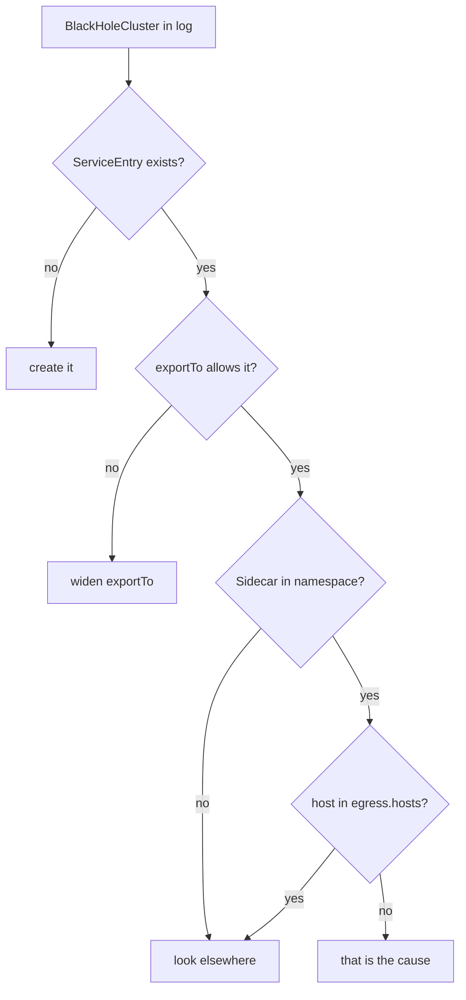

# A Registered Host Is An Ordinary Host

This is what makes `ServiceEntry` more than an allow-list, and it is the part that pays back everything you learned in sections 010 to 050. Then two scoping behaviours that decide whether the object works where you expect it to.

## Everything from earlier sections now applies

Once `httpbin.org` is on the star chart, it behaves like any other host in the mesh:

| Section | What you can now do to somebody else's API |
| --- | --- |
| 010 | route different paths to different destinations |
| 040 | set a `timeout` and a retry policy |
| 040 | apply a connection pool, so a slow partner cannot exhaust your workers |
| 040 | apply outlier detection across its resolved addresses |
| 030 | set a load balancer policy |
| 050 | inject a fault, to test how your code handles that API failing |

None of this requires cooperation from the other solar system. It is all client-side, enforced by your own ship's communications officer.

The timeout is the clearest demonstration, and the most immediately useful: an abort window on a third-party API you do not control and cannot change.

There is a catch first. In Part 2 you registered `httpbin.org` on `443` with `protocol: HTTPS`. On HTTPS the sidecar only sees sealed, encrypted bytes, so it cannot see where one HTTP request ends — and a timeout has nothing to bound. HTTP rules need a **plain HTTP port**. So the next `ServiceEntry` adds port `80`. It has the same name as Part 2's, so applying it replaces that one:

```yaml
apiVersion: networking.istio.io/v1
kind: ServiceEntry
metadata:
  name: httpbin-org
  namespace: bookinfo
spec:
  hosts:
    - httpbin.org
  ports:
    - number: 80
      name: http
      protocol: HTTP
    - number: 443
      name: https
      protocol: HTTPS
  location: MESH_EXTERNAL
  resolution: DNS
```

Then the `VirtualService` — the flight plan — puts a two-second deadline on it:

```yaml
apiVersion: networking.istio.io/v1
kind: VirtualService
metadata:
  name: httpbin-org
  namespace: bookinfo
spec:
  hosts:
    - httpbin.org
  http:
    - route:
        - destination:
            host: httpbin.org
      timeout: 2s
```

This works **only because** the `ServiceEntry` declared `protocol: HTTP` on port 80. With only an HTTPS or `TCP` port, the `VirtualService` would apply to nothing.

<!-- astrona:playground:renew -->

> [!TIP]
> **Try it — a deadline on somebody else's API**
>
> Save this as `serviceentry-httpbin-org-http-and-https.yaml`:
>
> ```yaml
> apiVersion: networking.istio.io/v1
> kind: ServiceEntry
> metadata:
>   name: httpbin-org
>   namespace: bookinfo
> spec:
>   hosts:
>     - httpbin.org
>   ports:
>     - number: 80
>       name: http
>       protocol: HTTP
>     - number: 443
>       name: https
>       protocol: HTTPS
>   location: MESH_EXTERNAL
>   resolution: DNS
> ```
>
> Save this as `virtualservice-httpbin-org-timeout.yaml`:
>
> ```yaml
> apiVersion: networking.istio.io/v1
> kind: VirtualService
> metadata:
>   name: httpbin-org
>   namespace: bookinfo
> spec:
>   hosts:
>     - httpbin.org
>   http:
>     - route:
>         - destination:
>             host: httpbin.org
>       timeout: 2s
> ```
>
> Apply it:
>
> ```sh
> kubectl apply -f serviceentry-httpbin-org-http-and-https.yaml
> kubectl apply -f virtualservice-httpbin-org-timeout.yaml
> ```
>
> Then check the result:
>
> ```sh
> call_external http://httpbin.org/delay/4
> call_external http://httpbin.org/get
> ```
>
> Expect `504` after about `2.0s` for the first call, and `200` for the second. Two seconds, not four — the same timeout feature from section 040, applied to a host on the public internet. That is the payoff for putting it on the star chart.

If you want HTTP features **and** an encrypted connection, the sidecar must add the encryption itself. That is TLS origination, and it is module 2's subject.

A `DestinationRule` — the docking instructions for one beacon — works the same way, and is arguably more valuable in production: a connection pool on an external dependency stops a slow partner API from filling your workers.

> [!TIP]
> **Try it — a connection pool on an external host**
>
> Save this as `destinationrule-httpbin-org.yaml`:
>
> ```yaml
> apiVersion: networking.istio.io/v1
> kind: DestinationRule
> metadata:
>   name: httpbin-org
>   namespace: bookinfo
> spec:
>   host: httpbin.org
>   trafficPolicy:
>     connectionPool:
>       tcp:
>         maxConnections: 2
>       http:
>         http1MaxPendingRequests: 2
> ```
>
> Apply it:
>
> ```sh
> kubectl apply -f destinationrule-httpbin-org.yaml
> ```
>
> Then check the result:
>
> ```sh
> sleep 3
> istioctl proxy-config cluster deploy/curl -n bookinfo --fqdn httpbin.org -o json \
>   | grep -A5 circuitBreakers
> ```
>
> Expect a block like this one for each registered port (`80` and `443`):
>
> ```text
> "circuitBreakers": {
>   "thresholds": [
>     {
>       "maxConnections": 2,
>       "maxPendingRequests": 2,
> ```
>
> A `DestinationRule` pointing at a public hostname, compiled into exactly the same Envoy circuit breaker as section 040 module 2 produced for an in-cluster Service. The object does not know or care that the destination is external.

## `exportTo` — a namespaced object with mesh-wide reach

A `ServiceEntry` is namespaced, but by **default it is exported to the entire mesh**. Every namespace can use it.

That surprises people, and it matters: a `ServiceEntry` created on one team's planet opens that host for every planet in the solar system. `exportTo` narrows it:

```yaml
spec:
  exportTo:
    - "."          # this namespace only
```

The values are the same shorthand as elsewhere: `.` for the object's own namespace, `*` for everywhere (the default), or a list of namespace names.

For a `REGISTRY_ONLY` mesh where the point is control, `exportTo: ["."]` on every `ServiceEntry` is a reasonable default — otherwise one namespace's allow-list is silently everyone's.

## The `Sidecar` interaction

This is the diagnostic worth carrying out of the module, because the symptom is identical to a missing `ServiceEntry`.

Section 010's `Sidecar` resource limits which registry entries a proxy is programmed with — and Part 1 noted the registry includes `ServiceEntry` hosts. So a perfectly correct, mesh-exported `ServiceEntry` can be **invisible** to one namespace because that namespace's `Sidecar` never listed the external host in its `egress.hosts`.

The result is a refusal — `BlackHoleCluster` in the log, `000` or `502` at the client — exactly as if the host had never been registered.



"Look elsewhere" means resolution, ports and protocol. Two of those gates belong to other people's objects, which is why a `ServiceEntry` that works in one namespace can fail in another with nothing wrong in the `ServiceEntry` itself.

The rule of thumb: **when a `ServiceEntry` works from one namespace and not another, look for a `Sidecar` before re-reading the `ServiceEntry`.**

The playground already has that trap set. Part 1's `Sidecar` in `bookinfo` lists only `./*` and `istio-system/*` — this namespace and `istio-system`. A `ServiceEntry` anywhere else is off that planet's star chart, even though `exportTo` says everyone may use it.

> [!TIP]
> **Try it — a correct `ServiceEntry` in the wrong namespace**
>
> ```sh
> kubectl delete se --all -n bookinfo
> ```
>
> Save this as `serviceentry-in-other-namespace.yaml`:
>
> ```yaml
> apiVersion: networking.istio.io/v1
> kind: ServiceEntry
> metadata:
>   name: httpbin-org
>   namespace: default
> spec:
>   hosts:
>     - httpbin.org
>   ports:
>     - number: 443
>       name: https
>       protocol: HTTPS
>   location: MESH_EXTERNAL
>   resolution: DNS
> ```
>
> Apply it:
>
> ```sh
> kubectl apply -f serviceentry-in-other-namespace.yaml
> ```
>
> Then check the result:
>
> ```sh
> call_external https://httpbin.org/get
> ```
>
> Expect `000 exit=35` — still blocked. The entry exists and is exported mesh-wide, but the `bookinfo` `Sidecar` only takes in configuration from `bookinfo` and `istio-system`. Fix it either way: put the `ServiceEntry` in the app's namespace, or add `default/*` to the `Sidecar`'s `egress.hosts`. Clean up with `kubectl delete -f serviceentry-in-other-namespace.yaml` and re-apply Part 2's `serviceentry-httpbin-org.yaml`.

## Common pitfalls

> [!WARNING]
> **Expecting `REGISTRY_ONLY` without setting it.** The default is `ALLOW_ANY`. If external calls succeed before you create any `ServiceEntry`, the mode is why.
>
> **Reading a refusal as a network problem.** Under `REGISTRY_ONLY`, `BlackHoleCluster` in the log (with `502` or `000` at the client) means "not in the registry". DNS and connectivity are fine.
>
> **Declaring `protocol: TCP` and expecting HTTP features.** No timeouts, no retries, no path routing. The declared protocol is what enables layer-7 handling.
>
> **Registering only the port the application uses today.** A `ServiceEntry` for port 80 does nothing for an HTTPS call on 443 — which is module 2's whole subject.
>
> **Assuming a `ServiceEntry` is namespace-private.** It is exported mesh-wide unless `exportTo` says otherwise.
>
> **Overlooking a `Sidecar` scope.** It hides a perfectly good `ServiceEntry` from one namespace, with the same refusal you would get from never having created it.
>
> **Using `resolution: DNS` with a wildcard host.** There is no single name to resolve; use `NONE`.
>
> **Forgetting the proxy resolves the name, not you.** With `resolution: DNS` the hostname must resolve from inside the pod.

> *A registered external host is an ordinary mesh host — every `VirtualService` and `DestinationRule` feature in this course applies to it unchanged.*

## Exam cheat sheet

```yaml
apiVersion: networking.istio.io/v1
kind: ServiceEntry
metadata: {name: httpbin-org, namespace: bookinfo}
spec:
  hosts: [httpbin.org]
  ports:
  - {number: 443, name: https, protocol: HTTPS}
  - {number: 80,  name: http,  protocol: HTTP}
  location: MESH_EXTERNAL       # outside the mesh, no mTLS
  resolution: DNS               # NONE for wildcards, STATIC with endpoints
---
apiVersion: networking.istio.io/v1
kind: Sidecar
metadata: {name: default, namespace: bookinfo}
spec:
  outboundTrafficPolicy: {mode: REGISTRY_ONLY}
  egress:
  - hosts: ["./*", "istio-system/*"]
```

- Mesh-wide alternative: install option `meshConfig.outboundTrafficPolicy.mode=REGISTRY_ONLY`.
- `REGISTRY_ONLY` is not a firewall: pods without a sidecar are not limited.
- HTTP features (timeout, retries, faults) need a plain `HTTP` port on the `ServiceEntry`.
- Docs: istio.io → Tasks → Traffic Management → Egress → **Accessing External Services**.
