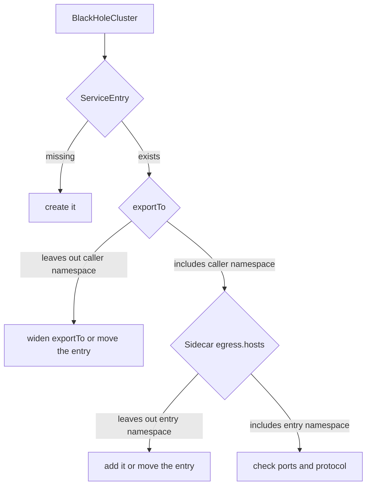

# Find A ServiceEntry Hidden By A Sidecar

A `ServiceEntry` adds a host outside the mesh to the service registry, the list of hosts that `istiod`, Istio's control plane, sends to every sidecar proxy. A sidecar proxy (Envoy) is the proxy container next to each application container; every request the pod sends passes through it. A `ServiceEntry` can be perfectly correct and still not work. The symptom is exactly the same as a missing one: `000` or `502` in `curl`, and `BlackHoleCluster` or `block_all` in the access log. `BlackHoleCluster` is the name the sidecar proxy writes in its access log when it drops a request to a host that is not in its configuration.

The cause is almost never in the `ServiceEntry` itself. It is in **which sidecar proxies may see it**. Two settings decide that, and one of them belongs to another object. This part explains both settings and then shows the one that belongs to the caller: the `Sidecar` resource.

The commands below need the `REGISTRY_ONLY` `Sidecar` resource named `default` in the `starfleet` namespace applied in your playground. `REGISTRY_ONLY` is the outbound traffic policy that makes the sidecar proxy refuse every host outside the service registry. The `Sidecar`'s `egress.hosts` list is `./*` and `istio-system/*`.

## Two settings between a ServiceEntry and a caller

For a pod's sidecar proxy to use a `ServiceEntry`, two settings must allow it:

1. **The entry's `exportTo`.** The owner of the `ServiceEntry` decides which namespaces may use it. The default is every namespace.
2. **The caller's `Sidecar` resource.** A `Sidecar` resource limits which hosts the sidecar proxies of one namespace get configuration for. Its `egress.hosts` list decides which namespaces the caller takes configuration from. `./*` only means "my own namespace".

So a mesh-wide `ServiceEntry` in the namespace `default` is still invisible to a pod whose `Sidecar` lists only `./*` and `istio-system/*`. And a `ServiceEntry` that the `Sidecar` does list is still invisible if its own `exportTo` leaves out the caller's namespace. When a request is refused, check in this order:



The diagram shows the three checks, from the existence of the entry to the caller's `Sidecar`, before you look at ports and protocol.

The rule to remember: **when a `ServiceEntry` works from one namespace and not from another, look for a `Sidecar` before you read the `ServiceEntry` again.** Your best tool is the caller's own sidecar proxy. If the host is not in `istioctl proxy-config cluster` for the calling pod, that pod cannot see the entry, however correct the entry is.

## Start from a clean namespace

Remove every `ServiceEntry`, `VirtualService` and `DestinationRule` from `starfleet`, so the earlier objects do not hide the effect. The `Sidecar` resource stays.

<!-- astrona:playground:renew -->

```sh
kubectl delete serviceentry,virtualservice,destinationrule --all -n starfleet
```

```text
serviceentry.networking.istio.io "httpbin-org" deleted from starfleet namespace
virtualservice.networking.istio.io "httpbin-org" deleted from starfleet namespace
destinationrule.networking.istio.io "httpbin-org" deleted from starfleet namespace
```

If your terminal does not have the `call_external` helper yet, paste it now. It sends one request from the `shuttle` pod and prints the status code, the time and the exit code of `curl`:

```sh
call_external() { kubectl exec -n starfleet deploy/shuttle -- curl -s -o /dev/null -w "%{http_code} %{time_total}s\n" --max-time 10 "$@"; echo "  exit=$?"; }
```

## A `Sidecar` that leaves the entry out

Start with the setting that belongs to the caller. Another team adds `httpbin.org` to the registry in its own namespace, and the `shuttle` pod tries to use it. Put a correct `ServiceEntry` in the namespace `default`. It has no `exportTo`, so it is exported to every namespace. Save this as `serviceentry-httpbin-org-in-default.yaml`:

```yaml
apiVersion: networking.istio.io/v1
kind: ServiceEntry
metadata:
  name: httpbin-org
  namespace: default
spec:
  hosts:
  - httpbin.org
  ports:
  - number: 443
    name: https
    protocol: HTTPS
  location: MESH_EXTERNAL
  resolution: DNS
```

Apply it:

```sh
kubectl apply -f serviceentry-httpbin-org-in-default.yaml
```

Then call the host, list the entries, look in the `shuttle` pod's sidecar proxy, and run `istioctl analyze`:

```sh
call_external https://httpbin.org/get
kubectl get serviceentry -A
istioctl proxy-config cluster deploy/shuttle -n starfleet | grep httpbin.org || echo "(no match)"
istioctl analyze -n starfleet
```

You should see:

```text
000 0.029325s
command terminated with exit code 35
  exit=35
NAMESPACE   NAME          HOSTS             LOCATION        RESOLUTION   AGE
default     httpbin-org   ["httpbin.org"]   MESH_EXTERNAL   DNS          5s
(no match)
✔ No validation issues found when analyzing namespace: starfleet.
```

The request is still refused. The entry exists and is exported everywhere, but the `shuttle` pod's sidecar proxy has no cluster for `httpbin.org`. `istioctl analyze` finds nothing wrong, because each object is valid on its own. The `starfleet` `Sidecar` takes configuration only from `starfleet` and `istio-system`, so the entry in `default` never reaches the `shuttle` pod.

To fix it from the caller's side, add exactly this one host from `default` to the `Sidecar`. The form is `<namespace>/<host>`. Save this as `sidecar-registry-only-with-default.yaml`:

```yaml
apiVersion: networking.istio.io/v1
kind: Sidecar
metadata:
  name: default
  namespace: starfleet
spec:
  outboundTrafficPolicy:
    mode: REGISTRY_ONLY
  egress:
  - hosts:
    - "./*"
    - "istio-system/*"
    - "default/httpbin.org"
```

Apply it:

```sh
kubectl apply -f sidecar-registry-only-with-default.yaml
```

Then check the result:

```sh
call_external https://httpbin.org/get
istioctl proxy-config cluster deploy/shuttle -n starfleet | grep httpbin.org || echo "(no match)"
```

You should see:

```text
200 0.490421s
  exit=0
httpbin.org                               443       -          outbound      STRICT_DNS
```

The same `ServiceEntry`, untouched, now works. Only the `Sidecar` changed. `default/httpbin.org` takes in one host from `default`, while `default/*` would take in everything there.

You can now tell a missing `ServiceEntry` from one that a `Sidecar` hides. A `Sidecar` whose `egress.hosts` leaves out the entry's namespace keeps the entry away from its pods, even when the entry is exported to every namespace. `istioctl analyze` does not report this case, but `istioctl proxy-config cluster` on the calling pod does: it lists the clusters, that is the destinations, the pod's sidecar proxy knows. The open question is the other setting: what happens when the owner of the entry limits it with `exportTo`.

## Common pitfalls

> [!WARNING]
> - **Reading the `ServiceEntry` again and again.** When it works from one namespace and not another, the cause is usually a `Sidecar`'s `egress.hosts`.
> - **Trusting `istioctl analyze` here.** A hidden entry is valid configuration, so `analyze` stays quiet. `istioctl proxy-config cluster` on the calling pod shows whether it can see the host.
> - **Fixing it with `*/*` in the `Sidecar`.** That takes in every namespace's configuration and removes the limit the `Sidecar` was there to set. Add the one namespace or host you need.
> - **Switching the `Sidecar` back to `ALLOW_ANY`.** The request gets out through `PassthroughCluster`, with no rules. The refusal is gone, and so is the control.
