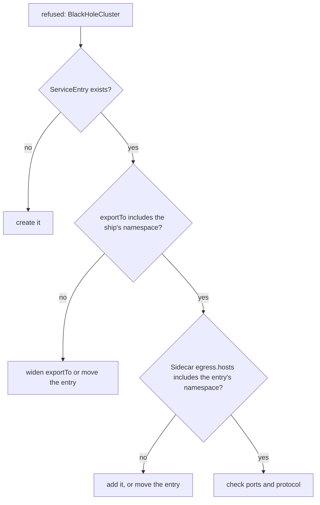

# When A Correct ServiceEntry Is Refused

Astronaut, this is the diagnosis worth carrying out of the module. A `ServiceEntry` can be perfectly correct and still be refused, with exactly the same symptom as a missing one: `000` or `502` at the ship, `BlackHoleCluster` or `block_all` in the flight log.

The cause is almost never in the `ServiceEntry` itself. It is in **who may see it**. Two gates decide that, and one of them belongs to somebody else's object.

The commands below need the `REGISTRY_ONLY` `Sidecar` applied in your playground, and the `call_external` helper pasted into your terminal.

## Two gates between a chart entry and a ship

For a ship to use a `ServiceEntry`, both gates must be open:

1. **The entry's `exportTo`.** The owner of the `ServiceEntry` decides which namespaces may use it. The default is every namespace.
2. **The ship's `Sidecar`.** The `egress.hosts` of the `Sidecar` on the ship's planet decide which namespaces the ship takes configuration from. `./*` only means "my own namespace".

So a mesh-wide `ServiceEntry` in namespace `default` is still invisible to a ship whose `Sidecar` lists only `./*` and `istio-system/*`. And a `ServiceEntry` that the `Sidecar` does list is still invisible if its own `exportTo` excludes the ship's namespace.



Rule of thumb: **when a `ServiceEntry` works from one namespace and not from another, look for a `Sidecar` before you read the `ServiceEntry` again.**

Your best tool is the ship's own proxy. If the host is not in `istioctl proxy-config cluster`, the ship cannot see the entry, however correct the entry is.

## Clear the planet

Start from a clean planet: no chart entries, flight plans or docking instructions in `starfleet`. The `Sidecar` stays.

<!-- astrona:playground:renew -->

### Remove the earlier objects

```sh
kubectl delete serviceentry,virtualservice,destinationrule --all -n starfleet
```

```text
serviceentry.networking.istio.io "httpbin-org" deleted from starfleet namespace
virtualservice.networking.istio.io "httpbin-org" deleted from starfleet namespace
destinationrule.networking.istio.io "httpbin-org" deleted from starfleet namespace
```

## Gate 2: the `Sidecar` that never takes the entry in

Start with the gate that belongs to the ship. Another team charts `httpbin.org` on its own planet, and your shuttle tries to use it.

### Chart `httpbin.org` on another planet

Put a correct `ServiceEntry` in the namespace `default`. It is exported to every namespace, because it has no `exportTo`. Save this as `serviceentry-httpbin-org-in-default.yaml`:

```yaml
apiVersion: networking.istio.io/v1
kind: ServiceEntry
metadata:
  name: httpbin-org
  namespace: default
spec:
  hosts:
  - httpbin.org
  ports:
  - number: 443
    name: https
    protocol: HTTPS
  location: MESH_EXTERNAL
  resolution: DNS
```

Apply it:

```sh
kubectl apply -f serviceentry-httpbin-org-in-default.yaml
```

Then call the planet, list the entries, and look in the shuttle's proxy:

```sh
call_external https://httpbin.org/get
kubectl get serviceentry -A
istioctl proxy-config cluster deploy/shuttle -n starfleet | grep httpbin.org || echo "(no match)"
istioctl analyze -n starfleet
```

You should see:

```text
000 0.029325s
command terminated with exit code 35
  exit=35
NAMESPACE   NAME          HOSTS             LOCATION        RESOLUTION   AGE
default     httpbin-org   ["httpbin.org"]   MESH_EXTERNAL   DNS          5s
(no match)
✔ No validation issues found when analyzing namespace: starfleet.
```

Still refused. The entry exists and is exported everywhere, but the shuttle's proxy has no cluster for `httpbin.org`. `istioctl analyze` finds nothing wrong, because nothing is wrong with either object on its own. The `starfleet` `Sidecar` takes configuration only from `starfleet` and `istio-system`, so `default` is off the shuttle's star chart.

### Open the second gate

Add exactly this one host from `default` to the `Sidecar`. The form is `<namespace>/<host>`. Save this as `sidecar-registry-only-with-default.yaml`:

```yaml
apiVersion: networking.istio.io/v1
kind: Sidecar
metadata:
  name: default
  namespace: starfleet
spec:
  outboundTrafficPolicy:
    mode: REGISTRY_ONLY
  egress:
  - hosts:
    - "./*"
    - "istio-system/*"
    - "default/httpbin.org"
```

Apply it:

```sh
kubectl apply -f sidecar-registry-only-with-default.yaml
```

Then check the result:

```sh
call_external https://httpbin.org/get
istioctl proxy-config cluster deploy/shuttle -n starfleet | grep httpbin.org || echo "(no match)"
```

You should see:

```text
200 0.490421s
  exit=0
httpbin.org                               443       -          outbound      STRICT_DNS
```

The same `ServiceEntry`, untouched, now works. Only the `Sidecar` changed. `default/httpbin.org` takes in one host from `default`. `default/*` would take in everything there.

## Gate 1: the `exportTo` that keeps the entry home

Now close the other gate. The owner of the entry in `default` decides to keep it private.

### Make the entry private to its namespace

Save this as `serviceentry-httpbin-org-in-default-private.yaml`:

```yaml
apiVersion: networking.istio.io/v1
kind: ServiceEntry
metadata:
  name: httpbin-org
  namespace: default
spec:
  hosts:
  - httpbin.org
  exportTo:
  - "."
  ports:
  - number: 443
    name: https
    protocol: HTTPS
  location: MESH_EXTERNAL
  resolution: DNS
```

Apply it:

```sh
kubectl apply -f serviceentry-httpbin-org-in-default-private.yaml
```

Then check the result:

```sh
call_external https://httpbin.org/get
istioctl proxy-config cluster deploy/shuttle -n starfleet | grep httpbin.org || echo "(no match)"
istioctl analyze -n starfleet
```

You should see:

```text
000 0.020038s
command terminated with exit code 35
  exit=35
(no match)
✔ No validation issues found when analyzing namespace: starfleet.
```

Refused again, while the `Sidecar` still lists `default/httpbin.org`. `exportTo: ["."]` keeps the entry inside `default`, and `starfleet` is not `default`. Again `istioctl analyze` is quiet. Only the shuttle's proxy shows the truth.

## The clean fix: chart the planet where the ship lives

Both gates open by themselves when the entry lives on the same planet as the ships that use it: `./*` in the `Sidecar` takes it in, and `exportTo: ["."]` keeps it from leaking to anyone else. That is the safest default for a `REGISTRY_ONLY` planet.

### Move the entry to `starfleet`

Remove the entry from `default`, and put the `Sidecar` back to its original form:

```sh
kubectl delete -f serviceentry-httpbin-org-in-default-private.yaml
kubectl apply -f sidecar-registry-only.yaml
```

Save this as `serviceentry-httpbin-org-private.yaml`:

```yaml
apiVersion: networking.istio.io/v1
kind: ServiceEntry
metadata:
  name: httpbin-org
  namespace: starfleet
spec:
  hosts:
  - httpbin.org
  exportTo:
  - "."
  ports:
  - number: 443
    name: https
    protocol: HTTPS
  location: MESH_EXTERNAL
  resolution: DNS
```

Apply it:

```sh
kubectl apply -f serviceentry-httpbin-org-private.yaml
```

Then call the charted planet and one that is not charted:

```sh
call_external https://httpbin.org/get
call_external https://www.google.com
istioctl proxy-config cluster deploy/shuttle -n starfleet | grep httpbin.org || echo "(no match)"
```

You should see:

```text
200 0.509702s
  exit=0
000 0.039927s
command terminated with exit code 35
  exit=35
httpbin.org                               443       -          outbound      STRICT_DNS
```

`httpbin.org` is open for `starfleet` only. Every other planet in the mesh, and every other host on the internet, stays closed.

## Common pitfalls

> [!WARNING]
> - **Reading the `ServiceEntry` again and again.** When it works from one namespace and not another, the cause is usually a `Sidecar`'s `egress.hosts`, or the entry's `exportTo`.
> - **Trusting `istioctl analyze` here.** A hidden entry is valid configuration. `analyze` stays quiet. The ship's `istioctl proxy-config cluster` shows whether it can see the host.
> - **Fixing it with `*/*` in the `Sidecar`.** That takes in every namespace's configuration and undoes the point of a smaller star chart. Add the one namespace or host you need.
> - **Turning the `Sidecar` back to `ALLOW_ANY`.** The signal gets out, through `PassthroughCluster`, with no rules. The refusal is gone, and so is the control.
> - **Forgetting that `exportTo` belongs to the owner.** A ship's `Sidecar` cannot take in an entry that its owner did not export to the ship's namespace.

> *A `ServiceEntry` only works for a ship that may see it: its `exportTo` must include the ship's namespace, and the ship's `Sidecar` must take in the entry's namespace.*

## Your mission: Reach The Hidden Relay

You can now tell a missing chart entry from a hidden one, and read the answer from the ship's own proxy. Now prove it in a graded mission: a correct-looking route to a relay outside the mesh never works, and more than one thing stands in the way.

The mission runs in its own training solar system, so first pause your playground. Nothing in it is lost:

```sh
astrona stop ats-014-playground-070-01
```

Then start the mission:

```sh
astrona run --git git@github.com:astrona-io/ATS014.git -c sections/section-070/module-01/labs/lab-02
```

Read the task in [`question.md`](./labs/lab-02/question.md) and solve it on your own first. When you think you are done, send it for grading:

```sh
astrona submit -c sections/section-070/module-01/labs/lab-02
```

When the mission is done, remove it and wake your playground up again:

```sh
astrona destroy ats-014-lab-070-01-02
astrona start ats-014-playground-070-01
```
