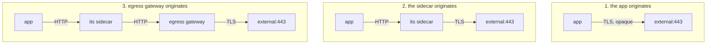

# Why HTTPS Is Opaque

Before the fix, be precise about the problem. This part establishes exactly what the communications officer (the sidecar) can see when the crew seals its own signal with HTTPS, and what that costs.

## What the proxy sees

An outbound HTTPS connection from the application is a TCP connection carrying a TLS session the proxy is not party to. The proxy can observe:

| Visible | Not visible |
| --- | --- |
| the destination IP and port | the HTTP method |
| the SNI server name in the handshake | the path |
| byte counts and connection duration | request and response headers |
| whether the connection succeeded | the status code |
| | the body |

SNI is the one useful piece — it is sent in the clear during the handshake — and it is why a `ServiceEntry` with `protocol: TLS` can do host-based decisions without decrypting anything. But it is one string per connection, not per request, and an HTTP/1.1 keep-alive connection carries many requests under one handshake.

## The access log tells you plainly

The cleanest demonstration is the access log, because for an HTTP request it records a method, a path and a status, and for an encrypted stream it cannot.

> [!TIP]
> **Try it — what a direct HTTPS call looks like from the mesh's side**
>
> ```sh
> kubectl -n tlsorig-demo exec deploy/tester -- \
>   curl -s -o /dev/null -w 'https: %{http_code}\n' --max-time 15 https://httpbin.org/get
> kubectl -n tlsorig-demo logs deploy/tester -c istio-proxy --tail=3
> ```
>
> Expect something like:
>
> ```text
> https: 200
> [2026-09-27T12:31:05.442Z] "- - -" 0 - - - "-" 705 5923 212 - "-" "-" "-" "-" "91.208.132.5:443" ...
> ```
>
> The call worked — and the log line has `"- - -"` where the method, path and protocol would be, and no status code. The proxy moved 705 bytes up and 5923 down to an IP on port 443, and has nothing else to say. The flight log recorded a sealed signal, nothing more. That is the whole problem in one line.

The contrast is what makes the point, so run the same call over plain HTTP and put the two log lines side by side. Nothing about the mesh changed between them — only whether the proxy was able to read what was inside the connection.

> [!TIP]
> **Try it — the same destination, in the clear**
>
> ```sh
> kubectl -n tlsorig-demo exec deploy/tester -- \
>   curl -s -o /dev/null -w 'http:  %{http_code}\n' --max-time 15 http://httpbin.org/get
> kubectl -n tlsorig-demo logs deploy/tester -c istio-proxy --tail=1
> ```
>
> Expect something like:
>
> ```text
> http:  200
> [2026-09-27T12:32:11.108Z] "GET /get HTTP/1.1" 200 - via_upstream - "-" 0 3421 198 - "-" "curl/8.5.0" ... "httpbin.org" ...
> ```
>
> `"GET /get HTTP/1.1"`, a `200`, and the authority — everything the encrypted line was missing. Every feature in sections 010 to 050 operates on exactly these fields, which is why the next section is about getting them back without sending plaintext across the network.

## What that costs

Everything in this course that operates on a request is unavailable:

| Section | Feature | Works on an opaque TLS stream? |
| --- | --- | --- |
| 010 | path / header / method routing | no |
| 020 | weighted shifting, mirroring | no — nothing to split per request |
| 040 | route `timeout`, `retries` | no — no request boundaries |
| 040 | `connectionPool` (TCP level) | **yes** — connections are still visible |
| 040 | `outlierDetection` on 5xx | no — no status codes to count |
| 050 | fault injection | no |
| — | per-request telemetry | no — only connection-level byte counts |

Note the one row that still works. Connection-level policy does not need to read the payload, so a TCP connection pool constrains an opaque HTTPS dependency perfectly well. That is worth knowing: if all you need is "do not let this partner exhaust my workers", you do not need origination at all.

Everything else does.

## The three ways an external HTTPS call can be arranged

Being able to name these keeps the next part straight:



In arrangement 3 the egress gateway holds the certificate. In arrangements 2 and 3 the only plaintext hop is inside the pod, over loopback — which is the answer to the reasonable first objection that this sounds like a downgrade.

To be precise about that: the plaintext hop is between the application container and its own sidecar, over the loopback interface inside the same pod. Nothing crosses the node boundary unencrypted.

## The application must cooperate in one respect

Origination is transparent to the application in every way except one: **the application has to call `http://`**.

If the code keeps calling `https://`, the sidecar sees an encrypted stream and none of this applies — you get arrangement 1 again, with a `ServiceEntry` and a `DestinationRule` sitting there doing nothing. That is a one-line change in the application's configuration, and it is the one prerequisite you cannot work around from the mesh side.

> *An application that originates its own TLS reduces its sidecar to a byte counter — the log line with `"- - -"` in it is the signature.*

## Common pitfalls

> [!WARNING]
> **Expecting routing or telemetry on application-originated TLS.** The proxy sees encrypted bytes. It can act on SNI and nothing else.
>
> **Reading the plaintext first hop as a downgrade.** It is inside the pod, over loopback. Nothing unencrypted leaves the node.
>
> **Forgetting the application has to cooperate.** It must call `http://` on the declared port and let the proxy originate TLS. An application that insists on `https://` is back to arrangement 1.
>
> **Assuming TLS origination changes what the destination sees.** It receives an ordinary HTTPS request, exactly as if the application had made it.
