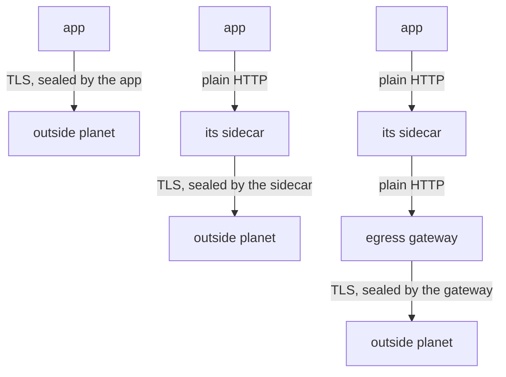

# Why HTTPS Is Opaque

Astronaut, before you fix the problem, look at it closely. This part shows exactly what the communications officer (the sidecar proxy) can see when the crew seals its own signal with HTTPS, and what that costs you.

## What the proxy sees

An HTTPS call from the application is a TCP connection that carries a TLS session. The proxy is not part of that session, so it cannot open the sealed crate. It can only see the outside of it:

| Visible | Not visible |
| --- | --- |
| the destination address and port | the HTTP method |
| the SNI server name in the handshake | the path |
| how many bytes moved, and for how long | request and response headers |
| whether the connection worked | the status code and the body |

**SNI** (Server Name Indication) is the host name the client writes on the outside of the crate, in plain text, at the start of the TLS handshake. It is the one useful thing the proxy can read. But it is one name per connection, not per request, and one connection can carry many requests.

## The flight log tells you plainly

The quickest proof is the shuttle's flight log (the proxy's access log). For an HTTP signal it writes the method, the path and the status code. For a sealed signal it cannot.

<!-- astrona:playground:renew -->

### Send a sealed signal

Send one HTTPS signal from the shuttle to `httpbin.org`, then read the last line of the shuttle's flight log:

```sh
kubectl exec -n starfleet deploy/shuttle -- curl -s -o /dev/null -w "%{http_code}\n" https://httpbin.org/get
kubectl logs -n starfleet deploy/shuttle -c istio-proxy --tail=1
```

You should see:

```text
200
[2026-10-08T22:53:14.535Z] "- - -" 0 - - - "-" 901 4875 618 - "-" "-" "-" "-" "18.233.182.23:443" PassthroughCluster 10.244.0.6:59668 18.233.182.23:443 10.244.0.6:59652 - -
```

The call worked, but the log line has `"- - -"` where the method, path and protocol should be, and `0` where the status code should be. The proxy moved 901 bytes out and 4875 bytes back to an address on port `443`, and that is all it knows. `PassthroughCluster` means the proxy let the signal through to a planet that is not on its star chart. If the log line is older than your call, wait a second and read it again.

### Send an open signal

Now send the same signal over plain HTTP:

```sh
kubectl exec -n starfleet deploy/shuttle -- curl -s -o /dev/null -w "%{http_code}\n" http://httpbin.org/get
kubectl logs -n starfleet deploy/shuttle -c istio-proxy --tail=1
```

You should see:

```text
200
[2026-10-08T22:53:18.193Z] "- - -" 0 - - - "-" 78 485 566 - "-" "-" "-" "-" "52.21.224.34:80" PassthroughCluster 10.244.0.6:50958 52.21.224.34:80 10.244.0.6:50954 - -
```

Surprise: still `"- - -"`, even though nothing was encrypted. The proxy only reads HTTP on a radio channel it **knows** carries HTTP. `httpbin.org` is not on the star chart yet, so the proxy treats the signal as raw bytes and passes it through.

### Look for a listener on port 80

A **listener** is the proxy's receiver for one radio channel. Ask the shuttle's proxy which listeners it has for port `80`:

```sh
istioctl proxy-config listener deploy/shuttle -n starfleet --port 80
```

You should see:

```text
ADDRESSES PORT MATCH DESTINATION
```

The list is empty. No Service and no chart entry in the mesh uses port `80`, so the proxy has no HTTP receiver for it. Two things must be true before the proxy can read a signal to an outside planet: the planet is on the star chart with an HTTP port, and the signal is not already sealed. Charting the planet is the first step of TLS origination.

## What that costs

Almost everything Istio does with traffic works on single requests. On a sealed stream there are no requests to work on:

| Feature | Works on a sealed HTTPS stream? |
| --- | --- |
| routing by path, header or method | no |
| weighted shifting and mirroring | no, there is nothing to split per request |
| route `timeout` and `retries` | no, the proxy cannot see where a request starts or ends |
| `connectionPool` limits at the TCP level | **yes**, connections are still visible |
| `outlierDetection` on 5xx answers | no, there are no status codes to count |
| fault injection | no |
| per-request flight log lines and metrics | no, only byte counts per connection |

One row still works. A TCP connection pool does not need to read the signal, so it can protect your ships from a slow partner even over HTTPS. If that is all you need, you do not need origination. For everything else, you do.

## Three ways to send an HTTPS signal out

There are three places where the TLS seal can be put on:



The diagram shows three arrangements, top to bottom: the application seals the signal itself, its own sidecar seals it, or an egress gateway (the departure gate of the solar system) seals it. This module is about the middle one.

In the middle arrangement, the only open hop is between the application and its own sidecar. Both sit in the same pod and talk over the pod's internal loopback connection. Nothing unencrypted leaves the ship.

## The application must call `http://`

Origination is invisible to the application except for one thing: **the application must call `http://`**, not `https://`. If it keeps calling `https://`, the proxy only sees a sealed crate again. Once origination is switched on, it gets worse: the proxy puts a second seal around the first one, and the call fails. Changing that one address in the application's configuration is the one step the mesh cannot do for you.

## Common pitfalls

> [!WARNING]
> - **Expecting routing or metrics on a signal the application sealed.** The proxy sees encrypted bytes. It can read the SNI name and nothing else.
> - **Expecting the proxy to read plain HTTP to an uncharted planet.** Without a chart entry with an HTTP port, port `80` signals pass through as raw bytes too.
> - **Calling the open first hop a downgrade.** It stays inside the pod. Nothing unencrypted leaves the node.
> - **Forgetting that the application must change.** It has to call `http://` and let its proxy add the seal.

> *When the application seals its own signal, its communications officer can only count bytes. The `"- - -"` in the flight log is the sign.*
