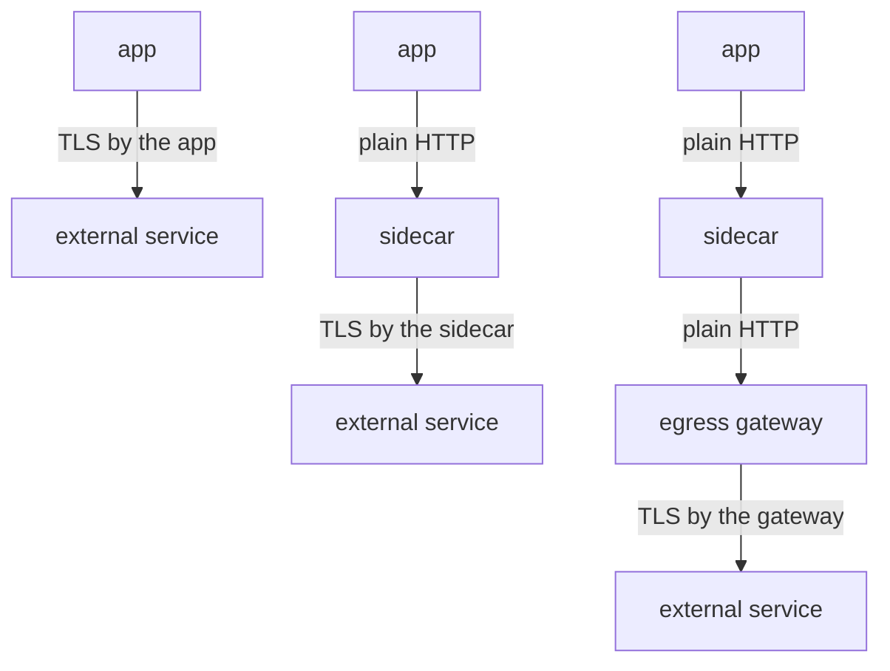

# Why The Proxy Cannot Read HTTPS Calls

Before you fix a problem, you should see it clearly. Istio's traffic features work on HTTP requests, but many applications call external services over HTTPS. This part shows exactly what the sidecar proxy can see when the application encrypts its own request, and which Istio features you lose because of it.

## What the proxy sees

The sidecar proxy (Envoy) is a proxy container that Istio adds to each pod. All inbound and outbound traffic of the pod passes through it. An HTTPS call from the application is a TCP connection that carries a TLS (Transport Layer Security) session. The proxy is not part of that TLS session, so it cannot decrypt it. It can only see the connection from the outside:

| Visible | Not visible |
| --- | --- |
| the destination address and port | the HTTP method |
| the SNI server name in the handshake | the path |
| how many bytes moved, and for how long | request and response headers |
| whether the connection worked | the status code and the body |

**SNI** (Server Name Indication) is the host name that the client sends in plain text at the start of the TLS handshake. It tells the server which certificate to use. It is the only useful name the proxy can read. But SNI is one name per connection, not per request, and one connection can carry many requests.

## The access log shows the difference

The quickest proof is the shuttle's access log. The proxy writes one access log line per request or connection. For an HTTP request, the line holds the method, the path and the status code. For an encrypted connection, the proxy cannot fill in those fields.

<!-- astrona:playground:renew -->

Send one HTTPS request from the `shuttle` pod to `httpbin.org`, then read the last line of the shuttle's access log:

```sh
kubectl exec -n starfleet deploy/shuttle -- curl -s -o /dev/null -w "%{http_code}\n" https://httpbin.org/get
kubectl logs -n starfleet deploy/shuttle -c istio-proxy --tail=1
```

You should see:

```text
200
[2026-10-08T22:53:14.535Z] "- - -" 0 - - - "-" 901 4875 618 - "-" "-" "-" "-" "18.233.182.23:443" PassthroughCluster 10.244.0.6:59668 18.233.182.23:443 10.244.0.6:59652 - -
```

The call worked, but the log line has `"- - -"` where the method, path and protocol should be. It has `0` where the status code should be. The proxy moved 901 bytes out and 4875 bytes back to an address on port `443`, and that is all it knows. `PassthroughCluster` means the proxy forwarded the connection to a host that is not in the mesh's service registry. If the log line is older than your call, wait a second and read it again.

Now send the same request over plain HTTP:

```sh
kubectl exec -n starfleet deploy/shuttle -- curl -s -o /dev/null -w "%{http_code}\n" http://httpbin.org/get
kubectl logs -n starfleet deploy/shuttle -c istio-proxy --tail=1
```

You should see:

```text
200
[2026-10-08T22:53:18.193Z] "- - -" 0 - - - "-" 78 485 566 - "-" "-" "-" "-" "52.21.224.34:80" PassthroughCluster 10.244.0.6:50958 52.21.224.34:80 10.244.0.6:50954 - -
```

The line still shows `"- - -"`, even though nothing was encrypted. The proxy only parses HTTP on a port that it **knows** carries HTTP. `httpbin.org` is not in the service registry yet, so the proxy treats the request as raw TCP bytes and forwards them.

A **listener** is the part of the proxy configuration that accepts traffic on one address and port, and decides how to handle it. Ask the shuttle's proxy which listeners it has for port `80`:

```sh
istioctl proxy-config listener deploy/shuttle -n starfleet --port 80
```

You should see:

```text
ADDRESSES PORT MATCH DESTINATION
```

The list is empty. No Service and no `ServiceEntry` in the mesh uses port `80`, so the proxy has no HTTP listener for it. Two things must be true before the proxy can read a request to an external service. First, the host is in the service registry with an HTTP port. Second, the application has not encrypted the request already. Adding the host with a `ServiceEntry` is the first step of TLS origination.

## What encryption by the application costs

Almost every Istio traffic feature works on single HTTP requests. On an encrypted TCP stream the proxy cannot see any requests, so these features have nothing to work on:

| Feature | Works on an encrypted HTTPS stream? |
| --- | --- |
| routing by path, header or method | no |
| weighted shifting and mirroring | no, there is nothing to split per request |
| route `timeout` and `retries` | no, the proxy cannot see where a request starts or ends |
| `connectionPool` limits at the TCP level | **yes**, connections are still visible |
| `outlierDetection` on 5xx answers | no, there are no status codes to count |
| fault injection | no |
| per-request access log lines and metrics | no, only byte counts per connection |

One row still works. A TCP connection pool limit does not need to read the request, so it can protect your workloads from a slow external service even over HTTPS. If that is all you need, you do not need TLS origination. For every other feature in the table, you do.

## Three places to add TLS

That leaves the question of where the TLS encryption should happen. There are three options:



The diagram shows three setups, top to bottom: the application encrypts the request itself, its own sidecar proxy encrypts it, or an egress gateway encrypts it. An egress gateway is an Envoy proxy at the edge of the mesh that handles traffic leaving the cluster. This module covers the middle setup: TLS origination in the sidecar.

In the middle setup, the only plain HTTP hop is between the application container and its own sidecar proxy. Both run in the same pod and connect over the pod's loopback interface. No unencrypted traffic leaves the pod.

## The application must call http://

TLS origination is invisible to the application, with one exception: **the application must call `http://`**, not `https://`. If it keeps calling `https://`, the proxy again sees only encrypted bytes. Once TLS origination is on, the result is worse: the proxy wraps a second TLS layer around the first one, and the call fails. Changing that one URL in the application's configuration is the one step the mesh cannot do for you.

You now know what the proxy can see in an encrypted connection, why plain HTTP to an unknown host is also passed through as raw bytes, and what you lose without TLS origination. The `"- - -"` in the access log is the sign of both cases. The open question is how to give the proxy an HTTP port and make it add TLS on the way out, which takes three Istio objects.

## Common pitfalls

> [!WARNING]
> - **Expecting routing or metrics on a request the application encrypted.** The proxy sees encrypted bytes. It can read the SNI name and nothing else.
> - **Expecting the proxy to read plain HTTP to a host that is not in the service registry.** Without a `ServiceEntry` with an HTTP port, port `80` traffic also passes through as raw bytes.
> - **Calling the plain first hop a security downgrade.** It stays inside the pod. No unencrypted traffic leaves the pod.
> - **Forgetting that the application must change.** It must call `http://` and let its sidecar proxy add TLS.
