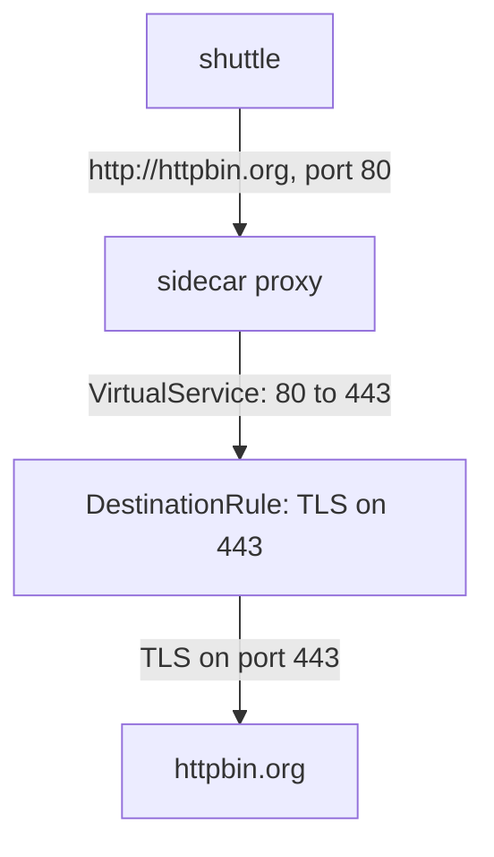

# Originate TLS With Three Istio Objects

When an application encrypts its own HTTPS call, its sidecar proxy sees only bytes. TLS (Transport Layer Security) origination fixes this: the application sends plain HTTP, and the sidecar proxy adds TLS on the way out. It needs three Istio objects, and each one does one job. This part builds them one at a time, and after each one you send a request to see what changed. Each stage has its own symptom, and you will meet the same symptom when that object is missing or wrong.



The diagram shows the path of one request: the application calls port `80`, the `VirtualService` moves the request to port `443`, and the `DestinationRule` makes the sidecar proxy open a TLS connection before the request leaves the pod. The `ServiceEntry` is what makes `httpbin.org` and both its ports known to the proxy in the first place.

## Add the host with two ports

A `ServiceEntry` adds a host outside the mesh to the mesh's service registry. For TLS origination it needs **two** ports. Port `80` with protocol `HTTP` is where the application's plain request arrives. Port `443` with protocol `HTTPS` is where the encrypted request leaves. People often forget port `80`. Without it, the proxy has no HTTP listener for the plain request.

<!-- astrona:playground:renew -->

Save this as `serviceentry-httpbin.yaml`:

```yaml
apiVersion: networking.istio.io/v1
kind: ServiceEntry
metadata:
  name: httpbin
  namespace: starfleet
spec:
  hosts:
  - httpbin.org
  location: MESH_EXTERNAL
  resolution: DNS
  ports:
  - number: 80
    name: http
    protocol: HTTP
  - number: 443
    name: https
    protocol: HTTPS
```

`location: MESH_EXTERNAL` says the host is outside the mesh, so it has no sidecar proxy. `resolution: DNS` tells the proxy to look up the address of `httpbin.org` in DNS itself.

Apply it:

```sh
kubectl apply -f serviceentry-httpbin.yaml
```

Then check the result. Send one plain HTTP request and one HTTPS request, and read the last two lines of the shuttle's access log:

```sh
kubectl exec -n starfleet deploy/shuttle -- curl -s -o /dev/null -w "%{http_code}\n" http://httpbin.org/get
kubectl exec -n starfleet deploy/shuttle -- curl -s -o /dev/null -w "%{http_code}\n" https://httpbin.org/get
kubectl logs -n starfleet deploy/shuttle -c istio-proxy --tail=2
```

You should see:

```text
200
200
[2026-10-08T22:53:28.272Z] "GET /get HTTP/1.1" 200 - via_upstream - "-" 0 929 235 234 "-" "curl/8.11.1" "91242682-4ae8-4424-8dd7-c359daea9a21" "httpbin.org" "54.159.186.149:80" outbound|80||httpbin.org 10.244.0.6:36968 32.194.118.12:80 10.244.0.6:40702 - default
[2026-10-08T22:53:28.587Z] "- - -" 0 - - - "-" 901 4875 623 - "-" "-" "-" "-" "52.21.224.34:443" outbound|443||httpbin.org 10.244.0.6:38182 52.21.224.34:443 10.244.0.6:38166 httpbin.org -
```

The plain request now has a readable line: `"GET /get HTTP/1.1" 200`, sent through the Envoy cluster `outbound|80||httpbin.org`. An Envoy cluster is the proxy's group of endpoints for one host and port. The HTTPS request still shows `"- - -"`. It now goes through `outbound|443||httpbin.org`, and the proxy logs the SNI (Server Name Indication) name `httpbin.org`, but it still cannot read the request.

The `ServiceEntry` alone does not add any encryption. The plain request still crosses the internet as plain HTTP on port `80`.

## Move the request to port 443

The application calls port `80`, but the encrypted request must leave on port `443`. A `VirtualService` holds routing rules for a host, and it can make that move. It matches requests that arrive on port `80` and routes them to the same host on port `443`. Only the port changes.

Save this as `virtualservice-httpbin.yaml`:

```yaml
apiVersion: networking.istio.io/v1
kind: VirtualService
metadata:
  name: httpbin
  namespace: starfleet
spec:
  hosts:
  - httpbin.org
  http:
  - match:
    - port: 80
    route:
    - destination:
        host: httpbin.org
        port:
          number: 443
```

Apply it:

```sh
kubectl apply -f virtualservice-httpbin.yaml
```

Then check the result. Send a plain HTTP request and read the access log:

```sh
kubectl exec -n starfleet deploy/shuttle -- curl -s -o /dev/null -w "%{http_code}\n" http://httpbin.org/get
kubectl logs -n starfleet deploy/shuttle -c istio-proxy --tail=1
```

You should see:

```text
400
[2026-10-08T22:53:47.310Z] "GET /get HTTP/1.1" 400 - via_upstream - "-" 0 220 236 235 "-" "curl/8.11.1" "7ccb1d45-fa38-4fe9-ac54-b141bb6f0fed" "httpbin.org" "52.21.224.34:443" outbound|443||httpbin.org 10.244.0.6:51070 100.51.105.232:80 10.244.0.6:53360 - -
```

The request now goes to port `443`, but as plain HTTP. The external server answers `400`, and the full response body says `The plain HTTP request was sent to HTTPS port`. `via_upstream` in the log means the response came from httpbin.org, not from your proxy. No object has told the proxy to use TLS yet.

## Turn on TLS for port 443

A `DestinationRule` holds the traffic policy for a destination: how a proxy connects to it. Its `tls` block with `mode: SIMPLE` makes the proxy open a TLS connection, like a normal HTTPS client. The proxy checks the server's certificate and encrypts the request.

Put the `tls` block under `portLevelSettings` for port `443` only. Port `80` is the plain side, where the application's request arrives, and it must stay plain. The `sni` field is the server name the proxy sends in the TLS handshake. The proxy is the TLS client now, so it must name the server.

Save this as `destinationrule-httpbin.yaml`:

```yaml
apiVersion: networking.istio.io/v1
kind: DestinationRule
metadata:
  name: httpbin
  namespace: starfleet
spec:
  host: httpbin.org
  trafficPolicy:
    portLevelSettings:
    - port:
        number: 443
      tls:
        mode: SIMPLE
        sni: httpbin.org
```

Apply it:

```sh
kubectl apply -f destinationrule-httpbin.yaml
```

Then check the result. Send a plain HTTP request, read the access log, and ask httpbin.org which URL it received:

```sh
kubectl exec -n starfleet deploy/shuttle -- curl -s -o /dev/null -w "%{http_code}\n" http://httpbin.org/get
kubectl logs -n starfleet deploy/shuttle -c istio-proxy --tail=1
kubectl exec -n starfleet deploy/shuttle -- curl -s http://httpbin.org/get | grep '"url"'
```

You should see:

```text
200
[2026-10-08T22:53:56.784Z] "GET /get HTTP/1.1" 200 - via_upstream - "-" 0 931 508 507 "-" "curl/8.11.1" "55f7d2df-0723-439e-a6bf-1616977b9b6e" "httpbin.org" "32.194.118.12:443" outbound|443||httpbin.org 10.244.0.6:60018 52.21.224.34:80 10.244.0.6:44636 - -
  "url": "https://httpbin.org/get"
```

The shuttle sent `http://`, and httpbin.org says it received `https://`. The sidecar proxy read the request (the log has the method, path and status), moved it to port `443`, and encrypted it on the way out.

You now have all three objects in place. The `ServiceEntry` declares both ports, the `VirtualService` moves the request from port `80` to port `443`, and the `DestinationRule` turns on TLS for port `443` only. Each object has its own symptom when it is missing: raw bytes or plain HTTP on port `80`, a `400` from the server, or no encryption at all. The open question is what happens when the objects look right but are placed wrong.

## Common pitfalls

> [!WARNING]
> - **Only port 443 in the `ServiceEntry`.** The plain request on port `80` has no HTTP listener and passes through as raw bytes. The mesh does not encrypt anything.
> - **No `VirtualService`.** The request stays on port `80` and crosses the internet as plain HTTP.
> - **No `DestinationRule`.** The request reaches port `443` as plain HTTP, and the server answers `400`.
> - **The `VirtualService` changing the host.** Only the port changes. The destination host stays `httpbin.org`.
