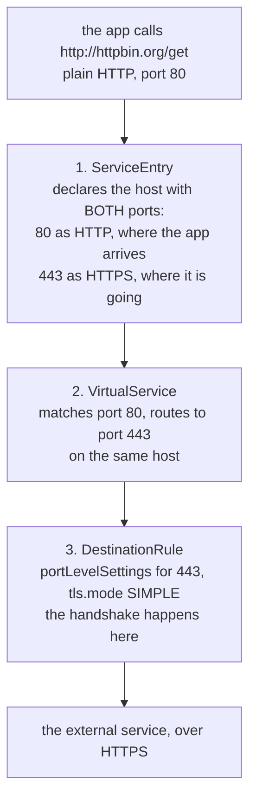

# The Three Objects

> Prerequisite: [Why HTTPS Is Opaque](./course-01-why-https-is-opaque.md). Next: [Proving It, And Mutual TLS](./course-03-proving-it-and-mutual-tls.md).

Three objects, each doing exactly one thing. Leaving any one out produces a distinct failure, so it is worth being able to name which does what before writing them.

## The division of labour



Each object does one job and none of them works alone. The most common failure is having two of the three.

| Omit | Symptom |
| --- | --- |
| port 80 from the `ServiceEntry` | the redirect has nothing to match; the call fails |
| the `VirtualService` | traffic stays on port 80 and the external service refuses plaintext |
| the `DestinationRule` | plaintext is sent to port 443; the handshake never happens and the service rejects it |

## ① The `ServiceEntry`, with two ports

```yaml
apiVersion: networking.istio.io/v1
kind: ServiceEntry
metadata:
  name: httpbin-ext
  namespace: tlsorig-demo
spec:
  hosts:
    - httpbin.org
  ports:
    - number: 80
      name: http
      protocol: HTTP
    - number: 443
      name: https
      protocol: HTTPS
  location: MESH_EXTERNAL
  resolution: DNS
```

Port 80 declared `HTTP` is what makes the request readable — that is module 1's lesson applied here. Port 443 declared `HTTPS` is the destination the redirect will aim at.

Declaring only 443 is the most common first attempt, and it fails because there is then no port-80 entry for the application's plaintext request to land on.

## ② The `VirtualService` — a port redirect

```yaml
apiVersion: networking.istio.io/v1
kind: VirtualService
metadata:
  name: httpbin-ext
  namespace: tlsorig-demo
spec:
  hosts:
    - httpbin.org
  http:
    - match:
        - port: 80
      route:
        - destination:
            host: httpbin.org
            port:
              number: 443
```

This is ordinary routing — the same object from section 010 — with the ports doing the work. `match: [{port: 80}]` selects traffic arriving on the plaintext port; the `route` sends it to 443 on the same host.

Note the destination host is unchanged. Only the port moves.

## ③ The `DestinationRule` — where the handshake happens

```yaml
apiVersion: networking.istio.io/v1
kind: DestinationRule
metadata:
  name: httpbin-ext
  namespace: tlsorig-demo
spec:
  host: httpbin.org
  trafficPolicy:
    portLevelSettings:
      - port:
          number: 443
        tls:
          mode: SIMPLE
          sni: httpbin.org
```

Two details here are the ones exams probe, and both are placement rather than syntax.

### `portLevelSettings`, not the top level

`tls` set directly under `trafficPolicy` applies to **every port** of the host — including port 80. The proxy would then try to originate TLS on the plaintext side as well, and the arrangement collapses.

The setting belongs to port 443 specifically, which is what `portLevelSettings` is for. This is the same precedence machinery from section 030 module 1, used for a different key.

### `sni`

**Server Name Indication** is the hostname the client announces during the TLS handshake, before any HTTP is exchanged. It exists because one IP address commonly serves many certificates, and the server must know which to present.

Since the proxy is now the TLS client, **the proxy must send it**. If it does not, a shared-hosting endpoint hands back the wrong certificate or rejects the handshake outright. Set it to the external hostname.

Some endpoints tolerate its absence — a host with a single certificate has nothing to disambiguate — which makes this a mistake that works in testing and fails in production.

> [!TIP]
> **Try it — apply all three and call over plain HTTP**
>
> ```sh
> kubectl apply -f - <<'EOF'
> apiVersion: networking.istio.io/v1
> kind: ServiceEntry
> metadata:
>   name: httpbin-ext
>   namespace: tlsorig-demo
> spec:
>   hosts:
>     - httpbin.org
>   ports:
>     - number: 80
>       name: http
>       protocol: HTTP
>     - number: 443
>       name: https
>       protocol: HTTPS
>   location: MESH_EXTERNAL
>   resolution: DNS
> ---
> apiVersion: networking.istio.io/v1
> kind: VirtualService
> metadata:
>   name: httpbin-ext
>   namespace: tlsorig-demo
> spec:
>   hosts:
>     - httpbin.org
>   http:
>     - match:
>         - port: 80
>       route:
>         - destination:
>             host: httpbin.org
>             port:
>               number: 443
> ---
> apiVersion: networking.istio.io/v1
> kind: DestinationRule
> metadata:
>   name: httpbin-ext
>   namespace: tlsorig-demo
> spec:
>   host: httpbin.org
>   trafficPolicy:
>     portLevelSettings:
>       - port:
>           number: 443
>         tls:
>           mode: SIMPLE
>           sni: httpbin.org
> EOF
> sleep 3
> kubectl -n tlsorig-demo exec deploy/tester -- \
>   curl -s -o /dev/null -w 'http:// call: %{http_code}\n' --max-time 15 http://httpbin.org/get
> ```
>
> Expect something like:
>
> ```text
> http:// call: 200
> ```
>
> A `200` from an `http://` URL against a service that only speaks HTTPS. The application did not change, and nothing was downgraded — the sidecar performed the handshake on its behalf.

## Breaking it deliberately

Worth doing once, because the failure is instructive and the fix is not obvious from the symptom.

> [!TIP]
> **Try it — move `tls` to the top level**
>
> ```sh
> kubectl -n tlsorig-demo patch destinationrule httpbin-ext --type merge -p '
> spec:
>   trafficPolicy:
>     tls:
>       mode: SIMPLE
>       sni: httpbin.org'
> sleep 3
> kubectl -n tlsorig-demo exec deploy/tester -- \
>   curl -s -o /dev/null -w 'top-level tls: %{http_code}\n' --max-time 15 http://httpbin.org/get
> ```
>
> Expect something like:
>
> ```text
> top-level tls: 503
> ```
>
> The `DestinationRule` is valid, `istioctl analyze` is clean, and the call fails — because the proxy is now trying to originate TLS toward port 80 as well, where the redirect starts. Re-apply the `portLevelSettings` version from the previous checkpoint before moving on. A 503 with a plausible-looking `DestinationRule` is the signature of this mistake.

> *`tls` belongs under `portLevelSettings` for port 443 — at the top level it applies to the plaintext port too and breaks the whole arrangement.*

## Common pitfalls

> [!WARNING]
> **Declaring only one port on the `ServiceEntry`.** Both are needed: 80 is where the application arrives, 443 is where the traffic goes.
>
> **Putting the `tls` block at the top level of the `trafficPolicy`.** It has to be under `portLevelSettings` for 443, or it applies to port 80 as well and breaks the arrival hop.
>
> **Forgetting the `VirtualService`.** Without the port redirect nothing ever reaches 443, and the `DestinationRule` is never consulted.
>
> **Using `tls.mode: ISTIO_MUTUAL` for an external host.** That is mesh identity. An external service wants `SIMPLE`, or `MUTUAL` with your own client certificate.

## Reference

- [Egress TLS origination](https://istio.io/latest/docs/tasks/traffic-management/egress/egress-tls-origination/) — the three-object walkthrough.
- [ClientTLSSettings API](https://istio.io/latest/docs/reference/config/networking/destination-rule/#ClientTLSSettings) — `mode`, `sni`, `credentialName` and the certificate fields.
- [TrafficPolicy `portLevelSettings`](https://istio.io/latest/docs/reference/config/networking/destination-rule/#TrafficPolicy-PortTrafficPolicy) — the per-port scope this module depends on.
- [RFC 6066 §3 (SNI)](https://www.rfc-editor.org/rfc/rfc6066#section-3) — what the field is, in two paragraphs.
