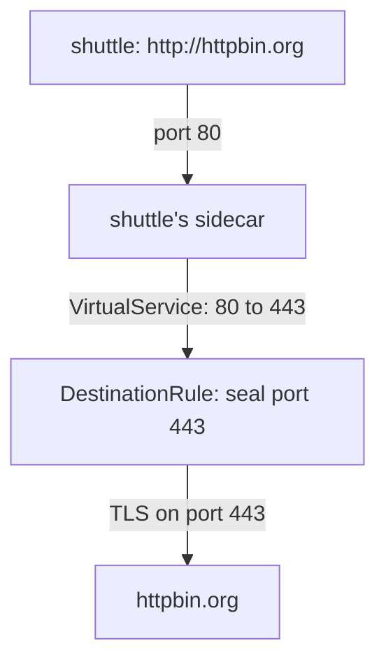

# The Three Objects

Astronaut, TLS origination needs three Istio objects, and each one does one job. You build them one at a time here, and after each one you send a signal to see what it changed. Every stage has its own symptom, and those symptoms are what you meet when one object is missing or wrong.



The diagram shows the path of one signal: the application calls port `80`, the flight plan moves the signal to port `443`, and the docking instructions seal it with TLS before it leaves. The `ServiceEntry` is what makes `httpbin.org` and both ports known in the first place.

## Chart the planet with two ports

A `ServiceEntry` adds a planet from another solar system to the star chart. For origination it needs **two** ports: port `80` with protocol `HTTP`, where the application's open signal arrives, and port `443` with protocol `HTTPS`, where the sealed signal leaves. Port `80` is the one people forget, and without it the proxy has no HTTP receiver for the open signal.

<!-- astrona:playground:renew -->

### Add httpbin.org to the star chart

Save this as `serviceentry-httpbin.yaml`:

```yaml
apiVersion: networking.istio.io/v1
kind: ServiceEntry
metadata:
  name: httpbin
  namespace: starfleet
spec:
  hosts:
  - httpbin.org
  location: MESH_EXTERNAL
  resolution: DNS
  ports:
  - number: 80
    name: http
    protocol: HTTP
  - number: 443
    name: https
    protocol: HTTPS
```

`location: MESH_EXTERNAL` says the planet is outside the mesh, so it has no sidecar. `resolution: DNS` tells the proxy to look up the address of `httpbin.org` itself.

Apply it:

```sh
kubectl apply -f serviceentry-httpbin.yaml
```

Then send one open and one sealed signal, and read the last two lines of the flight log:

```sh
kubectl exec -n starfleet deploy/shuttle -- curl -s -o /dev/null -w "%{http_code}\n" http://httpbin.org/get
kubectl exec -n starfleet deploy/shuttle -- curl -s -o /dev/null -w "%{http_code}\n" https://httpbin.org/get
kubectl logs -n starfleet deploy/shuttle -c istio-proxy --tail=2
```

You should see:

```text
200
200
[2026-10-08T22:53:28.272Z] "GET /get HTTP/1.1" 200 - via_upstream - "-" 0 929 235 234 "-" "curl/8.11.1" "91242682-4ae8-4424-8dd7-c359daea9a21" "httpbin.org" "54.159.186.149:80" outbound|80||httpbin.org 10.244.0.6:36968 32.194.118.12:80 10.244.0.6:40702 - default
[2026-10-08T22:53:28.587Z] "- - -" 0 - - - "-" 901 4875 623 - "-" "-" "-" "-" "52.21.224.34:443" outbound|443||httpbin.org 10.244.0.6:38182 52.21.224.34:443 10.244.0.6:38166 httpbin.org -
```

The open signal now has a readable line: `"GET /get HTTP/1.1" 200`, sent through the cluster `outbound|80||httpbin.org`. The sealed signal is still `"- - -"`. It now goes through `outbound|443||httpbin.org`, and the proxy logs the SNI name `httpbin.org`, but it still cannot read the request. Charting the planet alone does not seal anything: the open signal still travels across the internet as plain HTTP.

## Move the signal to port 443

The application calls port `80`, but the sealed signal must leave on port `443`. A `VirtualService` (the flight plan) does that move. It matches signals that arrive on port `80` and routes them to the same host on port `443`. Only the port changes.

### Write the port redirect

Save this as `virtualservice-httpbin.yaml`:

```yaml
apiVersion: networking.istio.io/v1
kind: VirtualService
metadata:
  name: httpbin
  namespace: starfleet
spec:
  hosts:
  - httpbin.org
  http:
  - match:
    - port: 80
    route:
    - destination:
        host: httpbin.org
        port:
          number: 443
```

Apply it:

```sh
kubectl apply -f virtualservice-httpbin.yaml
```

Then send an open signal and read the flight log:

```sh
kubectl exec -n starfleet deploy/shuttle -- curl -s -o /dev/null -w "%{http_code}\n" http://httpbin.org/get
kubectl logs -n starfleet deploy/shuttle -c istio-proxy --tail=1
```

You should see:

```text
400
[2026-10-08T22:53:47.310Z] "GET /get HTTP/1.1" 400 - via_upstream - "-" 0 220 236 235 "-" "curl/8.11.1" "7ccb1d45-fa38-4fe9-ac54-b141bb6f0fed" "httpbin.org" "52.21.224.34:443" outbound|443||httpbin.org 10.244.0.6:51070 100.51.105.232:80 10.244.0.6:53360 - -
```

The signal now goes to port `443`, but as plain HTTP. The outside server answers `400`, and the full body says `The plain HTTP request was sent to HTTPS port`. `via_upstream` in the log tells you the answer came from httpbin.org, not from your proxy. Nobody has told the proxy to seal the signal yet.

## Seal the signal on port 443

A `DestinationRule` (the docking instructions) tells the proxy how to connect to a destination. Its `tls` block with `mode: SIMPLE` makes the proxy open a TLS connection, like a normal HTTPS client: it checks the server's certificate and encrypts the signal.

Put the `tls` block under `portLevelSettings` for port `443` only. Port `80` is the open side, where the application arrives, and it must stay plain. The `sni` field is the host name the proxy writes on the outside of the sealed crate. The proxy is the TLS client now, so it has to name the server.

### Add the docking instructions

Save this as `destinationrule-httpbin.yaml`:

```yaml
apiVersion: networking.istio.io/v1
kind: DestinationRule
metadata:
  name: httpbin
  namespace: starfleet
spec:
  host: httpbin.org
  trafficPolicy:
    portLevelSettings:
    - port:
        number: 443
      tls:
        mode: SIMPLE
        sni: httpbin.org
```

Apply it:

```sh
kubectl apply -f destinationrule-httpbin.yaml
```

Then send an open signal, read the flight log, and ask httpbin.org which address it was reached on:

```sh
kubectl exec -n starfleet deploy/shuttle -- curl -s -o /dev/null -w "%{http_code}\n" http://httpbin.org/get
kubectl logs -n starfleet deploy/shuttle -c istio-proxy --tail=1
kubectl exec -n starfleet deploy/shuttle -- curl -s http://httpbin.org/get | grep '"url"'
```

You should see:

```text
200
[2026-10-08T22:53:56.784Z] "GET /get HTTP/1.1" 200 - via_upstream - "-" 0 931 508 507 "-" "curl/8.11.1" "55f7d2df-0723-439e-a6bf-1616977b9b6e" "httpbin.org" "32.194.118.12:443" outbound|443||httpbin.org 10.244.0.6:60018 52.21.224.34:80 10.244.0.6:44636 - -
  "url": "https://httpbin.org/get"
```

The shuttle sent `http://`, and httpbin.org says it was reached on `https://`. The proxy read the request (the log has the method, path and status), moved it to port `443`, and sealed it on the way out. All three objects are now in place.

## Common pitfalls

> [!WARNING]
> - **Only port 443 in the `ServiceEntry`.** The open signal on port `80` has no HTTP receiver and passes through as raw bytes. Nothing is sealed by the mesh.
> - **No `VirtualService`.** The signal stays on port `80` and travels as plain HTTP across the internet.
> - **No `DestinationRule`.** The signal reaches port `443` as plain HTTP, and the server answers `400`.
> - **The `VirtualService` changing the host.** Only the port changes. The destination host stays `httpbin.org`.

> *The `ServiceEntry` charts both ports, the `VirtualService` moves the signal from 80 to 443, and the `DestinationRule` seals port 443 only.*
