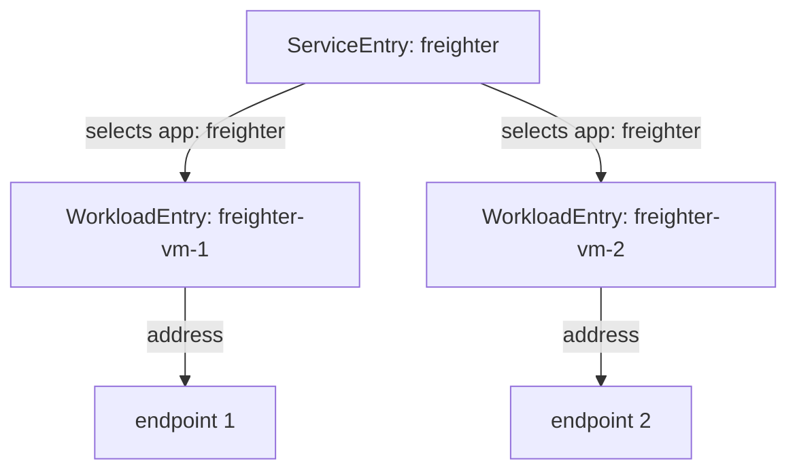

# Put Several Machines Behind One Host With workloadSelector

Real services run on more than one machine. A `ServiceEntry` with a `workloadSelector` finds its machines by label, so adding a machine means adding one `WorkloadEntry`, with no change to the `ServiceEntry`. A `WorkloadEntry` is the object that describes one machine outside Kubernetes: its address, its labels and its ServiceAccount. The label link between the two objects is easy to use, and it is also easy to break without any warning. This part does both.

The commands below need three objects in your playground: the `freighter-vm-1` `WorkloadEntry` with the label `app: freighter`, the `freighter` `ServiceEntry` (`MESH_INTERNAL`, `STATIC`, selecting `app: freighter`), and the `freighter` `DestinationRule` that sets `tls` mode `DISABLE`, because the stand-in pods have no sidecar proxy and cannot accept mTLS (mutual TLS).

## One label, many machines

Every `WorkloadEntry` in the namespace whose labels match the `workloadSelector` becomes one endpoint of the host. An endpoint is an IP address and port that the caller's sidecar proxy can send requests to. `istiod`, Istio's control plane, collects the matching entries and sends their addresses to every proxy.



The diagram shows one `ServiceEntry` selecting two `WorkloadEntry` objects by the same label, and each entry adding one endpoint to the cluster `outbound|8080||freighter.starfleet.mesh`.

<!-- astrona:playground:renew -->

Get the address of the second freighter pod:

```sh
FREIGHTER_VM_2=$(kubectl get pod -n starfleet -l ship=freighter-vm-2 -o jsonpath='{.items[0].status.podIP}')
echo $FREIGHTER_VM_2
```

```text
10.244.0.10
```

In the YAML, replace `<FREIGHTER_VM_2>` with that address. Save this as `workloadentry-freighter-vm-2.yaml`:

```yaml
apiVersion: networking.istio.io/v1
kind: WorkloadEntry
metadata:
  name: freighter-vm-2
  namespace: starfleet
spec:
  address: <FREIGHTER_VM_2>
  labels:
    app: freighter
  serviceAccount: freighter
```

Apply it:

```sh
kubectl apply -f workloadentry-freighter-vm-2.yaml
```

Then check the result:

```sh
istioctl proxy-config endpoints deploy/shuttle -n starfleet --cluster "outbound|8080||freighter.starfleet.mesh"
```

You should see:

```text
ENDPOINT             STATUS      OUTLIER CHECK     CLUSTER
10.244.0.10:8080     HEALTHY     OK                outbound|8080||freighter.starfleet.mesh
10.244.0.9:8080      HEALTHY     OK                outbound|8080||freighter.starfleet.mesh
```

The cluster now has two endpoints behind one host name. You did not change the `ServiceEntry`: its selector found the new entry by its label.

To see both machines answer, send 10 requests to the host name and count which pod answered each one. The `/hostname` path returns the name of the pod:

```sh
for i in $(seq 1 10); do
  kubectl exec -n starfleet deploy/shuttle -- curl -s http://freighter.starfleet.mesh:8080/hostname | grep -o 'freighter-vm-[0-9]'
done | sort | uniq -c
```

You should see something like:

```text
   2 freighter-vm-1
   8 freighter-vm-2
```

Both machines answer. The `shuttle` sidecar proxy spreads the requests across the two endpoints, the same way it does across two pods. Your numbers will be different each time.

## When the selector matches nothing

The link between the `ServiceEntry` and its entries is only a label. If the two sides do not agree, no tool reports it: not `kubectl`, not `istiod`, not `istioctl analyze`. The host stays in the service registry with no endpoints behind it.

To see this, swap two letters in the selector label. Save this as `serviceentry-freighter-typo.yaml`:

```yaml
apiVersion: networking.istio.io/v1
kind: ServiceEntry
metadata:
  name: freighter
  namespace: starfleet
spec:
  hosts:
  - freighter.starfleet.mesh
  location: MESH_INTERNAL
  resolution: STATIC
  ports:
  - number: 8080
    name: http
    protocol: HTTP
  workloadSelector:
    labels:
      app: frieghter
```

Apply it:

```sh
kubectl apply -f serviceentry-freighter-typo.yaml
```

Then list the endpoints, send a request, read the access log and run `istioctl analyze`:

```sh
istioctl proxy-config endpoints deploy/shuttle -n starfleet --cluster "outbound|8080||freighter.starfleet.mesh"
kubectl exec -n starfleet deploy/shuttle -- curl -s -o /dev/null -w "%{http_code}\n" http://freighter.starfleet.mesh:8080/hostname
kubectl logs -n starfleet deploy/shuttle -c istio-proxy --tail=1
istioctl analyze -n starfleet
```

You should see (log line trimmed):

```text
ENDPOINT     STATUS     OUTLIER CHECK     CLUSTER
503
"GET /hostname HTTP/1.1" 503 UH no_healthy_upstream ... "-" outbound|8080||freighter.starfleet.mesh ...
✔ No validation issues found when analyzing namespace: starfleet.
```

The endpoint list is empty. The request gets `503` with the response flag `UH` (no healthy upstream): the cluster exists, but it has no endpoint. The upstream address field in the log is `"-"`, because the proxy had no endpoint to pick. `istioctl analyze` finds nothing wrong, because a selector that matches nothing is valid configuration.

Apply the correct selector again:

```sh
kubectl apply -f serviceentry-freighter.yaml
```

## Two more rules for the selector

The `workloadSelector` also selects pods with matching labels in the same namespace, not only `WorkloadEntry` objects. This helps while you move a service from machines into Kubernetes, because old machines and new pods can serve the same host. It is also why the freighter pods in the playground carry a different label (`ship: ...`) than their entries (`app: freighter`): otherwise the selector would pick the pods directly.

A `ServiceEntry` takes its addresses either from a `workloadSelector` or from a list of `endpoints`, never both. The Istio validation webhook rejects an object that has both, with the message `only one of WorkloadSelector or Endpoints can be set`.

> [!TIP]
> When a host from a `ServiceEntry` answers `503 UH`, list its endpoints with `istioctl proxy-config endpoints` first. An empty list means the selector and the labels of the entries do not match.

You can now put several machines behind one host name and find a selector that matches nothing from a `503 UH` and an empty endpoint list. Every entry so far was written by hand, with an address you looked up yourself. The open question is how this scales to many machines that start and stop on their own.

## Common pitfalls

> [!WARNING]
> - **A selector label that no entry carries.** Zero endpoints, `503 UH`, and `istioctl analyze` reports nothing.
> - **One entry with a different label.** Only some of the machines answer. Count the endpoints, not only the status codes.
> - **Writing a new `ServiceEntry` for the second machine.** A second `WorkloadEntry` with the same labels joins the existing host.
> - **Giving the pods the same label as the entries by accident.** The selector picks the pods too.
> - **Setting `endpoints` and `workloadSelector` together.** Istio rejects the object.

## Your mission: Fix A ServiceEntry Selector And WorkloadEntry Labels Lab

You can now put several machines behind one host and find a selector that matches nothing. In the lab, every request to `freighter.starfleet.mesh` fails with `503`, more than one setting is wrong, and you must make both machines answer as members of the mesh.

The lab runs in its own cluster, so first pause your playground. Nothing in it is lost:

```sh
astrona stop ats-014-playground-070-03
```

Then start the lab:

```sh
astrona run --git git@github.com:astrona-io/ATS014.git -c sections/section-070/module-03/labs/lab-02
```

The task is on the next page. Solve it on your own first. When you think you are done, send it for grading:

```sh
astrona submit -c sections/section-070/module-03/labs/lab-02
```

When the lab is done, remove it and start your playground again:

```sh
astrona destroy ats-014-lab-070-03-02
astrona start ats-014-playground-070-03
```
