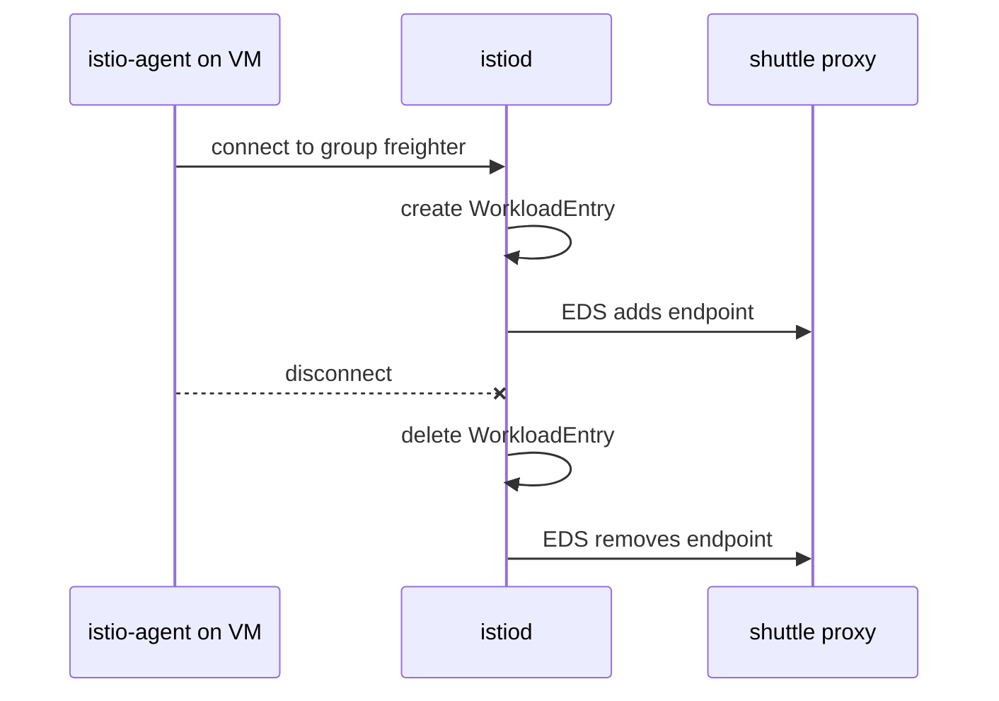

# Register Virtual Machines With WorkloadGroup

Writing one `WorkloadEntry` per machine by hand works for two machines. It does not work for a group of machines that start and stop every hour. A `WorkloadEntry` is the object that describes one machine outside Kubernetes: its address, its labels and its ServiceAccount. A `WorkloadGroup` lets each machine register itself, so `istiod` writes the `WorkloadEntry` for it. This part shows the object, what a real virtual machine needs to use it, and where the playground stops being like a real machine.

The commands below need the `freighter-vm-1` and `freighter-vm-2` `WorkloadEntry` objects applied in your playground, each with the label `app: freighter` and the ServiceAccount `freighter`.

## The problem with entries written by hand

Two failures follow when a person writes every entry:

- **A new machine has an address nobody wrote down.** Until someone writes its `WorkloadEntry`, no request in the mesh reaches it, even though it is up and ready.
- **A removed machine leaves an old entry behind.** The proxies keep an endpoint that no longer exists, and callers get failed requests until someone deletes the entry.

Neither failure is a mistake in the YAML. Both come from writing entries by hand, and the `WorkloadGroup` removes that step.

## `WorkloadGroup`: a template for many machines

A `WorkloadGroup` describes what every machine of one service looks like: its labels, its ServiceAccount, its ports, and optionally a health check. It has no address. A real virtual machine runs `istio-agent`, the Istio program that starts the machine's sidecar proxy and connects it to `istiod`, Istio's control plane. When the agent starts, it tells `istiod` which group the machine belongs to. `istiod` then creates the `WorkloadEntry` for the machine, with the machine's own address, and removes it again shortly after the machine disconnects.



The diagram shows auto-registration: the agent on the virtual machine connects to `istiod` and names its group, `istiod` creates the `WorkloadEntry`, and every sidecar proxy gets the new endpoint over EDS (Endpoint Discovery Service). When the machine disconnects, `istiod` deletes the entry and the endpoint goes away.

The three object names are easy to mix up, so compare them with the Kubernetes objects you know:

| For machines outside Kubernetes | Creates or selects | In Kubernetes | Creates or selects |
| --- | --- | --- | --- |
| `WorkloadGroup` | `WorkloadEntry` | Deployment | Pod |
| `ServiceEntry` with a `workloadSelector` | the entries it selects | Service | the pods it selects |

The first row is a template that creates instances. The second row is a host name and ports in front of whatever matches the labels. So a fully automatic setup has only two objects written by hand, the `WorkloadGroup` and the `ServiceEntry`, and no `WorkloadEntry` written by hand at all.

<!-- astrona:playground:renew -->

Write a group whose template matches the two entries you wrote by hand. Save this as `workloadgroup-freighter.yaml`:

```yaml
apiVersion: networking.istio.io/v1
kind: WorkloadGroup
metadata:
  name: freighter
  namespace: starfleet
spec:
  metadata:
    labels:
      app: freighter
  template:
    serviceAccount: freighter
    ports:
      http: 8080
```

Apply it:

```sh
kubectl apply -f workloadgroup-freighter.yaml
```

Then check the result:

```sh
kubectl get workloadgroup,workloadentry -n starfleet
```

You should see:

```text
NAME                                          AGE
workloadgroup.networking.istio.io/freighter   0s

NAME                                               AGE    ADDRESS
workloadentry.networking.istio.io/freighter-vm-1   109s   10.244.0.9
workloadentry.networking.istio.io/freighter-vm-2   33s    10.244.0.10
```

There is one group, and still only the two entries you wrote. No new entry appeared, and none will: the stand-in pods do not run `istio-agent`, so nothing registers against the group. Compare the group with the entries anyway. They have the same labels, the same ServiceAccount and the same port. That is exactly what registration fills in, with the address taken from the machine itself.

## What a real virtual machine needs

Registration needs more than configuration in the cluster. Before a machine can register, it needs all of this:

| What it needs | Why |
| --- | --- |
| `istio-agent` installed and running | It starts the sidecar proxy on the machine, connects to `istiod` and registers |
| A token for the group's ServiceAccount | It proves that the machine may use that identity |
| The mesh's root certificate | So the machine can verify the certificate of `istiod` |
| Configuration files (`cluster.env`, `mesh.yaml`) | Trust domain, network, group and the address of `istiod` |
| A network path to `istiod` on port `15012` | The port where `istiod` serves xDS (the protocol it uses to send configuration) and certificates |
| An address the pods can reach | Otherwise no request reaches the machine after it registers |

You do not write the token, the certificate and the configuration files by hand. `istioctl` builds them from the `WorkloadGroup`, ready to copy onto the machine. Ask it for the files of the `freighter` group, written to a local folder called `vm-files`:

```sh
istioctl x workload entry configure -f workloadgroup-freighter.yaml -o vm-files --clusterID Kubernetes --autoregister
```

You should see:

```text
Warning: a security token for namespace "starfleet" and service account "freighter" has been generated and stored at "vm-files/istio-token"
2026-10-08T23:02:45.199096Z	warn	Could not auto-detect IP for istiod.istio-system.svc/istio-system. Use --ingressIP to manually specify the Gateway address to reach istiod from the VM.
Configuration generation into directory vm-files was successful
```

Then list the files, and show the lines in `cluster.env` that come from your group:

```sh
ls vm-files
grep -E "AUTO_REGISTER|SERVICE_ACCOUNT|METAJSON_LABELS|INBOUND_PORTS" vm-files/cluster.env
```

```text
cluster.env
hosts
istio-token
mesh.yaml
root-cert.pem
ISTIO_INBOUND_PORTS='8080'
ISTIO_METAJSON_LABELS='{"app":"freighter","service.istio.io/canonical-name":"freighter","service.istio.io/canonical-revision":"latest"}'
ISTIO_META_AUTO_REGISTER_GROUP='freighter'
SERVICE_ACCOUNT='freighter'
```

Every value from your `WorkloadGroup` is there: the port, the label and the ServiceAccount. `ISTIO_META_AUTO_REGISTER_GROUP` tells the agent which group to register against. The token (`istio-token`) and the root certificate (`root-cert.pem`) let the machine prove its identity and trust `istiod`. The warning says that `istioctl` found no address of `istiod` that a machine outside the cluster can reach. A real setup exposes `istiod` through a gateway and passes that address with `--ingressIP`. The playground has no such gateway.

## What the playground cannot show

The stand-in is a pod without a sidecar proxy. Host names, selectors and routing work on it exactly as on a real machine. Three things do not:

- **Registering itself.** It runs no `istio-agent`, has no token and never connects to `istiod`. Your `WorkloadGroup` is valid, but no entry comes from it here.
- **Proving its identity.** The `serviceAccount` on your entries is only declared. A real machine sends its token to `istiod` and gets a certificate.
- **Accepting mTLS.** `MESH_INTERNAL` makes callers use mTLS (mutual TLS), which the stand-in cannot accept. That is why the playground needs the `tls` `DISABLE` `DestinationRule`, and a real machine with `istio-agent` does not.

Delete the files on your own machine when you are done. The token in them is a working credential for the `freighter` identity:

```sh
rm -rf vm-files
```

You now know the whole set of objects for machines outside Kubernetes. A `WorkloadEntry` describes one machine, a `MESH_INTERNAL` `ServiceEntry` with a `workloadSelector` gives the machines one host name, and a `WorkloadGroup` is the template that real machines with `istio-agent` register against. What stays open in a real setup is the network work around it: a gateway that exposes `istiod` and a path from the pods to the machines.

## Common pitfalls

> [!WARNING]
> - **Mixing up `WorkloadGroup` and `WorkloadEntry`.** The group is the template; the entry is one machine with an address.
> - **Expecting a `WorkloadGroup` alone to create endpoints.** Nothing appears until a machine with `istio-agent` registers against it.
> - **A template that does not match the `ServiceEntry`.** Registered entries get the group's labels. If the `workloadSelector` does not match them, the host has no endpoints.
> - **Forgetting the ServiceAccount.** The template's `serviceAccount` must exist in the group's namespace, and the token is made for it.
> - **Forgetting the network path.** The machine must reach `istiod` on port `15012`, and the pods must reach the machine.
> - **Leaving the onboarding files on disk.** `istio-token` is a working credential. Treat it like a password.

## Your mission: Add Two Virtual Machines To The Mesh With WorkloadEntry Lab

You can now describe machines with `WorkloadEntry`, give them a host name with a `MESH_INTERNAL` `ServiceEntry`, and write the `WorkloadGroup` that real machines register against. The lab asks you to add two stand-in machines to the mesh as one service, starting from nothing. The lab uses its own small app (`tester`, `legacy-vm-1` and `legacy-vm-2` in the `vm-demo` namespace), not the Starfleet.

The lab runs in its own cluster, so first pause your playground. Nothing in it is lost:

```sh
astrona stop ats-014-playground-070-03
```

Then start the lab:

```sh
astrona run --git git@github.com:astrona-io/ATS014.git -c sections/section-070/module-03/labs/lab-01
```

The task is on the next page. Solve it on your own first. When you think you are done, send it for grading:

```sh
astrona submit -c sections/section-070/module-03/labs/lab-01
```

When the lab is done, remove it and start your playground again:

```sh
astrona destroy ats-014-lab-070-03
astrona start ats-014-playground-070-03
```
