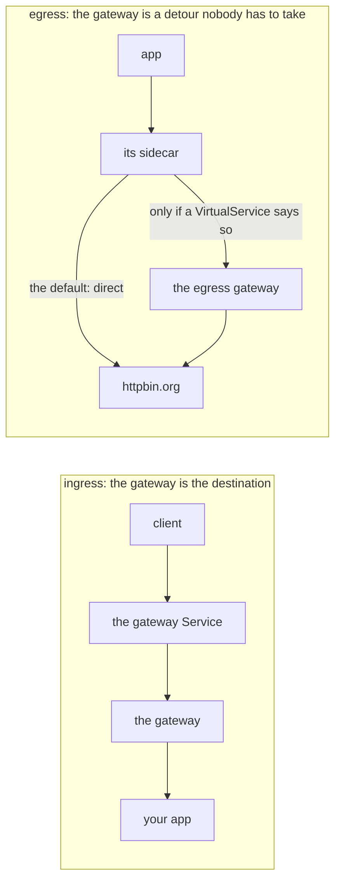

# A Gateway That Carries Nothing

> Prerequisite: [the module landing page](./course.md). Next: [The Two-Stage `VirtualService`](./course-02-the-two-stage-virtualservice.md).

Most clusters running the `demo` profile have an egress gateway they have never used. This part is about why, and about the one field in the `Gateway` object that reads backwards until you think about who is serving whom.

## It is already running, and it is idle

The `demo` profile installs `istio-egressgateway` alongside the ingress one. It is a standalone Envoy, `1/1`, exposed through a Service — structurally identical to the ingress gateway from section 060, and doing nothing at all.

> [!TIP]
> **Try it — the egress gateway exists and carries nothing**
>
> ```sh
> kubectl -n istio-system get pods -l istio=egressgateway
> kubectl -n egwgw-demo exec deploy/tester -- \
>   curl -s -o /dev/null -w 'external call: %{http_code}\n' --max-time 15 http://httpbin.org/get
> kubectl -n istio-system logs deploy/istio-egressgateway --tail=50 2>/dev/null | grep -c httpbin.org
> ```
>
> Expect something like:
>
> ```text
> NAME                                   READY   STATUS    AGE
> istio-egressgateway-7f4b6d8c9d-2wnzq   1/1     Running   8m
> external call: 200
> 0
> ```
>
> The pod is running, the external call works, and the gateway logged **nothing**. The traffic left through `tester`'s own sidecar, direct to the internet. This is the state most clusters are in without realising it — an egress gateway deployed by the profile, carrying zero traffic.

That zero is the fact to internalise. Deploying an egress gateway is not a security control. **Routing** traffic to it is.

## Why there is no interception

Ingress and egress are not symmetric, and it is worth seeing why.

For **ingress**, traffic arrives *at* the gateway's Service because a client resolved its address and connected to it. The gateway is the destination.

For **egress**, traffic is headed for `httpbin.org`. The sidecar intercepts it, and then has to decide where to send it. Left alone, it sends it to `httpbin.org`. Nothing about the egress gateway's existence changes that decision — the gateway is just another cluster the sidecar could route to, and something has to tell it to.



An ingress gateway is addressed; an egress gateway is chosen. Nothing intercepts outbound traffic on its behalf, which is why an idle egress gateway is the normal state.

## The `Gateway` object

```yaml
apiVersion: networking.istio.io/v1
kind: Gateway
metadata:
  name: istio-egressgateway
  namespace: egwgw-demo
spec:
  selector:
    istio: egressgateway
  servers:
    - port:
        number: 80
        name: http
        protocol: HTTP
      hosts:
        - httpbin.org
```

Structurally this is section 060's object. `selector` finds the gateway pods — `istio: egressgateway` this time — and `servers` opens a listener.

The field that reads backwards is **`hosts`**:

> `servers[].hosts` lists **`httpbin.org`** — the *external* hostname, not anything internal.

Read the object from the gateway's point of view: *"which hostnames will I serve requests for?"* The gateway is going to receive requests destined for `httpbin.org`, so that is the host it must accept. The traffic arrives at the gateway's Service address, but the `Host` header still says `httpbin.org`, and that is what the listener matches on.

Putting an internal name there — `istio-egressgateway.istio-system.svc.cluster.local`, say — is a common first attempt and produces a gateway that rejects everything you send it, with a 404 that looks inexplicable.

## The conventional `DestinationRule`

Most examples, including Istio's own, include an object that looks pointless:

```yaml
apiVersion: networking.istio.io/v1
kind: DestinationRule
metadata:
  name: egressgateway-for-httpbin
  namespace: egwgw-demo
spec:
  host: istio-egressgateway.istio-system.svc.cluster.local
  subsets:
    - name: httpbin
```

A subset with a name and **no labels**. It selects every endpoint of the gateway Service — which is to say, it narrows nothing.

It is there so that the two stages in Part 2 can name a distinct cluster per external host. With several external services routed through one gateway, each gets its own subset, and the proxy configuration and telemetry stay distinguishable per destination rather than collapsing into one `istio-egressgateway` bucket.

It is a naming device, not a filter. Recognise it; you do not have to be impressed by it.

> *A deployed egress gateway is evidence of nothing — until a `VirtualService` routes traffic to it, it carries zero bytes.*

## Common pitfalls

> [!WARNING]
> **Expecting the egress gateway to capture outbound traffic.** Nothing routes through it until a `VirtualService` sends traffic there. Deploying one changes nothing on its own.
>
> **Assuming a gateway that is running is a gateway that is used.** An idle egress gateway looks identical to a working one from `kubectl`.
>
> **Reading it as a security boundary.** It is a routing hop. A workload that bypasses its sidecar, or has none, never sees it. Section 010's `Sidecar` caveat applies again.
>
> **Forgetting the conventional `DestinationRule`.** The sidecar needs a subset to send traffic to the gateway with, and it is easy to leave out because it looks like boilerplate.

## Reference

- [Egress gateways task](https://istio.io/latest/docs/tasks/traffic-management/egress/egress-gateway/) — the upstream walkthrough this module follows.
- [Gateway API (networking.istio.io)](https://istio.io/latest/docs/reference/config/networking/gateway/) — the same object as section 060, used for egress.
- [Egress gateways with TLS origination](https://istio.io/latest/docs/tasks/traffic-management/egress/egress-gateway-tls-origination/) — where module 2 takes this.
- `kubectl -n istio-system logs deploy/istio-egressgateway` — the audit trail the whole arrangement exists to produce.
