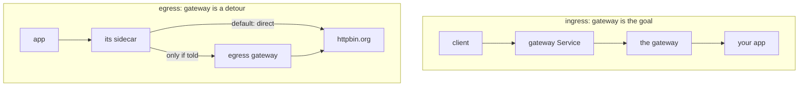

# A Gateway That Carries Nothing

Many solar systems (clusters) have a departure gate (an egress gateway) that no signal has ever used. This part is about why. It is also about the one field in the `Gateway` object that reads backwards until you think about who is serving whom.

## It is running, and it is idle

An egress gateway is the solar system's departure gate: one checked exit that all signals leaving the solar system can go through. Technically it is a standalone Envoy proxy. It is the same program as every communications officer (sidecar), but it flies on its own spaceship (pod) instead of beside an app. It sits behind a beacon (a Service), built just like the ingress gateway from section 060, and it does nothing at all until you route signals to it.

Where it lives depends on how Istio was installed:

| Install | Deployment and namespace | Pod label the `Gateway` selects |
| --- | --- | --- |
| Helm `gateway` chart, release `istio-egress` (the playground) | `istio-egress` in `istio-egress` | `istio: egress` |
| `istioctl install --set profile=demo` (the graded lab) | `istio-egressgateway` in `istio-system` | `istio: egressgateway` |

Check the label before you write a `Gateway`: `kubectl get pods -A -l 'istio in (egress,egressgateway)' --show-labels`.

First, the direct path. Register `httpbin.org` with a `ServiceEntry` (section 070), so it is on the star chart, and call it:

> [!TIP]
> **Try it — straight to the internet, past an idle gateway**
>
> ```sh
> cat > serviceentry-httpbin-org.yaml <<'EOF'
> apiVersion: networking.istio.io/v1
> kind: ServiceEntry
> metadata:
>   name: httpbin-org
>   namespace: bookinfo
> spec:
>   hosts:
>     - httpbin.org
>   ports:
>     - number: 443
>       name: tls
>       protocol: TLS
>   location: MESH_EXTERNAL
>   resolution: DNS
> EOF
> kubectl apply -f serviceentry-httpbin-org.yaml
> kubectl get pods -n istio-egress -l istio=egress
> call_external
> log_hop1_sidecar
> kubectl logs -n istio-egress deploy/istio-egress --tail=50 | grep -c httpbin.org
> ```
>
> Expect the egress gateway pod `Running`, then `200`, and a sidecar log line that ends at an internet IP:
>
> ```text
> ... "54.175.207.120:443" outbound|443||httpbin.org ...
> ```
>
> (IPs vary.) The last command prints `0`: the gate's flight log recorded **nothing**. The signal left through `curl`'s own communications officer, straight to the internet. Most clusters are in this state without knowing it: a departure gate deployed, and zero signals going through it.

That zero is the fact to remember, astronaut. Deploying an egress gateway is not a security control. **Routing** signals to it is.

## Why there is no interception

Ingress and egress are not symmetric, and it is worth seeing why.

For **ingress**, a signal arrives *at* the gateway's Service because a client looked up its address and connected to it. The gateway is the destination, like an arrival gate the ship flies straight into.

For **egress**, the signal is headed for `httpbin.org`, a planet outside the solar system. The sidecar picks it up and has to decide where to send it. Left alone, it sends it straight to `httpbin.org`. The departure gate being there changes nothing. The gate is just one more destination the communications officer could use, and a flight plan has to tell it to.



An ingress gateway is addressed; an egress gateway is chosen. Nothing catches outgoing signals for it, which is why an idle egress gateway is the normal state.

## The `Gateway` object

```yaml
apiVersion: networking.istio.io/v1
kind: Gateway
metadata:
  name: egress-gateway
  namespace: bookinfo
spec:
  selector:
    istio: egress
  servers:
    - port:
        number: 443
        name: tls
        protocol: TLS
      hosts:
        - httpbin.org
      tls:
        mode: PASSTHROUGH
```

Structurally this is section 060's `Gateway`. `selector` finds the gateway pods — `istio: egress` on the playground's Helm install — and `servers` opens a listener on them. `tls.mode: PASSTHROUGH` means the gateway does not decrypt anything: it forwards the sealed TLS stream as it is. Part 2 explains how it can still route it.

The field that reads backwards is **`hosts`**:

> `servers[].hosts` lists **`httpbin.org`** — the *external* hostname, not anything internal.

Read the object from the gateway's point of view: *"which hostnames will I serve requests for?"* The gate is going to receive signals bound for `httpbin.org`, so that is the host it must accept. The traffic arrives at the gateway's Service address, but it still names `httpbin.org` — in the `Host` header for plain HTTP, or in the TLS handshake for HTTPS — and that is what the listener matches on.

Putting an internal name there — `istio-egress.istio-egress.svc.cluster.local`, say — is a common first attempt and produces a gateway that rejects everything you send it.

For plain HTTP the object is the same with a different server. This is the shape the graded lab uses, on the demo profile's gateway:

```yaml
spec:
  selector:
    istio: egressgateway
  servers:
    - port:
        number: 80
        name: http
        protocol: HTTP
      hosts:
        - httpbin.org
```

## The conventional `DestinationRule`

Most examples, including Istio's own, include an object that looks pointless:

```yaml
apiVersion: networking.istio.io/v1
kind: DestinationRule
metadata:
  name: egress-gateway-for-httpbin-org
  namespace: bookinfo
spec:
  host: istio-egress.istio-egress.svc.cluster.local
  subsets:
    - name: httpbin-org
```

A subset with a name and **no labels**. It selects every endpoint of the gateway Service — which is to say, it narrows nothing. Note the full host name: the gateway's Service lives in another namespace, `istio-egress`, so a short name would not reach it. (On the demo profile the host is `istio-egressgateway.istio-system.svc.cluster.local`.)

It is there so that the two stages in Part 2 can name a distinct cluster per external host. With several external services routed through one gateway, each gets its own subset, and the proxy configuration and telemetry stay distinguishable per destination rather than collapsing into one bucket.

It is a name tag for the docking instructions, not a filter. But it is not optional: Part 3 shows the `NC` ("no cluster") failure you get when the route names a subset that no `DestinationRule` defines.

> *A deployed egress gateway is evidence of nothing — until a `VirtualService` routes traffic to it, it carries zero bytes.*

## Common pitfalls

> [!WARNING]
> **Expecting the egress gateway to capture outbound traffic.** Nothing routes through it until a `VirtualService` sends traffic there. Deploying one changes nothing on its own.
>
> **Assuming a gateway that is running is a gateway that is used.** An idle egress gateway looks identical to a working one from `kubectl`.
>
> **Copying the wrong selector.** A Helm install labels the pods `istio: egress`; the demo profile labels them `istio: egressgateway`. A `Gateway` that selects no pod configures nothing.
>
> **Reading it as a security boundary.** It is a routing hop. A workload that bypasses its sidecar, or has none, never sees it. Section 010's `Sidecar` caveat applies again.
>
> **Forgetting the conventional `DestinationRule`.** The sidecar needs a subset to send traffic to the gateway with, and it is easy to leave out because it looks like boilerplate.
