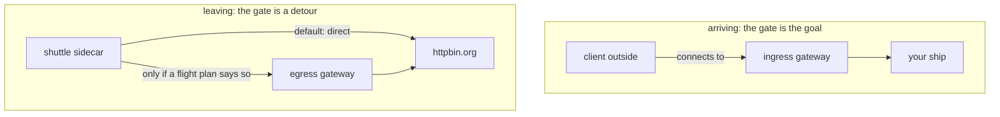

# A Gateway That Carries Nothing

Many solar systems have a departure gate that no signal has ever used. This part shows you why. You put `httpbin.org` on the star chart, signal it, and find out which way the signal really left.

## It is running, and it is idle

The egress gateway is a standalone Envoy proxy. It is the same program as every communications officer, but it flies on its own spaceship instead of beside an app, and it sits behind its own beacon (a Kubernetes Service). Until a flight plan sends signals to it, it does nothing at all.

Where it lives depends on how Istio was installed. Your playground uses the Helm `gateway` chart. A cluster installed with `istioctl install --set profile=demo` has one too, with other names:

| Install | Deployment and namespace | Pod label a `Gateway` selects |
| --- | --- | --- |
| Helm `gateway` chart, release `istio-egress` (your playground) | `istio-egress` in `istio-egress` | `istio: egress` |
| `istioctl` with the `demo` profile | `istio-egressgateway` in `istio-system` | `istio: egressgateway` |

Always look up the label before you write a `Gateway`. A `Gateway` that selects no pod configures nothing, and nothing warns you.

<!-- astrona:playground:renew -->

### Find the gate

Look for the gateway pods with either label:

```sh
kubectl get pods -A -l 'istio in (egress,egressgateway)'
```

You should see:

```text
NAMESPACE      NAME                            READY   STATUS    RESTARTS   AGE
istio-egress   istio-egress-77d46f4996-kz5nn   1/1     Running   0          51s
```

One pod, `1/1`: it is the proxy alone, with no app beside it. Now look at what it listens on:

```sh
istioctl proxy-config listener deploy/istio-egress -n istio-egress
```

```text
ADDRESSES PORT  MATCH DESTINATION
0.0.0.0   15021 ALL   Inline Route: /healthz/ready*
0.0.0.0   15090 ALL   Inline Route: /stats/prometheus*
```

Only the health check (`15021`) and the metrics port (`15090`). The gate has no listener for any signal yet. Its Service publishes ports `80` and `443`, but nothing behind them answers.

### Put the planet on the star chart

Before anything can be routed to `httpbin.org`, it must be on the star chart. That is the job of a `ServiceEntry`. The port is `443` with protocol `TLS`, because the shuttle calls `https://` and the proxies only see the encrypted stream.

Save this as `serviceentry-httpbin-org.yaml`:

```yaml
apiVersion: networking.istio.io/v1
kind: ServiceEntry
metadata:
  name: httpbin-org
  namespace: starfleet
spec:
  hosts:
  - httpbin.org
  ports:
  - number: 443
    name: tls
    protocol: TLS
  location: MESH_EXTERNAL
  resolution: DNS
```

Apply it:

```sh
kubectl apply -f serviceentry-httpbin-org.yaml
```

Then send a signal and read the shuttle's flight log:

```sh
call_external
log_shuttle
```

You should see (log line trimmed):

```text
200 0.523857s
  exit=0
"- - -" 0 - - - "-" 901 4875 630 - "-" "-" "-" "-" "3.225.83.162:443" outbound|443||httpbin.org ... httpbin.org -
```

The signal worked. The flight log names the cluster `outbound|443||httpbin.org`, so the shuttle's proxy used the star chart entry, and it connected to `3.225.83.162:443`: an address on the internet. Your addresses will differ.

### Count the signals at the gate

Now count how many lines in the gate's flight log mention `httpbin.org`:

```sh
kubectl logs -n istio-egress deploy/istio-egress | grep -c httpbin.org
```

```text
0
```

Zero. The signal left through the shuttle's own communications officer, straight to the internet. The gate was running the whole time and saw nothing. Most clusters with an egress gateway are in this state without knowing it.

Deploying an egress gateway is not a control. **Routing** signals to it is.

## Why nothing is caught

Ingress and egress look like mirror images, but they are not.

A signal **arrives** at the ingress gateway because a client looked up the gateway's address and connected to it. The arrival gate is the destination: ships fly straight into it.

A signal **leaving** is headed for `httpbin.org`, a planet in another solar system. The shuttle's sidecar picks it up and decides where to send it. Left alone, it sends it straight to `httpbin.org`. The departure gate is just one more place the sidecar *could* send it, and only a flight plan tells it to.



An ingress gateway is addressed. An egress gateway is chosen. Nothing steers outgoing signals to it on its own, so an idle egress gateway is the normal state.

## Common pitfalls

> [!WARNING]
> - **Expecting the egress gateway to catch outgoing signals.** It catches nothing. Without a flight plan that sends signals to it, it carries zero bytes.
> - **Taking a running gateway for a used one.** An idle gate and a busy gate look the same in `kubectl get pods`. Count its flight log lines, or read its listeners.
> - **Copying the wrong selector.** The Helm chart labels the pods `istio: egress`, the `demo` profile `istio: egressgateway`. Look the label up first.
> - **Calling it a security wall.** It is a routing stop. A pod that bypasses its sidecar, or has none, never meets it.

> *A deployed egress gateway proves nothing. Until a flight plan sends signals to it, it carries nothing.*
