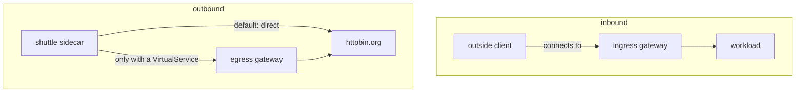

# Why An Egress Gateway Carries No Traffic By Itself

Many clusters run an egress gateway that no request has ever used. An **egress gateway** is an Envoy proxy that outbound traffic to outside hosts can be sent through, so the traffic leaves the mesh at one point. In this part you add `httpbin.org` to the mesh, send it a request, and find out which proxy really sent the request out of the cluster.

## The egress gateway runs, and stays idle

The egress gateway is a standalone Envoy proxy. It runs the same software as a **sidecar proxy**, the Envoy container that Istio adds to each pod. But it runs in its own pod, with no application next to it, and it sits behind its own Kubernetes Service. Until routing sends requests to it, it does nothing at all.

Where it runs depends on how Istio was installed. Your playground uses the Helm `gateway` chart. A cluster installed with `istioctl install --set profile=demo` has one too, with other names:

| Install | Deployment and namespace | Pod label a `Gateway` selects |
| --- | --- | --- |
| Helm `gateway` chart, release `istio-egress` (your playground) | `istio-egress` in `istio-egress` | `istio: egress` |
| `istioctl` with the `demo` profile | `istio-egressgateway` in `istio-system` | `istio: egressgateway` |

Always look up the label before you write a `Gateway`. A `Gateway` that selects no pod configures nothing, and nothing warns you.

<!-- astrona:playground:renew -->

### Find the egress gateway

Start by finding the gateway pods. This command looks for either label, so it works on both kinds of install:

```sh
kubectl get pods -A -l 'istio in (egress,egressgateway)'
```

You should see:

```text
NAMESPACE      NAME                            READY   STATUS    RESTARTS   AGE
istio-egress   istio-egress-77d46f4996-kz5nn   1/1     Running   0          51s
```

The pod shows `1/1`: it is the proxy alone, with no application container. Next, look at the **listeners** of the gateway. A listener is the part of Envoy that accepts connections on one port:

```sh
istioctl proxy-config listener deploy/istio-egress -n istio-egress
```

```text
ADDRESSES PORT  MATCH DESTINATION
0.0.0.0   15021 ALL   Inline Route: /healthz/ready*
0.0.0.0   15090 ALL   Inline Route: /stats/prometheus*
```

There are only two listeners: the health check (`15021`) and the metrics port (`15090`). The egress gateway has no listener for application traffic yet. Its Service publishes ports `80` and `443`, but nothing behind them answers.

### Add the outside host with a `ServiceEntry`

Before the mesh can route anything to `httpbin.org`, the host must be in the **service registry**, the list of hosts that `istiod` knows about. A **`ServiceEntry`** adds a host outside the mesh to that registry. The port is `443` with protocol `TLS`, because `shuttle` calls `https://` and the proxies only see the encrypted stream.

Save this as `serviceentry-httpbin-org.yaml`:

```yaml
apiVersion: networking.istio.io/v1
kind: ServiceEntry
metadata:
  name: httpbin-org
  namespace: starfleet
spec:
  hosts:
  - httpbin.org
  ports:
  - number: 443
    name: tls
    protocol: TLS
  location: MESH_EXTERNAL
  resolution: DNS
```

Apply it:

```sh
kubectl apply -f serviceentry-httpbin-org.yaml
```

Then send a request and read the access log of the `shuttle` sidecar:

```sh
call_external
log_shuttle
```

You should see (log line trimmed):

```text
200 0.523857s
  exit=0
"- - -" 0 - - - "-" 901 4875 630 - "-" "-" "-" "-" "3.225.83.162:443" outbound|443||httpbin.org ... httpbin.org -
```

The request worked. The log line names the cluster `outbound|443||httpbin.org`, so the `shuttle` sidecar used the `ServiceEntry`. It connected to `3.225.83.162:443`, an address on the internet. Your addresses will differ.

### Count the requests at the egress gateway

Now count how many lines in the egress gateway's access log mention `httpbin.org`:

```sh
kubectl logs -n istio-egress deploy/istio-egress | grep -c httpbin.org
```

```text
0
```

The count is zero. The `shuttle` sidecar sent the request straight to the internet. The egress gateway was running the whole time and saw nothing. Many clusters with an egress gateway are in this state without knowing it.

So deploying an egress gateway does not control outbound traffic. **Routing** requests to it does.

## Why the egress gateway receives nothing

Ingress and egress look like mirror images, but they are not. The difference is in who chooses the gateway.

A request **arrives** at the ingress gateway because a client looked up the gateway's address and connected to it. The ingress gateway is the destination of the connection.

A request **leaving** the mesh is addressed to `httpbin.org`, a host outside the cluster. The client's sidecar proxy receives it and decides where to send it. By default it sends the request straight to `httpbin.org`. The egress gateway is only one more place the sidecar *could* send it, and only a `VirtualService` tells the sidecar to do so.



The diagram shows that inbound clients connect to the ingress gateway on purpose, while the `shuttle` sidecar sends outbound requests direct unless a `VirtualService` sends them to the egress gateway.

A client addresses the ingress gateway, but routing must choose the egress gateway. Nothing sends outbound requests to the egress gateway on its own, so an idle egress gateway is the normal state.

You now know that a running egress gateway proves nothing, and how to check whether it receives any requests. The open question is what it takes to make the egress gateway accept requests for `httpbin.org` at all.

## Common pitfalls

> [!WARNING]
> - **Expecting the egress gateway to catch outbound requests.** It catches nothing. Without a `VirtualService` that sends requests to it, it carries zero bytes.
> - **Taking a running gateway for a used one.** An idle gateway and a busy gateway look the same in `kubectl get pods`. Count its access log lines, or read its listeners.
> - **Copying the wrong selector.** The Helm chart labels the pods `istio: egress`, the `demo` profile `istio: egressgateway`. Look the label up first.
> - **Treating it as a security barrier.** It is a routing step. A pod that bypasses its sidecar proxy, or has none, never reaches it.
